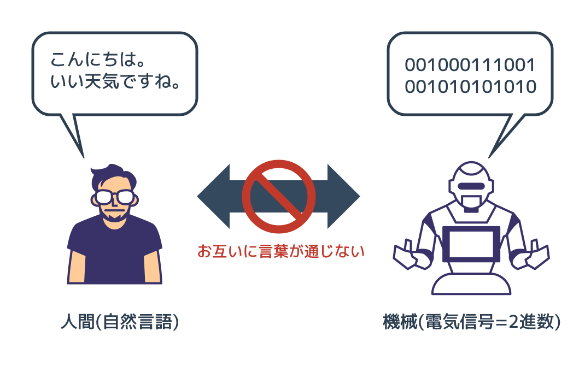

## 前書き

本書は私がシスコシステムズという会社で働いていた際に提供していた社内トレーニングの資料、
及びそれがマイナビニュースで連載となった際の記事にもとづいて書かれています。
シスコはIT業界において有名な会社であるため知っているかたも多いと思いますが、
開発というよりネットワークの会社です(USやインドの開発部隊は除く)。
つまり、本書のベースとなったトレーニングはITインフラのプロ(当然ながらプログラマーではない)に対して作られたものであるため、
他のプログラミングの専門書が飛ばしてしまったり難解に説明したりしているプログラミングの概念をかなり丁寧に説明しています。
本書を通してプログラミングがどのようなものか理解していただき、コードを書くことに抵抗がなくなって頂ければ幸いです。
なお、本書は前編・中編・後編の Python3 シリーズの前編となり、プログラミングの基礎を丁寧に説明することに注力しています。
オブジェクト指向の詳細やその他レベルの高い話題はそれほど深く扱わず、それらは本書の続編で扱います。

プログラミングは建築にたとえることができます。たとえば犬小屋を作ろうと思ったとき、
木の柱や板を調達して適当にデザインして組み立てることができます。
構造力学の計算をするどころか、建築について素人であっても作れます。
ただ、犬小屋を作るには「犬小屋とはこういうものだ」ということと、ノコギリとハンマーの使い方は知っている必要があります。
プログラミングもこれと同じで、比較的「小さい」プログラムはノコギリやハンマーに相当する最低限の文法と
「作りたいものの仕組みをどう実現するか」ということさえ知っていれば、そこそこ動くものを作ることができます。
しかし、人が住む家を作るとなると、犬小屋とは話が変わってきます。
頑丈であり住みやすい家を作るには、まず「家というものの仕組み」を犬小屋よりも深いレベルで知っている必要があります。
なおかつ家の工作に必要となるスキルは犬小屋より高度なものとなります。
ビルの建設などになってくるとさらに高度な知識が必要になります。
プログラミングも、単に文法や「言語や設計の思想」だけでなく周辺知識のようなものを身につけていないと、
数千、数万行レベルのコードを1人で書いたり、プロジェクトを回したりすることは難しいと思います。
より大きく複雑なものを作る場合ほど、より深いレベルの知識が必要になってきます。

まずは犬小屋を作るために、ハンマーやノコギリの使い方を正しく覚える。それがずばり本書の目的です。

ハンマーやノコギリの使い方を座学だけで学んで、「私はハンマーとノコギリを使えます」といったら、大工さんに笑われてしまいます。
使い方は教科書でも学べますが、使いこなそうと思うと、実際に木を切って、釘を打たないと、
そのスキルは身につきません。使ってみてはじめてわかることも多いはずです。
プログラミングも本で座学するだけでなく、実際にコードを書いて、動かすことで上達します。
ゆっくりでもいいので、実際に手を動かしながら本を読み進めていってもらえれば幸いです。

執筆書籍一覧
http://www.yuichi.com/books.html
