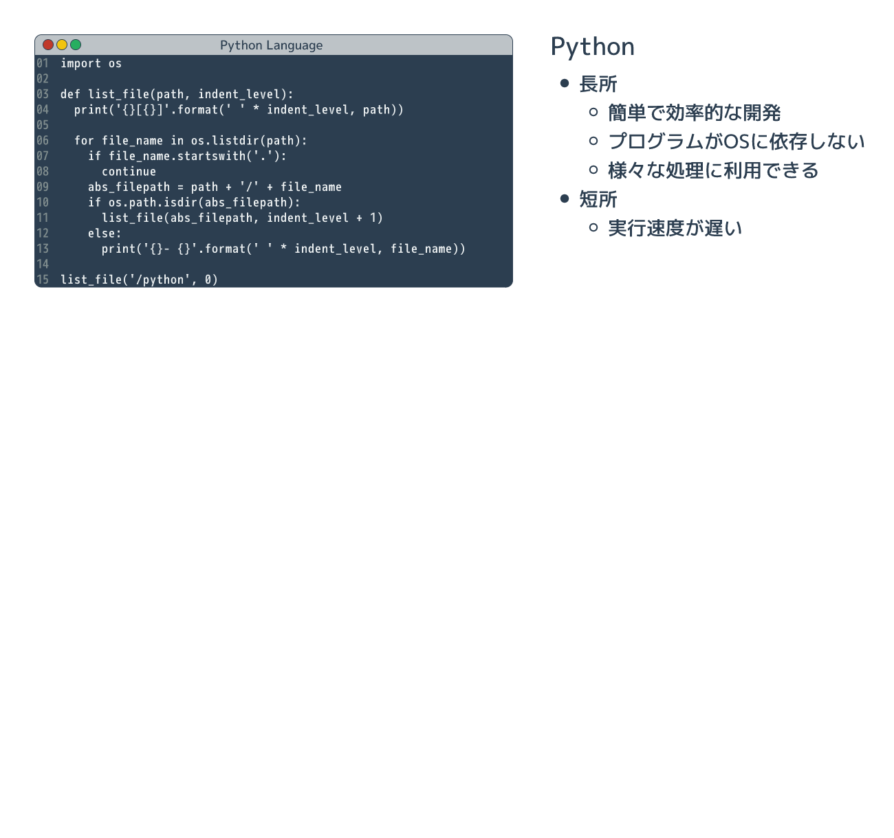
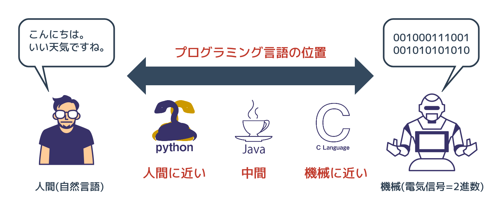

# なぜPythonを学ぶのか

{{ TOC }}

## 概要

プログラミング言語は多くあり、Pythonはその一つです。
コンピュータに同じ命令をするにしても、簡単なプログラミング言語で書けば簡単に書けます。
一方、難しいプログラミング言語でプログラムを書けば、余計な知識が必要とされるため難しいです。
効率的にプログラムを書くには簡単な言語を選ぶことが大事であり、Pythonは簡単な言語です。

また、プログラミング言語にはそれぞれ得意不得意な分野があります。
Pythonは他の言語に比べると得意な分野が広いものの、例えば組み込みコンピュータの制御といった機械に近い部分は苦手です。
どのようなことを実現したいかによって、学ぶべきプログラミング言語は変わってきます。

プログラムを始めて学ぶ人は「プログラミングの本質」を学ぶためにもPythonのような、
簡単で広く使われている言語を最初に覚えるべきです。
すでにプログラミングの知識がある人も、同じ機能を果たすプログラムをより効率的(短時間)に開発できるPythonを覚えるメリットはあります。

### 高級な言語と低級な言語

世界には数え切れないほどのプログラミング言語があり、実際に多くの人達に利用される言語でも数十種類はあります。
アプリケーションやサービスを作るにはどの言語を使うか選ぶ必要があります。

プログラミング言語にはそれぞれ得意な分野があります。
本サイトで学ぶプログラミング言語「**Python**」は、他の言語よりも汎用的(なんにでも使える)であり簡単です。
先程、プログラミング言語は人間と機械の中間にあると説明しましたが、
他のプログラミング言語よりも、Pythonは「人間より」だということです。

逆に有名な「**C言語**」は「機械より」なプログラミング言語です。
プログラミング言語が機械側に近いということは、
非常に小さなコンピュータ(例えば車のエンジン制御のチップなど)を動かす際に、
機械にとって処理しやすいプログラムを作ることができるということです。
また、機械に理解しやすいプログラムは高速に動作する場合が多いです。

人間に近いプログラミング言語は高級言語と呼ばれ、機械に近い言語は低級言語と呼ばれます。
高級であるほうが優れているように思われるかもしれませんが、単に使う場面が違うだけです。

1990年代以前であればコンピュータの処理能力もあまり高くなかったためC言語を使う機会も多かったですが、
現在はコンピュータは高速であるため処理能力よりも開発の生産性を重視して高級言語を利用する機会が増えています。
例えば、ある処理をするプログラムの開発に以下の2つの方法が考えられるとします。

* 0.0001秒で終わらせるプログラムを低級言語で1週間かけて開発する
* 0.001秒で終わらせられるプログラムを高級言語で1日で開発する

プログラムの開発にかかる人件費や、開発した後の保守費もタダではないので、
多くの場合は後者が選ばれるでしょう。

### 同じプログラムを複数のプログラミング言語で比較する

Python は汎用的であり簡単だと言いましたが、それは具体的にはどういうことでしょうか。
まずは論より証拠を見せたほうがはやいと思いますので、
「ディレクトリ(フォルダ)の階層を書き出すプログラム」を複数のプログラミング言語で書いて比較してみます。
実現することは全く同じですが、それぞれの言語の特徴がよくわかります。
同じ内容を複数の言語で書けば、それぞれの言語の特徴がよく分かります。

以下のアニメーション図では「Python」と「Java」と「C」という主要なプログラミング言語の3つコードと、
その特徴を示しています。

#### 図:同じ処理をするプログラムの比較

私から説明するまでもなく、Pythonのプログラムが短くて簡単に書けそうに思われたのではないでしょうか。
実際にその通りです。

### 3つのプログラミング言語の比較結果

いくつかのプログラミング言語で同一の処理を書きましたが、
ここで知ってほしいことは各プログラミング言語の詳細というよりも
「Aという処理を、Pythonだと2行で実現できるのに、Cだと5行必要」というような具合で、
言語ごとにプログラムを書く労力が大きく違うということです。

処理を書けば書くほどプログラムの文量がどんどん増えていくので、
今回の例では PythonとC言語のコード量には3倍以上の開きがありました。
開発時間に関しては私がPythonが得意ということもありますが、両者に10倍以上の開きがありました。

また、C言語に詳しいかたは気付かれたかもしれませんが、
先のC言語のコードはディレクトリが深くなったり、ファイル名が長かったりすると一気に破綻します。
作業領域の確保といった細かいことをC言語では気にする必要があるためです。
Pythonではそのようなことは気にする必要はありません。

Java言語はC言語に比べると柔軟な言語であるため、開発時間は短くて済みます。
Pythonの約2倍程度の時間で先ほどのコードを書くことができました。
ただ、Javaは「プログラミング言語としての文法が豊富で複雑」という特徴があります。
一旦理解してしまえば問題ありませんが、「とりあえず動かしたい」という初心者には最初のハードルが高いかもしれません。

最後に、Python、Java、Cの特徴を比較した図を記載します。

#### 図:プログラミング言語の比較

繰り返しますが、PythonはC言語やJavaに比べると、同じ処理を短いプログラムで実現することができます。
短いということをいいかえると、PythonはCやJavaより「簡単」な言語であるともいえます。

私の個人的な意見なのですが、初心者がまず学ぶべきことはプログラミング言語の仕様詳細よりも、
「プログラミング作業を行う際の考え方」です。
複雑な処理を実現したいときに「処理を小さい単位に分解して、
どのようなステップで実現するか順序立てて考える」ことが必ず必要となります。

それを学ぶのであれば、C言語のように余計な作法に振り回されて本質に注力できないプログラミング言語や、
Javaのように複雑で覚えることが多い言語よりも、
Pythonのような簡単な言語のほうが優れています。

Pythonは簡単なだけではなく、有名な大規模なソフトウェアプロジェクトで採用されていたり、
GoogleやCiscoといったメジャーなIT企業でも積極的に利用されていたりします。
開発のエキスパートたちがPythonを好き好んで利用しているのですから、
それはきっと素晴らしい言語ということです。

## 用語

* プログラミング
* プログラム
* コード
* プログラミング言語
* 自然言語
* 機械語
* コンパイル
* コンパイラ
* インタプリタ
* Python
* Java
* C言語
* アセンブリ言語
