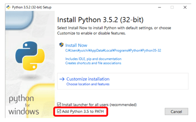

## プログラミングとはそもそもなにか

{{ TOC }}

### 概要

コンピュータは人間の言葉を理解できず、01で記述されたプログラム(命令)の通りに動きます。
ただ、逆に人間は「01で書かれた機械の命令」は理解しすることが苦手です。

プログラミング言語はこの「人間の言葉」と「01で書かれた機械の命令」の中間に存在しています。
人間が「規則性を持ったプログラミング言語」で命令を書き、それを01に変換してコンピュータに実行させます。
このようにすることで、人間が苦労少なくコンピュータに命令を与えることができます。

プログラミング言語にも幾つかの種類があり、Pythonはその一つです。
コンピュータに同じ命令をするにしても、簡単なプログラミング言語で書けば簡単に書けます。
一方、難しいプログラミング言語でプログラムを書けば、余計な知識が必要とされるため難しいです。
効率的にプログラムを書くには簡単な言語を選ぶことが大事であり、Pythonは簡単な言語です。

また、プログラミング言語にはそれぞれ得意不得意な分野があります。
Pythonは他の言語に比べると得意な分野が広いものの、例えば組み込みコンピュータの制御といった機械に近い部分は苦手です。
どのようなことを実現したいかによって、学ぶべきプログラミング言語は変わってきます。
特にこだわりがないのであれば、最初は簡単で広く使われているプログラミング言語を学ぶべきでしょう。

Pythonは簡単なプログラミング言語として普及しており、なおかつ多くのことが実現できる優秀な言語です。
そのため、最初に学ぶプログラミング言語としてPythonを選ぶのは間違っていません。

### 機械と人間のかけはしとなるプログラミング言語

#### 機械の言葉「01」

コンピュータ(PC)や機械は人間の言葉をそのまま理解することはできません。
AppleのSiriなどはユーザの質問にたいして応答をしているように見えますが、あくまでも人の声をデジタルデータに変換して、それにたいして機械的に応答をしているだけです。
そのため、人間の言葉を理解しているように「見せかけている」だけです。

それでは、機械はどのように人間からの命令を処理しているのでしょうか。
答えは簡単で「電気的に処理」しています。

電気はON/OFFの2つの状態があり、それが数字の「0と1」に対応付けられています。
ご存知のかたも多いと思いますが、WindowsやMacといったOSは、ハードディスク(HDD)の円盤にある0,1の情報(磁気で管理)や、SSDのメモリ上にある0,1の情報(電気で管理)として存在しています。
PCの電源をいれたら、HDDやSSDのうえにある情報をメモリ(RAM)とCPUを使って処理することで、PCは動いています。

<!-- 図 -->

OSだけでなく、OSの上で動くアプリケーションもこれと全く同じ要領で動きます。
アプリケーションを動かすためのWindowsの「.exe ファイル」や、Macの「.app ファイル」も、
ディスクの上にある「0,1で構成されたファイル」です。
アプリケーションを実行するときも、0,1で書かれた命令をメモリに読み込み、
CPUがそれを実行することでPCは人間の命令を実現します。

これからプログラミングで学ぶような「PCのディスプレイに"Hello"と表示させる」という命令も、
つきつめると0,1で構成されています。
ただ、「画面に Hello と出力することを機械が理解できるように0、1で命令して、
実行させろ」といわれても、どういう0,1 の羅列を書けばいいか分からずに途方にくれてしまいます。
機械が理解できる0,1の命令には規則性があるため、理論上は0,1 で命令を書くことはできるはずです。
ただ普通の人はそんなことはやりたくありません。

#### なぜプログラムを書くのに日本語ではなく「プログラミング言語」を使うか

プログラミングはこの「機械が理解できるように0,1で命令を与える」という難しい作業を、
人間がより簡単に行うための方法です。

人間は機械とは違って「アナログ」な「言葉」を通して、ものごとを考えたり、意思疎通をしています。

この人間の言葉は機械が理解できる「01の命令」に比べると、かなり曖昧です。
たとえば「料理を作る手順」について考えてみて下さい(料理は手順を順序だてて作業をするため、
非常に簡単なプログラミングに似ています)。

同じ料理を同じ手順で作るレシビを書くにしても、100人いれば100通りのレシビができるはずです。
それらのレシピは論理的には全く同じものであっても、日本語という言葉が柔軟すぎるため、
様々な書き方ができてしまうからです。
そのような柔軟な言葉で書かれた命令を、01のプログラムの命令に変換することは難しいです。
複雑な文法を機械が簡単には理解できないからです。

そのため、あえてプログラミング言語は日本語のような曖昧な言葉ではなく、
「制限された言葉」を使います。
ちょうど日本語とプログラミング言語で、同じ命令を書くと以下のようになります。

* 日本語: 70度の水で、15分間茹でます
* プログラミング言語: ゆでる 70度　15分

後者のプログラミング言語は、私が適当に文法を「作業　温度　時間」としました。
これであれば、機械が文字を解釈して01に変換するのは簡単そうです。

そのため、プログラミングでは人間が普通に使う言葉(自然言語と呼ばれる)ではなく、
プログラミング言語というプログラミング専用の言葉を使います。

#### プログラミング言語から機械語への変換

人間と機械の両方にとってわかりやすい「中間言語」であるプログラミング言語で、
人間は機械が解釈できる命令を書き、機械はそれを0,1に変換します。

この開発から実行までの流れが「プログラミング」と呼ばれています。
以下にこの概念を示す図を記載します。


図の真ん中に位置する「C、Java、Python」がプログラミング言語です。
これら以外にも多くの言語があります。

図にあるように人間が「機械にHelloと言わせたい」と思ったら、
プログラミング言語で「Hello と出力しろ」と命令を書きます。
上記図の「print(“Hello”)」がその命令です。
この命令のことを「プログラム」や「コード」と呼びます。

なお、このプログラミング言語から機械語への変換には大まかに次の2つの方式があります。

* コンパイル型
* インタプリタ型

コンパイルはプログラミング言語で書かれた命令を、「コンパイラ」と呼ばれるプログラムで、
プログラムが実行される前に機械語に変換します。
そして、その機械語のプログラムを実行します。

一方、インタプリタはプログラムを実行する際に、
インタプリタと呼ばれるプログラムがプログラミング言語の文法を読み取って解釈し、
その場で機械語に変換してプログラムを実行します。

コンパイル型とインタプリタ型のプログラミング言語には、それぞれ長所と短所があります。

ただ、いずれにせよ"Hello"というテキストを表示するために「0,1 の規則性を勉強して、
0,1を延々と羅列して命令を書く」のと「プログラミング言語で print("Hello")と書く」 ことを比べたら、
どう考えても後者のほうがずっと簡単で効率的です。
そのため機械になんらかの作業をさせる場合は、プログラミング言語を使ってその命令を書きます。

※広義では0、1で命令を羅列することもプログラミングといえます。
ただ、今ではあまり一般的ではないと考えています。

### なぜ Python を学ぶのか

#### 高級な言語と低級な言語

プログラミングを実現する手法や言語はさまざまです。
どのプログラミング言語であっても自分がやりたいことはおおよそ実現可能です。

ただ、重要なのはプログラミング言語にはそれぞれ得意な分野があるということです。
つまり、プログラムで実現したいことにより、適切な言語は変わるということです。

今回学ぶPythonは、そのようなプログラミング言語のひとつであり、
他の言語よりも汎用的(なんにでも使える)であり簡単です。
先程、プログラミング言語は人間と機械の中間にあると説明しましたが、
他のプログラミング言語よりも、Pythonは「人間より」だということです。

逆に「C言語」は人間よりも機械よりで、「アセンブリ言語」とよばれている最も原始的なプログラミングは、
かなり機械に近いです。
プログラミング言語が機械側に近いということは、非常に小さなコンピュータを動かす際に、
機械にとって処理しやすいプログラムを作ることができます。
ただし、それは人間からは遠いので、プログラムを作るのが大変です。

ようするに、人間に近ければプログラムを書くのが簡単であり、
機械に近ければ「電子機器(家電など)の制御」といった処理能力の少ないコンピュータ用のプログラムを書くことができます。
おそらく多くのかたがプログラムを書くのはPCでなにかの作業をするためでしょうから、
そのような場合は人間に近いプログラミング言語を選ぶほうが賢いです。
PCが持つCPUはパワーがあるので、人間に近いプログラミング言語もなんなく使うことができるからです。

これらの理由からプログラミング未経験者にとって、Pythonはかなりいい言語だと考えられています。
例えば、有名な MIT (マサチューセッツ工科大学)などでも、
Pythonを大学の最初のプログラミング授業で扱っていたりします。


#### 同じプログラムを複数のプログラミング言語で比較する

Python は汎用的であり簡単だと言いましたが、それは具体的にはどういうことでしょうか。
まずは論より証拠を見せたほうがはやいと思いますので、
「ディレクトリ(フォルダ)の階層を書き出すプログラムを作る」ということを複数の言語で行い、それを比較してみます。
同じ内容を複数の言語で書けば、それぞれの言語の特徴がよく分かります。

プログラムを書くにあたっては、まず「それをどう実現するか」について理解する必要があるため、
「ディレクトリ(フォルダ)の階層を書き出す」方法について考えます。

実現方法はいろいろありますが、今回は以下のルールに従って動かすことで実現させます。

1.	ディレクトリの中身を順に見ていく
2.	それがファイルであればそのままファイル名を表示。ディレクトリであれば、インデント(字下げ)してディレクトリ名を [ ] 付きで表示し1.に戻る
3.	ディレクトリ内のファイルをすべてチェックしたら終えたら終了

たとえば、以下のようなディレクトリ構造があるとしましょう。
四角で囲われているのがディレクトリで、Python ディレクトリが起点となっています。



プログラムでこれを表示させると次のようになります。

```
[/python]
 [/python/a]
 - aa
  [/python/a/ab]
  - aba
- b
- c
 [/python/d]
 - da
 - db
```

上記のルールにしたがって、この構造のディレクトリを表示させた際のプログラムの動きを具体的に書きくだすと、以下のようになります。

1.	pythonディレクトリの中を確認
2.	aはディレクトリなのでインデントしてディレクトリを表示
3.	aディレクトリの中を確認
4.	aaはファイルなので表示
5.	abはディレクトリなので、更にインデントしてディレクトリ名を表示
6.	abディレクトリの中を確認
7.	abaはファイルなので表示
8.	abディレクトリの中身を確認し終えたので、aディレクトリの確認の続きに戻る
9.	aディレクトリの中身を確認し終えたので、pythonディレクトリの中の確認の続きに戻る
10.	bはファイルなので表示
11.	以下省略

ルールに従って規則的に動いていることがわかります。
この自分で書いた「プログラムの挙動のルール」をアルゴリズムと呼びます。

では、実際にこれを実現するプログラムの例を、いくつかの有名な言語で記載していきます。
各言語について知らない方も多いと思うので、プログラムが実際に何をしているかということよりも、
ぼーっと眺めることで、各プログラミング言語の違いについていろいろと思いを馳せていただけたらよいと思います。
なお、比較を簡単にするために、必ずしも教科書的な書き方をしていないので注意して下さい。

#### Pythonのコード

まずPythonのプログラムを以下に記載します。 日本語のコメントを除けば全部で約15行となっています。

```python
import os

def list_file(path, indent_level):
  # ディレクトリ名を表示
  print('{}[{}]'.format(' '*indent_level, path))

  # ディレクトリ内のファイルとディレクトリを全てループで確認
  for file_name in os.listdir(path):
    if(file_name.startswith('.')): continue
    abs_filepath = path + '/' + file_name
    if(os.path.isdir(abs_filepath)):
      # ディレクトリだったので、そのディレクトリをチェックする
      list_file(abs_filepath, indent_level + 1)      
    else:
      # ファイルだったので、ファイル名を表示
      print('{}- {}'.format(' ' * indent_level, file_name))

list_file('/python', 0)
```

コード中にある「#」以降がプログラムのコメントであり、どのような処理をしているかメモしています。

#### Javaのコード

Javaで同じことをするプログラムを書くと、以下のようになります。Pythonだと15行程度だったプログラムが、およそ30行になっています。

```java
import java.io.File;

// クラス定義
public class Main {

  // エントリーポイント(プログラムの起点)
  public static void main(String[] args){
    Main m = new Main();
    m.listFile("/python", 0);
  }

  // インデントのためのユーティリティ関数
  public void printIndent(int indentLevel){
    for(int i=0; i<indentLevel; i++){
      System.out.print("  ");
    }
  }

  public void listFile(String dirPath, int indentLevel){
    // ディレクトリ名を表示
    printIndent(indentLevel);
    System.out.printf("[%s]\n", dirPath);

    File dir = new File(dirPath);
    File files[] = dir.listFiles();
    for(int i=0; i<files.length; i++){
      // ディレクトリ内のファイルとディレクトリを全て確認
      if(files[i].getName().startsWith(".")) continue;

      if(files[i].isDirectory()){
        // ディレクトリだったので、そのディレクトリをチェックする
        listFile(files[i].getAbsolutePath(), indentLevel + 1);
      }else{
        // ファイルだったので、ファイル名を表示
        printIndent(indentLevel);
        System.out.printf("- %s\n", files[i].getName());
      }
    }
  }
}
```

"public void listFile(String dirPath, int indentLevel){"というのが真ん中にありますが、
これがディレクトリを走査するアルゴリズムです。
Pythonと若干異なりますが、やっていることはほとんど同じです。

プログラムに詳しい人が見ると、増えたのはJavaによる言語の制約(Classの宣言が必要なことなど)や、
文字列処理あたりにあることがわかります。

メインの処理である"public void listFile" の下にある処理は、Pythonとさほど変わっていません。
同じことを実現するにしても Python のほうがずっと簡単に見えます。

プログラムの実行方法に関しても、Pythonのほうが Java よりも簡単です。
Python であればこのプログラムファイルを「python プログラム名」というコマンドで呼び出すだけですが、
Javaは「コンパイル」と呼ばれる作業で上記のテキストで書かれたプログラムを0、1のバイナリにしてあげて、
それをコマンドで指定して実行するという方式になります。

#### C言語の例

最後にC言語のプログラムです。これは約50行となっています。
どうです、もう読むのが面倒くさくなってきたのではないですか。書くのはもっと面倒でした(笑)。

面倒なだけではなく、CはPythonやJavaと違い、プログラムが「実行するOS」に強く依存するという問題があります。
下記のコードはMacで書いたものなので、おそらくWindowsでは動かないのではないでしょうか。

```c
#include <stdio.h>
#include <unistd.h>
#include <dirent.h>
#include <sys/stat.h>
#include <string.h>

void printIndent(int indentLevel);
void listFile(char path[], int indentLevel);

// エントリーポイント(プログラムの起点)
int main(int argc, const char * argv[]) {
  listFile("/python", 0);
  return 0;
}

// インデントのためのユーティリティ関数
void printIndent(int indentLevel){
  int i;
  for(i=0; i<indentLevel; i++){
    printf("  ");
  }
}

void listFile(char dirPath[], int indentLevel){
  DIR *dir;
  struct dirent *dp;
  int i=0;
  struct stat stat_buf;

  printIndent(indentLevel);
  printf("[%s]\n", dirPath);  // ディレクトリ名を表示

  dir = opendir(dirPath);
  // ディレクトリ内のファイルとディレクトリを全て確認
  for(i = 0; NULL != (dp=readdir(dir)); i++){
    const char* fileName = dp->d_name;
    if('.' == fileName[0]) continue;

    char cp[512];
    strcpy(cp, dirPath);
    strcat(cp, "/");
    strcat(cp, fileName);
    stat(cp, &stat_buf);
    if(S_ISDIR(stat_buf.st_mode)){
      // ディレクトリだったので、そのディレクトリをチェックする
      listFile(cp, indentLevel + 1);  
    }else{
      // ファイルだったので、ファイル名を表示
      printIndent(indentLevel);
      printf("- %s\n", fileName);
    }
  }
  closedir(dir);
}
```

"void listFile(char dirPath[], int indentLevel){" の下にあるプログラムがディレクトリを走査するプログラムです。
先に提示したPythonやJavaと同じアルゴリズムですが、ずいぶんと長くなっています。

#### 3つの言語の比較結果

いくつかのプログラミング言語で同一の処理を書きましたが、
ここで知ってほしいことは各プログラミング言語の詳細というよりも
「Aという処理を、Pythonだと2行で実現できるのに、Cだと5行必要」というような具合で、
言語ごとにプログラムを書く労力が大きく違うということです。

処理を書けば書くほどプログラムの文量がどんどん増えていくので、
今回の例では Pythonと C 言語の3倍以上のコード行数が必要となってしまっています。

また、Cをわかる人が見ればすぐに見抜かれてしまいますが、上記は非常に問題の多いコードです。
たとえばディレクトリが深くなったり、ファイル名が長かったりすると一気に破綻してしまいます。
本来であれば、そのあたりも考慮したコードを書かなければいけないはずです。

ディレクトリ構造を書き出すという処理をさせるのであれば、あまりC言語は使いたくないという感想を持っていただけたのではないでしょうか。

最後に、Python、Java、Cの特徴を比較した図を記載します。


PythonはC言語やJavaに比べると、同じ処理を短いプログラムで実現することができます。
短いということをいいかえると、PythonはCやJavaより「簡単」な言語であるともいえます。

私の個人的な意見なのですが、初心者がまず学ぶべきことは、プログラミング言語の仕様詳細よりも、そのプログラミング作業を行う際の考え方や思想だと思います。
複雑な処理を実現したいときに「処理を小さい単位に分解して、どのようなステップで実現するか順序立てて考える」ことが必ず必要となります。
それを学ぶのであれば、Cのように余計な作法に振り回されて本質に注力できないプログラミング言語よりも、
Pythonのような簡単な言語で「プログラミングの本質」に着目するほうがよいと思われます。

そのため私は、プログラミング初心者にはPythonからはじめることを推奨しています。

余談ですが、Pythonは簡単なだけではなく、OpenStackをはじめとした多くの大規模なソフトウェアプロジェクトで採用されていたり、
GoogleやCiscoといったメジャーなIT企業でも積極的に利用されていたりします。
「エキスパートたちがわざわざ選ぶのだから間違いない」と安直に考えることもできます。

### 用語

* プログラミング
* プログラム
* コード
* プログラミング言語
* 自然言語
* 機械語
* コンパイル
* コンパイラ
* インタプリタ
* Python
* Java
* C言語
* アセンブリ言語
