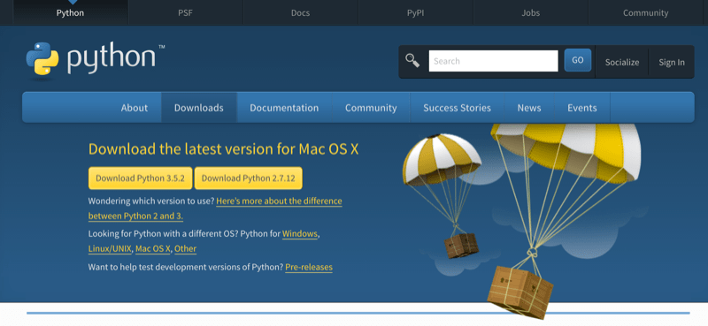

# Python3のインストール

{{ TOC }}

## 概要

Pythonを使うには、そのコンピュータにPythonがインストールされている必要があります。
Pythonには「Python2」と「Python3」があり、2017年現在はPython2からPython3に主流が移る過渡期にいます。
そのため、特別な理由などがなければPython3を学ぶことが、今後のことを考えると望ましいです。

WindowsにはPython2もPython3も、デフォルトではインストールされていません。
そのため、Pythonを使うにはインストールが必要です。

MacにはPython2のみデフォルトでインストールされています。
Python3を使いたければ、Python3をインストールする必要があります。

## Pythonのインストール

### Windows10へのインストール

WindowsにはデフォルトでPythonがインストールされていません。
Pythonを使うためにはインストールが必須です。

インストールにはPythonの公式サイト(https://www.python.org/)から、
実行環境にあったPythonのインストールイメージをダウンロードしてきます。



Pythonのバージョンには現在2.xと3.xがあります。
両者を区別する場合は前者を「**Python2**」と呼び、後者を「**Python3**」と呼びます。

新しくPythonを学ぶのであれば、現在主流になりつつある3.Xの最新版をインストールしてください。
本サイトでは「3.X」にて解説をしております。

上記ページから落としてきたイメージからインストーラーを立ち上げると以下のような画面が現れると思います。


この選択画面で赤の枠囲みがされている場所をチェックすると、
「環境変数」と呼ばれるアプリケーションの所在地を示す情報が自動で登録されますのでチェックをして下さい。
環境変数への登録は後ほど説明するコンソールでpythonコマンドを使うために必要となります。

環境変数に登録しないと、コンソールがPythonがどこに存在するか知らないため、
Pythonを使おうとした際に「そんなものはない」と怒られてしまいます。
仮にこの選択画面でチェックを忘れた場合は、「パスを通す」という作業をする必要があります。
面倒な場合はもう一度Pythonをインストールしなおして、その際に環境変数の登録をすれば大丈夫です。

「Install Now」と「Customize installation」の選択肢がありますが、
一般的には「Install Now」で構いません。
いま操作しているユーザー以外がPythonを利用したり、
凝った使い方をしたりしたい場合は「Customize Installation」が必要となります。

### Windows10でPythonの動作確認

Pythonは「コンソール」と呼ばれるアプリケーションから利用します。
Windowsで利用されるコンソールは「パワーシェル」もしくは「コマンドプロンプト」が一般的です。
パワーシェル及びコマンドプロンプトは場所がわからなくてもWindows の検索機能を使うことで見つけられるかと思います。
参考のために以下に画像を記載します。


パワーシェルやコマンドプロンプトは何度も使うことになるので、
タスクバーにピン留めしてすぐに使えるようにしておくと今後が楽です。

プロンプトから以下のように「python --version」と打ってPythonを起動してみてください。
先ほどのインストール作業時にパスが登録されていれば、以下のような出力が得られると思います。


そのようなものがないと怒られた場合はインストールができていないかパスが通っていません。
パスの通し方は検索してもらえればすぐに分かるはずです。

なお、本サイトのプログラムはMacで書いて実行しているため、微妙にWindowsと食い違いが発生するかもしれません。
大きな差ですと明記しますが、コマンド名やOSのディレクトリ構造といった小さい箇所は適時読み変えて下さい。

また、「ターミナル」と言った場合はパワーシェルやコマンドプロンプトのことを指します。

### Macへのインストールと動作確認

Windowsと異なり、MacにはデフォルトでPythonがインストールされています。
ただ、インストールされているものはPython2のため、Python3はインストールが必要です。
Windowsへのインストールと同じように公式サイト(https://www.python.org/)へ行き、
Python3のイメージをダウンロードしてきてインストールを行って下さい。

MacでのPython3のインストールは非常に簡単なため、割愛します。
Windowsで行ったパスを通すなどの作業は、自動で行われるため不要です。

MacでのPythonの実行も、Windowsと同じコンソールを使います。
Macのコンソールアプリケーションはターミナル(コマンドライン)で、
それは「アプリケーション」フォルダ配下の「ユーティリティ(Utilities)」の下にあります。

ターミナルは今後頻繁に使うことになるので、ドラッグ&ドロップでDockに登録しておいたほうがよいと思います。


ターミナルを起動して、「python --version」と打つと、
おそらくPython2のバージョンが表示されます。

Python3のバージョンを確認するには「python3 --version」と打つ必要があります。


Macには複数のバージョンのPythonがインストールされています。
デフォルトのPythonはPython2であるため、「python」とだけ入力するとpython2が使われます。
python3を使うためには、「python3」と明示的にバージョンを指定する必要があります。

ちなみに、ターミナルにて「python」に続いてtabボタンを打つと、
MacにインストールされているPythonのバージョン一覧が確認できます。

#### MAC: pythonのバージョン一覧を確認

```text
$ python
python             python2.7-config   python3.5-32       pythonw2.6
python-config      python3            python3.5-config   pythonw2.7
python2.6          python3-32         python3.5m
python2.6-config   python3-config     python3.5m-config
python2.7          python3.5          pythonw
```

上記の例ではPython2として、python2.6と2.7がインストールされており、
Python3としてpython3.5がインストールされています。

Python3 を使うつもりで間違えてPython2を使ったり、
その逆が発生したりしないように注意をしてください。

## コラム: Python2とPython3の違い

Python2とPytho3のプログラムには一部互換性がありません。
そのため、Python2で作ったコードをPython3で使うことや、
その逆ができないことが多々ありますので注意してください。

もし仮にPython2のプログラムを書く場合であっても、それがPython3で動くように書く癖をつけておいてください。
完全に互換性をもたせるのは大変なのでおすすめしませんが、
Python3で廃止される古いPython2の書き方に固執するのはよくありません。

ちなみにPython 2と3の両方をインストールして使い分けることも可能ですので、
最終的に2.xを使いたいかたも、3.xをインストールして大丈夫です。


## 用語

* Python2 : 古いPythonの種類。2.X として様々なバージョンがあるが、2.7が最後
* Python3 : 新しいPythonの種類。3.X として開発中。
* パスを通す
* 環境変数
* コンソール
* パワーシェル(PowerShell)
* ターミナル(Terminal)
