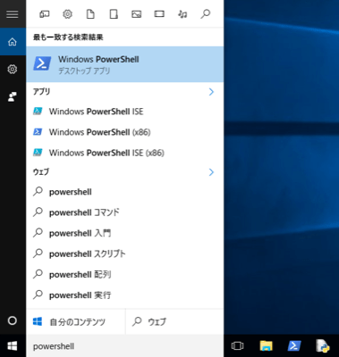
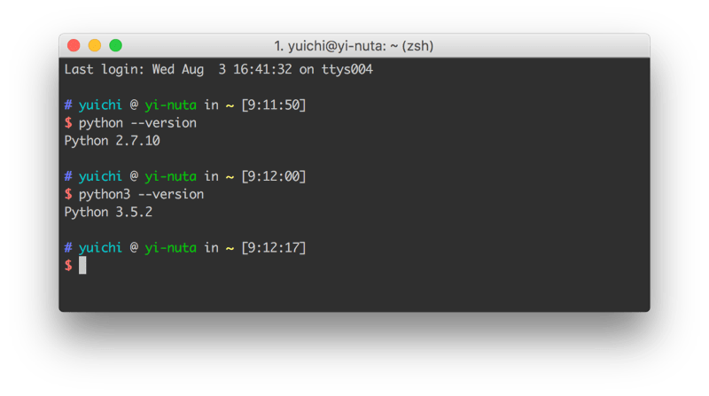

## Python 3 のインストールと実行

### Windows 10 へのインストール

さっそく Python を使う準備にとりかかりましょう。
Windows にはデフォルトでPythonはインストールされていません。
そのため Python を使うためにはインストールが必須です。
インストールにはPythonの公式サイト(https://www.python.org/)から実行環境にあったPythonのインストールイメージをダウンロードしてきます。


Pythonには現在2.xと3.xのバージョンがありますが、本書では Python 3 を利用するため、
3.x の最新版をインストールしてください。
Python 2.xと3.xのプログラムには一部互換性がないので、2で作ったコードを3で使うことや、
その逆ができないことが多々ありますので注意してください。
ちなみにPython 2と3の両方をインストールして使い分けることも可能ですので、
最終的に2.xを使いたいかたも、3.xをインストールして大丈夫です。

上記ページから落としてきたイメージからインストーラーを立ち上げると以下のような画面が現れると思います。


この選択画面で赤の枠囲みがされている場所をチェックすると、
「環境変数」と呼ばれるアプリケーションの所在地を示す情報が Windows に自動で登録されますのでチェックをして下さい。
チェックを忘れた場合は手動で「パスを通す」という作業が必要になります。
検索してもらえればパスの通しかたは分かるはずです。

Install Now と Customize installation の選択肢がありますが、
この Windows ユーザだけで使うのであれば Install Now で構いません。他のユーザが使ったり、
凝った使い方をしたりしたい場合は Windows のルートディレクトリ直下やProgram Filesにインストールする必要があります。
インストール作業は難しくないので割愛します。

さっそくインストールを終えた Python を利用してみたいと思います。
パワーシェルなりコマンドプロンプトなりをたちあげるとコンソールが現れますので、そこから python を使うことができます。
パワーシェル及びコマンドプロンプトは場所がわからなくてもWindows の検索機能を使うことで見つけられるかと思います。
参考のために以下に画像を記載します。



パワーシェルやコマンドプロンプトは何度も使うことになるので、
タスクバーにピン留めしてすぐに使えるようにしておくと今後が楽です。

プロンプトから以下のように“python --version”と打ってPythonを起動してみてください。
先ほどのインストール作業時にパスが登録されていれば以下のような出力が得られると思います。
そのようなものがないと怒られた場合はインストールができていないかパスが通っていません。
パスの通し方は検索してもらえればすぐに分かるはずです。


なお、本書のプログラムは Mac で書いて実行しているため、微妙に Windows と食い違いが発生するかもしれません。
大きな差ですと明記しますが、コマンド名やOSのディレクトリ構造といった小さい箇所は適時読み変えて下さい。
また、「ターミナル」と言った場合はパワーシェルやコマンドプロンプトのことを指します。

### Mac へのインストール

Windows と異なり、Mac にはデフォルトで Python がインストールされています。
ただ、インストールされているものは Python2 のため、Windows へのインストールと同じようにサイトへ行き、
Python3 のイメージをダウンロードしてきてインストールを行って下さい。

Mac での Python の実行はターミナル(コマンドライン)から行います。
ターミナルは「アプリケーション」フォルダ配下の「ユーティリティ(Utilities)」の下にあります。
今後頻繁に使うことになるのでドラッグ&ドロップでDockに登録しておいてもいいかもしれません。


ターミナルを起動して、”python --version” と打つと、
おそらく Python2 のバージョンが表示されます。
Python3 の確認には “python3 --version” と打つ必要があります。



複数のバージョンの Python がインストールされているため、このような挙動となります。
“python”の後にtabを打つと、インストールされているバージョンの一覧が確認できます。

```
$ python
python             python2.7-config   python3.5-32       pythonw2.6
python-config      python3            python3.5-config   pythonw2.7
python2.6          python3-32         python3.5m
python2.6-config   python3-config     python3.5m-config
python2.7          python3.5          pythonw
```

Python3 を使うつもりで間違えて Python2 を使ったり、
その逆が発生したりしないように注意をしてください。

### Python の実行

インストールが完了したので、さっそくPythonを使ってみましょう。
“--version”オプションなしで“python”と打つと、Pythonのプロンプト画面に入れます。

```
$ python3
Python 3.5.2 (v3.5.2:4def2a2901a5, Jun 26 2016, 10:47:25)
[GCC 4.2.1 (Apple Inc. build 5666) (dot 3)] on darwin
Type "help", "copyright", "credits" or "license" for more information.
>>>
```

画面に以下のプロンプトが表示されます。

```
>>>
```

それに続けてPythonのプログラムを書いて実行させます。とりあえず計算させたり、文字を画面に表示させたりしてみます。

```
>>> 1 + 1
2
>>> print('hello')
hello
>>>
```

1 + 1 を入力すれば、計算された値 2 が帰ってきて、hello を print しろと命令すれば hello と表示されました。
これも立派なプログラミング作業です。
このようにプロンプトでは「対話的」にプログラミングを行います。
簡単なプログラムの挙動確認であればプロンプトを使うことが多いです。
なお、この画面は「インタプリタ」とも呼ばれます。

プロンプトはプログラムのちょっとした挙動確認には便利なのですが、
いわゆるプログラムのソースコード(コード)を書くためのものではありません。
プロンプトの次は「IDLE」と呼ばれるPythonの開発環境を使ってコードを書いてみます。
IDLEは先ほどのようなプロンプト画面も使えますし、Pythonを書くのに適したエディタの機能も持っています。
では、さっそくIDLEを立ち上げてみましょう。

Windowsは、Windows メニューにある「すべてのプログラム」から「Python」を選択し、
その下にある「IDLE (Python GUI)」を選べば起動します。
Macは、アプリケーションフォルダ配下の「Python」ディレクトリの下に「IDLE」がありますので、
それをダブルクリックして起動させます。
パワーシェルやターミナルと同じように、IDLEもタスクバーや Dock に登録してしまってもいいかもしれないです。

起動すると以下のような画面が立ち上がってきます。
プロンプトと同じなので、計算をさせたり、文字を表示させたりすることもできます。


プロンプトに1行1行書いて実行させるだけでなく、ファイルにPythonのプログラムを書いて実行させることもできます。
IDLEのメニューから［File］ -> ［New File］とすることでエディタが開きます。
これに以下の文を書き込んで「test.py」というファイル名で保存(［File］ -> ［Save］)してください。
ファイルの名前はなんでもいいのですが、Pythonのプログラムの拡張子は「.py」であるということは覚えておいてください。

```python
print('1')
print('2')
print('3')
```


プログラムの内容は1、2、3と順番に画面に出力させるだけの簡単なものです。
IDLEのエディタが選択されている状態で［F5］ボタンを押すと、
このファイルをPythonで実行できます(Macで「F5」を実行するには、［fn］キーを押しながら［F5］ボタンを押す必要があります)。
実行するにはファイルが保存されている必要があります。
F5 を押すとプロンプトのウィンドウが前面に来て、プログラムの実行結果が出力されます。


なお、先ほど作成したファイル「test.py」を開く際に、利用するアプリケーションとしてIDLEを選択することもできます。
Windows ですと右クリックを押すと「IDLEで編集 (Edit with IDLE)」と出るので、
そこからファイルを直接開けます。
Macだと右クリック(［Control］を押しながらクリック)して、「IDLEで開く」と指定することで実現できます。
もちろん、IDELE のメニューから既存のファイルを開くこともできます。

先程はIDLEからファイルの実行をしましたが、プロンプトから python のプログラムファイルを実行することも可能です。
ターミナルやコマンドプロンプトで、pythonコマンドに続けてファイルを指定することで、ファイルが実行されます。

先ほどIDLEで作成した「test.py」をターミナルから起動してみます。
IDLE と同じ出力があることからプログラムがきちんと動いていることが分かります。


また、プロンプトを見てもらうと分かるように「pythonファイルがあるディレクトリ」に移動してからファイル名を与えてプログラムを実行しています。
違うディレクトリで実行するファイルを指定する場合は、
相対パス(自分がいる場所を起点としたファイルやディレクトリの場所)なり、
絶対パス(ファイルシステムのルートを起点としたファイルの場所)なりを指定する必要があります。

なお、以下のように自分の好きな高機能エディタとターミナルを並べて開発するスタイルや、
PyCharm といった IDE (統合開発環境) を使った開発が現場では一般的です。
ある程度コードが書けるようになったら自分にあった開発環境を模索してみてもいいかもしれません。


Python コマンドで対話型のインタプリタを呼び出したりプログラムファイルを実行したりすることがほとんどかと思いますが、
1ライナーと呼ばれる一行のプログラムを実行することができます。
それには -c オプションを使い、それに続けて実行したい Python のコードを書きます。

```
$ python3 -c "print(1+1)"
2
```

上記のダブルクオートに囲まれたpython のコードがその場で実行され、2という出力が得られています。
あまり複雑なことには使えませんがある処理をコピー・ペーストで実行したり、
SSH 経由で他のマシンに実行させたりする場合に便利です。

### コメント

python のプログラムに注釈をつけたい場合があります。
例えば「この処理はこれこれをしています」といったことを複雑なプログラムの最中に書いておけば、
そのコードを読んだ人にとって非常に分かりやすくなります。
Python では「プログラムとして解釈されないテキスト」を書くことでこれを実現し、
それをコメントと呼んでいます。

```python
# 5 + 5 の結果を表示する
print(5 + 5)

print(5 - 3) # 5 - 3 の結果を表示する

'''複数行の
コメントも
できる'''
print(5)
```

上記のプログラムでは # (シャープまたはハッシュと呼ばれる) から後はコメントとして Python に解釈されるため、
実行されません。プログラムを読む「人」以外にとっては全く意味のないものです。

1つめの例のようにコメントに1行を割り当てることが一般的ですが、
短いコメントであれば2つめのように Python の式のあとにコメントを書くこともできます。
このとき、# 以降のみがコメントとして扱われるので、# より前は Python に解釈されます。
ちなみにこのような行に埋め込むコメントはインラインコメントと呼ばれています。

3つめの例は複数行にまたがるコメントです。
\# をたてに並べて複数行のコメントを書くこともできますが、
シングルクオテーションまたはダブルクオテーション3つでテキストを囲むことでそれをコメントとして使うことができます。
これは後ほど改めて紹介します。

本シリーズではプログラムの出力をコメントとして表現します。
たとえば以下のプログラムがあるとしましょう。

```python
print(5 + 5)

print(5 - 3)

print(5)
```

これを実行すると以下のような出力が得られます。

```
$ python3 test.py
10
2
5
```

このとき、本書に記載するコードは以下のように出力をコードにコメントとして埋め込みます。

```python
print(5 + 5)
# 10

print(5 - 3)
# 2

print(5)
# 5
```

また複雑なコードを書く場合も本来の目的でコメントを使います。
自分でコードを書く際も積極的にコメントを書くようにして下さい。
ただ、コメントでわざわざ書かなくてもいい自明のことは書かないようにして下さい。

### エラーの読み方

今後プログラムを書くにあたり、必ず間違いが発生します。
そのとき Python はエラーを出力しますので、それを見て何が間違っているのか把握し、それを修正する必要がでてきます。
詳細は扱いませんが、簡単にエラーの読み方について紹介します。

まず以下のプログラム test.py があるとします。

```python
5 + 5
5 ~ 5
5 - 5
```

これを実行すると以下のようなエラー出力が得られます。

```
$ python3 test.py
  File "test.py", line 2
    5 ~ 5
      ^
SyntaxError: invalid syntax
```

エラーの出力には、 「test.py」というファイルの「2行目」にある「5 ~ 5」で
「SyntaxError: invalid syntax」というエラーが発生しているということが書かれています。
これを見てプログラムの誤った箇所を修正できます。

エラーの意味が分からない場合はそれを Google などでそのまま検索してください。
必要であれば python などのキーワードもつけて下さい。検索すれば丁寧に説明しているドキュメントやページが表示されるかと思います。
