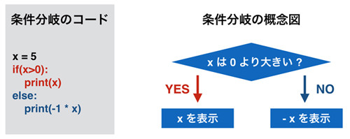

## 概要

プログラミングの学習の道のりは長いです。
そのため細かいことを説明する前に、本章でざっと全体像を語ってしまいたいと思います。
それぞれの細かい解説はあまりしませんが、分からなくても学習を進めると理解できてきますので、
 まずは深いことは考えずに手を動かしてプログラミングでどのようなことができるのか感じてみてください。

では、さっそくはじめていきましょう。Pythonのプロンプトを起動してください。
多くのプログラミング言語は、一行一行に順に命令を書いていくことで複雑な処理を実現します。
Pythonもそれと同じです。
まずは簡単な数値計算をさせてみます。計算式を書くと、その結果が返されます。

```
>>> 1 + 2
3
>>> 3 - 4
-1
>>> 5 * 6
30
```

「\*」は掛け算となります。

上記も立派なプログラムなのですが、一行でできることは限られていますので、単純な処理しか書くことができません。
より複雑なことをさせる場合は、1行目の結果を2行目で利用するといった具合に、
複数行を組み合わせて実行する必要があります。
この場合、「処理の結果を保存する」ことが必要となり、そのために「変数」を使います。
以下に具体例を示します。

```
>>> abc = 1 + 2
>>> abc + 3
6
```

上の例では1 + 2の結果を「abc」に保存して、その結果に+ 3して6を得ています。
この保存に利用しているabcが「変数」で、= 記号の右側の結果を、左側の変数に格納します。
変数に利用する文字はabcでなくても構わず、名前付けのルールさえ守れば自分が好きなものを使うことができます。
ちなみに、変数に値を格納することを「代入する」といいます。
変数の概念を以下の図に記します。


次に「関数」について扱います。
プログラムは、処理を一行一行書いていくことを繰り返して作られるのですが、
全ての機能を「自分で書く」のには限界があります。
たとえばファイルの内容を読み込む処理をしたいとした場合、
その処理は「1 + 1」とは根本的に違います。
「ファイルを開いて、それを読み込む(readする)」といった処理が必要となります。
そのような処理は「すでに誰かが作った処理」を呼び出すことで実現します。
具体的には、「ファイルを開く処理」を呼び出し、その後で「ファイルの中身を読む処理」を呼び出すのです。
この呼び出しは「関数」と呼ばれる機能を使うことで実現できます。
ファイルの読み出しだと話が難しいので、もっと簡単な「数の絶対値を得る」という関数を利用してみます。

```
>>> abs(-5)
5
>>> value = abs(5)
>>> value
5
```

「abs()」を使うことで-5の絶対値である5を得ています。
またその次に、5の絶対値である5も得ています。
absが関数の名前で()の中の数字が関数に与える値です。
ここでは、関数への入力値として-5を与えて、出力値として5を得ています。
例にあるように、関数から返された値を変数に格納することもできます。

この関数absを使うことで、自分で絶対値を得る具体的な処理を書かなくても絶対値を得ることができています。
絶対値を得るぐらいの処理でしたら自分で書いてもいいでしょうが、
先ほどのファイル処理やネットワークの利用などはそもそも関数を使わないと実現不可能です。
なお、absはよく使われる処理なので「組み込み関数」という「すぐに利用できる特別な関数」として提供されています。

次に「小数点の切り捨て」をしたいと思います。
小数点の切り捨ても関数として提供されていますが、
絶対値を得るabsほどよく使われる処理ではないので「組み込み関数」としては提供されていません。
「標準ライブラリ」という特定の処理をするためのツールセットのひとつの機能として提供されています。

標準ライブラリはそのなかに、特定機能を担当するモジュールをいくつも持っています。
たとえば、数学関連の「mathモジュール」や、OSの機能を利用するための「osモジュール」などがあります。
組み込み関数以外の「モジュールに属する関数」を使う場合は、
まず「◯◯というモジュールを使いますよ」という宣言をする必要があります。

切り捨ては「数学」的に利用される機能ですので、今回はmathモジュールを使います。
具体的には以下のようになります。

```
>>> import math
>>> math.floor(5.5)
5.0
```

「mathモジュールをimportして使いますよ」と宣言したあとで、
mathモジュールのfloor関数を呼び出しています。
モジュールに属する関数は、“モジュール名.関数()”というスタイルで呼び出すことができます。
5.5を与えて5.0を得ているのは先ほどのabsと同じですが、関数名の前にモジュール名がついているところが違います。
組み込み関数とモジュールの利用方法を以下に図示します。


なおmathモジュールにはほかの機能もあり、floorはそのひとつにすぎません。
切り捨てがあるのですから切り上げも当然ながらあります。

また、absやfloorのように「処理した結果を返す関数」だけでなく、
「結果を返さない関数」もあります。
たとえば今まで使っていたprint関数は、受け取った文字や数字を画面に出力するための関数です。
この関数を呼び出すのは「画面に出力をする」ためであり、何か値を得ることを目的としたものではありません。

```
>>> print('hello')
hello
>>> abc = 3
>>> print(abc)
3
```

上のように変数に何が入っているか確認する用途に利用できるので、
プログラムの挙動を確認するのに便利です。
本書のコードがどういう動きをしているか分からない場合は自分でコードに print 文を挟むことで、
どこをどう実行しているかといったことや、変数になにが入っているかということを確認してみてください。

さきほど絶対値を返す関数absを使ってみましたが、このような「関数」を自分で作ることも可能です。
absのように誰にでも使われる処理だと、すでに提供されている可能性が高いのです。
一方、自分だけが使うような処理だと自分で関数を作る必要がでてきます。
関数を自分で作る理由は「プログラムを整理する」ためです。
また「同じ処理を何度も呼び出す」ためでもあります。関数作成の方法を簡単に紹介します。
関数作成の手始めに“hello”と出力する簡単な関数「print_hello」を作ってみます。
複数行書く必要がでてきたため、プロンプトではなくファイルにコードを書いてためします。
ここでは test.py としています。

```
def print_hello():
  print('hello')
```

上記は関数の宣言(名前の登録)と処理の実装(機能を作る)をしています。
作った関数を使うためには、それを呼び出します。

```
def print_hello():
  print('hello')

print_hello()
```

これを実行すると以下のように出力されます。

```
hello
```

print_hello()を2回呼び出せば、helloが2回出力されます。
当然ですが、関数を定義せずに関数を呼びだそうとすると「そんな関数ないよ」と怒られてしまいます。
以前使った関数absやfloorはすでに定義されているので、自分で定義をしなくても呼び出すことができます。

次にprint_helloよりもう少し複雑な関数「add5」を作ってみます。
名前からわかると思いますが、受け取った数字に5を加えたものを返す関数です。

```
def add5(x):
  y = x + 5
  return y
```

さっそくを使います。

```
def add5(x):
  y = x + 5
  return y

z = add5(5)
print(z)
# 10
```

先ほどのprint_helloと同じように、関数の定義をdefで行い、add5を呼び出すことで関数を利用しています。
ただ、defで定義する際にadd5の()の中にxという変数が書かれています。
そして関数の定義の最後にreturnという命令が加えられています。
このxは関数を呼び出す際に「値を受け取る」ことを意味しています。
absが値を受け取るのと同じように、add5も値を受け取り、それがxに格納されるのです。
そしてそのxに5を加えた値をyに格納し、それをreturnで関数の呼び出しもとに返しています。
absが絶対値を返すように、add5は5を加えた値を返しています。

なお、わかりやすくするために、上の例では命令を一行にひとつしか書いていませんが、
一行に複数の命令を書くことも可能です。上記のadd5の例では、以下のようになります。

```
def add5(x):
  return x + 5

print(add5(5))
 # 10
```

関数作成の最後にabsと同じ働きをする関数「my_abs」を作ってみます。
まず絶対値を得るにはどういう手順で実現するか、考えてみましょう。

1.	数字Xを受け取る
2.	その数字Xが0より大きければ、すでにXは絶対値。 Xが0より小さければ、-1をかけて絶対値にする。
3.	絶対値を関数の呼び出しもとに返す

この2番目のステップで、「Xが0より大きければ、Aをする。そうでなければBをする」といったように、処理が条件分岐しています。このような条件分岐もプログラムで実現できます。



上記の図を参考にして、関数my_absを書いて利用してみます。

```
def my_abs(x):
  if(x>0):
      return x
  else:
      return x * -1

print(my_abs(-6))
# 6
```

先ほどのprint_hello、add5よりも複雑になっていますが、最初の5行で関数の定義をして、
後半で定義した関数を呼び出しているのは同じです。
-6という数字をmy_abs関数に渡して、返された絶対値をprint関数で画面に出力しています。

関数my_absの中の動きを見てみましょう。
my_abs(x)のxは、呼び出しもとで渡された値を格納しています。今回は-6になります。
その次に「xが0以上ならAをする、そうでないならBをする」という処理がきますが、それが「if else」の文です。
ifの後ろの()の中の条件「x>0」が満たされるなら、return x、
満たされないならelseの後の処理であるreturn x * -1が実行されます。
つまりx>0のときはxをそのまま返して、
x>0でないときは-1をかけて負数を正数にしたうえで値を関数の呼び出しもとに返すということです。
これで正数であろうと負数であろうと、常に絶対値が返されることがわかります。

ifのような「条件分岐」や、特定の処理を繰り返す「ループ」と呼ばれるものを組み合わせることで、
プログラムの動きをより複雑にすることができ、「特定の機能を実現するためのルール」が実現されます。
そのルールのことを「アルゴリズム」と呼びます。

一行一行命令を書くことと、誰かが作った処理を呼び出すことでプログラムが作られるということはわかっていただけたかと思います。
ただ、簡単な計算処理をさせるだけではプログラミングで何を実現できるか、
いまいちイメージがつかめていないかもしれません。
そのため、かなり駆け足となってしまいますがGUIのアプリケーションを実際に作ってみることで
「一歩先のレベルで何が作れるようになるか」を実際に味わってもらいたいと思います。
なおGUI はオブジェクト指向の知識を必要とするため本書ではなく中編で扱っています。

まず以下のプログラムをコピペで結構ですので実行してみてください。

```python
import tkinter
font=('Helevetica', 32, 'bold')
label = tkinter.Label(text='Hello Python', font=font, bg='red')
label.pack()
label.mainloop()
```

プロンプトへの貼り付けはうまく貼り付けられないことがあるので、
前回話したようにファイルに記入してから実行したほうがいいかもしれません。
起動すると以下のようなGUIの画面がでてきます。


GUIを利用する手法はさまざまですが、上の例では「tkinter」と呼ばれるPythonが提供しているGUIのモジュールを使っています。
mathモジュールと同じように、tkinterをimportし、「tkinter.Label」という関数でGUIのパーツを作り、
それを変数labelに格納しています。
その際にフォントや背景色、テキストに表示する文字などを指定しています。
少し複雑ですが、基本的には関数absに-5を与え5を得ていたのと全く同じです。
そして、そのlabelに格納されたパーツに対して、「pack()やmainloop()という処理をしろ」と命令することで、
実際に画面にGUIのパーツが画面に表示されます。

実は、tkinter.Labelという関数はLabelという「クラス」を「インスタンス化」するという処理を実行しています。
ただ、その概念は少々ややこしいので、詳細は「中編のオブジェクト指向の書籍」で扱います。
ただ、「クラスから作られたデータに対して、命令をすることで処理が実行され、
データの状態を変化させる」ということは覚えておいてもらったほうがよいかもしれません。
これについては後ほど簡単に解説します。

本章の最後にGUIのカウンターのアプリケーションを書いてみます。
アプリケーションとしては非常に単純なもので「ボタンがクリックされた回数」を表示するだけのものです。
以下のプログラムを実行してみてください。

```python
import tkinter

counter = 0
font=('Helevetica', 32, 'bold')
button = tkinter.Button(font=font, text=str(counter))

def clicked():
    global counter, button
    counter = counter + 1
    button.config(text=str(counter))

button.config(command=clicked)
button.pack()
button.mainloop()
```

以下のような画面が立ち上がり、クリックすると表示される数が増えることがわかると思います。


上記のプログラムを細かく解説することはしませんが、このプログラムで重要なのは以下の2つです。

* def clicked(): による関数の宣言
* button.config(command=clicked) による関数の登録

ボタンをクリックした際の処理を自分で関数「clicked」として定義し、
それを「button」というGUIのパーツに「ボタンがクリックされたらこの関数を実施して下さい」という形で登録をします。
そうすることで簡単にGUIのプログラムをカスタマイズして作ることが可能になります。

複雑なアプリケーションを書く際は、すべてを自分でプログラムをするということは実質的に不可能です。
そのため、提供されるなんらかのライブラリやフレームワークを利用することになります。
今回の「clicked関数の宣言とその登録」は、ライブラリやフレームワークを利用する際によく使われる手法のひとつです。
ほかにはクラスを継承する方法などもありますが、これらについても中編のオブジェクト指向編にて扱います。
