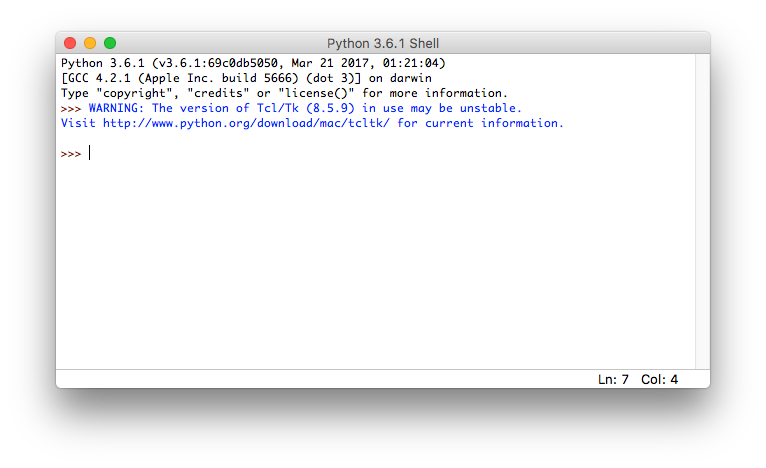
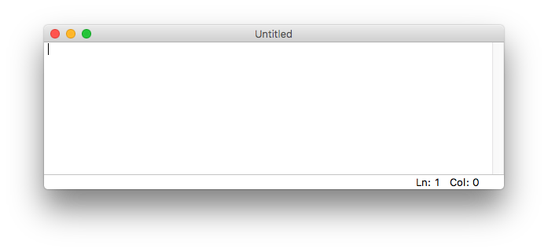
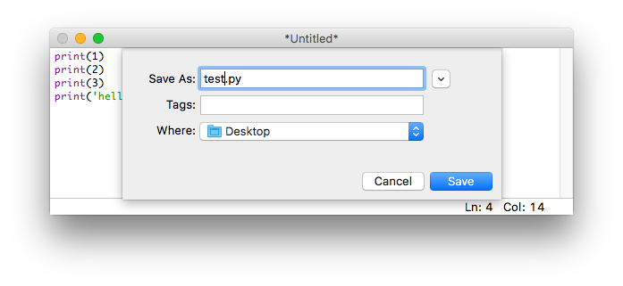
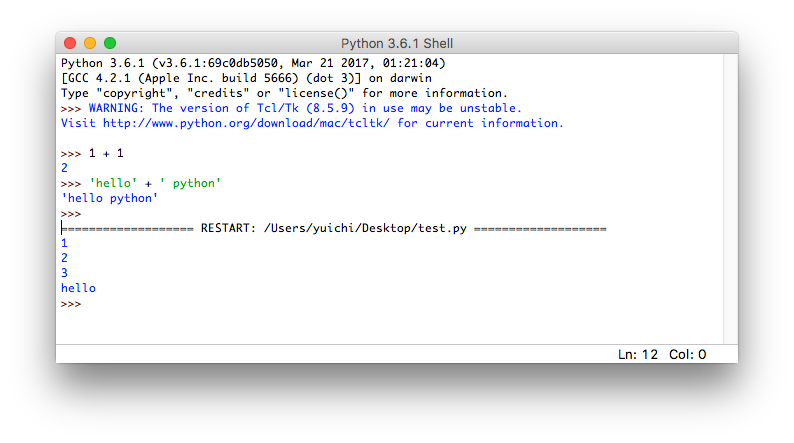
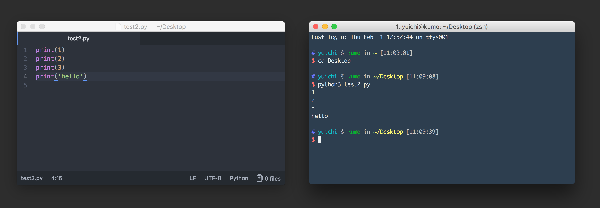
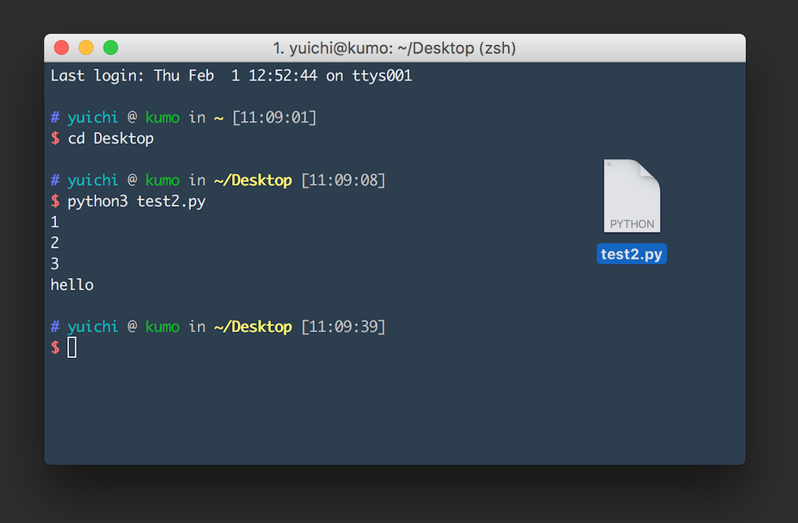
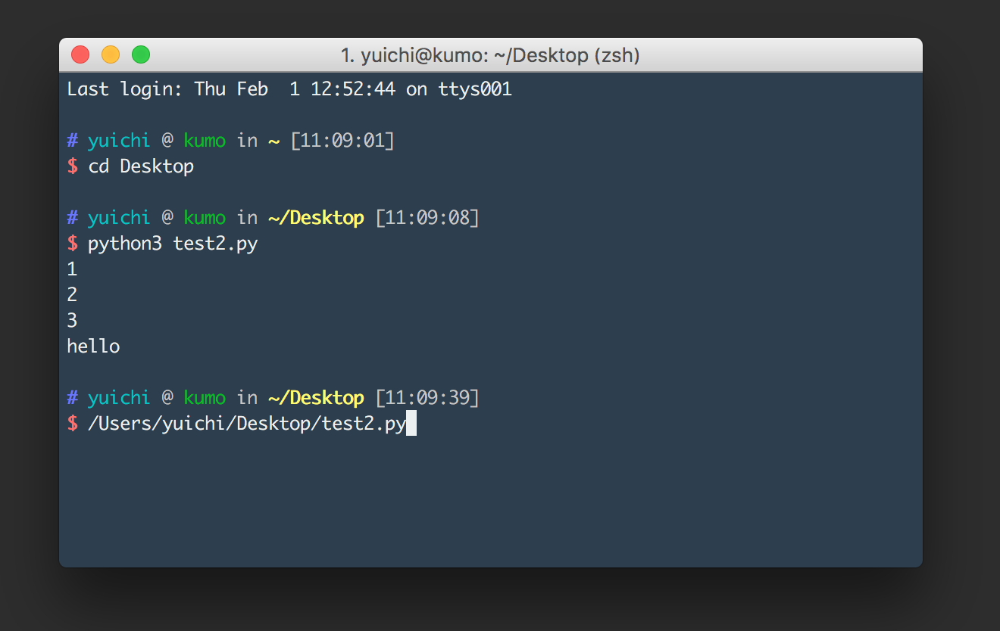

# プログラムファイルの実行

{{ TOC }}

## 概要

Pythonに複雑な処理を実行させるにはインタプリタではなく、
プログラムをファイルに書いてそれを実行するという方式をとります。

開発するには「プログラミング用のエディタ」でコードを書く必要があります。

ファイルに書かれたプログラムはコンソールからpythonコマンドを使って実行します。

## 開発の流れ

Pythonのインタプリタでは、「ユーザーからの入力」と「Pythonの処理と出力」を繰り返します。
ユーザーがいちいち入力をしないと何もできないので、プログラムを使ってなんらかの処理を「自動化」する用途には向いていません。

Pythonに決められた処理を実行させたい場合は「ファイルに書かれたPythonのプログラムをPythonに実行させる」という手法を使います。
プログラマは実行したい処理をあらかじめファイルに書いておき、それをPythonに実行させるという流れです。

Pythonでのプログラムの開発にはプログラミングに適した「**エディタ**」を使います。
Windowsのノートパッドで開発することもできますが、
プログラミング用のエディタには「**シンタックスハイライト**」と呼ばれる文法を解釈して文字を色付けする機能や、
「**オートインデント**」と呼ばれる整形機能があります。
高機能なエディタでは「**補完**」と呼ばれる入力候補を示してくれる機能すらあります。

Pythonでの開発は一般的には自分の好きなプログラミング用のエディタかプロジェクトで選定されたエディタで開発を行い、
それをコンソールから実行するという流れをとります。

## IDLEでの開発

Pythonをインストールすると「**IDLE**」と呼ばれる開発環境も同時にインストールされています。
プログラミングを全くしたことがない初心者はこれを使うのが簡単ですので、IDLEを使った開発方法をまずは紹介します。

次は「IDLE」と呼ばれるPythonの開発環境を使ってコードを書いてみます。
IDLEは先ほどのようなプロンプト画面も使えますし、Pythonを書くのに適したエディタの機能も持っています。
では、さっそくIDLEを立ち上げてみましょう。

### インタプリタ機能の利用

Windowsは、Windows メニューにある「すべてのプログラム」から「Python」を選択し、
その下にある「IDLE (Python GUI)」を選べば起動します。
Macは、アプリケーションフォルダ配下の「Python」ディレクトリの下に「IDLE」がありますので、
それをダブルクリックして起動させます。

起動すると以下のようなPythonインタプリタの画面が立ち上がってきます。
先のページと同じように計算をさせたり、文字を表示させたりすることもできます。



### プログラムの作成

IDLEはインタプリタだけでなく、Pythonの開発用のエディタとしても使うことができます。
新規ファイルの画面を開くには、IDLEのメニューから［File］ -> ［New File］とします。



これに以下の文を書き込んで「test.py」というファイル名で保存([File]->[Save])してください。
ご存知のようにファイルの拡張子(.txtや.mp4など)は、そのファイルがどの種類のものかを表します。
Pythonのプログラムファイルは拡張子が「.py」となります。

```python
print(1)
print(2)
print(3)
print('hello')
```



このプログラムの中にある「print」はカッコのなかにあるデータを画面に表示しなさいという命令になります。

### プログラムの実行

IDLEのエディタが選択されている状態で「F5」ボタンを押すと、
このファイルがPythonで実行され、結果がインタプリタ側の画面に表示されます。



Macで「F5」を実行するには、「fn」キーを押しながら「F5」ボタンを押す必要がありますので注意をしてください。
また、プログラムを実行するにはファイルが保存されている必要があります。
編集中のファイルを実行しようとすると、その前に保存することをIDLEが求めます。


## IDLE以外のエディタでの開発

IDLEは小規模なPythonプログラムの開発に十分な機能を持っています。
ただ、本格的な開発をするにはPythonのプログラミングエディタや「**統合開発環境(IDE)**」を使うのが一般的です。

プログラミング用のエディタはプログラムを書く上での様々な便利な機能があります。
統合開発環境はそれに加えて実行をしたり、プロジェクト単位でファイル群を扱ったりする機能があります。
Javaなどの開発では統合開発環境の利用が事実上必須ですが、
Pythonなどのスクリプト言語はプログラミング用のエディタで開発することのほうが多いです。

### 初心者におすすめのプログラミング用のエディタ

プログラミングをするためのエディタは数多くあります。
昔からある有名なものだと「**Vim**」や「**Emacs**」などがあり、
最近だと「**VSCode**」「**Sublime**」「**Atom**」あたりのユーザーが多いようです。

上級者であれば好きなエディタを使えばよいのでしょうが、
初心者の場合はvimとemacsは避けることをおすすめします。
なぜなら、これらのエディタはエディタ自体に癖があるので慣れるのに時間がかかるためです。
Pythonの勉強をすべき状況であるにもかかわらず、エディタの使い方に戸惑うのは間違っています。

VimとEmacs以外のエディタは一般的なエディタの延長線上にあるため癖がそれほどありません。
私は2年前ぐらいにSublimeからAtomに乗りかえています。


### 開発と実行

IDLE以外でのエディタを使う場合も、開発から実行までの流れはIDLEと全く同じです。
ただ、実行はF5ボタンではなくコンソールを使います。

コンソールでそのファイルを指定してPythonコマンドを使うことで、ファイルに書かれたプログラムが実行されます。
WindowsのパワーシェルやMacのターミナルで、pythonコマンドに続けてファイル名を書きます。



ファイルの指定方法には「**相対パス**」と呼ばれる方式と、「**絶対パス**」と呼ばれる方式があります。
相対パスはコンソールがどのディレクトリにいるかを基準としてファイルの所在地を書く方法で、
絶対パスはOSの一番上の階層を基準としてファイルの所在地を書く方法です。

この図の例では「cdコマンド」を使ってデスクトップに移動し、
そこにある「test2.py」というファイルを相対パスで指定して実行しています。

ファイルをコンソールにドラッグアンドドロップすれば絶対パスが表示されます。

#### 図: ドロップ前



#### 図: ドロップ後




絶対パスでファイルの場所を示せば、コンソールがどのディレクトリにいるかに関係なくファイルを指定できます。
このようにして、pythonコマンドに実行するファイルを指示すれば確実に実行ができます。


### Pythonのプログラムの中で日本語を使う方法

プログラム内では日本語を含む「**マルチバイト文字**」を使うことができます。

マルチバイト文字を使うには「**文字コード**」を指定する必要があります。
日本語ですと「UTF-8」「Shift-Jis」「EUC-JP」などが有名なコードです。

Python3のデフォルトの文字コードはUTF-8ですので、プログラムを書く場合はUTF-8を使うようにしてください。
他の文字コードも使うことができますが、そのための宣言などをしないといけなくなります。
宣言なしにUTF-8とASCII以外の文字コードを使うとエラーが発生しますので注意をしてください。


## print関数

Pythonには「**関数**」と呼ばれる機能があります。
関数は特定の機能を果たすための仕組みで、数多くあります。

使いたい関数は「関数名()」という形で呼び出すことができます。
例えば先ほどのプログラムの中で利用した「print(1)」は「**print関数**」の呼び出しとなります。

関数の()のなかには関数に与えるデータを書きます。
どのようなデータを与えられるかは関数によって異なりますが、
print関数の場合は受け取ったデータを画面に表示するという動きをします。

インタプリタを使う場合はprint関数を使わなくてもデータを表示させたりすることができますが、
プログラムファイルを実行する場合はprint関数などを使わないと何も表示されません。
どのように動いているかを確認するためには、本サイトのサンプルプログラムではprint関数を多用します。
