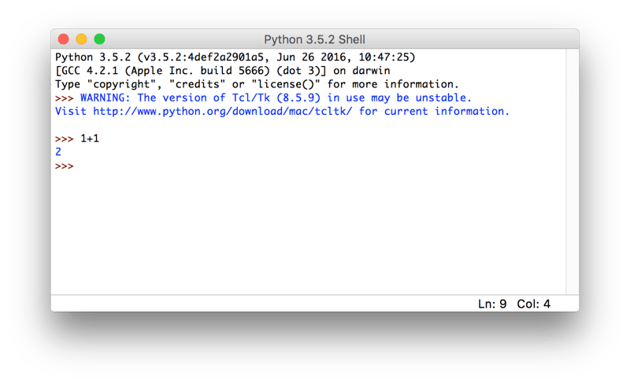

## Pythonの実行

### プログラムをファイルに書いて実行する

プロンプトの次は「IDLE」と呼ばれるPythonの開発環境を使ってコードを書いてみます。
IDLEは先ほどのようなプロンプト画面も使えますし、Pythonを書くのに適したエディタの機能も持っています。
では、さっそくIDLEを立ち上げてみましょう。

起動すると以下のような画面が立ち上がってきます。
プロンプトと同じなので、計算をさせたり、文字を表示させたりすることもできます。



Windowsは、Windows メニューにある「すべてのプログラム」から「Python」を選択し、
その下にある「IDLE (Python GUI)」を選べば起動します。

Macは、アプリケーションフォルダ配下の「Python」ディレクトリの下に「IDLE」がありますので、
それをダブルクリックして起動させます。
パワーシェルやターミナルと同じように、IDLEもタスクバーやDockに登録してしまってもいいかもしれないです。

プロンプトに1行1行書いて実行させるだけでなく、ファイルにPythonのプログラムを書いて実行させることもできます。
IDLEのメニューから［File］ -> ［New File］とすることでエディタが開きます。
これに以下の文を書き込んで「test.py」というファイル名で保存(［File］ -> ［Save］)してください。

Pythonプログラムが書かれたファイルの名前は好きなもので構いませんが、次の条件を満たすものとしてください。

* ファイルの拡張子が「.py」
* アルファベット(小文字推奨)と数字のみから構成されている
* 最初の一文字はアルファベット

拡張子はファイルがPythonのものであることを、ユーザとPython自体に知らせるために必要です。
ファイル名のルールは後ほど扱う「モジュール」という仕組みに関連しています。
今の時点では、深いことは考えずにこの命名規則を守るようにしてください。

以下にIDLEのエディタに書く、サンプルプログラムを記載します。
プログラムの内容は1、2、3と順番に画面に出力させるだけの簡単なものです。

#### プログラム: 1,2,3と出力

```python
print('1')
print('2')
print('3')
```

#### コンソール出力
```text
1
2
3
```


IDLEのエディタが選択されている状態で［F5］ボタンを押すと、
このファイルをPythonで実行できます(Macで「F5」を実行するには、［fn］キーを押しながら［F5］ボタンを押す必要があります)。
実行するにはファイルが保存されている必要があります。

F5を押すとプロンプトのウィンドウが前面に来て、プログラムの実行結果が出力されます。


なお、先ほど作成したファイル「test.py」を開く際に、利用するアプリケーションとしてIDLEを選択することもできます。
Windows ですと右クリックを押すと「IDLEで編集 (Edit with IDLE)」と出るので、
そこからファイルを直接開けます。
Macだと右クリック(［Control］を押しながらクリック)して、「IDLEで開く」と指定することで実現できます。
もちろん、IDELE のメニューから既存のファイルを開くこともできます。

先程はIDLEからファイルの実行をしましたが、コンソールからpythonのプログラムファイルを実行することも可能です。
Windowsのパワーシェルや、Macのターミナルで「pythonコマンドに続けてファイルを指定する」ことで、
そのファイルに書かれたPythonのプログラムが実行されます。

試しに、先ほどIDLEで作成した「test.py」をターミナルから起動してみます。
IDLEと同じ出力があることからプログラムがきちんと動いていることが分かります。


また、プロンプトを見てもらうと分かるように「pythonファイルがあるディレクトリ」に移動してからファイル名を与えてプログラムを実行しています。
違うディレクトリで実行するファイルを指定する場合は、
相対パス(自分がいる場所を起点としたファイルやディレクトリの場所)なり、
絶対パス(ファイルシステムのルートを起点としたファイルの場所)なりを指定する必要があります。

なお、以下のように自分の好きな高機能エディタとターミナルを並べて開発するスタイルや、
PyCharm といった IDE (統合開発環境) を使った開発が現場では一般的です。
IDLEは最初から使えるので便利なのですが、開発に必要な機能がそれほど多くないため、
大規模な開発ではそれほど利用されません。

ある程度コードが書けるようになったら、
自分にあった開発環境を模索してみてもいいかもしれません。


### Pythonのプログラムの中で日本語を使う方法

日本人である私達がプログラムを書く場合、日本語を利用する状況は多いはずです。

日本語などのアルファベット文字以外の扱いについては、
後ほど詳細に説明します。
現時点では「UTF-8」という文字コードでプログラムを書けば、
Python3では日本語を使えると覚えておいて下さい。

Windowsでよくつかわれている「Shift-Jis」などは、Python3のデフォルトの文字コードではありません。
特別な宣言なしにShift-Jisを使うと、プログラムが実行できないので注意をしてください。
逆に言えば、宣言をすればShift-Jisの日本語も使えます。


### Pythonコマンドで直接プログラムを実行

この項目はそれほど一般的でないため、初心者のかたは読み飛ばして頂いて構いません。

Pythonでプログラムを実行する方法は、先に説明した「Pythonシェルを使う」ことと、
「Pythonのプログラムファイルを実行する」ことがほとんどです。

ただ、これらに加えて「Pythonコマンドに続けてプログラムを書き、それを実行する」という方法があります。
例えば以下のようなものです。


#### コンソール: Pythonプログラムをコマンドに書いて実行

```text
$ python3 -c "print(1+1)"
2
```

Pythonコマンドに続けて、「-c」オプション、そして実行するプログラムが書かれています。
その実行結果が2となっていることから、「print(1+1)」が実行されていることがわかります。

このように「-c」オプションを使うと、プログラムを直接書いて、実行することができます。

ただ、「-c」に続けて記述するプログラムには、改行を含むことができません。
そのため、プログラムは1行で完結する必要があり、複雑なプログラムを書くには適しません。

利用場面はそれほど多くありませんが、Pythonのプログラムファイルを用意する必要がないため、
以下のような使い方ができます。

* 手順書で「これを実行してください」などと示す
* SSH 経由で他のマシンに処理を実行させる
* シェルのパイプと組み合わせて使う

1行で複雑なプログラムを書くには、高いプログラミングスキルを必要とします。
そのうえ、開発もめんどうなうえに、書かれているプログラムを呼んでも分かりにくいです。
可能であれば、プログラムファイルにプログラムを書き、それを実行するようにしてください。
