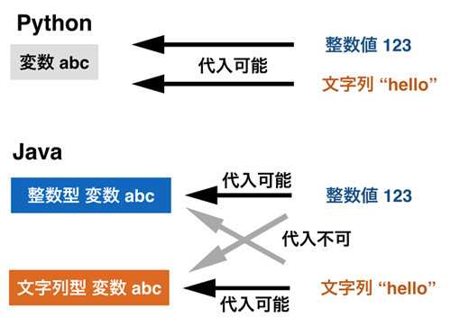

## 型と変数

### 型

プログラミングで使われるデータには「型」と呼ばれるものがあります。
たとえば、1や2というのは「数値」という型で、“Hello”というテキストは「文字列」という型です。
プログラミングをする際に、初心者の方はこの「型」について意識することが重要です。
なぜかというと、「型」と「処理」は密接に結びついているためです。
例をあげて説明します。Python のプロンプトを立ち上げて以下を実行してみてください。

```
>>> 3 + 3
6
>>> 3 - 1
2
```

上記のように数値は足し算、引き算することができます。当たり前といえば当たり前です。

では、文字列はどうでしょうか。文字列は ' ' でアルファベットや記号を囲むことで作成できますので、
先ほどと同じように足し算と引き算をさせてみます。

```
>>> 'hello' + 'python'
'hellopython'
>>> 'hello' - 'python'
Traceback (most recent call last):
  File "<stdin>", line 1, in <module>
TypeError: unsupported operand type(s) for -: 'str' and 'str'
```

文字列の足し算はできました。文字列の後ろに別の文字列をくっつけるという「結合」処理がされています。
文字列の結合は数値の足し算とは違いますが、これも直感的な処理内容といえるのではないでしょうか。

ただ、文字列の引き算をしようとしたところ、エラーが表示されてしまいました。
このエラーの内容は「operand(オペランド)」という言葉で小難しく説明されていますが、
要するに「文字列 - 文字列」という処理はできないということを言っています。

最初にも説明しましたが、「型」と「処理」は密接に結びついています。
数値であれば足し算も引き算もできますが、文字列は足し算(結合)しかできません。
同様に文字列でしかできない処理というものも存在しています。
すべてを暗記する必要はありませんが「どの型がどのような処理をすることができるか」
「その処理をするにはどういう書き方をすればいいか」ということをある程度知っておくことは重要です。
詳細はプログラミング言語ごとに若干異なりますが、他の言語でもそれほど大きな違いはありません。
そのため、型と処理の関係の知識がたまると言語というよりプログラミング自体の知識が向上します。

以下に型と処理の関係を示す図を記載します。


なお、ぱっと見て「同じに見えるデータ」であっても、型が違えば別物ですので注意が必要です。
例えば数値の3と文字列の'3'は別物です。前者は引き算に使えますが、後者は使えません。
後者はあくまでも文字列としての3であり、数値ではありません。

### 変数

型の続きを説明する前に変数の話をしてしまいましょう。
変数はデータを格納するための箱のようなものです。
プログラミングは1行1行に命令を書き連ねていくことで実現されますが、
後ろの行で前の行の結果を利用する場面などが必ずあります。
そのような場合に、変数に命令の結果を保存して、それを後で使うといった利用方法がとられます。
イメージとしては以下の図のようなものとなります。


変数の使い方は非常に簡単で、以下のように宣言するだけで変数に値が格納されます。

```python
変数名 = 変数に入れたい値
```

変数名はアルファベットから始まり、特別なキーワードを避けた英数字と一部の記号(“\_”など)から構成されていれば、
好きなものを使ってかまいません。
特別なキーワードは次章以降で扱うPythonの文法で利用されるものです。
たとえば、条件分岐のifやelseなどは変数名には使えません。
なお、変数に値を入れることを「代入する」といいますので、それも覚えておいてください。

変数が利用される場合は、その中に実際に代入されている値が自動的に取り出されて使われます。
以下に例を示します。

```
>>> a = 5
>>> print(a)
5
>>> b = a + 5
>>> print(b)
10
>>> b = a + 6
>>> print(b)
11
```

取り出しただけではデータは消失しないので、何度でも利用できます。
たとえば変数aに5を代入した後に、変数aから2回値を取り出していますが、2回とも5が取り出されています。
一般的には、取り出すというよりも“変数aが5を「返す」”というような言い方をします。

ただ、注意してほしいのは「なにか値が代入されている変数」に新しい値を代入してしまうと「昔の値」は上書きされてしまうということです。
上記例で、bは10を保持していましたが、そこに11が代入されると10を消失してしまいます。
また、代入されていない変数を使おうとするとエラーとなります。

少し高度になりますが、変数に同じ変数の値を加工して代入することも可能です。
たとえば、変数aにすでに文字列が入っており、それに別の文字列を追加したいという場合は以下のように書きます。

```
>>> a = 'hello'
>>> a = a + 'python'
>>> print(a)
hellopython
```

上記の「a = a + 'python'」は以下の動きをします。

1.	右のaが'hello'という文字列を返す
2.	それに'python'が結合されて'hellopython'になる
3.	'hellopython'が左のaに代入される

なお、「a = a」のように加工せずにそのまま代入することもできますが、その処理にとくに意味はありませんので普通はしません。

上記のサンプルでは変数名に a というアルファベットを使いましたが、
実際のプログラミングを行う際は以下のルールを守って命名するようにすることが推奨されています。

*	分かりやすい変数名
*	大文字は使わずアンダーバーで単語を区切る
*	理由なくアンダーバーから始まる変数名は使わない(特別な意味を持つ)

以下に良い例と悪い例を示します。

```
# 1単語の場合
student = 'taro' # OK : 小文字のみで構成
Student = 'taro' # 大文字スタートなのでNG
a = 'taro'       # a が何か分からないのでNG

# 2単語の場合
student_name = 'taro' # OK : 小文字の単語間を _ で区切る
studentName = 'taro'  # NG : 単語の区切りを大文字に
                      #      するのは Python 流でない

# 先頭が _ から始まる
_student = 'taro'   # 他の人に「これを使わないで下さい」と示す
__student = 'taro'  # 文法として外から使えなくする
```

プログラミング言語によって変数名の名前の付け方は異なります。
難しいことを考えなければ小文字の単語とアンダーバーのみで構成すると覚えておいて下さい。
なお、アンダーバーから始まる変数をどう利用するかは中編にて扱います。

また使いたい名前が予約後(Pythonの文法として特別な意味をもつワード)や、
既に定義されている名前と重複する場合は名前の後ろにアンダーバーをつけるという慣習があります。
たとえば後ほど説明する list という型がありますが、
リストのデータを list という変数に代入することは名前が分かりやすいためついついやりたくなりがちですが避けなければいけません。
list という変数名の代わりに list_ という変数名を使います。

```
# NG
# list = [1,2,3,4]

# OK
list_ = [1,2,3,4]
print(list_)
# [1, 2, 3, 4]
```

ただ、本書で使われるようなサンプルのプログラムならともかく、
現実のアプリケーションで用いられるコードの変数は何らかの役割があるはずです。
そのため、list_ といったような名前は本来現れないことが望ましいです。

Pythonの変数の概念は非常に簡単です。「
変数はどのような型の値でも格納する入れ物のようなもの」ということを理解していれば、
しばらくは何も問題ありません。
ただ、CやJavaなどのほかの言語だと、変数の概念はもう少し複雑なので簡単に説明します。
興味がない人は読み飛ばしていただいてかまいません。


### 型と変数

Python以外の言語を少しでも学んだことのある人は、先ほどのPythonの変数の使い方に違和感を覚えられたかもしれません。
CやJavaなどは「変数」と「型」が密接に結びついています。
具体的にいうと変数にも型があり、変数の型と代入する値の型は同一である必要があります。

たとえば、Javaで変数xを宣言し、それを利用するには以下のように書きます。

```java
// JAVA
int x;
x = 5;         // OK
x = "Java"     // Error
```

Pythonで変数を利用する場合、変数xの前に「int」というキーワードは存在していませんでした。
intは整数型のことなので、この場合は「整数型の変数x」を作っています。
Javaの変数には必ず型があるので、変数を宣言する(作る)際には必ず「int」といった型を示す必要があります。

上記例では変数を作成した後で、その変数に整数値5と文字列“Java”を代入しています。
変数xは整数型なので、同じ整数型である5は代入できるものの、
文字列型の“Java”は代入できずにエラーとなります。

文字列型の変数もこれと同じです。
文字列を格納するために作成された変数yに文字列を代入することは当然できますが、
整数型である5を代入することはできません。

```java
// JAVA
String y = "Java";   // OK
y = 5;               // Error
```

一方、Pythonの変数にはどのような型でもいれることができるので、
以下のように「整数を代入した変数に文字列を代入する」ことも問題ありません。
そもそもJavaでいう「int」や「String」といった変数の型宣言がPythonのコードにはありませんね。

```python
# PYTHON
x = 5
x = 'python'
```

Python と Java の変数の使い方の違いを図にまとめます。



ただ、上記のような「変数を使いまわす」ようなコードは一般的には避けたほうがよいです。
一度宣言された変数を「別の使い方で再利用」すると、その変数に何が入っているのかわかりにくくなるため、
プログラミングの行儀がよくありません。専門的な言い方をすると「保守しにくいコード」といわれます。
脱線はこのぐらいにして本題に戻ることにしましょう。

### 定数とマジックナンバー

プログラムの中にはたまに「マジックナンバー」と呼ばれる正体不明の数字が現れることがあります。
たとえば以下のコードを見て下さい。

```python
a = 100 * 1.08
print(a)
```

このコードが何をやっているか分かりません。
結論を言ってしまうと、1.08 は税率にあたり、税抜き100円が税込みいくらになるか確認しています。
1.08 という数字を見て勘のいいかたであれば「税率のようだ」と気づくかもしれませんが、
プログラミングはそのような気づきには頼ってほしくないです。

このような場合、1.08 というよくわからない「マジックナンバー」ではなく「定数」を使うことが望ましいです。
定数は一回設定されたら変更されることがない特殊な変数であり、
その名前は大文字とアンダーバーで宣言されます。
例えば先程の税込み額の計算プログラムであれば以下のようになります。

```python
TAX_RATE = 1.08

a = 100 * TAX_RATE
print(a)
# 108
```

上記の TAX_RATE が定数にあたります。

この定数は一般的にプログラムのファイルの先頭で宣言されます。そしてパラメータとして使われることも多く、
ファイルを開いて定数の値を変更することでプログラムの挙動を変えることがよくあります。
例えば税率が10% に変更されたら、プログラム本体ではなく定数を書き換えることで対応します。

```python
TAX_RATE = 1.1

a = 100 * TAX_RATE
print(a)
# 110
```

1.08 という税率がプログラムの各所に散っていたら、それを全て 1.1 に書き換えていく作業が必要になります。
定数を使っていればそのような作業は不要になり、なおかつプログラムが分かりやすくなります。

ちなみに、Python の定数は厳密な意味では定数ではなく、実は文法としては単なる変数と変わりがありません。
大文字で定数を作るというのは Python のプログラマたちが決めたルールであり、文法的な拘束はありません。
そのため再代入をしてもエラーとはなりません。ただ、定数が変わることは誰も想定していないので、
再代入は絶対にしないでください。
