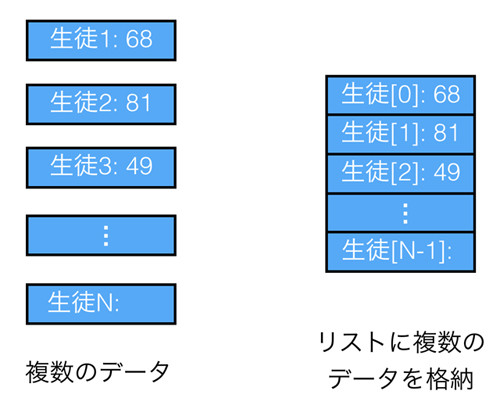
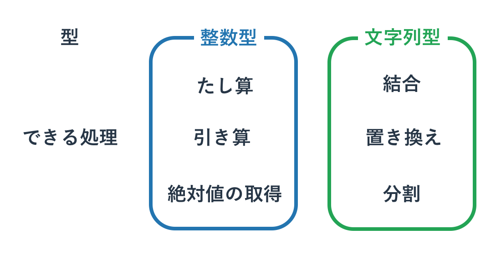

## Python で最重要な型

型と変数の基本的な使い方がわかったので、最初に知るべき重要な型とその利用法をいくつか紹介したいと思います。
今回紹介するのは以下の4つとなります。

* 数値
* 文字列
* Bool(ブール)
* リスト(配列)

この4つの型を使わずにプログラムを書くことは不可能と言ってもよいほどです。
これ以外にも重要な型はいくつかありますが、まずはこれら4つの型をしっかりと使いこなせるようになることが大事です。

### 数値型

いくつかのプログラミング言語では、同じ数値といってもそれが種類ごとに細かく分類されて別の型として扱われます。
たとえば、CやJavaでは「整数」と「少数」は別物ですし、それらも表現できる範囲が決まっています。
Javaの整数型であるintは32bitで整数を表現する型であるため、小数点は扱えない(切り捨て)ですし、
32bitで表現できない非常に大きな数なども利用できません。

一方、Pythonで数値を使うのは非常に簡単です。
正確にはPythonにも整数型や小数型は存在するものの、それらは区別なく同じ「数値型」のようなイメージで扱うことができます。
また、Javaのintで表現できない非常に大きな桁も、Pythonでは特別な操作をせずに表現できます。

```
>>> 123456789 * 123456789 # 掛け算
15241578750190521
```

数値型でどのような処理ができるかという話に移りましょう。
とくに断りなく使ってきましたが、数と数の計算に使用する「+」や「-」といった記号は「演算子」とよばれています。
そして演算子の演算対象となる値を「オペランド」と呼びます。

```
>>> 1 + 2
3
>>> 5 - 3
2
```

たとえば、1 + 2の演算子は「+」であり、そのオペランドは「1」と「2」です。数値型に関しては、
この演算子の種類を知ることが「処理」を知ることの第一歩といえます。

Pythonの数値計算で利用可能な演算子は以下となります。
いくつかは算数で使われる記号なのでわかりやすいですが、プログラミング独自の記号の使い方や、
Pythonだけでしか使えない記号もあります。足し算、引き算、掛け算、割り算がメインとなる処理ですが、
ほかの演算もときどき使うので覚えてしまってもいいかもしれません。


| 利用可能な演算子 | 説明 |
|:-------------:|:---:|
| M + N | 足し算 |
| M - N | 引き算 |
| M * N | 掛け算 |
| M / N | 割り算 |
| M % N | 剰余(あまり) |
| M ** N | べき乗(M * M * M.. を N回) |

算数の授業で習ったかと思いますが、演算子にも優先順位があります。
たとえば算数で「1 + 2 x 3」という計算をする場合、足し算よりも掛け算が優先されるため、
1+2よりも先に2x3が計算されて、答えは7になります。
Pythonでも同様に、上記の計算結果は7となります。
掛け算よりも足し算を優先する場合は「足し算を()で囲む」ことをしますが、Pythonも同様です。

```
>>> 1 + 2 * 3
7
>>> (1 + 2) * 3
9
```

とりあえず数値型の処理の紹介はこれで終わりです。
ただ、当然ながらほかにも多くの処理が存在しています。
たとえば今までも利用していた「絶対値を得る方法」や、「文字列の数字を数値型に変換する方法」などもあります。
よく行われる処理は調べればすぐわかるので、その都度ドキュメントをあたるなり、
検索エンジンを使うなりして解決してください。

演算子の話をしたので、次に代入を行うための特別な演算子である「代入演算子」の紹介もします。
名前からわかると思いますが、代入(=)と演算を同時に行うのが代入演算子です。

| 利用可能な演算子 | 説明 |
| M += N | M = M + N |
| M -= N | M = M - N |
| M *= N | M = M * N |
| M /= N | M = M / N |
| M %= N | M = M % N |
| M **= N | M = M ** N |

演算子と代入の記号(=)がくっついているだけなので、規則性は見てとれます。

```
>>> a = 5
>>> a += 3
>>> print(a)
8
```

注意すべきなのは、PythonにはCやJavaでいうインクリメント/デクリメントが存在しないことです。
インクリメントは変数の値に1を加えることで、そのためには特別な演算子である「++」を使います。

たとえばJavaの以下のコードでは、i は 1 になります。

```
int i=0;
i++;
```

Pythonで同様のことを行うには、以下のように書きます。

```
i = 0
i += 1
```

変数iに1を加えた値を、再度iに代入することは、インクリメントすることと実質的に同じです。
デクリメントも同じように使います。

必要であれば少数も利用されます。
例えば「整数÷整数」も必要があれば少数になります。

```
>>> 5 / 3
1.6666666666666667
>>> 5 // 3  # // は整数になる除算(切り捨て)
1
```

数値を扱う関数も多数用意されており、
例えば前章にて扱った絶対値を得る関数やリスト(後述)の合計値を得る関数があります。

```
>>> abs(-3)
3
>>> sum([1,3,5])
9
```

数値の操作はさまざまな処理で利用されます。
たとえば解析ツールや統計処理を行うアプリケーションを作るのであれば、数学的な処理をする必要があります。
演算子と数学的知識を使って、それを自力で実装する方法もありますが、
可能であれば実装の労力と実効速度およびバグの少なさを考慮して「標準ライブラリ」や「外部のライブラリ」を使うべきです。
ライブラリ(モジュール)の使いかたは本書で扱いますが、個別ライブラリに関しては主に下編で扱います。

### 文字列型

プログラミングでは、テキストデータを扱うことが非常に多いです。
そのため、テキストデータを扱う「文字列型」を使いこなせるようになることが重要です。

数字はそのまま書けば認識されていましたが、文字列は「特別な記号」でテキストを囲むことではじめて、
Pythonで解釈できるようになります。今まで特にことわりなくシングルクオテーション「'」を使っていましたが、
それも文字列を作る特別な記号のうちのひとつです。

たとえば以下のようにつかいます。

```
text = 'abcdefg'
```

テキストも数値と同じように演算することができます。
先に示したように「+」で結合もできますし、あまり知られていませんが「\*」で同じ文字列を繰り返すこともできます。

```
>>> text = 'hello' + ' python'
>>> print(text)
hello python
>>> text = 'hello' * 3
>>> print(text)
hellohellohello
```

プログラム中で文字列を作成する方法は主に3つあります。

Python で最もスタンダートなのは文字列型にしたいテキストをシングルクオテーション「'」で囲むというものです。
空白文字もそのまま含めることができます。

```
>>> text = 'hello python'
>>> print(text)
hello python
```

タブや改行といった特殊な文字はエスケープ処理をすることで加えることができます。
たとえば改行は、"\n"と表現されます。
英語キーボードの半角の\(バックスラッシュ)と日本語キーボードの¥は同じ意味なので、¥n(円記号は半角)も改行の意味を持ちます。

```
>>> print('hello \n python')
hello
 python
```

わかりやすいように\nの前後に空白をいれましたが、
改行させたいだけの場合は空白は不要です。
'hello\npython'と書けば改行コードが入ります。

文字列を作る別の方法はテキストをダブルクオテーション「"」で囲むというものです。
シングルクオテーションとほぼ同じです。
ほかのプログラミング言語だとダブルクオテーションのほうがよく使われるので、Pythonでもこちらを好んで使う人がいます。

シングルクオテーションとダブルクオテーションの使い分けは特に決まったものはないのですが、
「シングルクオテーションをダブルクオテーションで囲むと文字として扱われる」というルールがあるので、
文字列の中にシングルクオテーションを使いたい場合はダブルクオテーションを使うと便利です。

```
>>> print("it's nice!!")
it's nice!!
>>> print('it\'s nice!!')
it's nice!!
```

2つめの例のようにエスケープ記号を使うことで、
シングルクオテーションの中でシングルクオテーションを使うこともできます。
ダブルクオテーションでシングルクオテーションを囲むのと同じように、
シングルクオテーションでダブルクオテーションを囲むこともできます。
その効果はまったく同じで、ダブルクオテーションをエスケープせずに文字列で使うことができるというものです。

最後の方法はトリプルクオテーションというものです。
これはテキストをシングルクオテーションかダブルクオテーションの3つで囲むというものです。
トリプルクオテーションで囲まれると、その中身が見たままにテキストとして表示されます。
例えば以下のようになります。

```
>>> text = '''it's nice!!'''
>>> print(text)
it's nice!!
```

プロンプトでは使えませんが、ファイルにプログラムを書き込む場合は、
改行も含めてひとつのテキストにすることが可能です。
たとえば以下をPythonのプログラムファイルに書きます。

```python
text = '''hello
python'''
print(text)
```

そしてそれを実行すると、以下のような出力がされます。

```
hello
python
```

一つの print 文で複数行の文字列が出力されていることが分かります。

このトリプルクオテーションは文字列の宣言としての利用よりも、
複数行のプログラムをコメントアウトするときに使われることが多いかもしれません。
たとえば以下のような例があげられます。

```
処理1
'''
処理2-1  # 古いコード。実行されない
処理3-1  # 古いコード。実行されない
'''
処理2-2  # 新しいコード。実行される
処理3-2  # 新しいコード。実行される
処理4
```

処理2,3の動きを変更したいと思ったので、
昔の処理「2-1,3-1」を文字列にしてしまうことで実行されないようにして、
新しく「処理2-2,3-2」を書いたものです。
改良やバグ探しの場面では「昔の処理は実行させたくないのだけれども、消したくはない」ということが多く発生します。
そのようなときにトリプルクオテーションで処理を文字列にしてしまい、
処理を無視させてしまうと便利です。
また、後ほど説明する関数やクラスにて「それが何をやっているか」ということをトリプルクオテーションで表明することもよくあります。
なお、CやJavaでいうところの範囲指定のコメントアウト「`/** コメントアウト **/`」はPythonでは使えないので注意してください。

文字列の操作については後ほど詳細を扱いますので、
ここでは簡単な説明にとどめておきます。
演算子の利用は先に説明したとおりです。

```
>>> 'hello' + 'python'
'hellopython'
>>> a = 'hello'
>>> a += 'python'
>>> print(a)
'hellopython'
```

これに加えて関数を使う方法もあります。
たとえば数値などの「文字列でない型」を文字列型にするにはstr関数を使います。
この関数で囲ったすべての型は文字列に変換されます。

```
>>> str(5)
'5'
>>> str(5.5)
'5.5'
```

この関数は文字列に「文字列以外の型」を結合する際によく使われます。
この変換をしないとエラーになる場合が多々あります。
たとえば、以下の1行目の「文字列 + 数値」はエラーとなりますが、2行目は「文字列 + 文字列」なので問題ありません。

```
>>> 'hello' + 5
Traceback (most recent call last):
  File "<stdin>", line 1, in <module>
TypeError: cannot concatenate 'str' and 'int' objects
>>> 'hello' + str(5)
'hello5'
```

### Bool型

Boolは別名「真偽値」とも呼ばれる型です。
真偽値という名前を聞くとなんだか難しそうに思えるかもしれませんが、
要するにYES/NOに相当する「True/False」という「正か非」の2値しかない単純な型です。

Pythonのプログラム中で "True" と "False" は特別なキーワードとして扱われます。
それぞれその言葉のとおりに、YES/NOとしてPythonに解釈されるのです。
このようなキーワードのことを「予約語」と呼び、予約語は変数名や関数名に使うことはできません。

Boolは「比較演算子」と呼ばれる記号で2つの値を比較した際に返されます。
例として数字の大小を比較してみます。

```
>>> 10 > 5
True
>>> 10 < 5
False
>>> a = 10 > 5
>>> a
True
```

特に難しいことはありませんね。「10は5より大きい -> True(YES)」とされていますし、
「10は5より小さい -> False(NO)」とされています。Boolを変数に格納することも当然できます。

比較演算子の一覧を以下に記載します。

| 利用可能な演算子 | 説明 |
| A == B | AとBが同一ならTrue |
| A != B | AとBが異なればTrue |
| A > B | A が B より大きければ True |
| A >= B | A が B 以上なら True |
| A < B | A が B より小さければ True |
| A <= B | A が B 以下なら True |

以下に例を書いてみます。

```
>>> 'hello' == 'world'
False
>>> 'hello' != 'world'
True
>>> 5 > 4
True
>>> 5 > 5
False
>>> 5 >= 5
True
```

それほど難しくありませんね。
以下のようなブール代数(True/False)も使えます。
これは中学や高校の数学あたりで学んだものかと思います。

| 利用可能な演算子 | 説明 |
| not A | AがFalseならTrue |
| A and B | AもBもTrueならTrue |
| A or B | AかBがTrue |

```
>>> not True
False
>>> True and False
False
>>> True or False
True
>>> not (5>4)
False
```

他には集合やオブジェクトのチェックの演算子もあります。
これらは追って説明します。

| A is B | A と B は同一オブジェクト |
| A is not B | A と B は異なるオブジェクト |
| A in B | A は B に含まれる |
| A not in B | A は B に含まれない |

また、返り値がBool値である関数などもよく利用されます。

Bool型は後の章で扱う「ifやfor」といった制御文で利用されることが多いです。
条件分岐のif文では、たとえば変数aがTrueなら処理Aを実行し、Falseなら処理Bをするといった使い方をします。
具体的にBoolをどのように使うかは制御文を学ぶ際に理解できると思いますので、今回はここで解説を切り上げます。

### リスト

リスト(List)が本章で紹介する最後の型です。
名前からわかるようにデータを「リスト」状に複数個並べたような型です。
今までの数値や文字列に比べると使いどころがよくわからないかもしれないので、まずは例を示します。

たとえば生徒のテストの点数を管理するアプリケーションを書くとします。
リストを使わずに3人の生徒の平均点を求めようとすると、以下のようなコードが書けます。

```
student1 = 68
student2 = 81
student3 = 49
average = (student1 + student2 + student3) / 3
print(average)
# 66
```

生徒ごとに変数を作って、そこから平均値を求めています。
それほど難しくはありませんね。ただ、上記のプログラムには問題があります。
たとえば生徒の数が4人になった場合などに修正する箇所が多くなってしまうことです。
生徒が40人だと変更はもっと大変です。

このような問題は、リストを使うことでかなり解消できます。
リストは「リストというデータの中に複数のデータを格納できる」という型ですので、
「生徒達の点数」というデータに「具体的な各生徒の点数」を格納します。
リストを使うと先のプログラムは以下のようになります。

```
results = [68, 81, 49]
average = sum(results) / len(results)
print(average)
# 66
```

1行目では「生徒たちの点数」というリストを作成しています。
見ればわかると思いますが、リストは [] の記号のなかにコンマ区切りでデータを羅列することで作成されます。
2行目にあるsum()はリスト内にあるデータの合計値を算出する関数で、
len()はリストに格納されるデータの数を返す関数です。
ここでは平均値を求めるために「生徒の点数の合計値/生徒の人数」としています。

2つめのコードは生徒一人ひとりの点数ごとに変数を作成していないので、
「複数の生徒たちの点数の格納」も簡単ですし、なにより平均値の算出方法が生徒の数に依存していません。
このようにリストを使うことで「ひとつのグループに属するデータ」を便利に扱うことができます。

リストの概念を以下に記します。



リストに含まれるデータは「要素(Element)」と呼ばれます。
たとえば上記図でいうと1番目の要素は68であり、2番目の要素は81 となります。

リストがどのようなものかわかっていただけたかと思いますので、
操作方法について例を交えながら説明していきます。
リストの作成は以下のように [] 記号でリストの要素を囲むことで実現できます。

```
>>> a = []
>>> b = [1, 2, 3]
>>> c = ['A', 'B', 'C']
```

[] の中に何も入れない場合は空のリストを作成します。
なかに数字や文字列、及びその他の型をコンマで区切って書くことにより、それらを要素とするリストを作成することができます。

次にリストの「要素」を取り出したり、書き換えたりする方法を示します。
先の b = [1,2,3] では要素数が3つあるリストを作成していて、その中身は1、2、3となっています。
この中身にアクセスするにはリスト内の「x番目の要素を指定」する必要があります。
その方法は、「リスト名[要素の番号]」となります。

ただ、気をつけなければいけないのは、指定する順序は1からではなく0からということです。たとえば、以下のように使います。

```
b = [1,2,3]
print(b[0]) # -> 1
print(b[2]) # -> 3
b[1] = 5
print(b[1]) # -> 5
```

ちなみに、この「x番目」ということを「インデックス番号」と呼びます。
b[2]は、「リストbのインデックス番号が2の要素」という意味になります。
リストの値を参照するだけでなく、上書きもできています。

また、先ほど紹介したリスト長の取得関数 len() もよく使います。

```
>>> b = [1,2,3]
>>> b[3]
Traceback (most recent call last):
  File "<stdin>", line 1, in <module>
IndexError: list index out of range
>>> len(b)
3
```

上記コードを見てもらうと分かりますが、リスト範囲外へのアクセスはエラーになっています。
リスト長を超えたアクセスをしないためにもlen()でリスト長を得て、
要素へのアクセスは「リスト長 - 1」番目までとする必要があります。

他にはリストに要素が含まれるかの確認もよく利用します。

```
>>> a = [5,7,3,9]
>>> 3 in a
True
>>> 8 in a
False
>>> 8 not in a
True
```

in という予約後を使って「要素 in リスト」とすることで、
リストに要素が含まれていれば True、含まれていなければ False が返ってきます。

ちなみに Python のリストは「整数型だけ」「文字列型だけ」というように決まった型のデータだけでなく、
なんでも格納することができます。
ただ、管理しにくいのでこのような使い方はあまりしません。

```
>>> a = [1,'hello',False]
>>> a
[1, 'hello', False]
```

また、リストのなかにリストをいれて行列を作ることもよくあります。

```
>>> a = [[1,2,3], [4,5,6], [7,8,9]]
>>> a[1]
[4, 5, 6]
>>> a[1][1]
5
```

a[1][1] は a というリストから1番目の要素のリストをとりだし、
その取り出したリストから1番目の要素を取り出すということです。
上記でいうと、まず [4,5,6] が取り出され、次に 5 といった具合です。
行列を図で示すと以下のようになります。



リストに使える関数も色々ありますが、
現時点で知っておいて欲しいのは先ほど紹介したリスト長を得る len() と、
連番のリストをつくる range() です。これらは今後のサンプルコードでも利用されます。

```
>>> len([1,2,3])
3
>>> len([3,5,7,9,11])
5

# python2 より
>>> range(5)  # 0 から 5 - 1 まで
[0, 1, 2, 3, 4]
>>> range(5,10)  # 5 から 10 - 1 まで
[5, 6, 7, 8, 9]
```

なお、python3 では range() 関数は range 型という型を返すようになっていますが、
上記の python2 のサンプルとほぼおなじ感覚で利用することができます。
リストは奥が深いので、もう少しプログラミングの基礎を学習したあとで一章を割いて詳細を扱います。

### 型の確認 (type)

変数にどの型のデータが入っているか分からない場合はそれを type 関数に与えるとすぐに分かります。

```
>>> a = 'hello'
>>> type(a)
<class 'str'>
```

たとえば上記は変数 a に文字列型が入っていることがすぐに分かります。
これは変数以外でも例えば関数の返り値の型を調べるといった目的でも便利です。
C や Java といった言語であれば常に型を気にしてコードを書く必要があるため問題になりませんが、
Python はどの型を使っているか分からなくなることがあるため、その際は type 関数で調べて下さい。

### 型の変換 (キャスト)

ある型を別の型に変換することを「キャストする」といいます。
たとえば数字から文字列型、文字列型から数字への変換は以下のように行います。

```
>>> str(123)
'123'
>>> int('321')
321
>>> float('321.123')
321.123
```

まだ学んだ型が多くないため多くは語りませんが、
基本的にキャストはコアとなる型(本章で学んだものや後ほど学ぶ set や dict など)の間で使うことがほとんどです。
主要なものは都度覚えていくことが望ましいですが、必要以上に多くを覚える必要はありません。
