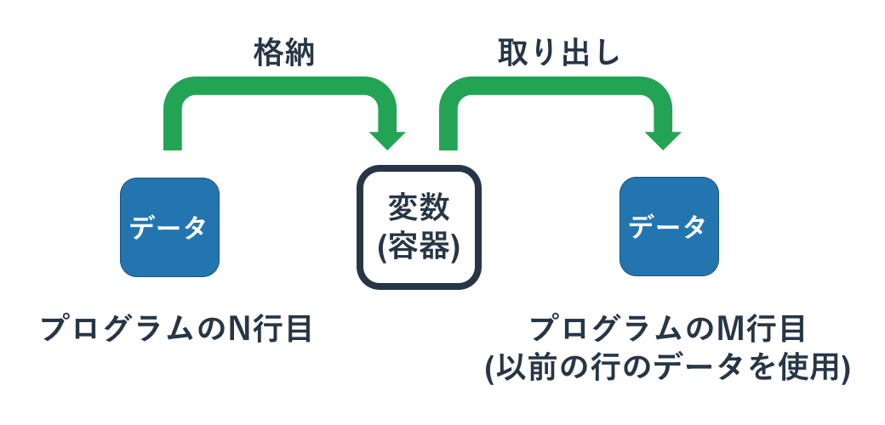
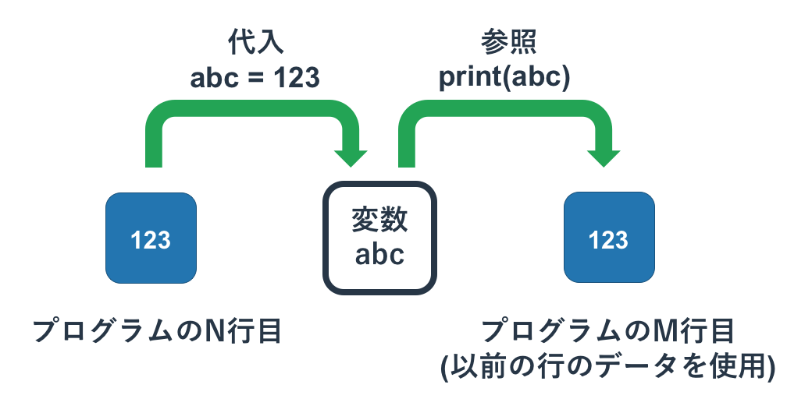
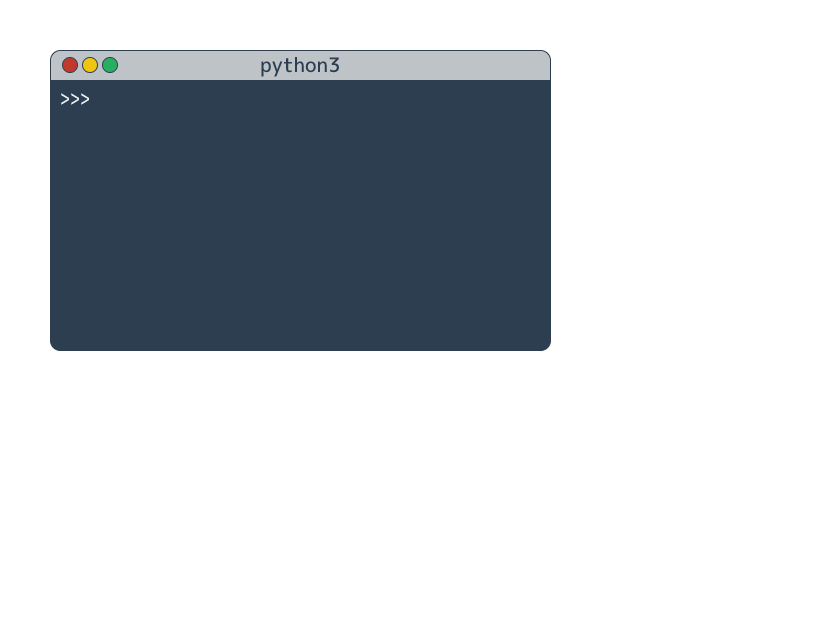

# 変数

{{ TOC }}

## 概要


「変数」は様々なデータを保存したり取り出したりすることができる容器のようなものです。
変数を使うことで複数行に及ぶ複雑なプログラムで、
前の行で得た結果を後ろの行で使うといったことができます。

変数の値は参照(取り出し)されても変わりません。
たとえば変数abcに数値123が代入されているとすると、
それを「abc + 456」としても「print(abc)」としても、変数abcの中身は123です。
ただ、その変数に値を再代入すると中身は上書きされます。

代入と演算を同時に行う「複合代入演算」と呼ばれる処理もあります。

## 変数の目的と利用方法

現実のプログラムは複雑であるため、1行のプログラムで全ての処理を作ることはできません。
そのため、複数の行で少しずつプログラムを組み立てていくという作業が必要です。

これには関数の作成や条件分岐、ループといった以後のページで学ぶ文法も使いますが、
それよりも基本的な「前の行で処理した結果を、後の行で使う」ことが一番多いです。

「**変数**」は処理結果を格納したり、取り出したりするために使われる仕組みです。
前の行でなんらかの処理をして結果を求め、それを変数に格納する。
そして後ろの行で変数から値を取り出して利用することで、複数行にまたがる処理を書くことができます。



変数には何回でも値を格納することができますが、
すでに変数が値を持っている場合はそれが上書きされます。

変数から値を取り出すことも何度もできます。
値を取り出しても変数の中身は残ったままとなりますので、変数が上書きされていない限りは毎回同じ値を得ます。

### 変数の宣言と代入

実際にPythonで変数を使いながら、その利用方法と特徴を確認します。

変数を使うにはまず最初に変数が作成される必要があります。
変数を作成することを「**変数を宣言する**」といいます。

Pythonは変数を宣言する際に、同時に変数に値を格納する必要があります。
変数に値を格納することを「**代入**」といい、宣言された変数に最初に代入することを特に「**初期化**」と呼びます。

変数の宣言と初期化(代入)は以下のように「=」記号(「**代入演算子**」と呼ばれる)の左に変数名を書き、右側に代入する値を書きます。

```text
変数名 = 変数に入れたい値
```

注意をしてほしいのはプログラミングにおける代入演算子「=」は、
算数や数学のイコール記号「=」とは異なることです。
今さら説明することでもないでしょうが、算数や数学のイコール記号は「=」の左辺(左側)と右辺(右側)が同じことを示しています。
一方、プログラミングにおける代入演算子は右辺を左辺に代入することに使われます。

たとえば変数abcを宣言し、数値の123で初期化するとすれば以下のようになります。
このように書けば、左辺にある変数abcの中身は右辺の5となります。

#### インタプリタ: 変数の宣言と初期化(代入)

```text
>>> abc = 123
```

変数を今まで扱ってきたデータのように使えば、代入されている変数の中身の値は取り出されます。

#### インタプリタ: 変数からの値の取り出し(直前のプログラムの続き)

```text
>>> 10 + abc
133
>>> print(abc)
123
```

ここでは変数abから値を2回取り出していますが、
いずれも代入されている123を返していることがわかります。
変数から値を取り出しても中身はなくなりません。



すでに宣言されている変数に値をもういちど代入する(「**再代入**」と呼ばれる)することもできます。
プログラミング言語によりやりかたは異なりますが、Pythonでは初期化と見た目は全く変わりません。

#### インタプリタ: 変数への再代入

```text
>>> cd = 10
>>> print(cd)
10
>>> cd = 20
>>> print(cd)
20
```

「変数名」はアルファベットや数字、一部の記号を使って自分の好きなものを使うことができます。
変数名の命名規則は次のページにて詳細を扱います。


### 代入演算子の優先度

1行の中に様々な演算子が混ざることがあります。
たとえば以下のプログラムを見て下さい。

```text
>>> ef = 10 + 5
```

このプログラムは「ef = 10」をした結果に対して「+ 5」をするのでしょうか。
それとも「10 + 5」をした結果を「ef = 」とするのでしょうか。

答えは後者で、変数efに対して15が代入されています。

これには理由があり、結合演算子「+」のほうが、代入演算子「=」よりも優先度が高いためです。
算数で「5 + 10 x 2」が、30ではなく25になるのは足し算よりも掛け算の優先度が高いからです。
それと同じでプログラミングの演算子にも優先度があり、代入演算子の優先度はかなり低いです。

代入演算子の右側でなんらかの処理が書かれていれば、その処理がされた結果が変数に代入されます。
変数に代入されてから代入演算子の右側の処理がされることはありません。

ここまでの話をまとめた図を示します。



### 変数に同じ変数の値を加工して代入

変数に同じ変数の値を加工して代入することも可能です。
たとえば、変数aにすでに文字列が入っており、それに別の文字列を追加したいという場合は以下のように書きます。

#### インタプリタ: 変数内の文字列を変更

```text
>>> a = 'hello'
>>> a = a + ' python'
>>> print(a)
hello python
```

上記の「a = a + ' python'」は以下の動きをします。

1.	代入演算子の右にあるaが'hello'という文字列を返す
2.	それに' python'が結合されて'hello python'になる
3.	代入演算子の右の結果である'hello python'が左の変数aに再代入される

こういった処理は上から下に順番に実行していくような状況ではあまり利用されませんが、
後ほど扱うループ処理(同じ処理を繰り返す)の中で利用されることがよくあります。

### 複合代入演算子

先ほどの「変数A = 変数A + 値B」という処理をするための特別な代入演算子があります。
「**複合代入演算子**」と呼ばれるもので「演算子=」という形式を取ります。

たとえば演算子「+」を使った複合代入演算子として「+=」があり、「変数A += 値B」とすると、
変数Aの値に値Bをたした結果を変数Aに代入します。

他には「-=」や「\*=」などもありますが、それぞれ「引いて代入」「かけて代入」となります。

```text
>>> a = 'hello'
>>> a += ' python'
>>> print(a)
hello python
```

複合代入演算子は変数の中身を利用しますので、その変数は事前に初期化されている必要があります。
初期化されていない変数で複合代入演算子を使うとエラーになります。

```text
>>> b += 'python'
Traceback (most recent call last):
  File "<stdin>", line 1, in <module>
NameError: name 'b' is not defined
```
