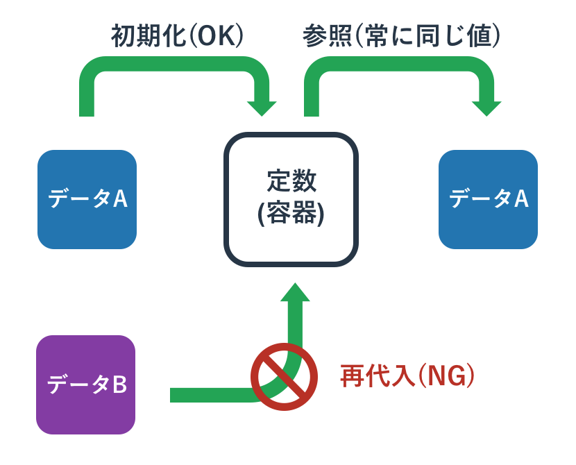
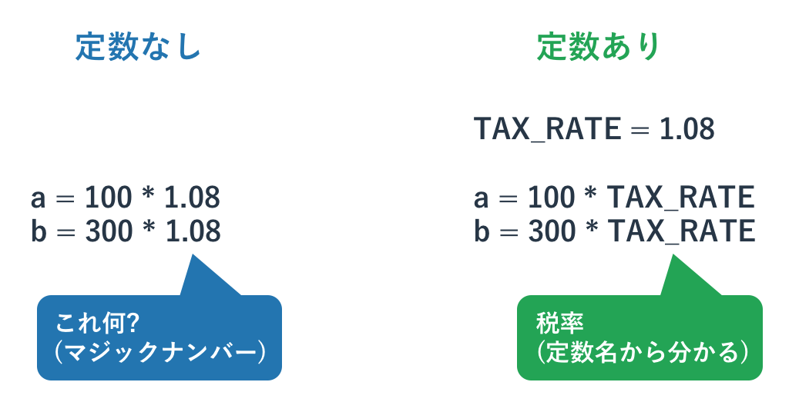
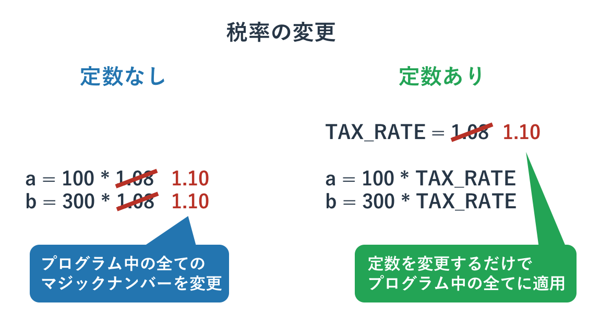

# 定数とマジックナンバー

{{ TOC }}

## 概要



変数はその名前から分かるように、その中身が「変わる」ことがあります。
値が初期化されたものから変わらない場合は変数の代わりに「定数」を使います。

定数はその名前にあるように「定まった数」ですので、中身が変わることがありません。
定数を使うことでプログラム中に登場するパッと見てなにか分からない「マジックナンバー」をなくしたり、
プログラムのパラメーターを調整しやすくなったりします。

プログラミング言語の多くは定数を文法として持っていますが、Pythonには文法としての定数はありません。
ただ、定数という仕組みは便利ですので、プログラマの間でのルールとしてPythonの定数は用いられれています。
変数を大文字のアルファベットの単語とアンダーバーで区切ると、それは変数ではなく定数として扱うことになっています。

Pythonの文法レベルでは定数は変数にすぎません。
そのため、初期化済みの定数に値を再代入することはできます。
ただ、そのようなことをすると「定数の値が常に同じ」というルールが信用できなくなりますので、
絶対に再代入しないでください。

## 定数とはなにか

プログラムの中にはたまに「**マジックナンバー**」と呼ばれる「正体不明の数字」が現れることがあります。
たとえば以下のコードを見て下さい。

```python
a = 100 * 1.08
print(a)
```

このコードが何をやっているか分からないかもしれませんが、
私は「1.08は税率」として、税抜き100円が税込みいくらになるかを計算する意図で書いています。

1.08という数字を見て勘のいいかたであれば、「税率のようだ」と気づくかもしれませんが、
プログラミングはそのような気づきには頼ってほしくありません。
誰が見ても理解できるコードであるべきです。

もしこれが1.08というよくわからない「マジックナンバー」ではなく、
「tax_rate(税率)」という1.08を持った変数であれば、
その名前からそれが税率であることは一目瞭然となります。

税率は数年単位であれば変わる可能性がありますが、
Pythonのその場限りのプログラムを動かしている最中に変わることはないでしょう。
そのような場合は「値が変わる可能性がある変数」ではなく、
「絶対に値が変わらない」性質を持つ「**定数**」を使います。

「定数は一回設定されたら変更されることがない」という性質を持つ特殊な変数であり、
その「名前は大文字とアンダーバー」で宣言されます。
そして「定数は一般的にプログラムのファイルの先頭周辺で宣言」されます。


例えば先程の税込み額の計算プログラムを、定数を使って書き直すと以下のようになります。

```python
TAX_RATE = 1.08

a = 100 * TAX_RATE
print(a)
```



定数はプログラムのパラメータとして使われることも多く、
ファイルを開いて定数の値を変更することでプログラムの挙動を変えることがよくあります。
例えば税率が10%に変更されたら、プログラム本体ではなく定数を書き換えることで対応します。

```python
TAX_RATE = 1.10

a = 100 * TAX_RATE
print(a)
```

もし仮に定数を使わずに1.08という税率をプログラムのいたるところに書いていたら、
全てを修正するのは大変です。
1.08を直接書くのではなく、それが代入されている定数TAX_RATEを使っていれば、
その初期化の値を1.08から1.10に変更するだけで全ての箇所で変更が適用されます。



## 定数はどういうものに使われるか

### マジックナンバーの説明

定数の利用目的はいくつかあり、その1つは先ほど解説した「マジックナンバーの説明」という用途です。

### プログラムのパラメーター

その他にもプログラムの変更可能なパラメーターとして定数を使うことがあります。
例えば後ほど扱うファイルを扱うプログラムにおいて、
どのファイルを読むか、どのファイルに書くかといったことを定数で定義をしておけば、
そのプログラムを使うユーザーがプログラムファイルの冒頭にある定数の値を書き換えるだけで変更ができます。
もし読み込むファイルの指定が定数でなく、分かりにくい場所にあれば、
変更を加えるためにプログラムを読んで理解しなければいけなくなります。

### プログラム中の識別子

その他にはプログラムの様々な箇所で使われる「識別子」としての役割もあります。
たとえばGUIを使うプログラムで色に応じた対応をする際に文字列の「'red'」などで色を認識させるのも一つのですが、
これを「RED」という定数にすることのほうが望ましいです。

なぜなら文字列であればタイプミスをしても文法的な間違いにはならないため、
「'red'」ではなく「'ret'」などとなっていてもプログラムが動いてしまい期待されない動作を引き起こす可能性が高いです。
一方、定数の「RED」であれば、タイプミスがあれば文法エラーとなるため、問題箇所が即座に判明します。


## 「Pythonの定数」は定数ではない

他のプログラミングを学んだことがある人であれば知っているかと思いますが、
一般的に「定数は上書きできない」という性質があります。
定数を初期化した後に、なんらかの値を再代入しようとするとエラーとなります。

ただ、実はPythonの定数は「大文字をアンダーバーで区切った単なる変数」にすぎません。
そのため、以下のように定数の値を上書きしてもエラーは発生しません。

```python
TAX_RATE = 1.08
TAX_RATE = 1.10
```

Pythonのプログラマの多くは他のプログラミング言語も知っています。
その人達は定数の利便性を知っているので、
定数の文法が存在しないPythonでも「大文字とアンダーバーで構成された変数を定数として扱う」というルールを自分たちで決めました。

Pythonの定数へは値の再代入ができます。
ただ、定数の初期化後にその値が別のものに変わることは誰も想定していません。
定数への再代入は絶対にしないでください。
