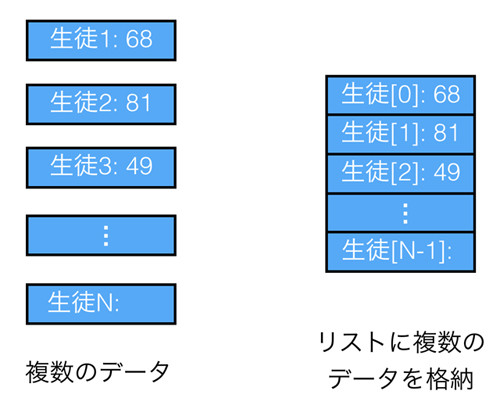

# 主要な型と演算子

{{ TOC }}

## 概要



Pythonに限らずプログラミング初心者がプログラミングを書けるようになるには「使用頻度の高い重要な型を覚える」ことが大事です。
重要な型はどのような処理を作る際にも、プログラムの「つなぎ」として使われます。
つまりそれらなしにはどのようなプログラムを組むこともできないということです。

Pythonで一般的に使われる型は10以上はありますが、そのなかでも特に大事なのは以下の4つです。

* 数値型
* 文字列型
* Bool型
* リスト型

これらの型の詳細を理解するにはPythonの基礎を一通り抑えることが必要です。
このページではそれほど難しくない簡単だけれども重要な項目のみに絞って説明します。

## 数値型

### Pythonの整数型と小数型

Pythonで数値を扱うのは簡単です。
特に難しいことを考えなくてもおおよそ思った通りに動きます。

実は今まで数を扱う「数値型」と説明してきましたが、厳密にはそのようなものはありません。
あるのは整数を扱う「**整数型**」と、少数を扱う「**少数型**」です。
整数型と少数型は、英語ではそれぞれ「int」と「float」となります。

```text
>>> type(123)
<class 'int'>
>>> type(0.456)
<class 'float'>
```

C言語やJava言語では整数型と少数型を明確に区別してプログラムを書かないと、期待通りに動いてくれません。
たとえば整数型の変数に少数を代入すると丸められてしまったり、整数型も上限値が決められていたりします。
数値を表現する型は主要なものだけでも4つあり、それらの特徴をきちんと理解していないと数を使いこなせません。

ただ、Pythonは整数と少数の区別なく使うことができ、変数に少数を代入してもそれが勝手に整数に丸められることはありません。
同様に整数の上限も特に決まっていないため、非常に大きな数の計算も桁を考えずに実行できます。
これが今までの説明で整数型や少数型といわず、数値型としてきた理由です。

```text
>>> 123 + 0.456
123.456
>>> 123456789123456789123456789 + 123456789123456789123456789
246913578246913578246913578
```


### 計算に使う演算子

数値型(整数型と少数型)でどのような処理ができるかという話に移りましょう。
数と数の計算に使用する「+」や「-」といった記号は「**演算子**」と呼びます。
変数への代入に利用する「=」はこの演算子の一つで代入演算子と呼ばれています。
ただ、計算ではなく代入処理に使うため、「+」や「-」とは少し異なります。

演算子の演算対象となる値は「**オペランド**」と呼ばれます。
たとえば、計算式「1 + 2」の演算子は「+」であり、そのオペランドは「1」と「2」です。

```text
>>> 1 + 2
3
```

Pythonの数値計算で使う初歩的な演算子は以下となります。
「+」や「-」は分かるかと思いますが、掛け算は算数や数学で使う記号ではなく「\*」を使います。
割り算は分数の「/」だと思えば分かりやすいでしょう。

| 代表的な演算子 | 説明 |
|:-------------:|:---:|
| M + N | 足し算 |
| M - N | 引き算 |
| M * N | 掛け算 |
| M / N | 割り算 |

これら以外にも数値計算の演算子はありますが、それらは数値型のページにて扱います。

### 演算子の優先度とその制御

算数の授業で習ったかもしれませんが、足し算や掛け算には優先順位があります。
たとえば「1 + 2 x 3」という計算をする場合、足し算よりも掛け算が優先されるため、
「1 + 2」より先に「2 x 3」が計算されて、答えは7になります。

Pythonでも掛け算が足し算よりも優先されるため、「1 + 2 x 3」の計算結果は7となります。

```text
>>> 1 + 2 * 3
7
```

算数で掛け算よりも足し算を優先する場合は「足し算を()で囲む」ことをします。
Pythonでも同じことができます。

```text
>>> (1 + 2) * 3
9
```

演算子の優先度は掛け算と割り算の優先度が高く、足し算と引き算の優先度がそれより低くなっています。
そして代入演算子の優先度は低いです。
まずはこれだけ覚えて下さい。

演算子の優先度が分かりにくい場合は「()」で囲むことで明示的に示すようにしてください。
「()」を使わなくても正しい場合であっても、結果が複雑な優先度によって求められる場合は「()」を使うほうが分かりやすいです。


### 複合代入演算子

変数のページで扱った「**複合代入演算子**」は、演算子の左側の変数に「その変数自身と演算子の右側の演算結果」を代入するのでした。
この複合代入演算子の動きは、数値計算の演算子と対応しています。
たとえば「+=」と「+」は対応しており、「\*=」と「\*」が対応しています。
オペランドとなるデータの型にある演算子が使えれば、その複合代入演算子も使えます。

| 代表的な複合代入演算子 | 説明 |
| M += N | M = M + N |
| M -= N | M = M - N |
| M *= N | M = M * N |
| M /= N | M = M / N |

```text
>>> a = 5
>>> a += 3
>>> print(a)
8
```

複合代入演算子でよく使われるのは「+=」です。
同じ処理の繰り返し(ループ)で何回ループしたかをカウントしたり、
変数に格納された文字列に別の文字列を追加するといった処理でよく利用されます。

他のプログラミング言語ですとループのカウントに「**インクリメント**」と呼ばれる手法をよく使います。
ただ、Pythonにはインクリメント機能がないため、複合代入演算子で代用します。

```java
int i = 0;
i++;
```

```python
i = 0
i += 1
```

### 0による割り算

算数や数学で学んだように、0で何かを割ることは禁じられています。
0で割り算をすると、その場でエラーが発生します。

```text
>>> 10 / 0
Traceback (most recent call last):
  File "<stdin>", line 1, in <module>
ZeroDivisionError: division by zero
```

上記のように直接0で割ることはないと思いますが、
ある変数で割り算をする場合に、その変数に0が代入されているというシナリオはよくあります。
条件分岐で変数の値が0でないかを確認をし、0であった場合は別の対応をとるといった回避策が必要です。

### 少数

Pythonの少数は整数の扱いとほぼ同じです。
整数が使える演算子や代入演算子を使うことができ、
演算子の優先度も同じです。

整数の割り算などでも、必要があれば勝手に少数となります。

```text
>>> 5 / 2
2.5
```

少数について気をつけて頂く必要があるのは、
計算は2進数で行われるため誤差が生じる場合があるということです。
たとえば以下の計算結果はおそらく想定しているものと違うでしょう。

```text
>>> 123 + 123.456
246.45600000000002
```

この問題はPythonのバグなどではなく「浮動小数点演算」という仕組みに起因しています。
誤差はごく小さいものなので通常は無視でき、必要があれば丸める処理をします。
厳密な科学計算が必要な場合は数学関連のモジュールを利用を検討してください。

少数を整数に変換する方法は四捨五入や切り上げ、切り捨てなど様々な方法があります。
これらの手法については数値型のページにて扱います。

## 文字列型

プログラミングでは、テキストデータを扱うことが多いです。
「**文字列型**」はテキストデータを扱う型なので、プログラミングができるようになるには文字列型の習熟が欠かせません。

### 文字列作成記号

数字はそのまま書けば認識されていましたが、
文字列は「特別な記号」でテキストを囲むことでPythonが文字列と認識します。
(囲まなければ変数名だと判断されます)

今まで文字列を作る記号として「**シングルクオテーション**」と呼ばれる「**'**」を使っていましたが、
これは文字列を作る特別な記号のうちのひとつです。
以下のように使うのでした。

```text
>>> text = 'hello python'
>>> print(text)
hello python
```


実はシングルクオテーションだけでなく「**ダブルクオテーション**」と呼ばれる「**"**」でも文字列が作成できます。

```text
>>> text = "hello python"
>>> print(text)
hello python
```

特に両者に大きな違いはありませんが、「シングルクオテーションがPythonの標準的な書き方」であることと、
「シングルクオテーションの文字列の中ではダブルクオテーションが使える」こと、
またその逆の「ダブルクオテーションの文字列の中ではシングルクオテーションが使える」ことは覚えておいて下さい。

ダブルクオテーションを使うのは以下のように内部にシングルクオテーションを保つ場合のみにするのがよいかと思います。

```text
>>> text = "I'm taro"
>>> print(text)
I'm taro
```

シングルクオテーションで上記を囲んでいると、「I」だけが文字列と認識されて、その後ろで文法エラーが発生します。

```text
>>> text = 'I'm taro'
  File "<stdin>", line 1
    text = 'I'm taro'
              ^
SyntaxError: invalid syntax
```


### エスケープ処理

機械は文字を「**文字コード**」というルールにもとづいて表示しています。
その中にはアルファベットや数字だけでなく、タブや改行も特殊な文字として含まれています。
これらの特殊な文字は文字列の中で「**エスケープ処理**」をすることで表現できます。

エスケープ処理は「これからエスケープ処理をしますよ」と伝える目的の「**エスケープ記号**」の後に、
決められた文字を1つ続けることで行われます。
エスケープ記号とその後に続く文字で特別な意味を持ち、この組み合わせを「**エスケープシーケンス**」と呼びます。

エスケープ記号として「**バックスラッシュ**」と呼ばれる「**\**」を使うのが世界では一般的ですが、
日本語キーボード環境だと「**円記号**」と呼ばれる「**¥**」を使います。
日本語環境でも英語キーボードを使っていればバックスラッシュを使います。
本サイトではバックスラッシュをエスケープ記号として使います。

### 代表的なエスケープシーケンス

以下に代表的なエスケープシーケンスを記載します。
バックスラッシュで書いていますが、円記号でも全く同じです。

| 利用可能な演算子 | 説明 |
|:-------------:|:---:|
| \\ | 「\」記号そのもの |
| \n | 改行 |
| \' | 「'」記号そのもの |
| \" | 「"」記号そのもの |

たとえば改行のエスケープシーケンス「\n」を使うと、文字列の中で改行がされます。

```text
>>> print('hello \n python')
hello
 python
```

わかりやすいように\nの前後に空白をいれましたが、
改行させたいだけの場合は空白は不要です。
'hello\npython'と書けば改行コードが入ります。

```text
>>> print('hello\npython')
hello
python
```


エスケープ記号を使えばシングルクオテーションの文字列の中のシングルクオテーションを文字列作成の記号ではなく単なる「'」として使うことができます。

```text
>>> text = 'I\'m taro'
>>> print(text)
I'm taro
```

このようにバックスラッシュや円記号は文字列中で特別な意味を持つため、
その記号自身を文字として扱うためには「\\」といったようにエスケープ記号自身をエスケープするという処理が必要になります。

### トリプルクオテーション

文字列を作るには「**トリプルクオテーション**」という手法もあります。
これはシングルクオテーション3つか、ダブルクオテーション3つを連続して書くというもので、
3つの組み合わせで文字列を囲みます。

```text
>>> text = '''hello python'''
>>> print(text)
hello python
```

文字列の前後で使う記号の種類は統一する必要がありますので、
前はシングルクオテーション3つで後ろはダブルクオテーション3つといったことはできません。
また、文字列の中にシングルクオテーションやダブルクオテーションを書くこともできます(3つは続けられません)。

プログラムファイルでトリプルクオテーションを使う場合は、
文字列を複数行にまたがせることができます。

```python
text = '''hello
python'''
print(text)
```

このプログラムを実行すると、以下のような出力がされます。

```text
hello
python
```

改行コードを文字列中に何度も出現させるよりは、
トリプルクオテーションを使って表示される形式のままに文字列を作ったほうが分かりやすいです。

このトリプルクオテーションを使った文字列の作成はコメントアウトにも使われています。
文字列を作成するだけではPythonの実行結果に違いは発生しないため、
プログラムのコード自体を文字列にしてしまうことで、影響を発生させないようにしています。
トリプルクオテーションを使ったコメントの使い方はコメントのページをご参照下さい。

### 文字列の演算

文字列も数値と同じように演算することができます。
先に示したように「+」で結合もできますし、
あまり知られていませんが掛け算である「\*」記号で同じ文字列を繰り返すこともできます。

```
>>> text = 'hello' + ' python'
>>> print(text)
hello python
>>> text = 'hello' * 3
>>> print(text)
hellohellohello
```

文字列と他の型(例えば数値型など)を結合して新しい文字列を作る場合は、
他の型を文字列型にキャストする必要があります。

## Bool型

Bool型は別名「真偽値」と呼ばれます。
真偽値という名前を聞くとなんだか難しそうに思えるかもしれませんが、
要するに真偽に相当する「True/False」という「YES/NO」「正/非」の2値しかない単純な型です。

Pythonのプログラム中で「**True**」と「**False**」という文字は予約語として登録されています。
それぞれその言葉のとおりに、YES/NOとしてPythonに解釈されます。


Bool型は今後学ぶ条件分岐やループ処理で利用されます。
たとえば条件を満たすTrueの場合は処理Aを実施し、
条件を満たさないFalseの場合は処理Bを実施するといったように、プログラムの制御に関わります。

Bool型は自分で「True/False」を直接プログラムに書くだけでなく、
「比較演算子」を使った演算結果や、関数の返り値として得られます。

Bool型は様々な箇所で使われていますので、
一箇所でまとめて扱うのではなく個別のテーマに付随する形で詳細を扱います。
具体的には以下のようにしています。

* Bool型の解説ページ : 全てに関わる一般的なことについて
* 個別の型の解説ページ : その型のBool型に関わる関数や演算子、処理について
* その他のページ : 解説する処理などに関わるBool型の使い方について

### 比較演算子

Bool型の値は「比較演算子」と呼ばれる記号で2つの値を比較した際に返されます。
例として数字の大小を比較してみます。

この比較演算子は算数で習った「大なり」記号である「>」や、「小なり」記号である「<」などです。
「10 > 5」は「10は5より大きい」という意味で、それはあっていますので結果は「True」となります。

```text
>>> 10 > 5
True
```

同様に「10 < 5」は「10は5より小さい」という意味で、これは間違っているため「False」が返ります。

```text
>>> 10 < 5
False
```

比較演算子の演算で得たブール型の値も数値や文字列と同じように変数に代入可能です。

```text
>>> a = 10 > 5
>>> a
True
```

以下に代表的な比較演算子を記載します。

| 代表的な演算子 | 説明 |
| A > B | A が B より大きければ True |
| A >= B | A が B 以上なら True |
| A < B | A が B より小さければ True |
| A <= B | A が B 以下なら True |
| A == B | AとBが同一ならTrue |
| A != B | AとBが異なればTrue |

どちらが大きいか小さいかの比較は算数の通りなので分かりやすいかと思います。
プログラミング独特のものとしては「==」と「!=」があり、
それぞれ「同じか」「同じでないか」を調べます。

```text
>>> 'hello' == 'world'
False
>>> 'hello' != 'world'
True
```


## リスト

「**リスト(List)**」が本ページで紹介する最後の型です。
その名前からわかるように「データをリスト状に並べた」値を持つ型です。
数値や文字列はそれ自体がデータですが、リストはそれらを格納する入れ物のような型になります。

リストはループ処理に欠かせない型です。
どういった用途で利用されるのかはループ制御のページで解説し、ここでは最も初歩的な操作方法のみ扱います。
リストの詳細についてはリスト型のページをご参照ください。


### リストの作成

リストは「[]」の記号のなかにコンマ(,)区切りでデータを羅列することで作成されます。
たとえば「[1,2,3,4,5]」とすると、内部に「1,2,3,4,5」というデータが格納されたリスト型の値が作成されます。

```text
>>> a = [1,2,3,4,5]
>>> print(a)
[1, 2, 3, 4, 5]
>>> type(a)
<class 'list'>
```


リストの内部に格納する値はなんでもよいですが、一般的に複数の型の値を混ぜることはありません。
リストの解説ページで扱いますが、リストのなかにリストを収める多重構造にする場合もあります。

内部に値を持たないリストを作ることもでき、その場合は単に「[]」とします。

```text
>>> a = []
>>> print(a)
[]
>>> type(a)
<class 'list'>
```

### リストの要素へのアクセス

リストが持つデータは「**要素**」と呼ばれており、
前から何番目かという意味の「**インデックス番号**」を指定して中身の操作をします。
注意をしてほしいのは「インデックス番号は0から数える」ということです。

たとえばリスト「[1,2,3,4,5]」のインデックス番号0の値は「1」で、
インデックス番号1の値は「2」となります。

リストの要素へのアクセスは「リスト型の値[インデックス番号]」とします。
要素の取得をしても中身はなくなりません。

```text
>>> a = [1,2,3,4,5]
>>> a[0]
1
>>> a[3]
4
>>> print(a)
[1, 2, 3, 4, 5]
```

要素の変更は、インデックス番号でリストの要素を指定してそれに代入するという手法になります。

```text
>>> a = [1,2,3,4,5]
>>> a[1] = 100
>>> print(a)
[1, 100, 3, 4, 5]
```


### リストの注意点

リストには長さがあります。
要素が5つ入っているリストの長さは5であり、
インデックス番号は0から4まで使えます。

リストの長さを超えて要素にアクセスすると、エラーが発生します。

```text
>>> a = [1,2,3,4,5]
>>> a[3]
4
>>> a[4]
5
>>> a[5]
Traceback (most recent call last):
  File "<stdin>", line 1, in <module>
IndexError: list index out of range
```

リストの長さを得るには「**len関数**」を使います。

```text
>>> a = [1,2,3,4,5]
>>> len(a)
5
```

つまり、アクセスしてよい最大のインデックス番号は「len(リスト値) - 1」までとなります。
