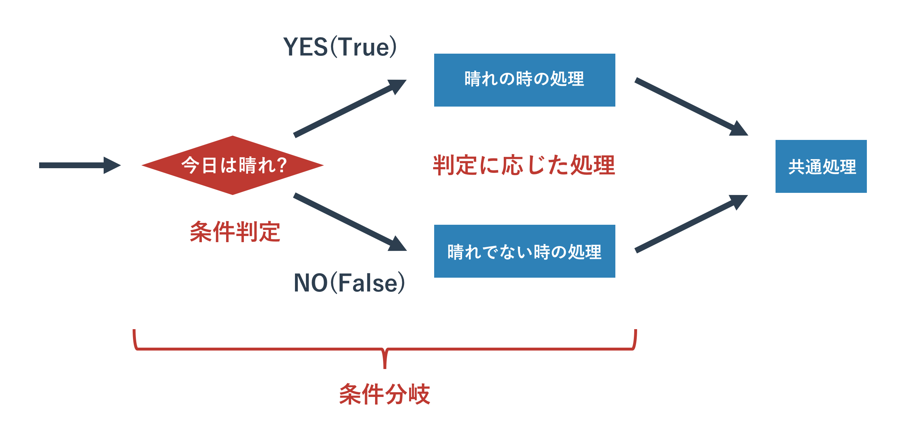

# テキスト処理

{{ TOC }}

## 概要

テキスト処理は要するに、文字列型の処理です。
前の章で扱ったように文字列型もオブジェクトであるため、様々なメソッドが利用できます。
テキストファイルの処理では文字列型の基本知識が必要なので、
以前学んだことを少し発展させて復習します。


## 文字列の基本操作

### 文字列の定義

まず、文字列は以下のように定義するのでした。

```python
text1 = 'hello python'

text2 = '''hello
world
python'''
```

ひとつめに関しては今さらいうこともないですが、
2つめに関しては複数行でテキストをプログラム中で定義する方法でした。
記号「'」の代わりに記号「"」を使うことも可能ですが、文字列の前後で統一されている必要があります。

### 文字列を作る演算子

文字列の結合に関しては「+」記号でできますが、
数字などを結合するときは「文字列に変換」してから結合するのでした。
ほかの型から文字列型への変換にはstr関数を使います。

```python
print('hello ' + 'world')
# hello world
print('hello ' + str(5))
# hello 5
```

文字列長は以下のように len() 関数を使うことで取得できます。

```python
length = len('hello world')
print(length)
# 11
```

### in 演算子

検索には「存在の確認」と「位置の確認」の2つの使い方があり、それぞれ次のようになります。

```python
text = 'hello world python'
print('wor' in text)
# True

print('w0r' in text)
# False
```

inについてはlistでの使い方と同じで、「A in B」の場合は「AがBに含まれていれば Trueを返す」という動きをします。
’hello world python’ というテキストに ‘wor’ は含まれているので True となっています。

### 文字列の部分取得

文字列中の「文字」の取得は以下のように [X] で位置を指定して行います。

```python
text = 'hello world python'
print(text[4])
# o

print(text[-4])
# t

print(text[100])
# Traceback (most recent call last):
#  ...
# IndexError: string index out of range
```

この位置の指定はリストの要素の数え方と同じで0から始まります。
先頭から0、1、2……と数えていくと4はoに対応しています。
面白いのがこの値をマイナスにできるところです。
このように指定すると後ろ側から取得してきます。
この際、0からではなく-1、-2、-3……とカウントすることに注意してください。
文字列の範囲を超えてアクセスしようとするとエラーになります。

文字列から「文字列」を取得するには、以下のように行います。

```python
text = 'hello world python'
print(text[6:11])
# world

print(text[-12:-7])
# world
```

これは「スライシング」と呼ばれるテクニックで、
[X:Y]とあるとXからYまで取得という意味になります。
[X:Y] と指定する際はX < Yとなるようにしてください。
先ほどと同じように、範囲指定にもマイナス値を利用できます。

前と後ろを指定するのではなく、Xより前、Xより後という指定の仕方も可能です。

```python
print(text[6:])
# world python

print(text[:11])
# hello world

print(text[:])
# hello world python
```

見ていただくとわかるように [X:Y] の片方を省略しています。
そうすると先頭から、もしくは末尾までという意味になります。
あまり使いどころはありませんが、両方とも省略すると、文字列のすべてが取得されます。
このスライシングはリストから複数の要素を取り出す際にも使えます。


## 文字列型のメソッド

### 文字列のデータは決して変わらない

先にお伝えしたように文字列型もオブジェクトであるためメソッドが利用できます。
ただ、文字列型に対してメソッドを呼び出した場合は
「呼び出し元の文字列オブジェクトは変更されない」という規則があります。
例えば次にお話する文字列の置き換えも、置き換えメソッドを呼び出した文字列は変更されず、
メソッドの返り値として変更された文字列オブジェクトがかえってくるという動きをします。
これは全ての文字列型のメソッドに共通した特徴なので必ず覚えておいて下さい。

### 文字列の部分置き換えと削除 : replace メソッド

文字列型のメソッドを使ってテキストの置き換え処理をしてみます。
テキストエディタなどである特定のキーワードを別のキーワードに置き換えることがあるかと思いますが、それと同じ要領です。
サンプルコードを以下に記載します。

```python
text = 'hello world python'
text1 = text.replace('o', '0')
print(text)
# hello world python

print(text1)
# hell0 w0rld pyth0n

print(text.replace('world', 'WORLD'))
# hello WORLD python
```

文字列.replace(置き換える文字列, 置き換えられる文字列)とすると、変換された文字列が返されます。
例にもあるように、元の文字列自体は変化していません。
1文字だけを変更することもできますし、文字列を変更することもできます。
不要かもしれませんが、上記のコードのオブジェクトとメソッドの関係を図に示します。



‘hello world python’ という文字列型のオブジェクトを変数 text に格納し、
そのオブジェクトに対してメソッド replace を呼び出しています。
そのメソッドは変換した文字列を返り値として返しますが、
元のデータ(オブジェクトが持つ’hello world python’ というテキストデータ自体)は変更を加えません。

文字列中の特定の文字列を消したい場合は、replaceメソッドの置き換え対象の文字列を空文字(`''`)にします。
そうすることで、置き換え対象の文字列が空文字になるため、実質的に削除されます。

```python
text = 'hello world python'
text1 = text.replace('o', '')
print(text1)
# hell wrld pythn
```

### 文字列の検索 : startswith, endswith, find

文字列の検索もそれほど難しくはありません。

find メソッドについては最も左側にあるマッチした位置を返します。
そのため、'o'は何個もありますが、一番左の位置となっています。
マッチしない場合は-1が返ってきます。

```python
print(text.find('wor'))
# 6

print(text.find('w0r'))
# -1

print(text.find('o'))
# 4
```

find メソッドに似たメソッドで startswith と endswith があります。
名前から分かるかもしれませんが、前者は「この文字列から始まっていればTrue」、
後者は「この文字列で終わっていればTrue」という動きをします。

```python
text = 'hello world python'
print(text.startswith('hell'))
# True

print(text.startswith('hell0'))
# False

print(text.endswith('hon'))
# True

print(text.endswith('h0n'))
# False
```

それほど使う場面は多くないのですが、
find メソッドのオプションである第二引数を指定することで前側を指定した数だけ飛ばして途中から検索することもできます。
右側から探索をする rfind というメソッドも利用できます。

```python
text = 'hello world python'
print(text.find('o', 10))
# 16

print(text.rfind('o'))
# 16
```

### 文字列の前後の削除 : strip, rstrip, lstrip

次に文字列の前後からの特定の文字の削除メソッド stripです。
よく利用するのは、前後の空白や改行コード、タブなどを取り除く場合などでしょう。

```python
text = ' hello world \n'
print(text.strip())
# 'hello world'

print(text.strip(' hell'))
# 'o world \n'
```

strip関数に引数を指定しないと文字列の前後の空白文字(空白とタブ、改行)が取り除かれます。
引数に文字列を指定すると、その文字列が取り除かれます。
この strip() 関数はファイル読み込み処理とともに「改行コードを取り除く」ことによく使われることがありますので、
覚えておいて頂いたほうがいいかもしれません。
左側の文字だけを取り除く場合は lstrip、右側だけの場合は rstrip メソッドを使います。

```python
text = ' hello world \n'
print(text.strip())
# 'hello world'

print(text.lstrip())
# 'hello world \n'

print(text.rstrip())
# ' hello world'
```

また、文字列を split メソッドで特定の区切り文字で分割して文字列のリストにすることもできます。
改行コードで分割する場合は split(‘\n’) とすることもできますし、
splitlines() という専用のメソッドもあります。

```python
text = '1, taro, 35, male'
print(text.split(','))
# ['1', ' taro', ' 35', ' male']

text = 'hello\nworld\npython'
print(text.splitlines())
# ['hello', 'world', 'python']

print(text.split('\n'))
# ['hello', 'world', 'python']
```

上記サンプルにあるようなコンマ「,」記号での文字列の分割は CSV(Excel出力)やログの解析あたりでよく使うテクニックです。
たとえば以下ではトリプルくおテーションで作ったCSV形式のテキストを、
まず改行コードで分割して1行ずつににして、各行においてコンマでテキストを区切っています。

```python
text = '''1, taro, 35, male
2, jiro, 29, male
3, hanako, 23, female'''

for line in text.split('\n'):
  elems = line.split(',')
  print(elems[1].strip() + ':' + elems[2].strip())

# taro:35
# jiro:29
# hanako:23
```

この例のように CSV の要素に空白が含まれているのであれば、
先ほどの strip 関数と組み合わせて前後の空白を取り除いて整形してあげてもいいかもしれません。

## メソッドの連続呼び出し

「オブジェクトを返す関数やメソッド」に対してメソッドを呼び出しているようなコードはよくありますが、
それは上記と同じように「作成されたばかりのオブジェクトのメソッドを呼ぶ」ということをしています。
例えば以下の様なコードにです。

```python
print('hello world python'.replace('he','HE').replace('py','PY'))
# HEllo world PYthon
```

これは分かりやすく書けば以下のようになります。

```python
a = 'hello world python'
b = a.replace('he','HE')
print(b.replace('py','PY'))
# HEllo world PYthon
```

メソッドをチェーン上に並べるのは長くなりすぎなければ積極的に活用するべきだと思います。
ただ、例えばマイナーなメソッドを呼び出したりバグを生んだりしそうな場所での利用は避けて頂いたほうが無難です。
メソッドをチェーン上に並べた場所でエラーが発生すると、そのエラー原因の特定が困難な場合があります。

他には文字列の大文字、小文字の変換あたりもよく使います。

```
>>> a = 'Hello Python'
>>> a.lower()
'hello python'
>>> a.upper()
'HELLO PYTHON'
```

## 文字列の生成

### 文字列の結合

テキストを整形して文字列を作ることはよくあります。
たとえば、文字列型の名前と数値型の年齢を合わせて「名前 : 年齢」とするには以下のようにすればできます。

```python
text = 'taro' + ' : ' + str(35)
print(text)
# taro : 35
```

上記は文字列の結合を使って文字列を生成しています。
数値型と文字列は直接結合できないため、数値35はstr()関数を使って一旦文字列にしています。

3つの文字列ぐらいであれば結合を使うことで文字列を作れますが、
あまりに長くなってくると結合で文字列を作るのは非常に見苦しくなってきます。

### format メソッド

結合の代わりに、文字列にテキストや数字を埋め込むという手法で文字列を生成することができます。
これを実現する format メソッドを使うと非常にシンプルに文字列を作ることができます。

```python
text = '{} : {}'.format('taro',35)
print(text)
# taro : 35
```

文字列のformat関数(メソッド)の引数に {} に対応する文字列なり数値なりを与えています。
ひとつ目の{}がfortmatメソッドの1つめの引数に対応し、2番目の{}が2番目の引数に対応、
といった具合で文字列に引数を埋め込んでいきます。
私はそれほど利用しませんが、この format はもっと複雑な使い方もできます。
たとえば {} の中に数字やキーワードを埋め込むことで引数の何番目をそこに埋め込むかを調整できます。

```python
print('{0} {2} {1} {0}'.format('a', 'b', 'c'))
# a c b a

print('{user} : {age}'.format(user='taro', age=35))
# taro : 35
```

上記のように同じ引数を何度も埋め込むこともできます。キーワード引数を使うこともできます。

### formatメソッドのフォーマット

さらに format メソッドは文字列に埋め込む「フォーマット(形式)」も調整できます。
フォーマットを指定するには「:」のあとにフォーマットを指定する書式を書きます。
かなり細かく調整できますが、いくつか便利なものだけ紹介します。

まず数字の桁の調整です。

```python
# 5桁
print('{:5}'.format(50))
# '   50'

print('{:5}'.format(255))
# '  255'

# 5桁(左寄せ)
print('{:<5}'.format(255))
# '255  '

print('{:<5}'.format(50))
# '50   '

# 5桁(0埋め)
print('{:05}'.format(50))
# '00050'

print('{:05}'.format(255))
# '00255'

# 位置指定やキーワードとの併用
print('{ab:05} {cd:05}'.format(ab=50, cd=255))
# '00050 00255'
```

コロンの後に数字を指定することで表示される桁数を調整できます。
0を指定する桁数の前に付けることで0埋めされます。

数値型の表示を調整することもよくあります。

```python
# 整数、少数
print('{:d}, {:f}'.format(5, 5.5))
# '5, 5.500000'

print('{:.3f}, {:.5f}'.format(5.5, 5.5))
# '5.500, 5.50000'

# 3桁区切り
print('{:,}, {:10,}, {:010,}'.format(111111, 111111, 111111))
# '111,111,    111,111, 00,111,111'

# 基数変換(2進数、8進数, 10進数, 16進数)
print('{0:b}, {0:o}, {0:d}, {0:x}'.format(100))
# '1100100, 144, 100, 64'
```

### 書式化演算子 %

format メソッドに似た書式化演算子(%)も Python3 では利用できます。
書式化演算子は format メソッドより気軽に使えますが、そのぶん単純なことしかできません。
以下のように使います。

```
ベースとなる文字列 % 埋め込む値
ベースとなる文字列 % (埋め込む値1, 埋め込む値2,..)
```

ベースとなる文字列に値を一つだけ埋め込む場合はそれを % 記号の後におきます。
そして複数の値を埋め込む場合は % 記号のあとに埋め込む要素をタプルにまとめて配置します。
例えば以下のようになります。

```python
text = 'hello %s' % 'HELLO'
print(text)
# hello HELLO

text = 'hello %s python %s' % ('HELLO', 1)
print(text)
# hello HELLO python 1
```

ベースとなる文字列の「%s」の箇所に値が埋め込まれていることがわかります。
この %s はどのような形で値が埋め込まれるかを指定する「変換指定子」と呼ばれており、
%s は文字列、%d は整数、%f は少数として利用されます。

```python
print('hello %s python' % (5.5))
# hello 5.5 python

print('hello %d python %f' % (5.5, 5.5))
# hello 5 python 5.500000
```

format メソッドと書式化指定子は奥が深く、様々な使い方ができます。
ただ、込み入った使い方は頻繁には利用されないため、必要になったタイミングでドキュメントなどを参照すれば問題ないと思います。
C言語などの printf に慣れているかたは書式化演算子のほうが書式を見慣れているため魅力的に見えるかもしれません。
ただ、今後の Python は format メソッドを主流としていく見込みなので、可能であれば format メソッドを使うようにしてください。

リストに含まれる複数の文字列を「特定の文字列」で結合していくことも可能です。
これはちょうど先程のsplit メソッドの逆です。
2次元配列(リストにリストが入っている)に格納された情報をCSV形式でファイルに書き出したりする際に便利な手法です。
書式は「結合に使う文字列.join(文字列のリスト)」となります。
空白で結合すればそのままつながります。

```python
a = ['1', 'taro', '35', 'male']
print(', '.join(a))
# 1, taro, 35, male

print(''.join(a))
# 1taro35male
```

## 文字列のエスケープ

最後に文字列で使われる特殊記号についてお話します。
特殊記号はプログラム中で意味を持ってしまう特別な記号のことです。
たとえば「'」という記号は文字列を作成する際に利用する特別な記号です。
そのほかにはビープ音なども記号に分類されます。
これらは文法的な理由やそもそもそれを表現する記号がキーボードのキーにないことから、
「これは XX ですよ」という特別なルールにもとづいて文字列に表記します。
そのルールに利用されるのがエスケープ記号と呼ばれるもので半角のバックスラッシュ「\」(英語キーボード)か、
半角の円記号「¥」(日本語キーボード)を利用します。
このエスケープ記号の後に特別な文字を続けることで、それが特別な意味を持つのです。

たとえば「'」とビープ音は以下のように記載できます。

```python
print('escape sample1 \'.')
print('escape sample2 \a.')
```

ほかには改行とエスケープ記号自身あたりをよく使います。

```python
print('escape sample1 \n.')
print('escape sample1 \\.')
```

エスケープ記号一覧は調べてもらえればすぐに出てきますので、興味がある人は検索してみてください。
