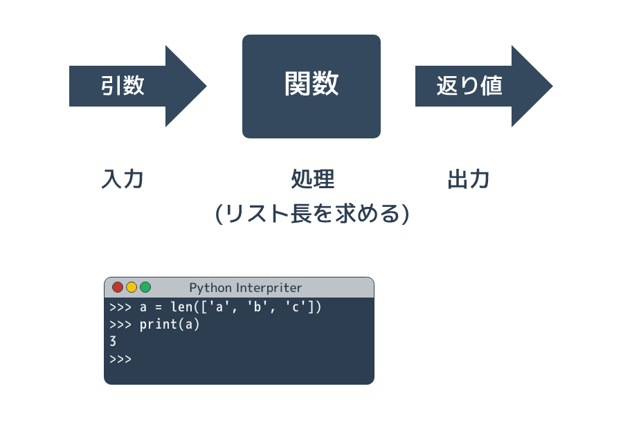
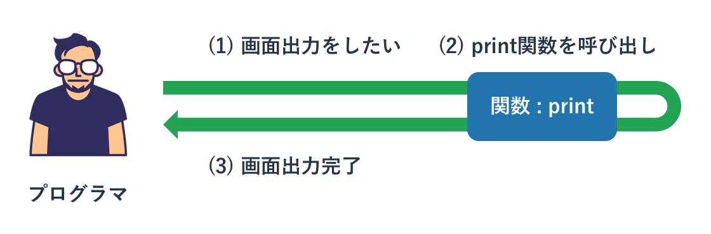
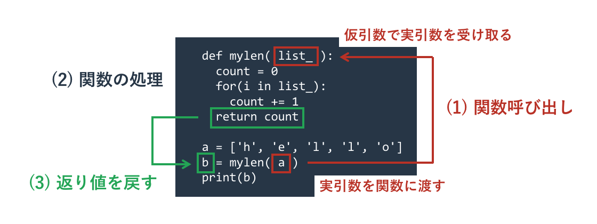
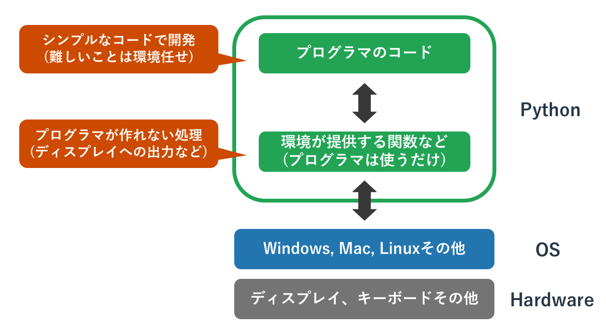

# 関数

{{ TOC }}

## 概要



Pythonに限らず、多くのプログラミング言語には「関数」という概念があります。
関数は呼び出し元から「引数」として値を受けとり、
内部で「処理」をして、結果を「返り値」として返します。
引数と返り値は必須ではなく、どちらかもしくは両方がないこともあります。

関数は以下の役割を持っています

* Pythonが提供する機能を呼び出す
* プログラムを分かりやすくする
* プログラムの重複を減らす

Pythonが提供する関数を使うことでキーボードやファイルからの入力、
ディスプレイへの出力といったプログラマーが作れない処理を実現できます。

複雑な処理をPythonが提供する関数で簡単に実現できたり、
自分でその関数を作ることで複雑なコードを外に追いやることでプログラムの見通しがよくなります。
また、似たような処理をコピーペーストではなく関数を使って実現できるため、
プログラムの重複が減ります。

## Pythonが提供する組み込み関数

関数はプログラマが自分で作るものと、プログラミング言語の環境(Python)が提供するものがあり、
後者を特に「**組み込み関数**」と呼びます。



たとえば出力をコンソールにするprint文も組み込み関数です。
この関数に値を与えると、それがコンソールに表示されます。

```python
print('Hello Python')
```

```text
Hello Python
```

この関数の「()」にいれる値を「**引数**」と呼んでいます。
関数の目線で「引き込む値」で、関数を使う側が関数に渡す値です。
上記の例では「'Hello Python'」という文字列が引数であり、
これがprint関数を使う側からprint関数に渡されています。

関数はそれぞれ役割を持っていて、print関数は引数をコンソールに表示することが役割です。

別の関数len()はリストの長さを確認するための関数です。
この関数は引数としてリストを受け取ると、リストの長さを求めるという処理をします。
ただ、先ほどのprint関数と異なり、この関数はリストの長さをプログラムの呼び出し側に「返す」という動きをします。
この返す値のことを「**返り値**」と呼びます。

```python
a = ['h', 'e', 'l', 'l', 'o']
b = len(a)
print(b)
```

```text
5
```

先ほどのprint関数は引数を処理のなかで画面出力することが役割でしたので、
特に値を呼び出し元に返す必要がありません。
そのため返り値がありませんでした。

一方、関数lenは処理の役割がリストの長さを求めるということなので、
求めた値を呼び出し元に返さないと呼び出した意味がありません。
そのため、呼び出し元に返り値を返します。

関数は突き詰めると「呼び出し元が引数で値を関数に渡す」「関数の処理のなかで引数を使ってなにかをする」
「関数が返り値として処理した結果を呼び出し側に返す」という3つの流れに集約されます。


## 関数の定義と利用

組み込み関数を使うだけでなく、関数を自分で作って使うこともできます。
関数の定義もif文やfor文と同じように、「**def文**」を使って宣言し、コードブロックで処理を書きます。

リスト長を求めるlen()関数と同じことをする「mylen()」関数を定義します。

```python
def mylen(list_):
  count = 0
  for(i in list_):
    count += 1
  return count
```

def文に続けて自分がつけたい関数名を書き、それに続けて()に囲まれた引数を書きます。
関数名や引数名は変数と同じように自分の好きな名前をつけられます。
ただ、変数と同じく小文字のアルファベットとアンダーバーと数字を使うのが一般的です。

コードブロック内にその処理を書き、ここではfor文を使って要素を全てループして数を数えています。
求めた値を呼び出し側に返すには「**return文**」を使います。

return文は関数を打ち切るキーワードで、return文以降のコードは実行されません。
return文の後ろに何も書かなければ返り値はなにもなく、後ろに値を書けばそれが返り値となります。
return文がない、もしくはif文の関係で実行されなかったといった場合は、
関数のコードブロックの最後まで実行されて返り値なしとなります。

自分が定義した関数を使う方法は組み込み関数と全く同じです。

```python
def mylen(list_):
  count = 0
  for(i in list_):
    count += 1
  return count

a = ['h', 'e', 'l', 'l', 'o']
b = mylen(a)
print(b)
```

```text
5
```

注意をして欲しいのは自分が作った関数を利用するのは定義をした後になるということです。
上記ではmylenの定義をしたあとで、それを使っています。
もしこの順序が逆になれば「mylenは定義されていない」としてエラーが発生します。

なお、関数で定義している引数を「**仮引数**」と呼び、関数を呼び出す側で与える引数を「**実引数**」といいます。
たんに引数といった場合はいずれかを意味しています。



### 引数

関数の引数は好きな数だけ定義できます。
引数が存在しない場合は引数定義を「関数名()」と空にして、
複数存在する場合は「関数名(引数名1, 引数名2, 引数名3)」とコンマ区切りで並べます。

この関数の定義にある引数の数と、関数を呼び出す際に与える引数の数をあわせる必要があります。
定義と呼び出しの引数の数があっていなければエラーが発生します。
functionは関数で、argは引数、callは呼び出しの英語です。


```python
def myfunction1():
  print('myfunction1 called')

def myfunction2(arg1, arg2, arg3):
  print('myfunction2 called')

myfunction1()
myfunction2(1, 2, 3)

myfunction1('test')
```

```text
myfunction1 called
myfunction2 called
Traceback (most recent call last):
  File "sample.py", line 10, in <module>
    myfunction1('test')
TypeError: myfunction1() takes 0 positional arguments but 1 was given
```

引数の数を揃えた1番めと2番めの呼び出しは成功していますが、
引数がない関数を引数を与えて呼び出すと「関数myfunction1は引数を0受け取るが、1つ与えられている」としてエラーになっています。

Pythonの関数の引数には中級者向けの様々なテクニックがあります。
それらを使えば上記の引数の数が違う問題なども回避できます。
これらについては関数の引数の詳細を扱うページにて解説します。

### 返り値なしはNoneを返す

返り値がない関数があると先ほど説明しましたが、厳密にいうとそれらの関数は「**None**」という値を返り値として返しています。
Noneは日本語でいうと「何もない」ですので、何もないということを明示的に返しています。

先ほどprint()関数は返り値がないと説明しましたが、あえて返り値を変数に代入して中身を確認すると、
このNoneという値が返されていることが分かります。

```python
a = print('hello')
print(a)
print(type(a))
```

```text
hello
None
<class 'NoneType'>
```

なお、Noneが返されていることを「返り値はNone」と明示的には言わず、「返り値はない」とされることが多いです。
どちらの表現も間違いではありませんが「返り値はNone」とわざわざ伝える必要はないです。

### 返り値がない自作関数

自作の関数でreturn文を後ろの返り値なしで呼び出したり、関数内でreturn文が呼び出されないと、
Noneが返されます。

```python
def myfunction1():
  1 + 1

def myfunction2():
  1 + 1
  return

print(myfunction1())
print(myfunction2())
```

```text
None
None
```

### 複数のreturn文

関数内に複数のreturn文を書くことができます。
これはループの中に書かれたbreakと似ていて、
それが呼び出されたタイミングで全ての残りの処理が打ち切られて関数呼び出しが終了します。

プログラムの最後にbreak文があれば関数の処理は最後まで実施されるが、
途中にある場合はそれ以後は実施されないということです。

以下の関数では引数が10の場合のみ、if文でreturn文が実行されます。

```python
def function(a):
  print(1)
  if(a == 10):
    return
  print(2)

function(3)
function(10)

```

```text
1
2
1
```

関数のなかで複数のreturn文を使うのであれば、全てのreturn文が同じ形式の返り値を返すようにしてください。
状況に応じて引数Noneが返されたり数値が返されたりすると、それを使う側は引数の型のチェックなどが必要になります。
そのような何が返されるか分からない関数は非常に使いにくいものとなります。

## 関数内の関数

Python の関数は実は関数の中に入れ子構造にすることができます。
例えば以下のような使い方ができます。

```python
def test1():
  a = 10

  def test2(x, y):
    return x + y

  return a + test2(5, 6)

print(test1())
# 21
```

上記の例では関数 test1() の中で関数 test2() を定義し、それを使っています。
今回のサンプルのような短い関数であればこのような使い方は不要ですが、
より複雑な処理を関数で行う場合は処理を綺麗に分類するために内部で関数を定義して使うことがあります。

## 組み込み関数


