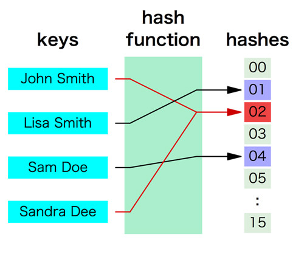

## セット

次は「セット」です。セットを一言で説明すると、「集合」という概念を実現するための型です。
たとえば、ある空の集合にAを追加すると、その集合にはAがあります。
さらにBを追加するとA、Bの2つが存在します。
しかし、ここにさらにAを追加しても、「A、A、B」とはならずに「A、B」のままです。
そして集合は「順序を持たない」ので「A、B」も、「B、A」も同じ意味を持ちます。
セットの内部実装には非常に重要な概念があるのですが、とりあえず使い方を説明してしまいます。

空のセットのオブジェクトを作るにはset() 関数を使います。
空でない場合は{}に要素を並べることで作ることもできます。
  もしくはリストのデータをset関数に渡すことで、中身のあるセットを作ることもできます。

```python
a = set()
print(a)
# set()

b = {1,2,3}
print(b)
# {1, 2, 3}

c = set([1,3,5,7])
print(c)
# {1, 3, 5, 7}
```

空のセットを作る際に注意して欲しいことは「変数 = {}」 としてしまうと、
  セットではなく次に説明する「辞書型のオブジェクト」が作成されてしまうということです。

セットへの要素の追加にはadd、削除にはremoveメソッドを使います。

```python
a = {1, 2, 3}
a.add(4)
print(a)
# {1, 2, 3, 4}
a.add(2)
print(a)
# {1, 2, 3, 4}

a.remove(1)
print(a)
# {2, 3, 4}
```

リストのデータ追加のメソッド名を覚えていますか。addではなく、appendや insertでしたね。
日本語で言うと同じ「追加」であっても、addだと「集合に加える」という感じで、
appendだと「末尾に加える」という意味合いになります。
順序を持たない set 型なので、add というメソッド名となっています。
そして removeメソッドを使うと指定した値をセットから取り除きます。
存在しない値を指定するとエラーになるので注意してください。

セットの使い方はリストに似ています。

```python
# in, not in を使える
a = {1,3,5,7}
print(1 in a)
# True
print(2 in a)
# False

# pop を使える(何が帰ってくるかは分からない)
b = a.pop()
print(a)
# {3, 5, 7}
print(b)
# 1

# for も使えるが順序は不明
for i in {1,3,5,7}:
  print(i)
# 1 3 5 7
```

リストと若干異なるのはセットの結合です。
先程説明したようにセットは重複した要素を持たないため、
結合される2つのセットが同じものを持っていれば1つだけになります。
プラス記号を使った結合はできません。

```python
a = {1,2,3}
a.union({3,4,5})
print(a)
# {1, 2, 3, 4, 5}

print(a + {5,6,7})
# Traceback (most recent call last):
# ...
# TypeError: unsupported operand type(s) for +: 'set' and 'set'
```

あまり利用場面は多くないかもしれませんが、集合特有の演算をすることもできます。

```python
# 比較
print({1,2,3} < {1,2,3,4})
# True

# AND(両方含むもののみ)
print({1,2,3} & {3,4,5})
# {3}

# OR(結合)
print({1,2,3} | {3,4,5})
# {1, 2, 3, 4, 5}
```

セットの使い方はわかっていただけたでしょうか。
追加や削除、有無のチェックなどの機能を見ると、なんだかリストに似ているような気がしたかもしれませんが、
両者の仕組みはまったく異なっています。

### ハッシュの仕組み

セットで使われている重要なコンピュータ技術に、ハッシュ(Hash)と呼ばれているものがあります。
集合はハッシュを使わずにでも実現できるでしょうが、
PythonのセットはJavaでいうところのHashSetに近いです。
このハッシュの概念図を以下に示します。



ハッシュは「ハッシュ関数」と呼ばれるものに特定の値(キー)を与えて「ハッシュ値」を得ることで実現されています。
ハッシュ値はある範囲のなかの数値(一般的には0からN)のどれかとなり、
同じキーから生成されるハッシュ値は常に同じです。

上記の図でいうと、キーとして「John Smith」をハッシュ関数にかけるとハッシュ値「02」が得られています。
同様に「Lisa Smith」をハッシュ関数にかけると「01」となります。
そしてハッシュ値の範囲は00から15です。
この性質を考慮したうえで「ある集合に要素Xはあるか」ということをどのようにして実現するか想像してください。

ハッシュを使う場合、たとえば「John Smith」を集合に加える際には、
ハッシュ値「02」の場所に「John Smith」を格納します。
そして「John Smith」が存在するかどうかのチェックはハッシュ値「02」の場所に「John Smith」がいるかどうか確認すればいいのです。
一方、リストの探索であれば「先頭から末尾まで順に「John Smith」かどうかを確認していく」ことが必要です。
リストのサイズが大きければこの探索コストは非常に大きくなります。
「要素」の探索という面においてハッシュはリストに比べるとであるのに比べると随分スマートだと思いませんか。
実際、ハッシュを使った要素の探索は非常に高速です。

ただ、ハッシュも使い方を間違えると効率が悪くなります。もう一度図を見てください。
よく見ると「John Smith」と「Sandra Dee」は同じハッシュ値に割り当てられています。
これはいわゆる「ハッシュの衝突」と呼ばれており、これが多発すると探索のスピードが遅くなります。
なぜなら「Sandra Dee」の有無の確認をする際に「01」を見にいって、
そこに「John Smith」やほかの要素がたくさん入っていると、
「01」のなかで「リストの探索」のようにして全部をチェックしていかないといけないからです。

この問題を防ぐためにハッシュ値の範囲は十分な広さを持たせる必要があります。
たとえば今回のように00から15などという範囲は狭すぎるので、これをもっと広げます。
そうすると確率的には衝突は発生しにくくなります。
ただ、通常はこんなことを気にしなくてもPythonがよしなに処理してくれるので大丈夫です。
