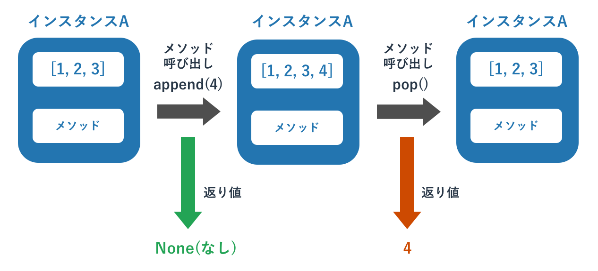
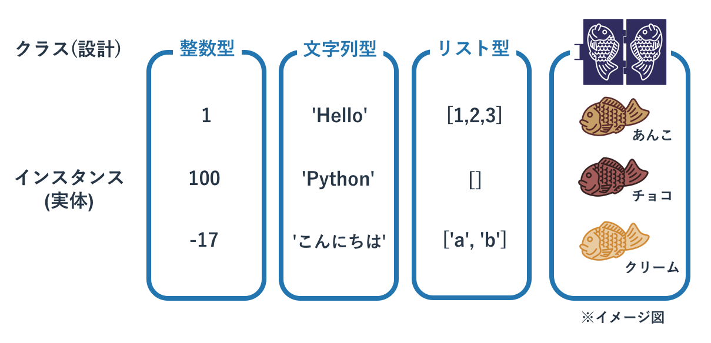
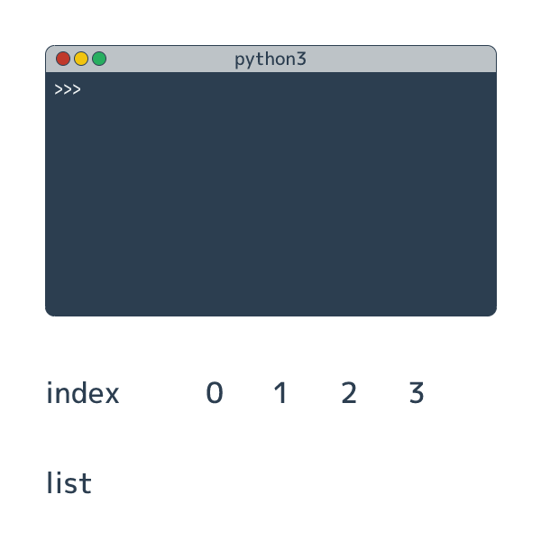
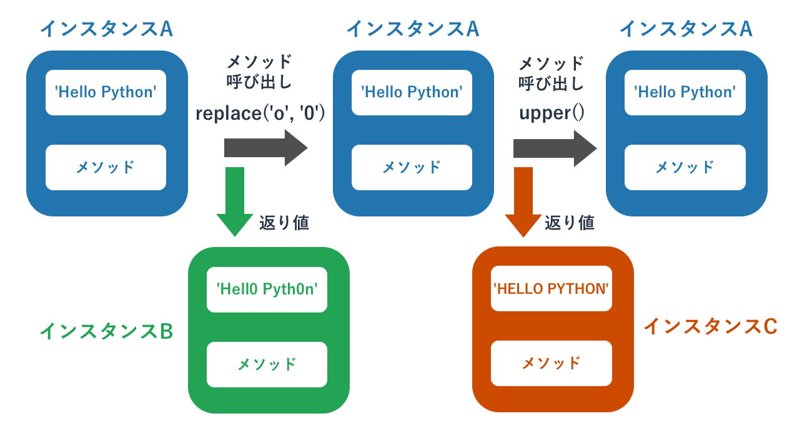
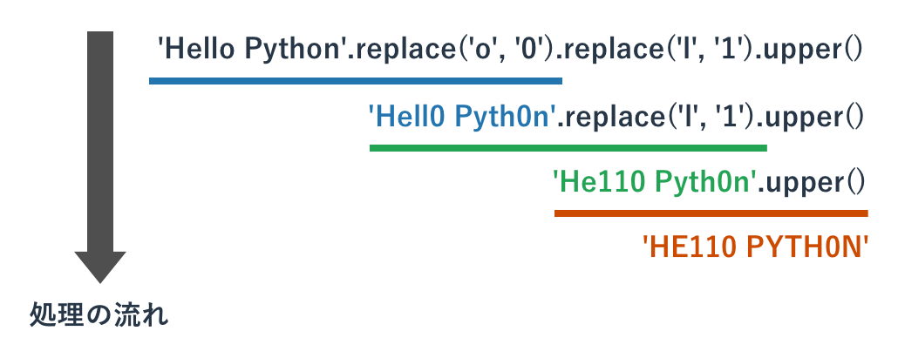

# オブジェクト指向を体験

{{ TOC }}

## 概要



オブジェクト指向について理解するには、
オブジェクトが持つ「状態」と「処理」がどのようなものか理解することが必要です。
このページでは既存のリストという型を使って、それらがどのようなものか体験してもらいます。

「状態」と「処理」の関係をなんとなく把握したうえで、
次ページ以降で学ぶ「クラス」を使ってオブジェクト指向に沿ったプログラムを書けば、
オブジェクト指向について理解が深まります。

## クラスとインスタンス

Pythonを含む「**オブジェクト指向**」のプログラミング言語を理解するには「**クラス**」と「**インスタンス**」の関係の理解が欠かせません。
これらを自分で定義して使うこともできるのですが、このページでは既存の型を使いこなすのに必要な知識のみを扱います。

今までの説明でデータの種類のことを「型」と呼び、そのデータ自体のことを「値」と呼んでいました。
この呼び方も一般的ですが、オブジェクト指向の世界においては両者は「クラス」と「インスタンス」と呼ばれます。
既に説明した型でいえば、以下のようになります。

*	整数型がクラスであり、1や2,3はインスタンス
*	文字列型がクラスであり、'hello'や'python'はインスタンス
*	リストがクラスであり、[]や[1,2,3],['hello', 'python']はインスタンス

クラスが概念であり、インスタンスが実際の値にあたります。
概念はとしてのクラスは1つしかありませんが、そのインスタンスは無数にあります。



## インスタンスとメソッド

インスタンスは単なるデータではなく、「データと処理の組み合わせ」です。

この後でリスト型を参考に具体的な説明をしますが、インスタンスは内部にデータを持ちつつ、
「**メソッド**」と呼ばれる処理を使うことができます。

メソッドは関数に非常によく似ていて、引数を呼び出し元から受け取ったり、返り値を呼び出し元に返すことができます。
ただ、関数と異なりメソッドはそのインスタンスが持つ内部データを操作します。

クラスはインスタンスの設計図ですので、インスタンスがどのような内部データを持ち、
それをメソッドがどう使うかはクラスの定義に書かれています。



## リストで学ぶオブジェクト指向

数多くのプログラマにオブジェクト指向を教えて得られた教訓は、
「オブジェクト指向は使わないと分からない」「クラスを設計しないとオブジェクト指向の本質は分からない」というものです。

概念的な話を続けるよりも、リスト型のインスタンスをどのように使うかを題材としてオブジェクト指向を体験してみます。
Pythonのインタプリタでリスト型のデータを作成して変数に代入します。

```text
>>> a = [1, 2, 3]
>>>
```

リスト型のデータの作成は、リスト型のインスタンスの作成と同じ意味です。
つまり変数aにはリストのインスタンスが格納されています。

どのような内部データを持っているかはprint()関数にインスタンスを与えることで確認できます。

```text
>>> print(a)
[1, 2, 3]
>>>
```

インスタンスは内部に値を持っているだけでなく、その内部データを処理するためにメソッドを持っています(他の目的のメソッドもあります)。
ここではリストのインスタンスが持つ「要素を追加する」というメソッドを呼び出して、要素「4」を追加します。

メソッドの呼び出しは「**インスタンス.メソッド名(引数)**」というフォーマットです。
要素を追加するメソッドは「append」ですので、今回は「a.append(4)」となります。

```text
>>> a.append(4)
>>>
```

呼び出しただけでは特に何も変わったように見えませんが、
内部データをprint()関数で確認すると、要素4が追加されていることがわかります。

```text
>>> print(a)
[1, 2, 3, 4]
>>>
```

メソッドは返り値を持つものもあります。
リストのpopメソッドはリストのインスタンスから要素を取り出すためのメソッドで、取り出された要素は返り値として返されます。
そしてインスタンスが持つ内部データからはpopされたものがなくなります。

```text
>>> b = a.pop()
>>> print(b)
4
>>> print(a)
[1, 2, 3]
>>>
```


リストがどのようなメソッドを持つかはリスト型の解説ページにて詳細を扱います。



## 不変オブジェクト

リスト型のインスタンスはメソッドを呼び出すと、そのインスタンスが持つ内部データが書き換わることがあります。
一方、インスタンスの内部データが絶対に書き変わらないインスタンスも存在し、それらは「**不変オブジェクト**」と呼ばれています。

不変オブジェクトの代表格が文字列型で、文字列型のインスタンスはメソッドが呼び出されても変わりません。
たとえば「特定文字を別の文字と置き換える」という「replace」というメソッドが文字列型にはありますが、
これを使うと「返り値として置き換えられた文字列が返る」という動きをして、呼び出し元のインスタンスは変わりません。

```text
>>> a = 'Hello Python'
>>> b = a.replace('o', '0')
>>> print(a)
Hello Python
>>> print(b)
Hell0 Pyth0n
```

同様に、アルファベットを大文字に変換するというupper()メソッドも、呼び出し元の値は変わりません。

```text
>>> a = 'Hello Python'
>>> b = a.upper()
>>> print(a)
Hello Python
>>> print(b)
HELLO PYTHON
```



## メソッドを直接呼び出す

少し高度なトピックになりますが、比較的よく使われるメソッドの使い方を紹介します。

実はメソッドは必ずしも変数に代入されたインスタンスに対して使う必要はなく、
インスタンスが生成された瞬間に使うことができます。

```text
>>> a = [1, 2, 3].pop()
>>> print(a)
3
```

上記は「[1, 2, 3]」でリストのインスタンスを作成し、そのインスタンスに対してpop()メソッドを呼び出しています。

他には関数の返り値に対してメソッドを呼び出すこともできます。
たとえば文字列型にキャストするstr()関数の返り値は文字列型のインスタンスですので、そのメソッドを使うことができます。

```text
>>> a = 1010
>>> b = str(a).replace('0', 'o')
>>> print(b)
1o1o
```

上記は「str(a)」の返り値である文字列インスタンス「'1010'」に対して、直接replace()メソッドを呼び出して「'0'」を「'o'」に変換しています。

このメソッドの直接呼び出しを繋げると、まるでメソッドが鎖のように繋がることがあり、このテクニックを「メソッドのチェイニング」と呼びます。
例えば以下の様なコードにです。

```text
>>> a = 'Hello Python'.replace('o', '0').replace('l', '1').upper()
>>> print(a)
HE110 PYTH0N
```

これは分かりやすく書けば以下のようになります。

```text
>>> a = 'Hello Python'.replace('o', '0')
>>> b = a.replace('l', '1')
>>> c = b.upper()
>>> print(c)
HE110 PYTH0N
```

メソッドをチェーン上に並べるのは、無駄に変数をたくさん作るのを防ぐために活用するべき場面があります。
ただ、あまりにも長く繋げ過ぎたり、あまり有名でないメソッドを呼び出してバグを生むような状況にはならないようにしてください。
メソッドをチェーン上に並べた場所でエラーが発生すると、そのエラー原因の特定が困難な場合があります。


## dir関数

インスタンスがどのようなメソッドを持つかは「**dir関数**」で確認できます。
dir関数に引数としてインスタンスを渡すと、そのメソッドの属性(インスタンスが持つ内部データやメソッドなどの総称)の一覧をリスト形式で返します。

たとえばリストですと以下のよう出力が得られます。

```text
>>> a = [1,2,3]
>>> dir(a)
['__add__', '__class__', '__contains__', '__delattr__', '__delitem__', '__dir__',
'__doc__', '__eq__', '__format__', '__ge__', '__getattribute__', '__getitem__',
'__gt__', '__hash__', '__iadd__', '__imul__', '__init__', '__iter__', '__le__',
'__len__', '__lt__', '__mul__', '__ne__', '__new__', '__reduce__', '__reduce_ex__',
'__repr__', '__reversed__', '__rmul__', '__setattr__', '__setitem__', '__sizeof__',
'__str__', '__subclasshook__', 'append', 'clear', 'copy', 'count', 'extend',
'index', 'insert', 'pop', 'remove', 'reverse', 'sort']
```

先ほど利用したappend()メソッドや、pop()メソッドもあります。

このdir関数は「あの処理をしたいのだけど、どういうメソッド名だったかな」といった感じで忘れしまったメソッドを確認したり、
「あの処理をしたいのだけど、なにかそれらしい名前のメソッドはあるかな」といったこと調べたりするのに便利です。
