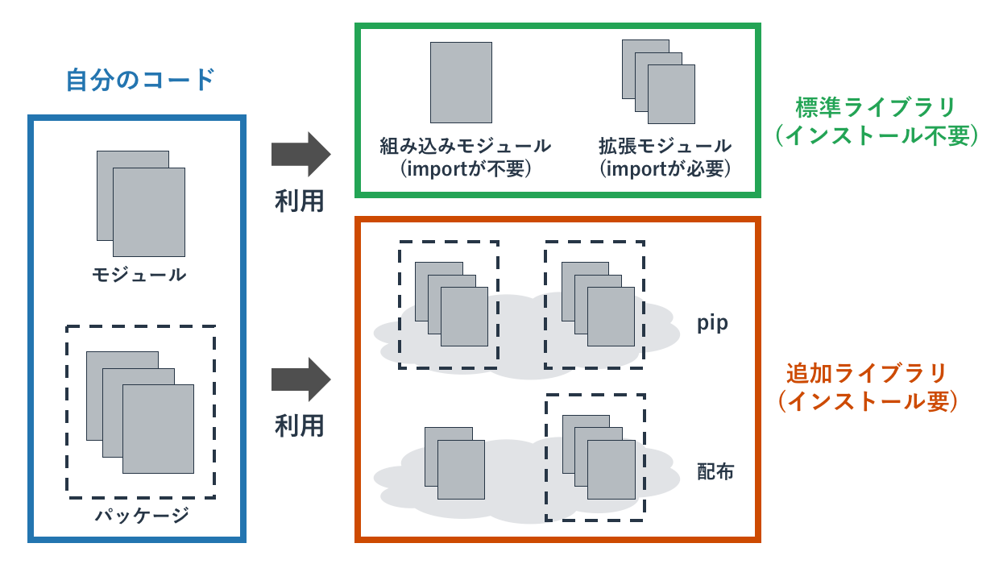

# モジュールの利用

{{ TOC }}

## 概要



Pythonが提供する機能は多く、print関数といったよく利用される機能だけでなく、
数学やネットワーク関連の機能もあります。

これらの補助的な機能については「モジュール」という形でPythonはプログラマに提供しています。
既に作成されているモジュールを取り込んで使うことで、自分で作成できない機能を利用したり、
開発の手間を省くことが可能になります。

また、Pythonはモジュールの集合をパッケージとしても提供しています。
複雑なライブラリだと1つのモジュールで全ての機能を提供するのではなく、
複数のモジュールをパッケージとしてグループ化して提供します。

## モジュールの全体像

「**モジュール**」はプログラムを分割する手法です。
モジュールはPython自体が提供する環境でも利用されており、自分でモジュールを作って利用することもできます。

Python自体が提供するモジュールは「**標準ライブラリ**」と呼ばれています(ライブラリはモジュールの集合というニュアンスがあります)。
これには今まで利用してきたprint関数といった特に宣言無く利用できる「**組み込みモジュール**」と呼ばれるものと、
数学やネットワークの処理といった用途ごとのモジュールがあります。
Pythonが提供するこれらのモジュールの一部はC言語で書かれていて、
Pythonのプログラマが直接使うことができないシステム機能へのアクセス(たとえば画面出力など)を提供しています。

Python環境自体が提供する標準ライブラリ以外にも、普及しているモジュールはあります。
それはpipと呼ばれるパッケージ管理システムを使って追加インストールをしたり、
ソースコードとして配布されているものを取り込んだりして使います。

pipで提供されるのはモジュールではなく複数のモジュールを含む「**パッケージ**」というものです。
複雑な機能を実現するプログラムを1つのモジュールに詰め込むことはできないため、
複数のモジュールに分けてそれをパッケージという入れ物にいれて提供します。

大規模なソフトウェアを開発する場合は自分が書くソースコードの量も数千行、数万行となります。
そのときはプログラムの機能ごとにファイルを分けて、それらをモジュール化します。
自分が開発したモジュールを自分のプログラムで読み込むことで、コードを整理できます。

以下にPythonのモジュールの全体像を記載します。


## モジュールの利用

### import

モジュールを利用するためにはその宣言が必要です。
その宣言方法は複数ありますが、最もよく使われるのが「**import宣言**」です。

import宣言は「import文」に続けて、モジュール名を書きます。
たとえば、数学処理がまとめられたmathモジュールを利用するには以下のようにします。

```python
import math
```

import宣言されたモジュールは「**モジュール名.モジュールの関数**」などとして、
頭にモジュール名を付けて利用します。
たとえば、mathモジュールの切り捨て関数であるfloorを使うには以下のようにします。

```text
>>> import math
>>> math.floor(5.5)
5
```

仮にimport文なしにmathモジュールのfloor関数を使おうとすると、
mathという名前は宣言されていないとエラーが発生します。

```text
>>> math.floor(5.5)
Traceback (most recent call last):
  File "<stdin>", line 1, in <module>
NameError: name 'math' is not defined
```

モジュールが持つのは関数だけでなく、クラスや定数、変数などもあります。
それらも共通して「モジュール名.定数」などとして使います。

### import A as B

importで読み込むモジュール名が長かったりわかりにくかったりする場合は、
モジュールにに別名を付けることが可能です。

別名をつけてimportするには「**import モジュール名 as 別名**」とします。
たとえばGUIのライブラリである「math」を「mathematics」として読み込むには、
「import math as mathematics」とします。

```text
>>> import math as mathematics
>>> mathematics.floor(5.5)
5
```

### from A import B

モジュール名を書かずにモジュールの関数などを使うこともできます。
それには「**from モジュール名 import 使う関数など**」とします。

たとえば「from math import floor」とすると、
floor関数をmathモジュールの後ろに付けずに使うことができるようになります。

```python
>>> from math import floor
>>> floor(5.5)
5
```

頻繁に使う関数であればこのように使用しても構いませんが、
一般的にはfromを使わずにimportのみを使うことがよいとされています。
なぜならその関数がどのモジュールに属しているかひとめで分かるからです。

あまり見かけませんが、先ほどの「import A as B」とfromを組み合わせることで、
あるモジュールに属する関数を別名で使うこともできます。

```text
>>> from math import floor as f
>>> f(5.5)
5
```

### from A import *

モジュール内の全ての関数やクラスなどを、モジュール名なしで呼び出すこともできます。
それには「**from モジュール名 import \***」という宣言をします。

このアスタリスク記号(\*)は「**ワイルドカード**」と呼ばれており、「全て」を意味しています。
そのため、モジュールの全てに対してfrom宣言で利用するという意味になります。

```
>>> from math import floor
>>> floor(5.5)
5
```

ただ、このような乱雑なモジュールの利用法は「名前の衝突(同じ名前が２箇所で使われてしまっている)」
などの問題が発生しかねないので、あまり推奨できません。

あるモジュールをテストするといったシナリオでは有効な使い方ですが、
本番環境用のコードでは使用しないほうがよいです。

## pip

Pythonで効率的に開発を行うには既存のライブラリを可能な限り使う姿勢が重要です。

全ての細かい処理まで自分で開発すると、その開発にはコスト(時間とお金)がかかります。
そういった細かい処理をライブラリの関数などで代替できるのであれば、
自分で開発する必要もなくなり効率的です。

Pythonが最初から提供しているライブラリは基本的な機能に限られており、
多くのユーザーの要望を満たしきれていません。
そのため、PythonのユーザーはPythonが提供する組み込みライブラリ以外に、
「**pip**」と呼ばれるパッケージを任意で追加できる仕組み(「**パッケージ管理システム**」)を使っています。

pipを使うことでデフォルトでは組み込みきれないほどの膨大なライブラリを、
必要に応じて自分の環境に追加インストールして利用します。


### パッケージのインストール

pipはPython3をインストールしていれば自動で一緒にインストールされています。
(古いPython3だと入っていないかもしれませんので、その場合はアップグレードしてください。)

pipを使ってパッケージをインストールするまでは、pipが提供するパッケージは使えません。
例えば「requests」というパッケージはデフォルトではインストールされていないため、
importしようとすると「そのようなモジュールはない」とエラーが発生します。

```text
>>> import requests
Traceback (most recent call last):
  File "<stdin>", line 1, in <module>
ModuleNotFoundError: No module named 'requests'
```

pipでのモジュールのインストールは「**pip install モジュール名**」というコマンドをコンソールで実行することで行います。
requestsパッケージをインストールしてみます。

```text
$ pip3 install requests
Collecting requests
  Downloading requests-2.18.4-py2.py3-none-any.whl (88kB)
    100% |████████████████████████████████| 92kB 380kB/s
Collecting chardet<3.1.0,>=3.0.2 (from requests)
  Downloading chardet-3.0.4-py2.py3-none-any.whl (133kB)
    100% |████████████████████████████████| 143kB 936kB/s
Requirement already satisfied: idna<2.7,>=2.5 in /Library/Frameworks/Python.framework/Versions/3.6/lib/python3.6/site-packages (from requests)
Collecting certifi>=2017.4.17 (from requests)
  Downloading certifi-2018.1.18-py2.py3-none-any.whl (151kB)
    100% |████████████████████████████████| 153kB 873kB/s
Collecting urllib3<1.23,>=1.21.1 (from requests)
  Downloading urllib3-1.22-py2.py3-none-any.whl (132kB)
    100% |████████████████████████████████| 133kB 3.4MB/s
Installing collected packages: chardet, certifi, urllib3, requests
Successfully installed certifi-2018.1.18 chardet-3.0.4 requests-2.18.4 urllib3-1.22
```

Macの場合は「python」の利用を「python3」とするように、「pip」の利用も「pip3」とします。
パッケージファイルをインターネットからダウンロードしてきて、インストールをしています。

インストールに成功すると、そのパッケージを利用することができるようになります。
以下ではrequestsモジュールを使って、yahooのトップページの情報を取得してきて表示しています。
(ページからはみ出すことを防ぐため、yahooのページ情報の一部を削ったり変更しています。)

```text
>>> import requests
>>> response = requests.get('http://yahoo.co.jp')
>>> print(response.text)
<html>
<head>
<meta http-equiv="content-type" content="text/html; charset=utf-8">
<meta http-equiv="content-style-type" content="text/css">
<meta http-equiv="content-script-type" content="text/javascript">
<meta name="description" content="日本最大級のポータルサイト。検索、オークション、
ニュース、メール、コミュニティ、ショッピング、など80以上のサービスを展開。
あなたの生活をより豊かにする「ライフ・エンジン」を目指していきます。">
<meta name="robots" content="noodp">
<meta name="google-site-verification" content="fsLMOiigp5fIpCDMEVodQnQC7jIY1K3UXW5QkQcBmVs">
<link rel="canonical" href="https://www.yahoo.co.jp/" />
```

これはyahooのページにHTTPというプロトコルを使ってアクセスして、
Yahooのサーバーから返されたデータを表示しています。

このような複雑な処理をpipでインストールしたrequestsパッケージを使うことで、短い2行で実現できています。
自力で同じ処理をするのは大変なので、パッケージを使う理由が分かって頂けたのではないでしょうか。
