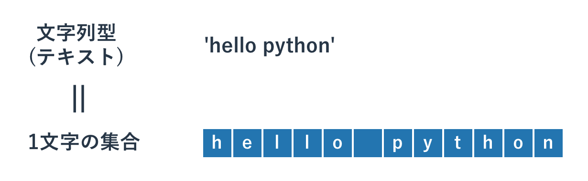

# オブジェクト指向を体験

{{ TOC }}

## 概要

オブジェクト指向について理解するには、
オブジェクトが持つ「状態」と「処理」がどのようなものか理解することが必要です。
このページでは既存のリストという型を使って、それらがどのようなものか体験してもらいます。

「状態」と「処理」の関係をなんとなく把握したうえで、
次ページ以降で学ぶ「クラス」を使ってオブジェクト指向に沿ったプログラムを書けば、
オブジェクト指向について理解が深まります。

## リストで学ぶオブジェクト指向

オブジェクト指向の難しい話をしたり、いきなり文法を教えたりしても頭にはすっと入ってこないと思います。
そのため、まずは難しい話は抜きにしてリストという型を使って「オブジェクト」の扱いに慣れ親しんでもらいたいと思います。

既にご存知かと思いますが、リストは型の一つであり、内部に複数のデータをリスト形式で持ちます。
例えば、以下は全てリスト型のデータです。

```python
[]
[1,2,3]
['hello','python']
[1,'python',3]
```

リストは「型」であり、上記はその「データ」です。リストは「概念」で「1,2,3 という数字が格納されたリストのデータ」は具体的なモノです。
オブジェクト指向におけるこの「概念のレベルでのデータ」がクラスであり、その具体的なモノがオブジェクトと呼ばれています。
例えばクラスとオブジェクトの関係は以下のようなものとなります。

*	整数型がクラスであり、1,2,3 はオブジェクト
*	文字列型がクラスであり、’hello’, ‘python’ はオブジェクト
*	リストがクラスであり、[],[1,2,3],[“hello”,”python”] はオブジェクト

上記の例だけを見るとオブジェクトはつまり「具体的なデータ」のように思えますが、実はそうではありません。
データに加えて「処理」も含んでいます。
たとえば、「リスト末尾に要素を追加」することを思い浮かべて下さい。[1,2,3] に 4 を追加して [1,2,3,4] とするには、
以下のように [1,2,3] というリストのオブジェクトに対して追加処理を「メソッド」として呼び出します。

```python
a = [1,2,3]
print(a)
# [1, 2, 3]

# Listオブジェクト a のメソッド呼び出し
a.append(4)

# オブジェクト自体が変更されている
print(a)
# [1, 2, 3, 4]
```

上記のサンプルプログラムは [1,2,3] というリストのオブジェクトがデータだけでなく append という処理(メソッド)も持っていて、
それを使うことで自分自身のデータを更新しています。
[1,2,3] というオブジェクトが変数 a に代入された時点では [1,2,3] のままですが、
append メソッドを呼び出した呼び出した後は[1,2,3,4]となっていることが分かります。
オブジェクトが「データ」と「処理」の両方を持つということを理解できましたでしょうか。
以下に上記の変化を示す図を記載します。


以上でリストを使った簡単なオブジェクト指向の体験は終了です。
最後にオブジェクトの詳細を知るのに便利な関数である dir() を紹介します。
例えばプログラムを書いていると「リスト型がどういう名前のメソッドを持っているか」ということを確認する必要がある場合が出てきます。
dir 関数にオブジェクトを与えると、そのオブジェクトがどのような属性を持つかリスト形式で返してくれます。

```
$ python3
>>> a = [1,2,3]
>>> dir(a)
['__add__', '__class__', '__contains__', '__delattr__', '__delitem__', '__dir__', '__doc__', '__eq__', '__format__', '__ge__', '__getattribute__', '__getitem__', '__gt__', '__hash__', '__iadd__', '__imul__', '__init__', '__iter__', '__le__', '__len__', '__lt__', '__mul__', '__ne__', '__new__', '__reduce__', '__reduce_ex__', '__repr__', '__reversed__', '__rmul__', '__setattr__', '__setitem__', '__sizeof__', '__str__', '__subclasshook__', 'append', 'clear', 'copy', 'count', 'extend', 'index', 'insert', 'pop', 'remove', 'reverse', 'sort']
```

「あの処理をしたいのだけど、どういう名前だったかな」といった感じで忘れしまったメソッドを確認したり、
「あの処理をしたいのだけど、なにかそれっぽいものはあるかな」といったこと調べたりするのに便利です。

dir に加えて help 関数を使うと、属性のより詳細を調べることもできます。
たとえばリストの pop メソッドがどういうものか調べたければ以下のようにします。

```
>>> help(a.pop)

Help on built-in function pop:

pop(...) method of builtins.list instance
    L.pop([index]) -> item -- remove and return item at index (default last).
    Raises IndexError if list is empty or index is out of range.
```

上記のヘルプを使うことでメソッドの挙動がわかります。
少し慣れが必要ですが、いちいち本で調べたりGoogle で検索したりするより、
上記のようにインタプリタを使ってその場でどういう属性を持つか調べるほうがはやいので積極的に使ってみて下さい。

## メソッドの連続呼び出し

「オブジェクトを返す関数やメソッド」に対してメソッドを呼び出しているようなコードはよくありますが、
それは上記と同じように「作成されたばかりのオブジェクトのメソッドを呼ぶ」ということをしています。
例えば以下の様なコードにです。

```python
print('hello world python'.replace('he','HE').replace('py','PY'))
# HEllo world PYthon
```

これは分かりやすく書けば以下のようになります。

```python
a = 'hello world python'
b = a.replace('he','HE')
print(b.replace('py','PY'))
# HEllo world PYthon
```

メソッドをチェーン上に並べるのは長くなりすぎなければ積極的に活用するべきだと思います。
ただ、例えばマイナーなメソッドを呼び出したりバグを生んだりしそうな場所での利用は避けて頂いたほうが無難です。
メソッドをチェーン上に並べた場所でエラーが発生すると、そのエラー原因の特定が困難な場合があります。

他には文字列の大文字、小文字の変換あたりもよく使います。

```
>>> a = 'Hello Python'
>>> a.lower()
'hello python'
>>> a.upper()
'HELLO PYTHON'
```


# オブジェクトとメソッド

{{ TOC }}

## 概要

今まで型や変数、制御構造や関数といったテーマを扱ってきました。
これらは昔から続く「手続き型言語」において重要な概念です。
ただ、昨今のプログラミング言語は「手続き型言語」の進化系ともいえる「オブジェクト指向型言語」
と呼ばれるジャンルに属していることがほとんどです。
もちろん Python もオブジェクト指向型言語です。
この「オブジェクト指向」については話すことが山ほどあるため、本書の続編でメインに扱います。
ただ、これを全く理解していないと本書(上編)の後半が理解しにくくなるため、
少し背伸びをしてその概念の説明をしたいと思います。

## オブジェクトは「データ」と「処理」の組み合わせ

まず「オブジェクト指向」における「オブジェクト」なのですが、
これは簡単に言ってしまうと「データの塊 + α」です。
例えばお客様の情報を扱うとしましょう。
ここではお客様ID、名前、年齢を管理しているとします。
オブジェクトはここでは「具体的な顧客情報」にあたり、
それはテンプレートのような枠組み(型)から作成されます。


上記の図でいえば、まずCustomer という一般的な「型」があり、
ana, beckey, carol はその型の具体的なデータ、つまりオブジェクトだといえます。
ana のID、名前、年齢はあくまで ana のものなので、
それぞれ個別にではなく「Customerという単位」でまとめて扱ったほうが簡単です。
beckey、carol についても同じです。
なお、上記のオブジェクトはインスタンスと呼ばれることもあり、
id や name といったオブジェクトに付随するデータはインスタンス変数と呼ばれています。

そしてオブジェクト指向の「データの塊 + α」のαの部分ですが、
それはメソッドと呼ばれる「オブジェクトのデータを操作する処理」 となります。
つまりオブジェクトは「データの塊 + 処理」といえます。

たとえば ana の登録された年齢を変更したいとしましょう。
この時、ana という「オブジェクトに対してメソッド set_age を呼び出す」ことで ana の年齢を変更します。


図にかかれているように「オブジェクト.メソッド名(引数)」とすることでそのオブジェクトを操作することができます。
この set_age というメソッドは ana の年齢を変更するということが明白です。

ちなみに、オブジェクトのメソッドはなにもオブジェクトを変更するだけではなく、
そのデータを「参照する」ためにも使われます。
例えば「年齢を確認する」こと自体はオブジェクト自体には影響は与えません。


参考までに ana オブジェクトの操作イメージを以下にコードで示してみます。
(実際には、私が Customer というクラスを作成してそのデータやメソッドなども定義し、
そこから ana を作成しています。ただ、作成は難しいので省略しています。
あくまでも利用イメージだけに着目してください。)

```
# 現在のオブジェクトの状態をダンプ
>>> ana.dump()
id:   8
name: Ana
age:  31

# ana オブジェクトのメソッドを呼び出し年齢を更新
>>> ana.set_age(32)
# オブジェクトの中身が更新されている
>>> ana.dump()
id:   8
name: Ana
age:  32

# ana オブジェクトから値を取り出す(変更はなし)
>>> ana.get_age()
32
>>> ana.dump()
id:   8
name: Ana
age:  32
```

今回は例に ana を使いましたが、同様の操作は beckey 及び carol に対して行うこともできます。
これらのオブジェクトはどれも Customer という型から作成されたものであり、
同じ型から作られたオブジェクトには同じ操作ができるからです。

本章以降ではこのオブジェクトとメソッドが利用されますが、
基本的には「オブジェクトはデータを内部に持つ」ことと
「メソッドはオブジェクトを操作(中身を変更)もしくは参照(取り出すだけで変更しない)」するということを意識してもらえば、
使っているうちに慣れてくると思います。
なお、Python のデータは実は全てオブジェクトです。
数字もオブジェクトであるため、実はメソッドを呼び出すこともできます。
あえてそのような使い方はされませんが、全てはオブジェクトであるということは覚えておいて下さい。

## オブジェクトの参照

オブジェクトはメモリ上に存在し、オブジェクトが代入された変数はそれを参照しています。
言葉で書くと難しいですが、コードで見ると簡単です。

```python
a = [1,2,3]
b = a
```

上記コードではまず、リストのオブジェクトである[1,2,3] が存在し、それが変数 a に代入されています。
そして変数 a は変数 b に代入されています。
この操作をすると以下の様な状態になっています。



図を見るとわかりますが、変数 a, b は共に同一のリストのオブジェクトを持っているといえます。
そのため、変数 a に対して操作をすると、それは変数 b にも影響を与えます。

```python
a = [1,2,3]
b = a

a.append(4)
print('a: ' + str(a))
# a: [1, 2, 3, 4]

print('b: ' + str(b))
# b: [1, 2, 3, 4]
```

リストのオブジェクトに対して append メソッドを呼び出すと、リストの末尾に要素を追加することができます。
append したあとの print 出力を見ると変数 a に格納されているリストオブジェクトのデータがアップデートされています。
そして変数b に格納されているリストオブジェクトは変数a のものと同じなので、
変数b自体に対しては操作をしていないのに中身が変わっていることがわかります。

変数に対する操作は変数が格納しているオブジェクトに対する操作だといえます。
その変数にどのオブジェクトが入っているかは常に意識するようにしてください。
自分が意図していないところでオブジェクトが操作されてしまっていて、
使うときに問題がおきるというのはよくあるトラブルです。

## オブジェクトの属性の確認

先ほどの ana オブジェクトには name, age といったインスタンス変数や get_age() といったメソッドが存在しましたが、
これらはオブジェクトが持つ「属性」と呼ばれるものです。
この属性としてどのようなものがあるかは dir 関数を使うことで確認できます。
dir 関数の引数としてオブジェクトを与えると、属性の一覧をリスト形式で返してくれます。
たとえば文字列型の属性であれば以下のようになります。

```
>>> dir('text')
['__add__', '__class__', '__contains__', '__delattr__', '__dir__', '__doc__',
 '__eq__', '__format__', '__ge__', '__getattribute__', '__getitem__',
 '__getnewargs__', '__gt__', '__hash__', '__init__', '__iter__', '__le__',
 '__len__', '__lt__', '__mod__', '__mul__', '__ne__', '__new__', '__reduce__',
  '__reduce_ex__', '__repr__', '__rmod__', '__rmul__', '__setattr__',
  '__sizeof__', '__str__', '__subclasshook__', 'capitalize', 'casefold',
  'center', 'count', 'encode', 'endswith', 'expandtabs', 'find', 'format',
  'format_map', 'index', 'isalnum', 'isalpha', 'isdecimal', 'isdigit',
  'isidentifier', 'islower', 'isnumeric', 'isprintable', 'isspace', 'istitle',
  'isupper', 'join', 'ljust', 'lower', 'lstrip', 'maketrans', 'partition',
  'replace', 'rfind', 'rindex', 'rjust', 'rpartition', 'rsplit', 'rstrip',
  'split', 'splitlines', 'startswith', 'strip', 'swapcase', 'title',
  'translate', 'upper', 'zfill']
```

オブジェクトのメソッド名を忘れてしまった際などに dir 関数を使ってどういうものがあるか確認できます。ぜひ活用してみてください。
