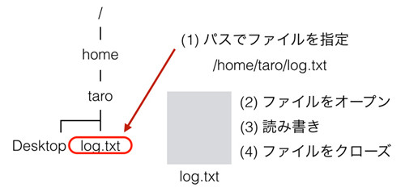
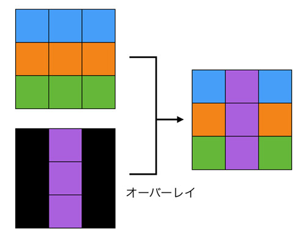

## ファイル処理

ファイル処理

ファイル処理については、プログラミングというよりも「OSのファイル処理の方式」をまず理解しておく必要があります。
そのため、最初にファイル処理の概念について説明します。
これがわかってしまえば、その利用はさほど難しくありません。
なお、プログラムがどのようにファイルを扱うかは、OSの仕組みにもとづいているため、
多くのプログラミング言語でさほど変わりません。

ファイル処理がOSにおいてどう実現されているかを抽象化すると以下の図のようになります。
実際はもっと複雑ですが、通常のプログラミングではそこまで意識する必要はないので詳細は割愛します。


まずご存知のようにOSにはディレクトリがあり、それが階層構造を作っています。
ファイルはそのディレクトリのなかに保存されています。
ディレクトリやファイルは、サイズなどの情報と共にポインタのようなものを持っていて、
それがファイルの実体を指しています。

構造についての話はこれぐらいにして、実際にファイルをどのように処理するか話をしましょう。
OSにおけるファイル処理は主に以下のような流れとなります。



まず絶対パス(ルートやCドライブなどからのパス)や、
相対パス(現在いるディレクトリから指し示すパス)を使ってファイルを指定します。
それに対して読み、書き、読み書きなどのモードを指定してファイルをオープンします。
そして読み書きなどの必要な処理を繰り返し、処理がすべて完了したらファイルをクローズして終わりです。

読み書きなどの具体的な処理はそれほど難しくありません。
一言でいってしまえば、「テキストファイルは行ごとに処理する」
「バイナリファイルは先頭から何バイトめか(位置)を指定して処理する」ことです。
たとえば、テキストファイルで以下のものがあるとします。

```
world
python
java
```

この内容にすべて"hello "を加えて画面に表示するというプログラムを書く場合、
ループ処理を利用して以下のことを繰り返して処理するのが一般的です。

1.	行の内容を取得
2.	hello に行の内容を追加しprint
3.	次の行に進む

「テキストファイルは行ごとに処理する」のが基本であることを覚えておいてください。
バイナリファイルの扱いは後ほど簡単に扱いますが、Python でそれを専用ライブラリなしにやることはかなり稀かと思います。
私が過去にバイナリファイルを操作した際に利用した言語は C もしくは Objective-C でした。

### テキストファイルの読み書き処理
実際に pythonでテキストファイルの処理をどのようにするか紹介します。
先ほどのテキストファイルの処理方法さえ理解してしまえば非常に簡単です。
以下の内容が書かれたファイル text1.txt があるとします。

```
world
python
java
```

このファイルに書かれている各行にhelloを加えて表示するサンプルを書いてみます。

```python
f = open('text1.txt', 'r')
print(type(f))

for line in f:
  print('hello ' + line)
f.close()
```

まずファイル 'txt.txt' をモード 'r(読み)' でオープンしています。
オープンしたファイルオブジェクトに対してfor文を使うと1行1行取得できるので、
行ごとにprintする処理をしています。
これを実行すると以下のような出力となります。

```
<type 'file'>
hello world

hello python

hello java
```

print文の改行に加えてもとのテキストの改行コードも表示されるので業の間にもう1行スペースがあいてしまっていますが、
この回避方法については先に説明した sys.stdout.write() を使うか後述する print 文の出力オプションを使います。

ほかにはファイルを丸ごと読む方法もあります。

```python
f = open('text1.txt', 'r')
text = f.read()
print(text)

lines = text.split('\n')
print(lines)

f.close()
```

ファイルオブジェクトに対してreadメソッドを使うことで、
その中身をすべて文字列として取得します。
それを行ごとに処理したいのであれば、文字列を先に説明した改行コードで分割することで行ごとのリストになるので、
それに対して処理を行うことができます。
この処理方式はファイルを全て読み込むため、
容量の大きなファイルで実行しようとするとリソースを使いすぎてエラーになる可能性があります。
小さいファイルであれば問題無いですが、注意して利用して下さい。

次にファイルへの書き込み方法について説明します。
書き込みも読み込みと大差ありませんが、ファイルをオープンする際に書き込みモードを指定します。
以下のテキストが既に書かれているテキストファイルtext2.txtに 123456 と書き込みをするとします。

```
Hello
```

書き込みのコードは以下となります。

```python
f = open('text.txt', 'w')
f.write('123')
f.write('456')
f.close()
```

コードを見てもらうと想像がつくとは思いますが、openの第二引数が書き込みモードの 'w' となっています。
そしてファイルオブジェクトにたいしてwriteすることで、実際にファイルに書き込み処理がされています。
そして最後にクローズするのは同じです。

書き込みされたファイル text2.txt は以下のようになりました。

```
123456
```

見てもらうとわかるように、もともとのテキストであるHelloが消えています。
ファイルが上書きされていることがわかります。

ただ、場合によっては「追記(もとの中身を残したまま後ろに加える)」しないといけないこともあります。
その場合はファイルをオープンするモードを 'a' の「追記」にすれば実現できます。
モードのみ修正して以下のコードにしてみます。

```python
f = open('text.txt', 'a')
f.write('123')
f.write('456')
f.close()
```

これを実行すると、以下のようになりました。

```
123456123456
```

もとの '123456' は残ったままで、その後ろに '123456' が新しく追加されています。
ファイルのオープンごとに以前の内容が消えないので、アプリケーションのログなどを取る際に便利な手法です。
なお、書き込みを「次の行」にする場合は改行コード”\n”をファイルに書き込めばそこで改行されます。

### バッファリング

ファイルへの読み書きをする際に知っておいてもらいたいのが「バッファリング」という処理です。
ご存知かもしれませんが、ハードディスクへのアクセス速度はメモリへのアクセス速度に比べて何桁も遅いです。
そのため、ファイルを何度も細かく読み書きすることを繰り返しているとプログラムが非常に低速になってしまいます。
この問題を防ぐために、出力があるたびに毎回ディスクに書き込むのではなく、
メモリ上の高速な一時領域にデータをおいておき、まとめてそれを読み書きするという処理が行われます。
こうすることで低速なディスクアクセスの回数が減らせるのでプログラムが高速化されます。
これがバッファリングの基本的な概念です。

以下にこれを図で示します。


このディスクへの書き込みは Python が判断して適切なタイミングで発生するようですが、
書き込みを強制的に行いたい場合はそこでflush()メソッドを使います。

```python
f = open('text3.txt', 'w')
f.write('123')
f.flush()
f.write('456')
f.close()
```

closeのタイミングで必ず書き込まれるので、今回のようにopenからcloseまで時間が短い場合はflushは不要です。
ただ、openしっぱなしで、なかなかcloseしないようなプログラムは適切なタイミングでflush するように心がけてください。
でないと、プログラムが強制終了されてしまった場合などに、ファイルに書き込みがされていない可能性があります。

### バイナリファイルの読み書き処理

テキストファイルの主要な話を終えたため、次はバイナリファイルについて扱います。
バイナリファイルは中身が01から構成されているファイルで、一般的には画像ファイルや音声ファイル、
それに加えてアプリケーション特有のファイル(たとえば word など)があります。
こちらはテキストと違うのでそもそも行という概念がありません。
正直なことをいうと、テキスト処理よりもバイナリファイルの処理は骨が折れます。
ただ、ファイルを読み書きできないかというと、そんなことはありません。
そのバイナリファイルの構造を知ってさえいれば操作は可能です。

著者はビットマップ形式の画像ファイルの合成とWAV形式の音声データの加工の経験があるので、
それをベースにしてバイナリファイルの処理についてお話をします。

ビットマップは以下の図のように、ピクセルから構成されている画像ファイルです。


それぞれのピクセルはRGB(赤緑青)で表現されています。
それぞれの色は1バイト(0～255)の容量があるので、ようするに1ピクセルは3バイトです。
つまりファイルサイズは「縦のピクセル数×横のピクセル数×3」バイトになります。

ここまでわかってしまえば、あとは簡単です。たとえば画像Aに画像Bをオーバーレイ(一部上書き)するとします。
この際、Bの画像の黒(RGBが0, 0, 0)は透過させます。すると、以下の図のようにして合成が可能です。



Bの左上は黒なのでAのものを合成画像に利用。その右隣は黒ではないのでBのものを利用。
その右隣はA……といった感じでどんどん処理をしていくと、最終的に右の図のようになります。
これをファイルに書き込めば、自分でバイナリファイルを作ったことになります。

次にWAV音声ファイルです。これも比較的わかりやすい形式ですが、
先ほどのビットファイルと違って「ヘッダ」と「データ」に分かれています。
データは先程のビットマップと同じく音声のデータ(波形)を含んでいるだけなので簡単ですが、
ヘッダにはデータをどのように表現するかといった情報が含まれています。


後ろのデータを変えれば当然再生される音も変わりますが、その際に必要に応じてヘッダを変更する必要があります。

最後にバイナリデータの処理のコツを伝えます。
それは「プログラムで処理しやすい生(raw)の形式に一旦戻す」ということです。
たとえばビットマップであれば編集は簡単ですが、JPEGやPNGを編集するのは非常に難しいです。
なぜなら RAW 形式に比べて JPEG や PNG形式が画像をどのように表現するかがはるかに複雑だからです。
JPEG を直接操作するのであれば、JPEG に関する深い知識が必要になります。
その分野を専門としているプログラマ以外には実装することはできないでしょう。

まずJPEG → ビットマップに変換してやり、ビットマップで編集を行う。
そしてビットマップ → JPEGに再度変換することで JPEG ファイルを変換できます。
音声も同じでmp3を直接編集するのではなく、mp3 → wav → 編集 → new wav →new mp3とすればよいです。
これらの変換には組み込みもしくは外部のライブラリを利用することになると思います。


### with/as によるファイル処理

withとasは「コンテキスト」を扱うための特別な構文です。
ほかの言語ではあまり見られない少々独特な概念なのですが、知っておいて損はないと思うので取り扱いたいと思います。
コンテキストの詳細については下編で扱います。

コンテキストという言葉は少しボヤッとしているのすが、
「ある特定の処理」を実行するための状態(モード)だと言えるかもしれません。
たとえばファイル処理なのですが、基本的には以下の流れとなります。

1.	ファイルをオープンする
2.	読み書き
3.	ファイルをクローズ

これは「ファイル処理のための状態(モード)に入っている」という状況です。
当然ながら自分で書くプログラムなので、ファイルを意図的にオープンしっぱなしにして何もしないことも可能ですが。
ただ、ほとんどの場合は単にファイルをクローズし忘れているだけです。

with と as は Python の文法として「ある一連の処理」を完遂することを目的に使うものです。
具体的には以下のように使います。

```python
with A as B
  処理
```

Aはコンテキストをサポートする特別なオブジェクトであり、Bはそれが代入されているのですが、ここでは深いことは気にせずファイル処理を with とas で行ってみます。
以下のコードを見てください。

```python
with open('text1.txt', 'r') as f:
  for line in f:
    print(line)
```

このプログラムは text1.txtを読み取り専用モードで開き、その中身を一行ずつプリントするというプログラムです。
注目して欲しいのは今までのように open 関数で作ったファイルオブジェクトを代入するのではなく、
with と as でコンテキストとして扱っていることです。
ここではopen('hello.txt', 'r')がコンテキストをサポートするファイルオブジェクトを返し、
それがfに格納されています。
そしてこのfを使ってファイル処理をしています。

一般的なopen関数と代入によるファイルオブジェクトの取得ではなく、
with/asを使うとファイルオブジェクトがクローズされることが保証されます。
