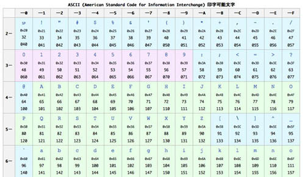
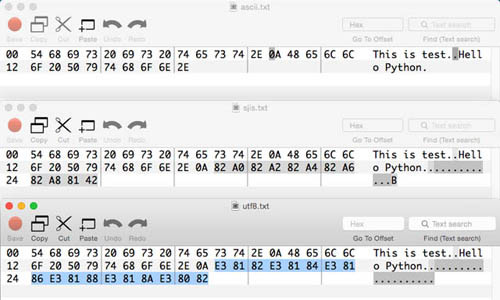

## 基数と文字コードの仕組み

日本でプログラミングをする以上、プログラミングにおける「日本語の処理」は必須の知識です。
ただ、日本語について扱うには「文字コード」と文字データがどのように表現されているかを知るための「基数の知識」が必要です。
そのため、順を追って基数と文字コード、そして次の章にて日本語の処理を扱うという手順で説明します。

### 基数
私たちが普段使う10進数を思い出してください。0、1、2…… と数が大きくなっていき、8、9となると次は桁があがって10になります。
このとき、ひとつの桁で表現できる数は0～9の10個であり、この1桁で表現できる数を「基数」と呼びます。
そしてその基数Nで表現される数え方を「N進数」と呼びます。
たとえば、0～9の10個であれば10進数、0～7の8個であれば8進数になります。

では、0～1で表現されるのは、基数が何で何進数と呼ばれているでしょうか。
基数が2なので、2進数です。コンピュータが理解可能なのは01だけという話を何度もしていますが、
要するにコンピュータは2進数を使うということです。

ただ、人間は01だけで構成された数字を見せられても、あまりピンときません。
たとえば、適当に打った01000100010011110010という2進数の大きさがどれほどなのか、一瞬では把握できません。
これを10進数に直すと279794になり、およそ28万であるということがわかります。

2進数を人が読みやすい10進数に変換するのは結構骨が折れます。
たとえば、01001101という2進数を10進数に変換するには、
2進数の各桁の値(0 or 1)に2 の“桁－1”乗をかけた値を足しあわせていくという処理を行います。
試しに低い桁から順に足しあわせて計算してみます。

```
(1 x 2^0) + (0 x 2^1) + (1 x 2^3) + (1 x 2^4) + (0 x 2^5) + (0 x 2^6) + (1 x 2^7) + (0 x 2^8)
 = 1 + 0 + 4 + 8 + 0 + 0 + 64 + 0
 = 77

# 補足
# N^MはNのM乗という意味。べき乗をテキストで表現できるので便利な書き方
# Python的に書くとN ** M
# 2^0 は1, 2^1は2, 2^2は4,……, 2^8は128
```

2進数 01001101 から 10進数の 77 を求められています。
疑い深い人は2進数から10進数に変換できるアプリケーションの電卓などもあるでしょうから、確認してみてもいいかもしれません。
0進数から2進数への変換はこの逆で、割り算を繰り返すようなことをします。

以上のように「2進数は桁が大きくなりわかりづらい」ものの「10進数は2進数と相性が悪い(変換しにくい)」という問題があるので、
コンピュータでは2進数と相性がよい16進数がよく使われます。
16進数は0～9までの数字だと16パターンを表現できないので、
アルファベットを使って、0から15までを1桁で表現します。
具体的には以下のようになります。

```
16進数 : 10進数
0  :  0
1  :  1
2  :  2
…
8  :  8
9  :  9
A  : 10
B  : 11
C  : 12
D  : 13
E  : 14
F  : 15
10 : 16   # 桁が増える
11 : 17
…
```

この16進数は2進数と非常に相性がよく、2進数の4桁をちょうど16進数だと1桁で表現できます。
0000～1111は10進数でいうと0～15なので、ちょうど16進数の0～Fにピッタリあてはまるのです。
1バイト(0から255)は8ビット、つまり2進数が8桁なので、ちょうど16進数2桁で表現できます。

基数変換に便利なPythonの関数を紹介します。10進数から2進数、8進数、16進数への変換は専用の関数を使います。

```python
print(bin(100))  # 2進数
# 0b1100100

print(oct(100))  # 8進数
# 0144

print(hex(100))  # 16進数
# 0x64
```

先頭に何かついていますが、0bは2進数、0xは16進数という表明に使います。
8進数は0だけを先頭につけるというルールもありますが、桁埋めの0と混同しないように注意してください。

次に、N進数から10進数への変換です。実はこれはすでに使ったことがある関数 int を使います。

```python
print(int('100'))
# 100

print(int('1100100', 2))  # 2進数
# 100

print(int('0144', 8))  # 8進数
# 100

print(int('64', 16))   # 16進数
# 100

print(int('6B', 16))   # A,B,C……も使える
# 107

print(int('212', 3))      # あまり使わないN進数も一応使える
# 23
```

intの第一引数に数字のもとになる文字列を入れ、第二引数に基数を指定します。
第二引数を省略すると10進数として扱われます。基数とN進数に関しては以上です。

### 文字コード

コンピュータは、突き詰めると01しか理解できないので、文字も最終的には01に対応付けられます。
その「文字と01の対応関係」を決めるのが文字コードと呼ばれているものです。
アルファベットと数字のみを利用する場合は「ASCIIコード」と呼ばれる文字コードが使われることが多いです。
たとえばASCIIコードだと「01100001」は「a」に対応し、その次の「01100010」は「b」に対応しています。
ただ、先にお伝えしたように2進数だと桁が長いので、一般的には16進数2桁で文字コードを表現します。
aとbはそれぞれ以下のようになります。

```
>>> hex(int('01100001', 2))  # a
'0x61'
>>> hex(int('01100010', 2))  # b
'0x62'
```

以下にASCIIコードの一部を記載します。



見てもらうとわかりますが、文字1文字が1バイトに対応しています。
1バイトは8ビットなので2の8乗パターンの組み合わせ、つまり0～255の256パターンが存在します。
アルファベットや数字、改行などのいくつかの特殊記号だけであれば256パターンもあれば表現できます。

ただ、よく考えてみてください。日本語はどう考えても1バイト＝256個じゃ足りません。
そこで日本語を扱うときは複数バイトを使います。
2バイトにするだけでも65536(256^2) パターン、3バイトにすれば16777216(256^3)パターンの組み合わせが表現できます。

この複数バイトの01と文字のマッピングをする文字コードにはいくつかの種類があります。
日本で有名なのは、Shift-JISやUTF-8、EUC-JPあたりでしょうか。
文字コードが違えば、01に変換したデータも変わってきます。

以下のテキストがあるとします。

```
This is test.
Hello Python.
あいうえお。
```

文字コードとバイト配列を比較するためにこれをASCII、Shift-JIS(SJIS)、UTF-8でファイルに書き込み、
それをバイナリエディタを使って01(実際は16進数)で見てみます。
なお、日本語あいうえおはASCIIにはそもそも対応してないので、ASCII の例はアルファベットのみから構成されています。
上からASCII、SJIS、UTF-8という順です。



英語の部分は変わっていませんが、強調している日本語の部分は文字コードごとに違っているのがわかります。

ここからわかることは「どの文字コードで書かれているか」ということがわからないと、
エディタやPythonは適切に文字を扱うことができないということです。
たとえば、SJISのファイルをUTF-8として読み込もうとすればコードを解釈できずに文字化けが発生したりエラーとなったりします。
当然、ひとつのファイルのなかでさまざまな文字コードを織り交ぜるということはできません。
ファイルのなかで利用する文字コードは必ず統一して下さい。
文字コードがどのようなものか、正しく文字コードを認識できることがいかに大切かということを理解してもらえたら幸いです。
なお、自分で文字コードの変更を試されたい場合は文字コードを変更できるエディタやnkfコマンドなどを利用すればよいと思います。

余談ですが、もしどの文字コードを使ってもよいのであれば、UTF-8が今だと一般的かもしれません。
10年前だとShift-JISだとかEUC-JPあたりも見たのですが、今のプログラマはあまり好んで使わない傾向があります。
私は制約がない限り、すべてUTF-8でコードもドキュメントも統一するようにしています。
実際、次の章でも説明しますが python3 はUTF-8 をデフォルトの文字コードにしています。
可能であれば UTF-8 でコードを書くようにして下さい。

### バイト配列

文字コードだけでなく様々なデータは全て「0,1 の羅列」で表現されています。
この0,1 の羅列のことをバイト列といい、Python はそれを bytes という型で扱います。
バイト列は文字列やリストと似たようなシーケンスとして処理ができますが、
C 言語などと違ってPython でバイト配列を直接扱う機会は多くないと思います。
ただ、プログラミングの基礎概念として知っておくべき内容であるため、簡単に説明します。
バイト列の宣言は文字列とほぼ同じように行いますが、シングルクオテーション等の前に b と宣言します。
例えば以下のようになります。

```python
b = b'hello world'
print(type(b))
# <class 'bytes'>
```

上記例では ‘hello world’ を文字列としてではなく、バイト列として扱います。
そのため、変数 b は文字列型ではなくバイト型のオブジェクトを持っています。
バイト型のオブジェクトも当然ながらメソッドを持っており、hex を使うとバイト列を 16 進数の文字列で返します。

```python
print(b.hex())
# 68656c6c6f20776f726c64
```

68 -> h, 65 -> e, 6c -> l, 6c -> l というように Ascii 表に沿って、
上記の16進数をアルファベットに変換していくと hello world になります。
16進数の文字列をbyte 型に変換するには bytes クラスの fromhex メソッドを使います。

```python
print(bytes.fromhex('68656c6c6f20776f726c64'))
# b'hello world'

文字列とバイト列の変換は encode と decode メソッドを使います。

print('hello world'.encode())
# b'hello world'

print(b'hello world'.decode())
# hello world
```

文字列に対してメソッド encode() を呼び出すとバイト列を返し、
バイト列に対して decode メソッドを呼び出すと文字列を返します。
