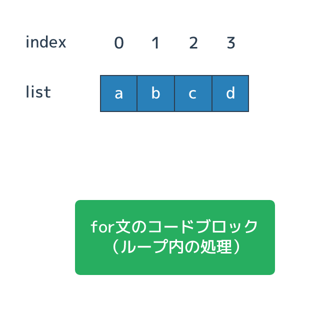
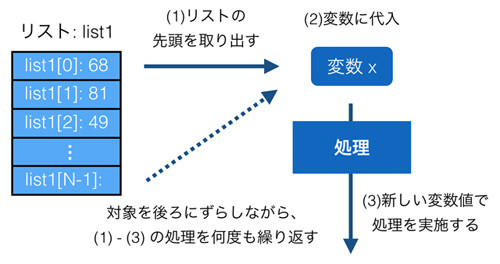
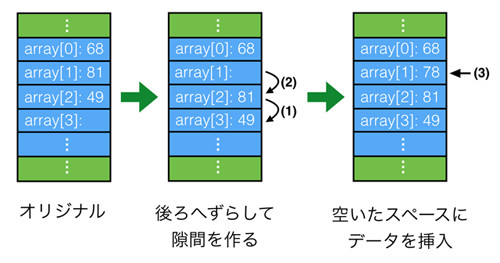

# リスト

{{ TOC }}

## 概要

あいうえお

### リスト長

また、先ほど紹介したリスト長の取得関数 len() もよく使います。

```
>>> b = [1,2,3]
>>> b[3]
Traceback (most recent call last):
  File "<stdin>", line 1, in <module>
IndexError: list index out of range
>>> len(b)
3
```

上記コードを見てもらうと分かりますが、リスト範囲外へのアクセスはエラーになっています。
リスト長を超えたアクセスをしないためにもlen()でリスト長を得て、
要素へのアクセスは「リスト長 - 1」番目までとする必要があります。

### in 演算子

他にはリストに要素が含まれるかの確認もよく利用します。

```
>>> a = [5,7,3,9]
>>> 3 in a
True
>>> 8 in a
False
>>> 8 not in a
True
```

in という予約後を使って「要素 in リスト」とすることで、
リストに要素が含まれていれば True、含まれていなければ False が返ってきます。

ちなみに Python のリストは「整数型だけ」「文字列型だけ」というように決まった型のデータだけでなく、
なんでも格納することができます。
ただ、管理しにくいのでこのような使い方はあまりしません。

```
>>> a = [1,'hello',False]
>>> a
[1, 'hello', False]
```

### リストの中のリスト

また、リストのなかにリストをいれて行列を作ることもよくあります。

```
>>> a = [[1,2,3], [4,5,6], [7,8,9]]
>>> a[1]
[4, 5, 6]
>>> a[1][1]
5
```

a[1][1] は a というリストから1番目の要素のリストをとりだし、
その取り出したリストから1番目の要素を取り出すということです。
上記でいうと、まず [4,5,6] が取り出され、次に 5 といった具合です。
行列を図で示すと以下のようになります。


リストに使える関数も色々ありますが、
現時点で知っておいて欲しいのは先ほど紹介したリスト長を得る len() と、
連番のリストをつくる range() です。これらは今後のサンプルコードでも利用されます。

```
>>> len([1,2,3])
3
>>> len([3,5,7,9,11])
5

# python2 より
>>> range(5)  # 0 から 5 - 1 まで
[0, 1, 2, 3, 4]
>>> range(5,10)  # 5 から 10 - 1 まで
[5, 6, 7, 8, 9]
```

なお、python3 では range() 関数は range 型という型を返すようになっていますが、
上記の python2 のサンプルとほぼおなじ感覚で利用することができます。
リストは奥が深いので、もう少しプログラミングの基礎を学習したあとで一章を割いて詳細を扱います。


# リスト再入門

{{ TOC }}

## 概要

あとで書く

## リストのメソッド

文字列と同じく、リストもオブジェクトです。
そのため、まずは以前扱わなかったメソッドを使う処理を紹介します。

### 要素の追加 : append, insert

リストにデータを追加する方法です。
追加するといっても「リスト末尾への追加」と「リストの途中への追加」でやりかたが異なります。
末尾(一番最後)への追加は append メソッドを使い、間に追加するには insert を使います。

```python
a = [1,2,3]
a.append(4)   # 末尾への追加
print(a)
# [1, 2, 3, 4]

a.insert(1,10)   # 1番目の要素に10を追加
print(a)
# [1, 10, 2, 3, 4]
```

### 要素の削除 : del演算子、removeメソッド

追加とくれば削除です。
削除にはremoveメソッドを使います。

```python
a = ['a', 'b', 'c', 'd']
a.remove('b')
print(a)
# ['a', 'c', 'd']

a.remove(1)
# Traceback (most recent call last):
#   ...
# ValueError: list.remove(x): x not in list
```

remove メソッドはリストの中にある要素自体を指定してそれを消します。
存在しない要素を指定するとエラーになりますので、
含まれるかどうか分からない場合は in 演算子で存在を確認したあとで remove して下さい。
del 演算子を使った要素の削除もできますが、
こちらは remove メソッドとは異なり消す要素を「インデックス」で指定します。
何番目の要素を消すか番号で指定するということです。
これはスライスやリスト末尾からの指定などもできます。

```python
a = [1,2,3,4,5]
del a[2]
print(a)
# [1, 2, 4, 5]

a = [1,2,3,4,5]
del a[1:3]
print(a)
# [1, 4, 5]

a = [1,2,3,4,5]
del a[-1]
print(a)
# [1, 2, 3, 4]
```

### 要素の取り出し : pop

次に pop メソッドです。
これは del 演算子に似ているのですが、消すだけではなく同時に値を取り出します。
引数にインデックス番号(先頭が0)を渡せばそれに対応する要素を取得してリストから消します。
引数を与えない場合はリスト末尾の要素を取り出します。

```python
a = [1,2,3,4,5]
b = a.pop(3)
print(a)
# [1, 2, 3, 5]
print(b)
# 4

c = a.pop()
print(a)
# [1, 2, 3]
print(c)
# 5
```

### キュー(Queue)とスタック(Stack)

様々なプログラミング言語でリストを使ってキューやスタックと呼ばれるデータ構造を実現することがよくあります。
キュー及びスタックは複数のデータを管理するためのデータ構造です。
キューは別名FIFO (First In First Out) とも呼ばれており、
最初にいれたデータを最初に取り出すというデータ構造です。
一方、スタックは LIFO(Last In First Out) と呼ばれており、
その名前が示すように最後にいれたデータを最初に取り出すというデータ構造です。
以下に両者がどのようなものか示す図を記載します。



キュー及びスタックに1,2,3 というデータが入っているとします。
キューにデータ4をいれると1,2,3,4 というデータを持ちます。
そこからデータをとりだすと先頭(最初にいれたデータ)にある 1 を取り出し、2,3,4 となります。
一方、スタックは最後にいれたデータを最初に取り出します。
そのため、4をいれられて 1,2,3,4 となっているデータから取り出されるのは4となります。
リストへの追加には既に利用した append メソッドを利用し、データの取り出しには pop メソッドを使います。

以下に list を使ったキューの実現方法を記載します。

```python
queue = [1,2,3]
queue.append(4)
print(queue)
# [1, 2, 3, 4]
a = queue.pop(0)
print(a)
# 1
print(queue)
# [2, 3, 4]
```

append でリストの最後にデータを追加し、pop(0) でリストの最初のデータを取り出しています。
そして次にスタックです。

```python
stack = [1,2,3]
stack.append(4)
print(stack)
# [1, 2, 3, 4]
a = stack.pop()
print(a)
# 4
print(stack)
#[1, 2, 3]
```

スタックからデータを取り出すということはつまり、リストの最後の要素を取り出すということです。
そのため、引数なしの pop メソッドでリストの最後の要素を取得します。

### リストの結合 : +演算子, extendメソッド

次はリストとリストの結合です。これにはプラス演算子を使う方法と extend メソッドがあります。
append を使うと、append されたリスト自体がメソッドを呼び出したリストの最後の要素になるので結合はされません。

```python
a = [1,2,3,4]
b = [5,6,7,8]
print(a + b)
# [1, 2, 3, 4, 5, 6, 7, 8]

a.extend(b)
print(a)
# [1, 2, 3, 4, 5, 6, 7, 8]
```

プラス演算子とextend メソッドは一見すると同じに見えますが、
もとのデータがどうなるかという点でかなり違います。
まずプラス演算子ですが、結合されているリストa,bはそのまま残り、
両者が結合された新しいリストが作られています。
一方、extend メソッドを使うと呼び出し元のリスト a の後ろに指定されたリストb が結合されます。
リストb 自体は変更が加わりませんが、リスト a はもとのデータではなくなっています。

### リストの反転: reverse

あとで整理

### リストのソート: sort

他にはリストの順序を反転するreverse メソッドや、
中身の順序をソートする sort メソッドあたりも利用されます。

```python
a = [1,2,3,4,5]
a.reverse()
print(a)
# [5, 4, 3, 2, 1]

b = [1,3,5,2,4]
b.sort()
print(b)
# [1, 2, 3, 4, 5]
```

### リストの初期化

あとで整理

### リストのコピー

リストのコピーや初期化は以下のように行います。

```python
a = [1,2,3,4,5]
b = a.copy()
a.append(6)
print(a)
# [1, 2, 3, 4, 5, 6]
print(b)
# [1, 2, 3, 4, 5]

a.clear()
print(a)
# []
```

先にお伝えしたようにリストを格納する変数を別の変数に代入したとしても、
それはコピーではなく同じオブジェクトを共有するだけです。
つまり片方の変数の値を操作すると、もう片側の変数の値も変わっているということです。
上記のようにコピーを行った場合は別々のオブジェクトとなるため片側の操作がもう片側に影響をあたえることはありません。

## リストの仕組みと配列との違い

ここではCやJavaの「配列」とPythonのリストの比較を通して、Python のリストがどのようなものか説明します。
Python では配列相当のものがないので必ずしも学ぶ必要はないかと思いますが、
この違いはプログラミング一般において重要なため、C や Java を学ばれたことがないかたも一読していただくといいと思います。

生徒の点数を扱うことを題材にして配列とリストを比較してみます。
まず簡単に両者のイメージ図を以下に記載します。



左側のCやJavaの配列は「メモリ」上に連番でデータを格納するスペースを用意するのに対して、
右側の「リスト」はバラバラの複数のデータ間を順序を持って結びつけることで実現されています。

Pythonのリストは、CやJavaのVectorやListに相当する型です。
Pythonのリストはまるで配列のように利用されますが、CやJava の配列とは大きく異なります。
たとえば純粋な配列では、「要素(配列やリストの中にあるデータ)」の間に新しいデータを挟み込むことはできません。
そのため、配列に入っている要素を詰め替えるなどしてデータを追加します。



一方、リストはN-1番目の要素とN番目の要素の間に新しいデータを挟み込むことができます。
配列ではメモリ上に要素を連番で格納するためのスペースを用意するのに対し、
リストは以下の図のようにバラバラに用意された要素間を順に結びつけることで実現されているためです。


Javaの配列のコードを確認してみます。

```java
int a[] = {0, 1, 2};
System.out.println(a[1]);      // 2番目の要素の値を取得 -> 1
System.out.println(a.length);  // a の配列長を取得 -> 3
a[1] = 10;
a[3] = 3;  // Error
```

1行目では要素数3のint型の配列の変数を宣言し、それに代入しています。
先の章でお伝えしたように、Javaの変数には型があるのでした。
a[x]とすると配列aのx番目の要素にアクセスできます。
そして、a.lengthとすることで配列長が取得できます。

4行目では配列の2番目の要素に値を代入しています。
ただ、5行目では配列長3の4番目の要素に値を代入しようとしているのでエラーとなってしまいます。

次にPythonのリストを使ってみます。Pythonの変数には型がないので、
特に型を指定していない変数aに[0, 1, 2]という3要素のリストをそのまま代入しています。
2行目ではリストの中身を確認しています。そして3行目では配列長を取得しています。

```python
a = [0, 1, 2]
print(a[1])
# 2番目の要素の値を取得 -> 1
print(len(a))   
# a の配列長を取得 -> 3

a[1] = 10;
a.append(3)
print(len(3))   
# 4
```

異なるのは5行目です。
配列は配列長を超えて要素を代入することができませんが、リストはリスト長を伸ばすことができます。
Pythonではリストをまるで配列のように使いますが、両者はあくまでも別物という認識を持っておく必要があります。
