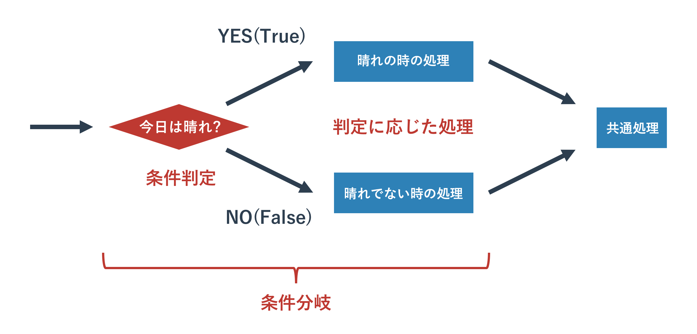

# 文字列型

{{ TOC }}

## 概要

テキスト処理は要するに、文字列型の処理です。
前の章で扱ったように文字列型もオブジェクトであるため、様々なメソッドが利用できます。
テキストファイルの処理では文字列型の基本知識が必要なので、
以前学んだことを少し発展させて復習します。


## 文字列の基本操作

### 文字列の宣言

文字列はシングルクオートで囲むことで宣言できます。

```text
>>> a = 'hello world'
>>> print(a)
hello world
>>> print(type(a))
<class 'str'>
```

シングルクオートの代わりにダブルクオートを使うこともできますが、
Pythonではシングルクオートの利用が標準的です。

```text
>>> a = "hello world"
>>> print(a)
hello world
>>> print(type(a))
<class 'str'>
```

両者に違いはありませんので、特に理由がないかぎりはシングルクオートを利用します。

シングルクオートとダブルクオートを使い分ける場面は、
文字列内にシングルクオートかダブルクオートが文字として出現する場合です。
シングルクオートの文字列宣言のなかではダブルクオートを利用することができ、
その逆にダブルクオートの文字列宣言のなかでシングルクオートを使うことができます。

たとえば「I'm Taro」というテキストを文字列にする場合、
シングルクオートで文字列を宣言するのであれば内部のシングルクオートをエスケープ処理する必要があります。

```text
>>> a = 'I\'m Taro'
>>> print(a)
I'm Taro
```

一方、ダブルクオートで囲むのであればエスケープは不要です。

```text
>>> a = "I'm Taro"
>>> print(a)
I'm Taro
```


### 複数行にまたがる文字列の宣言

複数行にまたがる文字列の宣言にはトリプルクオテーションを使います。
トリプルクオテーションはシングルクオテーションを3つか、ダブルクオテーション3つを続けることで宣言でき、
文字列の前後のトリプルクオテーションの記号は統一する必要があります。

```python
text = """line1
line2"""
print(text)
```

トリプルクオテーションの中ではトリプルクオテーションと同じ記号が3つ続かない限りは使えます。
そのため、文字列の中でシングルクオテーションやダブルクオテーションを複雑に使いたい場合は1行であってもトリプルクオテーションを使ってもよいかもしれません。

```python
text = '''I'm Taro. "Hello World"'''
print(text)
```

なお、Pythonでは複数行にまたがるコメント記法が正式には存在していません。
そのため、プログラムをトリプルクオテーションで文字列化してしまうことで実行しても影響をなくすようにします。
実質的にトリプルクオテーションが複数行のコメントに使われています。


### +演算子

+演算子を使うことで2つの文字列を結合できます。
もとの2つの文字列には変化はありません。

```text
>>> a = 'hello'
>>> b = ' world'
>>> print(a + b)
hello world
>>> print(a)
hello
>>> print(b)
 world
```

複合代入演算子を使うことで既存の文字列の後ろに新しい文字列を加えることもよくあります。

```text
>>> a = 'hello'
>>> a += ' world'
>>> print(a)
hello world
```

これは「a = a + ' world'」として処理されていますので、変数aのなかにある文字列自体が置き換えられています。
「最初に変数aに入っていた文字列のインスタンス」と、
実行後に変数aに代入されている「複合代入演算子で文字列が付け加えられた文字列のインスタンス」はメモリ上では別物になっています。
これは他の型の複合代入演算子の動きでも同じです。

### 文字列長の取得

文字列型はリストと同じシーケンス型に分類されます。
そのため、len関数で長さ(文字列長)を得ることができます。

```text
>>> length = len('hello world')
>>> print(length)
11
```

### in 演算子

検索には「存在の確認」と「位置の確認」の2つの使い方があり、それぞれ次のようになります。

```python
text = 'hello world python'
print('wor' in text)
# True

print('w0r' in text)
# False
```

inについてはlistでの使い方と同じで、「A in B」の場合は「AがBに含まれていれば Trueを返す」という動きをします。
’hello world python’ というテキストに ‘wor’ は含まれているので True となっています。

### 文字列の部分取得

文字列中の「文字」の取得は以下のように [X] で位置を指定して行います。

```python
text = 'hello world python'
print(text[4])
# o

print(text[-4])
# t

print(text[100])
# Traceback (most recent call last):
#  ...
# IndexError: string index out of range
```

この位置の指定はリストの要素の数え方と同じで0から始まります。
先頭から0、1、2……と数えていくと4はoに対応しています。
面白いのがこの値をマイナスにできるところです。
このように指定すると後ろ側から取得してきます。
この際、0からではなく-1、-2、-3……とカウントすることに注意してください。
文字列の範囲を超えてアクセスしようとするとエラーになります。

文字列から「文字列」を取得するには、以下のように行います。

```python
text = 'hello world python'
print(text[6:11])
# world

print(text[-12:-7])
# world
```

これは「スライシング」と呼ばれるテクニックで、
[X:Y]とあるとXからYまで取得という意味になります。
[X:Y] と指定する際はX < Yとなるようにしてください。
先ほどと同じように、範囲指定にもマイナス値を利用できます。

前と後ろを指定するのではなく、Xより前、Xより後という指定の仕方も可能です。

```python
print(text[6:])
# world python

print(text[:11])
# hello world

print(text[:])
# hello world python
```

見ていただくとわかるように [X:Y] の片方を省略しています。
そうすると先頭から、もしくは末尾までという意味になります。
あまり使いどころはありませんが、両方とも省略すると、文字列のすべてが取得されます。
このスライシングはリストから複数の要素を取り出す際にも使えます。


## 文字列型のメソッド

### 文字列のデータは決して変わらない

先にお伝えしたように文字列型もオブジェクトであるためメソッドが利用できます。
ただ、文字列型に対してメソッドを呼び出した場合は
「呼び出し元の文字列オブジェクトは変更されない」という規則があります。
例えば次にお話する文字列の置き換えも、置き換えメソッドを呼び出した文字列は変更されず、
メソッドの返り値として変更された文字列オブジェクトがかえってくるという動きをします。
これは全ての文字列型のメソッドに共通した特徴なので必ず覚えておいて下さい。

### 文字列の部分置き換えと削除 : replace メソッド

文字列型のメソッドを使ってテキストの置き換え処理をしてみます。
テキストエディタなどである特定のキーワードを別のキーワードに置き換えることがあるかと思いますが、それと同じ要領です。
サンプルコードを以下に記載します。

```python
text = 'hello world python'
text1 = text.replace('o', '0')
print(text)
# hello world python

print(text1)
# hell0 w0rld pyth0n

print(text.replace('world', 'WORLD'))
# hello WORLD python
```

文字列.replace(置き換える文字列, 置き換えられる文字列)とすると、変換された文字列が返されます。
例にもあるように、元の文字列自体は変化していません。
1文字だけを変更することもできますし、文字列を変更することもできます。
不要かもしれませんが、上記のコードのオブジェクトとメソッドの関係を図に示します。



‘hello world python’ という文字列型のオブジェクトを変数 text に格納し、
そのオブジェクトに対してメソッド replace を呼び出しています。
そのメソッドは変換した文字列を返り値として返しますが、
元のデータ(オブジェクトが持つ’hello world python’ というテキストデータ自体)は変更を加えません。

文字列中の特定の文字列を消したい場合は、replaceメソッドの置き換え対象の文字列を空文字(`''`)にします。
そうすることで、置き換え対象の文字列が空文字になるため、実質的に削除されます。

```python
text = 'hello world python'
text1 = text.replace('o', '')
print(text1)
# hell wrld pythn
```

### 文字列の検索 : startswith, endswith, find

文字列の検索もそれほど難しくはありません。

find メソッドについては最も左側にあるマッチした位置を返します。
そのため、'o'は何個もありますが、一番左の位置となっています。
マッチしない場合は-1が返ってきます。

```python
print(text.find('wor'))
# 6

print(text.find('w0r'))
# -1

print(text.find('o'))
# 4
```

find メソッドに似たメソッドで startswith と endswith があります。
名前から分かるかもしれませんが、前者は「この文字列から始まっていればTrue」、
後者は「この文字列で終わっていればTrue」という動きをします。

```python
text = 'hello world python'
print(text.startswith('hell'))
# True

print(text.startswith('hell0'))
# False

print(text.endswith('hon'))
# True

print(text.endswith('h0n'))
# False
```

それほど使う場面は多くないのですが、
find メソッドのオプションである第二引数を指定することで前側を指定した数だけ飛ばして途中から検索することもできます。
右側から探索をする rfind というメソッドも利用できます。

```python
text = 'hello world python'
print(text.find('o', 10))
# 16

print(text.rfind('o'))
# 16
```

### 文字列の前後の削除 : strip, rstrip, lstrip

次に文字列の前後からの特定の文字の削除メソッド stripです。
よく利用するのは、前後の空白や改行コード、タブなどを取り除く場合などでしょう。

```python
text = ' hello world \n'
print(text.strip())
# 'hello world'

print(text.strip(' hell'))
# 'o world \n'
```

strip関数に引数を指定しないと文字列の前後の空白文字(空白とタブ、改行)が取り除かれます。
引数に文字列を指定すると、その文字列が取り除かれます。
この strip() 関数はファイル読み込み処理とともに「改行コードを取り除く」ことによく使われることがありますので、
覚えておいて頂いたほうがいいかもしれません。
左側の文字だけを取り除く場合は lstrip、右側だけの場合は rstrip メソッドを使います。

```python
text = ' hello world \n'
print(text.strip())
# 'hello world'

print(text.lstrip())
# 'hello world \n'

print(text.rstrip())
# ' hello world'
```

また、文字列を split メソッドで特定の区切り文字で分割して文字列のリストにすることもできます。
改行コードで分割する場合は split(‘\n’) とすることもできますし、
splitlines() という専用のメソッドもあります。

```python
text = '1, taro, 35, male'
print(text.split(','))
# ['1', ' taro', ' 35', ' male']

text = 'hello\nworld\npython'
print(text.splitlines())
# ['hello', 'world', 'python']

print(text.split('\n'))
# ['hello', 'world', 'python']
```

上記サンプルにあるようなコンマ「,」記号での文字列の分割は CSV(Excel出力)やログの解析あたりでよく使うテクニックです。
たとえば以下ではトリプルくおテーションで作ったCSV形式のテキストを、
まず改行コードで分割して1行ずつににして、各行においてコンマでテキストを区切っています。

```python
text = '''1, taro, 35, male
2, jiro, 29, male
3, hanako, 23, female'''

for line in text.split('\n'):
  elems = line.split(',')
  print(elems[1].strip() + ':' + elems[2].strip())

# taro:35
# jiro:29
# hanako:23
```

この例のように CSV の要素に空白が含まれているのであれば、
先ほどの strip 関数と組み合わせて前後の空白を取り除いて整形してあげてもいいかもしれません。


## 文字列のエスケープ

最後に文字列で使われる特殊記号についてお話します。
特殊記号はプログラム中で意味を持ってしまう特別な記号のことです。
たとえば「'」という記号は文字列を作成する際に利用する特別な記号です。
そのほかにはビープ音なども記号に分類されます。
これらは文法的な理由やそもそもそれを表現する記号がキーボードのキーにないことから、
「これは XX ですよ」という特別なルールにもとづいて文字列に表記します。
そのルールに利用されるのがエスケープ記号と呼ばれるもので半角のバックスラッシュ「\」(英語キーボード)か、
半角の円記号「¥」(日本語キーボード)を利用します。
このエスケープ記号の後に特別な文字を続けることで、それが特別な意味を持つのです。

たとえば「'」とビープ音は以下のように記載できます。

```python
print('escape sample1 \'.')
print('escape sample2 \a.')
```

ほかには改行とエスケープ記号自身あたりをよく使います。

```python
print('escape sample1 \n.')
print('escape sample1 \\.')
```

エスケープ記号一覧は調べてもらえればすぐに出てきますので、興味がある人は検索してみてください。
