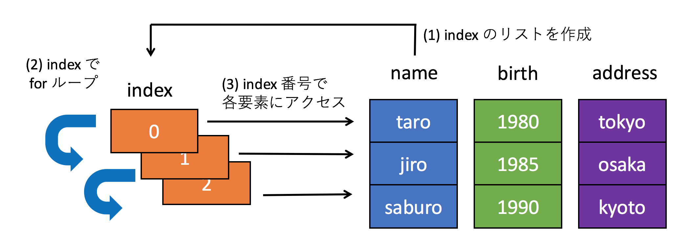
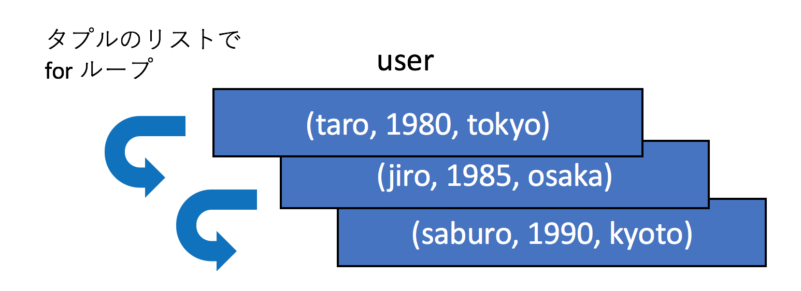
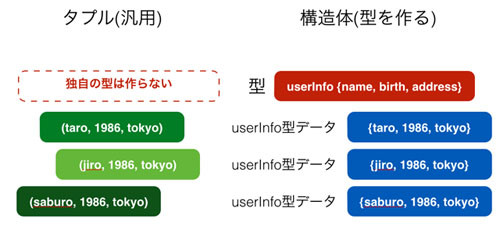
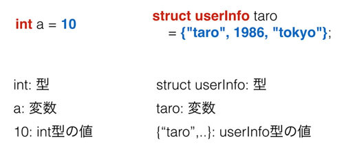

## データ構造

{{ TOC }}

### 概要

このページは必読ではありません。
オブジェクト指向のベースになった「データ構造」を、タプルでどのように作るか、
それを作ることによってどのようなメリットがあるかについて扱います。

プログラムには様々なデータを持たせて、それを処理することで、自分が実現したい結果を得ます。
たとえば「各生徒の点数」というデータと「生徒の点数を全て足しあわせ、人数で割る」という処理で、
「生徒の平均点」という実現したい結果を得るなどです。

上記のような簡単な例であればデータ構造について考慮することは多くありませんが、
より複雑なプログラムを作るのであれば「データをどのようにプログラムに持たせるか」が非常に重要です。
上手にデータを表現できれば、それを処理するプログラムは理解しやすいものになりますが、
あまりよくない設計でデータ構造を作ってしまえば、処理するプログラムも複雑になります。

Pythonでデータ構造を作るための型は様々あり、代表的なものは以下のものです。
クラス以外については既に解説済みです。

* リスト
* セット
* 辞書型
* タプル
* クラス

このページでは今後解説していくクラスのデータ構造の簡易版としても使えるタプルについてお話します。


### Pythonのタプル

プログラムで扱うデータはグループでまとめられることが多いです。
例えばお店の会員情報について考えた場合、そこに含まれるデータは名前、生年月日、住所など多岐にわたります。
それらのデータはバラバラに管理するよりも「会員1の情報」「会員2の情報」といった形でまとめられて管理されているほうが扱いやすいです。

Python のタプルは複数のデータをひとまとめにする型ですので、そういったバラバラの情報をまとめて管理するのに便利です。
まとめられたデータは「何番目の要素か」を指定して取り出すことも可能です。以下にタプルで会員情報を扱う例を記載します。

```python
# 会員情報をまとめる
user_taro = ('taro', 1980, 'tokyo')
print(user_taro)
# ('taro', 1980, 'tokyo')

# アクセスする
name = user_taro[0]
print(name)
# taro
```

たとえば、会員として taro, jiro, saburo の3人がいるとした場合、
タプルを使わずリストを使ってデータの種類ごとに情報を管理すると以下のようになります。

```python
name = ['taro', 'jiro', 'saburo']
birth = [1980, 1985, 1990]
address = ['tokyo', 'osaka', 'kyoto']

num_user = len(name)
for index in range(num_user):
  print('{} {} {}'.format(name[index],
                          birth[index],
                          address[index]))

# taro 1980 tokyo
# jiro 1985 osaka
# saburo 1990 kyoto
```

名前、誕生日、住所にそれぞれリストを作って、そこにユーザ情報を格納しています。
その下にある for ループは以下の仕組みで動いています。

1.	name リストの長さを取得。これは会員数と同じ
2.	その長さの分だけ range 関数を使って 0 から開始するインデックス番号のリストを作成する(今回は[0,1,2]となる)
3.	for ループでインデックス番号のリストを回し、name, birth, address といったリストの要素をインデックス番号で取得する

この流れを図にすると以下のようになります。



次に同じことをタプルで実装してみます。
タプルを使うと会員という単位で情報をまとめられるため、データ構造がかなりシンプルになります。

```python
taro = ('taro', 1980, 'tokyo')
jiro = ('jiro', 1985, 'osaka')
saburo = ('saburo', 1990, 'kyoto')
users = [taro, jiro, saburo]

for user in users:
  print(user)
```

会員情報にアクセスするfor 文のコードもシンプルになっています。
図にするほどでもないと思いますが、先ほどの例と比較してみたいのでタプルの場合のループの実装も図にしてみます。



「どうユーザ情報を管理するか」ということだけで、プログラムの複雑さが大幅に変わったことを実感していただけましたでしょうか。
適切にデータを管理する「データ構造」を作ることで「プログラムの処理部分」をシンプルにすることができます。
今後解説していくオブジェクト指向もデータ構造を内部にもつので、
誰がどのような情報をどのように持つかを常に意識してコードを書くようにするとプログラミングのスキルが向上します。

以上のようにタプルはデータの管理において非常に有用ですが、「まとめる」という意味以上の役割を持ちません。
例えば先ほど会員情報のタプルはプログラマたちが「そういうふうに扱う」というルールを間違えずに使うことでなりたっています。
そのため、たとえば名前と生年月日を逆に扱うといった、参照する順序を間違えるトラブルが発生したり、
新しい入会年月日などの情報をタプルに追加した際に、関数呼び出しや戻り値の受け取りで不整合が発生したりすることがあります。

### C言語の構造体

実は Python が開発されるはるか昔から、タプルと同じ「データをまとめる」という目的の仕組みがありました。
「C言語の構造体」です。
C言語の構造体には以下の3つの特徴があります。

*	専用の型を作る
*	順番ではなく名前でデータを参照
*	中身のデータを更新可能

まず専用の型を作るということですが、これはつまり以下の図のようなイメージとなります。



Python のタプルの例を見てもらうとわかりますが、データをたんにタプルでまとめているだけです。
一方、C言語の構造体はまず型を作り、その型のデータを作るという流れになっています。

実際に両者のコードを比べてみます。
まずPythonのタプルです。先程も扱いましたが、複数のデータを ()でくくってひとつのオブジェクトとし、それを会員情報taroとしています。

```python
taro = ('taro', 1986,'tokyo')
print('{} {} {}'.format(taro[0], taro[1], taro[2]))
# taro 1986 tokyo

taro = (taro[0], 1990, taro[2])
print('{} {} {}'.format(taro[0], taro[1], taro[2]))
# taro 1990 tokyo
```

注目してほしいのは「独自の型」を使っていないことと、値の取り出しも順番を指定して参照していることです。
タプルの要素へは再代入はできないため、新しくタプルを作りなおすことでタプルを更新しています。
タプルで同じ構造を持つ taro と jiro を作成したとしても、両方のオブジェクトは完全に別物です。たまたま同じ構造となっているだけです。

次にC言語の構造体で会員情報を扱ってみます。
まずは構造体の型宣言です。

```c
#include <stdio.h>

// 専用の型を作る
struct userInfo{
    char name[100];
    int birth;
    char address[100];
};
```

本書はC言語の書籍ではないので詳細は省きますが、注目して欲しいのはstruct userInfoとして構造体で「新しい型」を定義していることです。
ここではuserInfoが型名で、nameやbirthはその構造体が持つデータです。
次に作成した構造体の型を利用するコードです。

```c
int main(void){
    //userInfo 型の変数を作成し、そこに userInfo のデータを格納
    struct userInfo taro = {"taro", 1980, "tokyo"};
    printf("%s %d %s\n", taro.name, taro.birth, taro.address);
    // taro 1980 tokyo

    taro.birth = 1985;
    printf("%s %d %s\n", taro.name, taro.birth, taro.address);
    // taro 1985 tokyo
}
```

`struct userInfo taro` は `userInfo` 型の変数であるtaroを作成しています。
そしてそこにuserInfo型のデータである`{"taro", 1980, "tokyo"}`を格納しています。
上記の型の定義の後は、普通のC言語のintなどの型と大きな違いはありません。両者を比べてみるとよくわかります。



定義したuserInfo型の初期化では、タプルとは初期化の記号が違うものの似たようにして{}に 構造体の要素を順に並べています。

ただ、タプルと構造体で大きく異なるのが参照と代入です。
例を見てもらうとわかるように、変数に代入された構造体が持つ各データへの参照は「変数名.データ名」となっています。
Pythonのタプルでは[0]や[1]といったようにタプルの何番目のデータか指定することでアクセスしていましたが、
それに比べると名前でのアクセスはわかりやすいです。
Python には「名前付きタプル」というものがあり、それを構造体に近いかたちで利用することは可能です。
ただ、タプルと構造体はやはり別物です。
Python には構造体はないものの、次の章で扱う「クラス」があります。
そのクラスを使うことでオブジェクト内のデータに名前を使ってアクセスすることができます。
