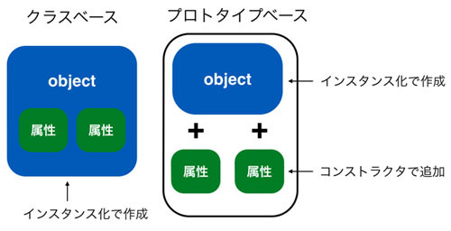

# self

{{ TOC }}

## 概要

あとで書く

## メソッドの第一引数 self は何者か

Pythonのクラスのメソッドやコンストラクタでは第一引数をselfとします。
そして、それらの定義されたメソッドを呼び出す際はselfに該当する引数を指定しないのでした。
たとえば、以下のクラスのコンストラクタとメソッドmethod1の利用方法を見ればわかります。
宣言にはselfがありますが、呼び出しにはselfに相当するものがありません。

```python
class MyClass:
  def __init__(self):
    print('constructer')

  def method1(self, a):
    print(a)

instance = MyClass()
# constructer

instance.method1('hello')
# hello
```

さて、本章ではこの self が何なのかということを確認してみます。
先ほどのクラスにselfのタイプとそれ自身(参照)を表示するメソッドを追加します。
そして、それとは別にインスタンスのタイプと参照を表示させます。
まず最初にクラスから作られたインスタンスを確認してみます。

```python
class MyClass:
  def method2(self):
    print('self type: {}'.format(type(self)))
    print('self ref:  {}'.format(self))

instance = MyClass()

print('instance type: {}'.format(type(instance)))
# instance type: <class '__main__.MyClass'>

print('instance ref: {}'.format(instance))
# instance ref: <__main__.MyClass object at 0x1013d76d8>
```

作成されたインスタンスのタイプは「<class '__main__.MyClass'> 」となっています。
ようするに MyClass のインスタンスであるということです。
そしてそれを直接プリントした出力は「<__main__.MyClass object at 0x1013d76d8>」となりました。
後者は「このMyClass のオブジェクト(インスタンス)はメモリ空間上の 0x1013d76d8 にある」という表示です。

次に instanse.method2() を呼び出し、そのなかで self がなにものなのか出力させてみます。

```python
instance.method2()
# self type: <class '__main__.MyClass'>
# self ref:  <__main__.MyClass object at 0x1013d76d8>
```

タイプやインスタンスの所在地の出力結果を見ると、先ほどの instance にまったく同じものであることがわかります。
つまりメソッドの第一引数のselfには「インスタンスとしての自分自身」が入ることがわかります。
このことから、ちょうどインスタンスのデータを「インスタンス.データ」としてアクセスするように、
メソッド内でも自分自身のデータを「self.データ」としてアクセスしていることがわかります。

## インスタンス変数の正体

例えば以前使った下記のコードですが、コンストラクタ内でインスタンスのデータを「self.インスタンス変数」として初期化しています。

```python
class UserInfo:
  def __init__(self, name, birth, address):
    print('initialize instance')
    self.name = name
    self.birth = birth
    self.address = address
```

コンストラクタ以外のメソッド内で「 self.インスタンス変数」 としていたのもこれと同じ理由です。
self を使わず単に「name や birth」とすると、それはインスタンス変数ではなく、
インスタンス変数と同じ名前の「ローカル変数(メソッド内だけで使える変数。関数のものと同じ)」を使っていることになります。
そのため、上記のコードにおいてコンストラクタに渡されている引数はただのメソッド内の変数として扱われ、
self.name はインスタンスが持つインスタンス変数として扱われます。
両者ともnameという名前になっていますが別物です。

インスタンス変数と変数の違いを少し確認してみます。以下のコードはコンストラクタ及びメソッドで、
a をインスタンス変数、b をメソッド内の変数として扱っています。

```python
class MyClass:
  def __init__(self):
    self.a = 0
    b = 0

  def set_a(self, value):
    self.a =  value

  def get_a(self):
    return self.a

  def set_b(self, value):
    b = value

  def get_b(self):
    return b
```

インスタンス変数 a にメソッド set_a で値をセットし、get_a でそれを取得してみます。

```python
instance = MyClass()
instance.set_a(3)
print(instance.get_a())
# 3
```

想定通り、セットもゲットもできています。
一方、変数 b に同じことをやるとエラーとなってしまいます。

```python
instance.set_b(5)
print(instance.get_b())
# Traceback (most recent call last):
#   ...
# NameError: name 'b' is not defined
```

これはなぜかというと、コンストラクタやメソッドで使われている変数 b はそのメソッドでしか有効でないためです。
コンストラクタやメソッドで変数 b に代入をしても、それとは異なるメソッドではその変数 b はまだ存在していません。
そのため、get_b メソッド内で変数 b の値を取得しようとしたところ「変数 b は定義されていない」と怒られてしまっています。
インスタンス変数とself について理解できていればこの間違いを意図的にやることはないと思います。
ただ、うっかり self を書き忘れてしまうということはあると思いますので注意して下さい。

## 動的なオブジェクト構造

コンストラクタとself についてあらかた分かって頂けたと思います。
そのため、Pythonのオブジェクト指向が「どのように実現されているか」を少し深掘りしてみます。
このレベルまで気にしなくてもプログラムは組めるため、プログラミング初心者のかたは読み飛ばしていただいていいと思います。

今までPythonのインスタンスはクラスから作られるという話を何度もしました。
そしてインスタンスで持つデータはクラスのコンストラクタで定義されたものを使うのでした。
そのインスタンス変数の定義の仕方をよく思い出してください。
以下のようにコンストラクタでselfに追加していっていました。

```python
class MyClass:
  def __init__(self):
    self.a = 'a'
    self.b = 'b'
```

既にお話したようにselfはインスタンス自身でした。コードを見てみてください。
self.a = 'a'としていることからわかるように、すでに存在する self.a というインスタンス変数に文字列 ‘a’ を代入しているように見えます。
ただ厳密にはこの説明間違っています。
実はこのself.a = 'a'が実施される直前までは、このインスタンスはaというデータを持っていません。
そのため、self.a = 'a'はインスタンスがすでに持つ変数への値の代入というよりは、
新しくデータを作っているようなイメージです。
これは、JavaScriptなどで利用されているプロトタイプベースのオブジェクト指向に似ており、C++ や Java のオブジェクトとは全く異なっています。

少しコードを書き換えてテストします。

```python
class MyClass:
  def __init__(self):
    print('1: {}'.format(dir(self)))
    self.a = 'a'
    self.b = 'b'
    print('2: {}'.format(dir(self)))

instance = MyClass()
print('3: {}'.format(dir(instance)))
```

上記ではあるオブジェクトが持つ属性(インスタンス変数やメソッドなど)を確認するdir関数を使うことで、
インスタンスが何を持っているか確認しています。
具体的にはコンストラクタ__init__でインスタンス変数値をに代入する前後で、
そのインスタンスがどのようなデータを持っているか表示しています。
そして、作成し終わった後でインスタンスの中身を再度 dir で確認しています。

実行結果は以下のようになります。

```
1: ['__class__', ... , '__weakref__']
2: ['__class__', ... , '__weakref__', 'a', 'b']
3: ['__class__', ... , '__weakref__', 'a', 'b']
```

見てもらうとわかるようにすべて同じインスタンスであるにもかかわらず、持っている属性にa、bが途中で追加されています。
Python のコンストラクタは「すでにあるインスタンス変数に値をいれる」というよりは「新しくインスタンス変数を作っている」といえます。
Javaなどだとコンストラクタで属性の中身に変更を加えられますが、属性の有無そのものは変化していません。

実はこの属性の追加はコンストラクタ以外でも実行できます。
たとえば、先ほど作ったMyClassのインスタンスにクラスで定義されていない属性cを追加してみます。

```python
instance.c = 'c'
print('4: {}'.format(dir(instance)))
# 4: ['__class__', ... , '__weakref__', , 'a', 'b', 'c']
```

dirで確認すると、今まで存在しなかった属性cが追加されていることがわかります。
当然、同じ要領でコンストラクタ以外のメソッド内でも新しくインスタンス変数を作ることはできます。
メソッドでさえ新しく作ることができます。

```python
def new_method(self):
  return 'hello new method'

MyClass.new_method = new_method
print(instance.new_method())
# hello new method

print('5: {}'.format(dir(instance)))
# 4: ['__class__', ... , '__weakref__', , 'a', 'b', 'c', 'new_method']
```

クラスベースとプロトタイプベースのインスタンスの作られ方の違いについて、以下に概念図を記載します。
Python は両者の中間にいます。



プロトタイプベースのほうが融通は効きます。
ただ、規則性を持ってコードを書かないとカオスになるので注意してください。
初心者のうちは厳格にルールを守ることに注力すべきだと思います。

Pythonで属性はオブジェクトに「後付けできる」ということは知っておくべきだと思います。
なぜならこれらのテクニックは上級レベルのプログラミングで利用されることがあるためです。
ただ、意図してそのようなことをしないのであれば、
コンストラクタ以外でのオブジェクトへのデータの追加は可能な限り控えるべきだと思います。
インスタンスの属性があったりなかったりするとトラブルのもとですし、
なによりクラスのコードだけを読んでもインスタンスがどのようなデータを持っているのかわからなくなります。
インスタンスを作った時点では使わないインスタンス変数があったとしても、
それは必ずコンストラクタで初期化するようにしてください。
特に初心者のかたは誰が読んでも分かるコードを書くことに注意を払ってください。
