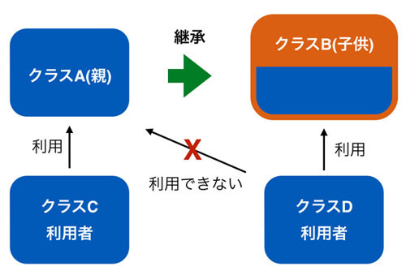

## クラスの継承

オブジェクト指向の後半は「継承」という概念が主なテーマとなります。
継承は具体的にはクラスAがすでにあり、そのクラスAをベースにして機能拡張をしたクラスBを作るという手法になります。

手法について扱うだけであればさほど苦労はしないと思いますが、
継承のメリットと正しい使い方を理解することは難しいかもしれません。
そのため、前半戦と同じように「なぜそうするか」や「どうあるべきか」といった話に比重を置きます。
かなり冗長になってしまうかもしれませんが、ご容赦願います。
継承についてある程度学んだら、簡単にGUIの使い方を扱い、GUIを使って継承を実際に利用してみたいと思います。

最初に難しい話を繰り返しても眠くなってしまうでしょうし、
とりあえずざっくりと継承のやりかたについてお話します。

まず以下の図を見てください。


左側にあるのがクラスAで右側にあるのがクラスBとなります。
クラスBはクラスAを継承して作られており、内部にクラスAの要素を引き継いでいることがわかります。
「クラスBがクラスAを持っている」のではなく、「クラスBはクラスAをベースに作られている」ことに注意してください。

これを実際にコードに書いてみます。まずはクラスAです。

```python
class ClassA:
  def __init__(self):
    self.var_a = 'class a'

  def print_a(self):
    print('this method is defined in ' + self.var_a)

a = ClassA()
a.print_a()
# this method is defined in class a
```

var_aというインスタンス変数とprint_aというメソッドを持っています。
ここまでは今までに学んだことであり、特に新しいものではありません。

次にこれを継承するクラスBを実装します。

```python
class ClassB(ClassA):       # <--- 継承の宣言
  def __init__(self):
    self.var_b = 'class b'
    super().__init__()   # <--- 親クラスの初期化

  def print_b(self):
    print('this method is defined in ' + self.var_b)
    print('parent of ' + self.var_b + ' is ' + self.var_a)
```

注目して欲しい点はいくつかありますが、まず最初に知る必要があるのは文法です。
一行目のクラスBの宣言の後ろに () で ClassA が記載されていることがわかります。
これが継承の宣言です。
これをすることで「クラスBはクラスAを継承する」ことができるようになります。
そして次は、4行目の "super().__init__()" です。これはクラスBの親クラスであるクラスAの初期化です。

思い出してください。コンストラクタである__init__メソッドは引数をとると、その引数を初期化に利用するのでした。
今回は引数がselfだけなので、初期化時に特に値を渡さなくてよいのですが、
引数が2つ以上ある場合は値を渡さないとエラーになります。
クラスAを継承したクラスBのなかで、「クラスAをどのように初期化するか」を指定する必要があり、
この4行目はそれを実行しています。
今回は親クラスに引数がないのですが、親クラスに引数がある場合は、子クラスでの初期化時に親クラスに引数を渡す必要があります。
これは後のサンプルで扱うため、ここでは割愛します。

最後にprint_bを見てもらいたいですが、なかでself.var_aを参照していることがわかります。
Bの中でAのインスタンス変数を使っているということです。

とりあえず、このクラスBを使ってみます。

```python
b = ClassB()
b.print_b()
# this method is defined in class b
# parent of class b is class a

b.print_a()
# this method is defined in class a
```

まず、クラスBのインスタンスは当然ながらクラスBのメソッドを呼び出すことができます。
出力を見てもらうとわかるように、クラスAのインスタンス変数を利用することができています。

親のインスタンス変数だけでなく、親のメソッドも利用することが可能です。
クラスBのインスタンスからクラスAで定義されている print_a メソッドを呼び出していますが、
特にエラーなく動作していることがわかります。

だいたいどういう使い方をするかわかっていただけたでしょうか。

継承を使うメリット
継承の使い方はわかっていただけたかと思います。問題となるのはなぜそのようなことをするのかだと思います。

たとえば先程の例であれば、わざわざクラスAを作って、クラスBに継承させるなどという面倒なことをせず、いきなり定義してしまえばよいです。たとえば以下のようなコードを書くと、クラスAなしで新しいクラスBに先ほどの継承するクラスBとまったく同じことをさせることができます。

```python
class ClassB:   
  def __init__(self):
    self.var_a = 'class a'
    self.var_b = 'class b'

  def print_a(self):
    print('this method is defined in ' + self.var_a)

  def print_b(self):
    print('this method is defined in ' + self.var_b)
    print('parent of {} is {}'.format(self.var_b, self.var_a))
```

どうみてもこっちのほうがシンプルです。
実際、今回のようなクラスA、Bの継承の使い方はあくまでもサンプルであり、
これが実コードであれば設計としてはナンセンスです。
では、具体的にどのような場合に継承を使うメリットがあるのでしょうか。
それは主に以下の場合となります。

*	すでに利用している自分が作った既存のクラスを継承する場合
*	標準ライブラリやほかの人が作ったクラスを継承する場合
*	親に多数の子供がいる場合
*	GUIを利用する場合

上記のいくつかについては細かい話が必要なため、この章ですべてをカバーすることはできません。
そのため、いくつかは個々で紹介し、続く章で残りのものを扱います。

なお、これらの継承の使いかたは、ほかのメジャーなオブジェクト指向言語であるJavaやC++も意識したうえで記載しています。
正直なところPythonの継承はこれらの言語より単純であり、実現できることもそれほど多くありません。
「こんなことPythonではやらないよ」といった話も出てくるとは思いますが、ご了承ください。

#### 自分が作った既存クラスを継承

これは自分たちが作った既存のクラスがすでに存在していて、それに変更は加えることはできないものの、
似たクラスが必要な場合に利用します。

たとえば、以下の図を見てください。



ここではクラスAはクラスCから利用されています。
このクラスAに機能を追加し、それを別の用途で利用したいとします。
今回はクラスDからの利用としましょう。
その際、クラスA自体のコードを変更してしまうのが手っ取り早いのですが、常にそれができるとは限りません。
その際、クラスAはキープしたままにし、継承を利用して変更を加えるという利用方法があります。

個人的にこの使い方はあまり好きではないです。なぜなら継承ではなく、
コンポジション(クラスBがクラスAを持つ)で実現できてしまう場合が多いからです。
継承とコンポジションの使い分けの話をするにはまだ早いので、これは後ほど改めて扱います。

#### 親子関係の確認

継承を使った場合、どのクラスがどのクラスを継承しているかを正しく認識している必要があります。
ドキュメントなりコードをじっくり読めば分かるのでしょうが、それを助けてくれる機能が python にはあります。

以下のコードがあるとします。

```python
class MyClassA:
  pass

class MyClassB(MyClassA):
  pass

class MyClassC(MyClassB):
  pass

class MyClassD(MyClassA):
  pass
```

見て分かるようにクラスAがあり、B は A を継承し、C は B を継承しています。そして D は A を継承しています。
これらのクラスはなにもしないので便宜的に pass を宣言しています。
なにも書かないとエラーになります。

まずクラスの親子関係の確認ですが、これは組み込み関数の issubclass を使うことで実現できます。
issubclass(A, B) とすることで A は B のサブクラスかを確認し、サブクラスであれば True を返します。
試しに先ほどのクラス群で関数の挙動を確認します。

```python
print(issubclass(MyClassB, MyClassA))
# True

print(issubclass(MyClassC, MyClassA))
# True

print(issubclass(MyClassD, MyClassB))
# False
```

この結果を見ると親子関係が True となることは当然ながら、祖父母と子供の関係でも True となることがわかります。
また、同じクラスから派生していても直接的な親子関係がなければ True となりません。
たとえば、B と D はともに A から派生した兄弟関係ですが、issubclass では False となっています。
D と C も当然ながら issubclass では False となります。
インスタンスの親子関係の確認が必要な場合は type 関数と組み合わせることで実現できます。

```python
a = MyClassA()
b = MyClassB()
print(issubclass(type(b), type(a)))
# True
```

次にサブクラスから親クラスがなにかをチェックする場合はクラスの特殊な属性である`__base__`を使います。

```python
print(MyClassA.__base__)
# <class 'object'>

print(MyClassB.__base__)
# <class '__main__.MyClassA'>

print(MyClassC.__base__)
# <class '__main__.MyClassB'>
```

実は Python はクラス自体もオブジェクトです。クラスをインスタンス化すればオブジェクトが作られますが、
クラス自体も実はオブジェクトです。あまり初心者向けの話題ではないため詳細は後編に譲りますが、
クラスもオブジェクトであるため、属性(インスタンス変数やメソッド)を持っており、`__base__`もその一つです。
サンプルの出力を見てもらうと親クラスを持たないクラスAは「object」を継承したクラスであり、
B は A を継承し、C は B を継承していることが分かります。
ちなみに`__main__`という出力もありますが、これはそのクラスが「エントリとなるモジュール」にあるということを意味しています。

インスタンスから親クラスを割り出すのも先ほどと同じように type 関数か
「インスタンスの属性`__class__`」を使ってクラスを取得し、そこから親クラスを得ることができます。

```python
b = MyClassB()
print(type(b).__base__)
# <class '__main__.MyClassA'>

print(b.__class__.__base__)
# <class '__main__.MyClassA'>
```

それほど難しくありませんね。

先ほどさらっと言った「親クラスを持たないクラスAはobject を継承している」ということですが、
これは Python の継承のルールです。
明示的に親クラスを宣言していないクラスは全て object と呼ばれているクラスを継承しています。

そのため、以下の2つのクラス MyClassA1, MyClassA2は実質的に全く同じだと言えます。

```python
class MyClassA1:
  pass

class MyClassA2(object):
  pass

print(MyClassA1.__base__)
# <class 'object'>

print(MyClassA2.__base__)
# <class 'object'>
```

明示的に object を継承している MyClassA2 も、何も継承していないと宣言している MyClassA1、
もともに親クラスは object になっています。
実は Python2 では宣言の仕方が異なる MyClassA1, MyClassA2は異なるものとなるのですが、
Python3 は両者を区別していません。Python3 を使うのであればあえて object の継承を宣言する必要はありません。
