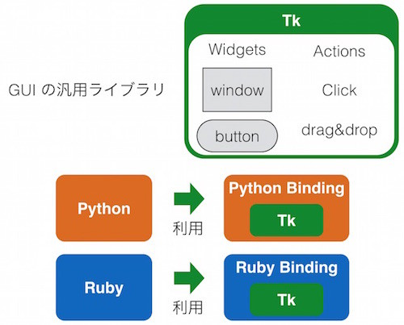
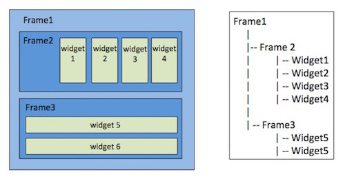
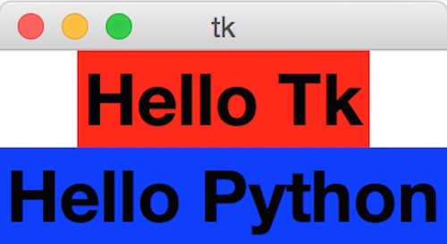
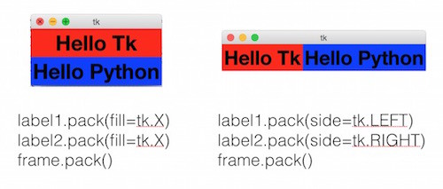
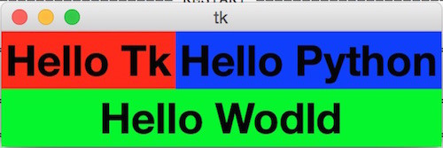
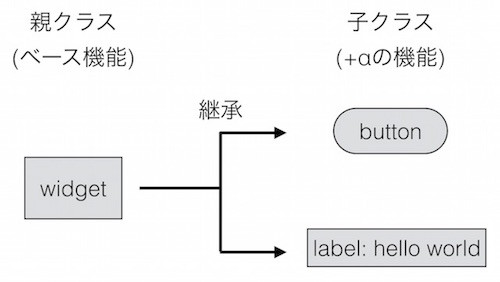
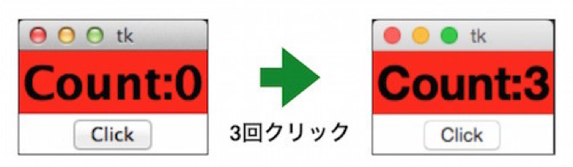
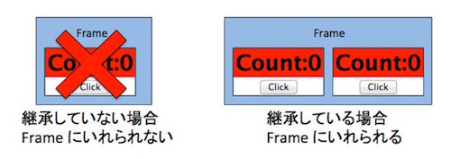

## GUI で継承を学ぶ

{{ TOC }}

継承についておおまかに学んだため、この章ではTkinterというPythonのGUIのライブラリを使って、
GUIアプリケーションの作り方について学んでみたいと思います。
GUIプログラムの作成は初心者向けとは言いづらいところがありますが、
以下のような特徴があるためプログラミングの学習に向いています 。

*	自分が作りたいものを想像しやすい
*	オブジェクト指向に慣れ親しむのに向いている
*	継承を利用する

PythonでGUIを使うといってもさまざまなライブラリがあり、
GUIアプリの作成は Tkinter がベストではない場合もあります。
また、そもそもPythonではなくほかの言語を用いて作るべきである可能性すらあります。
今回はあくまでも学習目的メインなので、そのあたりのことはご容赦ください。
また、本書はGUIをメインとしているわけではないので、当然ながらTkinterのすべてはカバーしきれません。
簡単な使い方紹介や実例をとおして、GUIの仕組みやオブジェクト指向について理解してもらうことを目標にしているので、
興味があるかたはほかのWebページや本などを活用してください。

### Tkinterの紹介と本記事で作るサンプル

WindowsやMac上のアプリケーションも当然ながらプログラムで作られています。
それらを思い浮かべると、ある共通点があることがわかりませんか。
まず一般的にアプリケーションはウィンドウという形で提供され、そのなかにボタンやテキストを書く領域、それにメニューなどが存在しています。
GUI のライブラリはこれらの「見た目」を作ることに特化したライブラリです。
ライブラリの特定の関数を呼び出したり、GUI のクラスをインスタンス化することでウィンドウやメニューを作成したり、
場合によっては提供されるクラスを継承することで細かい挙動や見た目を作ったりします。

TkinterもこういったGUIのライブラリであり、Pythonで利用されます。
ただ、TkinterはPythonで一から作られたものというよりは、
Tkという汎用のGUIのツールキットをPythonで利用できるようにしたものです。
この仕組みを以下の図に記します。



上記図にあるように、まずTkと呼ばれているGUIのツールキットがあり、Pythonがそれを「ラップ」しているようなイメージです。
そのラップされたPythonのライブラリをTkinterと呼んでいます。
Tkはほかの言語でも利用されていて、たとえば図にあるように、Rubyでも利用されています。

本章はこのTkinterとPythonを使って、以下のようなカウンターを実装することを目標にします。


見てもらうとわかりますが、clickと書かれているボタンを押すと表示されているカウンターの数が増えます。

### GUIの基本的な考え方

GUIのアプリケーションといってもブラウザ上で動くものやデスクトップアプリとして動くものなどいろいろあります。
ただ、ある一定の規模のGUIのアプリを構築する場合、
基本的にGUIのウィンドウは「フレーム(ウィジェットをいれる)」と
「ウィジェット(ボタンやテキスト欄といったパーツ)」で構成された入れ子構造となっている場合が多いです。
たとえば以下の図のようになります。



左側にアプリの画面の概念図、右側に GUIのパーツの階層構造が書かれています。
みてわかるようにフレーム1はフレーム2,3を内部に持っていて、それらを縦に並べて表示させています。
そしてフレーム2も中にウィジェット1,2,3,4を持っており、それを横に表示。
フレーム3はウィジェット5,6を持ち、縦に表示といった具合です。
このとき大切なのは、フレーム1,2,3 やWidgetは必要に応じて適切なものが選ばれ、
場合によっては「継承」でカスタマイズされているということです。
このあたりの話は本章の後半で扱います。

### Tkinterの使いかた

詳しいGUIの使い方を理解するためには、まず基礎となる作法を学ぶ必要があります。
そのため、簡単なものから順を追って説明していきたいと思います。おおまかな流れとしては以下のようになります。

*	ウィンドウの表示方法
*	フレームの使い方
*	継承を使った新しいウィジェットの作成

まず以下の図のものを作ります。


これを実現するコードは以下となります。

```python
import tkinter as tk

font=('Helevetica', 32, 'bold')
label = tk.Label(text='Hello Tkinter', font=font, bg='red')
label.pack()
label.mainloop()
```

コードの解説をすると、まず最初にTkinterを使うためにライブラリをインポートしています。
そして前書で扱ったように import X as Yとすると、XというライブラリをYという名前で使うことができます。
Tkinterという名前が長いのでtkとしています。
次にfontの定義ですが、これは単にタプルで表示するテキスト情報をまとめています。
フォント、文字サイズ、大文字と指定しているだけです。

tk.Label()関数でGUIのパーツである「ラベル」と呼ばれているWidgetを作成します。
名前付き引数を使って作るパーツの詳細をオプションとして指定しています。
今回は表示する文字列を "Hello Tkinter" とし、フォントは定義したもの、背景色(BackGround)を赤としています。
そして、作成されたラベルのpack()と呼ばれているメソッドで label を配置し、
mainloop()メソッドでGUIを表示するという流れでGUIアプリケーションが起動します。

#### フレームを使った複数のウィジェットの利用

先程はラベルひとつだけの単純なパーツ構成だったので、もう少し複雑なものを作ってみます。
とはいっても単純で、以下のような2つのラベルを表示するだけのアプリケーションです。



これを実現するためにはフレームを使うのが簡単です。
フレームオブジェクトはその中にウィジェットを複数持つことができ、
それらをどのように表示するかを管理してくれます。
まぁ、まずは簡単なのでコードを見てみましょうか。

```python
import tkinter as tk

frame = tk.Frame()
font=('Helevetica', 32, 'bold')
label1 = tk.Label(frame, text='Hello Tk', font=font, bg='red')
label2 = tk.Label(frame, text='Hello Python', font=font, bg='blue')
label1.pack()
label2.pack()
frame.pack()
frame.mainloop()
```

まずtk.Frame()関数によりFrameのインスタンスを作っているところです。

そして次に、先ほどと同じようにtk.Label()関数でラベルを作っているのですが、
その第一引数に親となるフレームを与えています。
このようにすることで新しく作られたラベルは先程のフレームの中に格納されます。
要するにラベルがフレームの子要素となったということです。

そして、ラベル、フレームというように内側から順にpackメソッドを呼び出していき、
最後に一番外側のフレームに対してmainloop を呼び出します。

GUIのフレームワークにより、このパーツの親子関係の指定方法は変わってきます。
今回は子に親を指定していますが、どちらかというと親に対して「親のパーツ.addChild(中のパーツ)」というような形で、
指定するほうが他のGUIフレームワークでは一般的かもしれません。
基本となる思想はそれほど変わらないので、フレームワークの流儀に合わせてください。

先ほどのフレームでの表示は少し雑だったので、オプションを付けてもう少し丁寧に表示してみます。
オプションはpackメソッドの中で「どのように表示するか」を指定できます。たとえば以下のようなものがあります。



左側の例では左右の隙間をうめて、右側の例はウィジェットを横並びで格納をしています。
基本的にフレームの中に「縦に並べるか」「横に並べるか」を指定し、あとは細かい調整をするという考え方でいいと思います。
今回は割愛していますが、中に格納するWidget間のスペースといったことも調整できます。
複雑なWidgetの配置をしたい場合は、フレームの中にフレームを入れるという入れ子構造にします。
たとえば以下のような配置にしたいとしましょう。



コードは以下のようになります。

```python
import tkinter as tk

frame1 = tk.Frame()

# Child1
frame2 = tk.Frame(frame1)
font=('Helevetica', 32, 'bold')
label1 = tk.Label(frame2, text='Hello Tk', font=font, bg='red')
label2 = tk.Label(frame2, text='Hello Python', font=font, bg='blue')
label1.pack(side=tk.LEFT)
label2.pack(side=tk.LEFT)
frame2.pack()

# Child2
label3 = tk.Label(frame1, text='Hello Wodld', font=font, bg='green')
label3.pack(fill=tk.X)

frame1.pack()
frame1.mainloop()
```

注目して欲しいのはframe2の親にframe1が指定されていることです。
frame2の中には2つのラベルが入っていますが、これはframe1から見るとframe2というひとつの要素に過ぎません。
そしてlabel3は、frame1にとってframe2と同じく自分の子供となります。
つまりframe1にとってはlabel1,2は孫で、label3は子供になります。

誰が誰の親で、中から外に順にpackしていくということに注意を払えばそれほど難しくありません。

#### ウィジェットの継承

今まで利用してきたGUIのパーツはフレームとラベルだけでしたが、
実際にはボタンやテキストボックスなど、さまざまなものが存在しています。
ただ、よく考えてください。
ボタンやラベルにはそれぞれ共通した役割である「フレームに格納可能」「画面に表示される」
「クリックなどのイベント処理が可能」といった共通した特性があります。
これらの共通した特性を複数のクラスで実現する必要がある場合は、前回お話ししたように「継承」が便利です。
GUIはコンポジションより継承をするべき場面です。

たとえばTkinterというよりも、一般的なGUIのライブラリでは、
以下のようにラベルやボタンといったパーツは基本となるWidgetクラスから継承される場合が多いです。



こうすることで基本機能はWidgetに搭載し、その差分のみ子クラスであるボタンやラベルで実装すれば機能を実現できます。
この基本ルールは自分でGUIのパーツを新しく作る際もあてはまります。
確認のために簡単なGUIのパーツを作ってみます。冒頭でお話したカウンタを作ります。



これを実装する場合、別に継承を使わないでも実現可能です。たとえば以下のようなものもそうです。

```python
import tkinter as tk

class Counter:
  def __init__(self, value):
    self.value = value
    frame = tk.Frame()
    font = ('Helevetica', 32, 'bold')
    self.label = tk.Label(frame,
                text=self.getText(),
                font=font, bg='red')
    button = tk.Button(frame, text='Click',
               command=self.clicked)
    self.label.pack()
    button.pack()
    frame.pack()
    frame.mainloop()

  def clicked(self):
    self.value += 1
    self.label.configure(text=self.getText())

  def getText(self):
    return 'Count:{}'.format(self.value)

c = Counter(0)
```

コードを読んでみるとわかりますが、クラスCounterは、特にTkinterのパーツを継承しておらず、
その初期化の際にFrameを作り、その中にラベルとボタンを格納して表示するという仕組みになっています。
なお、ボタンが押されたときのアクションは、登録されたメソッドが呼び出されるというものになっています。

一方、同じことを継承で実現することもできます。こちらのほうが一般的な GUIの実装方法といえます。

```python
import tkinter as tk

class Counter(tk.Frame):
  def __init__(self, master=None, value=0):
    self.value = value

    tk.Frame.__init__(self, master)
    font = ('Helevetica', 32, 'bold')
    self.label = tk.Label(self,
                 text=self.getText(),
                 font=font, bg='red')
    self.button = tk.Button(self, text='Click',
                  command=self.clicked)
    self.label.pack()
    self.button.pack()

  def clicked(self):
    self.value += 1
    self.label.configure(text=self.getText())

  def getText(self):
    return 'Count:{}'.format(self.value)

f = tk.Frame()
c1 = Counter(value=0, master=f)
c2 = Counter(value=5, master=f)
c1.pack()
c2.pack()
f.pack()
f.mainloop()
```

先程に比べてコードが少し複雑になっていますが、Counterはtk.Frameを継承して作り、
自分自身の中にラベルとボタンを配置するという構成になっています。

また、継承を使わないコードと使うコードの最後の部分を見比べてもらうとわかりますが、
継承をしない場合はあくまでも「俺ルール」で表示をさせているのに対して、
継承を使う場合はほかのtkのウィジェットのGUIパーツとほとんど違いなく利用できています。
ほかのGUIパーツのように使えるので、今回はFrameの中に入れて2つ利用するということをやっています。
これは継承を使わないコードでは「俺ルール」で仕組みを作らないと実現できませんし、
そんなコードは汎用性が低くて使いにくいです。



GUIのアプリケーションはパーツとパーツが複雑に絡み合うため、大規模なものを作るとなると難易度が一気に増えます。
ただ、そのような問題をいかに乗り越えるかということに四苦八苦し、
自分でいろいろ考えたアイディアを試したり先人の知恵を借りたりして解決していくということを繰り返すことで、
プログラマとしてのレベルが上がってくれるのではないかと思います。

#### 継承 vs コンポジション

さて、今回まで継承についていろいろと説明してきましたが、継承を覚えたときに陥りがちなのは「継承中毒」というやつです。
要するに、なんでもかんでも継承してしまうということです。
なお、継承は「絶対継承すべき」という場面以外では使わないというのが私の持論です。
詳しくは『Effective Java(第2版 丸善出版 1994年)』あたりの本を読んで欲しいのですが、
「継承よりもコンポジションを使うべき」というテーマの話題があります。

コンポジションは本書の前半で学んだので覚えているかと思いますが、要するに、あるクラスに別のクラスを持たせることです。
継承で実現できる「親クラスの関数やパラメータを使う」という機能はコンポジションでも実現可能です。
例えば先ほどの Register の実装などを想像してもらうと分かりやすいかもしれません。

一方、たとえばGUIのパーツやスレッド関係のクラスは、多くの場合は継承が必須です。
また、先に説明したポリモーフィズムを実現するのにも、継承を使うべきかもしれません。
型システムがJavaなどより厳格でないPythonでは、必ずしも継承を使わなくてもポリモーフィズムは実現できます。
継承を使わなくても、同じメソッド名でそろえれば問題ありません。
ただ、ポリモーフィズムを使いたいのであれば「俺はポリモーフィズムを使っているぞ」という表明のためにも継承を使うべきかもしれません。

継承にすべきかコンポジションにすべきか悩んだ場合は、それが以下のいずれであるべきか考える必要があります。

*	IS-A 関係
*	HAS-A 関係

A is B(例:トラックは車)のときは継承を使い、A has B(車はタイヤを持つ)のときはコンポジションを使うというのが一般的な決め方です。
時と場合により例外はあるでしょうが、まずは基本に忠実に実装してみるのがよいかと思います。
車の機能を実装するときにタイヤを継承して作ることも可能ですが、それはやらないべきです。

なお、Python ではポリモーフィズムの代わりに「ダックタイピング」と呼ばれるテクニックを使うこともできます。
こちらは後編にて紹介します。
