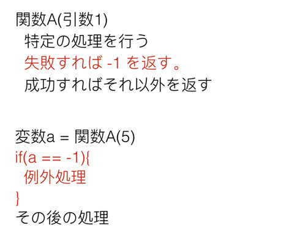
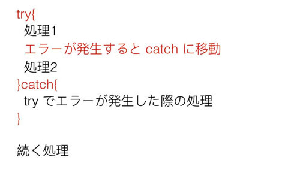

## 例外処理の基礎

例外処理は名前を聞いてわかるように「例外(エラー)」に対する処理です。
この例外は簡単に言ってしまえば、「期待されない動き」のことで、たとえば0での除算などがあげられます。
算数や数学で学んだことがあるかもしれませんが、「0で何かを割る」というのは数学ではやってはいけないルールです。
そのため、Pythonでもこの処理を実行しようとするとエラーになります。

試しにターミナルで実行してみると以下のようなエラー表示が確認できます。

```
>>> 5 / 0
Traceback (most recent call last):
  File "<stdin>", line 1, in <module>
ZeroDivisionError: division by zero
```

出力されたエラーメッセージを読んでもらうとわかるように、
0によるdivision(割り算)によりZeroDivisionErrorが発生していることがわかります。
このエラーが発生すると処理が中断されてしまいます。

以下のようなバグを含むコードを用意します。0除算のバグの前後に Print 文があるため、
どこでエラーが発生するか確認できます。

```python
def test():
  print(1)
  5 / 0
  print(2)

test()
print(3)
```

上記のプログラムを実行してみます。

```
1
Traceback (most recent call last):
  File "test.py", line 6, in <module>
    test()
  File "test.py", line 3, in test
    5 / 0
ZeroDivisionError: division by zero
```

出力されるのは1だけであり、2は出力されていません。
2が出力される前に「5を0で割る」という処理があり、
そこでエラーが発生してprint(2)を実行する前に処理を打ち切ってしまっているためです。
この「数字を0で割る」という処理はそもそもプログラムとして実装されるべきではありません。
上記のような直接的なバグコードを書くことはもちろん、
たとえばどのような数字が入っているかわからない変数aを変数bで割る場合は、
割る前にbの値が0でないかをチェックし、0の場合は割らないようにするなどの対処が必要です。
例えば以下のようなコードとなります。

list_ = [4,2,8,0,9,1,5]
for i in list_:
  if i == 0:
    print('SKIP')
  else:
    print(5 / i)

# 1.25
# 2.5
# 0.625
# skip
# 0.5555555555555556
# 5.0
# 1.0

0除算のようなエラーは必ず発生しないように注意を払う必要があります。
ただ、注意深くコードを書くことによりすべてのエラーが避けられるかというと、そうではありません。
たとえば「サーバからデータを取ってくる」というネットワークを使ったプログラムを作成する場合、
「サーバに接続できるか」は自分が注意深くコードを書くかどうかというよりも、
実行するマシンがネットワークにそもそも繋がっているか、つながっていてもサーバへのリーチャビリティはあるか、
といったことなどに依存します。
このような処理をする場合はその例外を正しく取り扱うために例外処理が必要です。

### 例外処理のやりかた

例外に対する例外処理が必要なことはわかっていただけたと思います。
ここではその例外処理をどのようにして実装するかという「概念」を学びたいと思います。

まず、例外処理はPython以前からある思想です。
例外は言語に関係なく発生するので当然です。
ただ、その例外処理の実装スタイルには大まかに分けて2つあります。
ひとつめはC言語などで使われる「返り値チェック」を使うものです。
そして2つめはJavaなどで使われる「try/catch」を使うものです。
PythonはJavaと同じく後者を使うのですが、前者も知っておく必要があるので先に説明します。

C言語のような「返り値チェック」の例外処理ですが、歴史的にはこちらのほうが古いです。
その方式を簡単に言ってしまうと「ある関数を呼び出した時の返り値」が例外の値でないかをチェックするというものです。

以下の図を見てください。



ここでは関数Aがあり、それは「ある処理に失敗したら、返り値として-1を返す」という動きをすると決められています。
自分でこの返り値のルールを作ることもあるでしょうし、
すでに存在している関数のドキュメントにそう書かれていることもあります。
このような関数を使う場合、その返り値を受取、それがエラーの結果出ないことを確認する必要があります。
Python にもこのタイプの関数(メソッド)があり、例えば以下の文字列の find メソッドがあげられます。

```python
index = '12345'.find('34')
print(index)
# 2

index = '12345'.find('hello')
print(index)
# -1
```

このメソッドはある文字列がその文字列オブジェクトのどこにあるかを返します。
ひとつめのサンプルは含まれているため位置を返し、ふたつめのサンプルは含まれていないため、「-1」を返しています。
例えばこの返り値の特性を使って「ある文字列が別の文字列に含まれるか」を確認する関数を作ることができます。

```python
def contains(text1, text2):
  index = text1.find(text2)
  if(index == -1):
    return False
  else:
    return True    

print(contains('12345', '34'))
# True

print(contains('12345', 'hello'))
# False
```

上記コードの関数はかなり冗長ですが、返り値が -1 であれば「含まれないためFalse」、
そうでなければ「含まれるためTrue」としています。

上記のプログラムであれば単に含まれるか含まれないかの判定ですが、
もし仮に「文字列が含まれていなければ処理を中断しなければならない」とした場合、
仮に返り値が-1であれば処理に失敗しているので、処理の中断なり別の回避策なりが必要です。

この関数の返り値のチェック以外にも、関数の引数に「ポインタと呼ばれている参照」を渡し、
そこに関数内で特定の値をセットするという方法もあります。
関数を呼び出した側でそのポインタの値をチェックすれば、引数と同じく成功したか失敗したかがわかります。
このような形でポインタを使うところはC言語特有なので、
比較的新しい高級言語しか使わない人には慣れない使い方かと思いますが、
基本的には関数の返り値のチェックと大差はありません。
これらがC言語などの手続き型言語で使われる代表的な例外処理方式です。

#### Try/Exception(Catch)方式

次にJavaで使われるtry/catchによる例外処理です。
プログラミング言語の文法としてtry/catch方式の例外処理がサポートされている場合に利用可能で、
Pythonもこれをサポートしています。
C 言語はサポートしていません。
Python にて自分でコードを書く場合はC方式の例外処理を実装することも可能ですが、
ほかの人のコードを利用する場合はその例外処理をtry/catchで対処する必要があり、
なおかつCのスタイルで例外処理を使うとコードも煩雑になるので、
特に理由がないかぎりはtry/catchに沿った例外処理を使ったほうがよいと思います。

とりあえず Java の Try/Catchをどのように使うか見てみましょう。以下の図を見てください。



try/catch方式は簡単です。例外が発生する可能性があり、
その対処が必要な箇所をtryスコープ(Javaだと中括弧{}のブロック)で囲みます。
このスコープ内でエラーが発生すると、その後ろにあるcatchスコープまでジャンプします。
エラーが発生したあとのtryスコープ内のコードは実行されないので注意してください。
上記図で言うと、処理2の前にエラーが発生すると、処理2は実行されません。

また、tryスコープの中でエラーが発生しなかった場合はcatchのスコープ内の処理は実行されません。
tryの中でエラーが起きようと起きまいと、try/catchの後にあるコードは実行されます。
もしエラーが発生した場合に処理を打ち切りたいのであれば、catchの中でプログラムを終了させるなり、
returnで関数を抜けてしまうなりする必要があります。

try/catchについては実際にPythonで使い方を学ぶと理解できると思いますので、
詳しい話をするのはここでは控えて、使いながら学んでいきたいと思います。

#### Pythonのtry/catch

Pythonのtry/catchは簡単です。まず一番シンプルな使い方は以下のようなものになります。

```python
print('1: outside of try/catch')

try:
  print('2: inside of try scope')
  5 / 0
  print('3: inside of try scope')
except Exception:
  print('4: inside of except(catch) scope')

print('5: outside of try/catch')
```

try/catchのcatchはPythonではexceptになっていますが、それ以外は先程説明したものとまったく同じです。
tryの中でエラーが発生すれば、それ以後のtry内の処理を打ち切ってexceptにジャンプします。

見てもらうと分かるように今回はわざとtry ブロックの中で「5/0」でエラーを発生させています。
これを実行すると以下のようになります。

```
# python3 test.py
1: outside of try/catch
2: inside of try scope
4: inside of except(catch) scope
5: outside of try/catch
```

上記出力を見てわかるように、5/0のエラー発生後のコードであるprint('3: inside of try scope') は実行されずに、
exceptにジャンプしてその中の処理を実施しています。
試しにこの5 / 0をコメントアウトして実行してみます。

```python
print('1: outside of try/catch')

try:
  print('2: inside of try scope')
  # 5 / 0
  print('3: inside of try scope')
except Exception:
  print('4: inside of except(catch) scope')

print('5: outside of try/catch')
```

これを実行すると以下のような出力が得られます。

```
python3 test.py
1: outside of try/catch
2: inside of try scope
3: inside of try scope
5: outside of try/catch
```

先ほどと異なり、エラーが発生していないのでprint('3: inside of try scope')が実行されています。
またエラーが発生しなかったので、except内の処理は呼びだされず '4: inside of except(catch) scope' の表示がなくなっていることもわかります。
そして、try/catchの外にある'1: outside of try/catch'と'5: outside of try/catch'は常に実行されています。

これがPythonの簡単な一番簡単な例外処理のやりかたです。
Pythonではより細かく詳細な例外処理の実装を行うことも可能ですが、私は正直なところそれほど複雑なものは利用しません。

ちなみに先程の文字列の find メソッド(与えられた文字列がなければ -1 を返す)とほとんど同じ
「期待されない場合に例外となる文字列のメソッド index」もあります。
具体的には以下のものとなります。

```python
index = '12345'.index('23')
print(index)
# 1

index = '12345'.index('hello')
print(index)
# Traceback (most recent call last):
# ...
# ValueError: substring not found
```

見てもらうとわかるように index も find と同様に文字列の位置を返すメソッドなのですが、
文字列が存在しない場合は例外が発生しています(実際には print 文より前に例外が発生しています)。
Try/Catch流で文字列が存在するか確認する関数 contains を実装すると以下のようになります。

```python
def contains(text1, text2):
  try:
    text1.index(text2)
    return True
  except Exception:
    return False

print(contains('12345', '34'))
# True

print(contains('12345', 'hello'))
# False
```

今回のように文字列を探すという単純な処理であれば -1 を返すというルールを使うことで処理をしてしまうのが一般的です。
ただ、複雑な処理になるとより柔軟に対応できる例外処理方式を使うことが一般的です。
自分でプログラムを書く場合に、エラーが発生した場合に「例外を知らせる値を返す」か、
「例外を発生させてそれを処理してもらうか(後述)」のどちらを使うかは状況に応じて使い分けて下さい。

#### キャッチした例外を変数に格納
try/catchのexceptで指定した Except は先にも言ったように「クラス」です。
掴んだ例外はそのクラスのインスタンスとして取得することができます。
これもそれほど難しくないのでコードで確認してみます。

```python
print(1)
try:
  5/0
except Exception as e:
  print(type(e))
  print(e)
print(2)
```

exceptの後に、Exceptionに続けてeがあります。このeが例外を格納している変数です。
eは実際にはException型ではなく「Exceptionおよびその子クラスのいずれか」が格納されています。
これはクラスの継承で話した親クラスと子クラスの関係から実現できています。
上記コードではわざと 5/0 で例外を発生させてその例外を変数 e にキャッチ、typeとともにその内容を表示させています。
その出力を見てみます。

```
1
<class 'ZeroDivisionError'>
division by zero
2
```

ZeroDivisionErrorが発生していることがわかります。
printさせれば、なぜZeroDivisionErrorになったかがわかります。
必ずしも例外を変数にいれる必要はありませんが、
自分が期待しないエラーはキャッチしてその中身を確認したほうがいい場合があります。
より詳細を知りたい場合は後述するエラーのトレースを使うと便利です。

#### 意図的に例外を発生させる

プログラムが自分の意図しない状態になりそうなら、
その処理を中断するために「わざと例外を発生させる」というテクニックがあります。
たとえば簡単に天気予報の情報を得るためのライブラリを自分が書いているとしましょう。
当然ながらネットワークを使って外部から天気予報を取得することになるのでしょうが、
例えばネットワークが繋がっていない場合は天気を取得できません。
その場合、わざと例外を発生させることで「ライブラリを利用する側」に対して例外処理で問題に対応してもらうことができます。
Python はこの「例外を意図的に発生させる」ことを raise キーワードを使うことで実現できます。
簡単なサンプルを見てみます。

```python
try:
  a = 0
  if(a == 0):
    raise Exception('hello')
  5/a
except Exception as e:
  print(type(e))
  print(e)
```

前にお話したように0での除算は禁止されているため、割る前に除数が0でないかをチェックさせています。
そして、それが0であった場合は0 で割ってZeroDivisionErrorにさせるよりも、
「自分がコントロールできる形でわざとエラーとする」ことでZeroDivisionErrorとなることを避けています。
それを実現するためにraiseを使って、その後ろのExceptionを発生させています。
なお、Exceptionに与えられている'hello'はエラーの内容を記載しています。
そのあとのexceptでこのエラーをキャッチできるので、今回はraiseされたExceptionをつかんでいます。

今回は例を簡単にするために発生させる例外を Exception としメッセージも hello でしたが、
実際はエラーに即した例外クラスを使い、メッセージにそのエラー原因を書くことになります。
例外クラスには後述する「自作の例外クラス」を使うことが多いです。

このプログラムの出力は以下のようになります。
helloというメッセージを持つExceptionをキャッチできています。

```
<class 'Exception'>
hello
```

このような処理を見て「どうせエラーになるのだから、
5/0でも raise でもどっちでもいいじゃないか」と思うかもしれません。
ただ、同じエラーであってもraiseでエラーとしている場合は「エラーを意図して発生させている」ことが明確にわかり、
それを自分でコントロールできていることがわかります。
一方、raiseでなく5/aでzeroDivisionErrorエラーが発生し、それをexceptで扱っていると、
それは「コードを読んだ人」にとっては意図せずエラーが発生しているように見えてしまいます。

つまり、たとえ実装者が「期待したエラーハンドリング」だと思っていても、
ほかの人にはそう見えない可能性があるのです。
自分でエラーをコントロールする場合はエラーが発生してしまってから対処するのではなく、
エラーが発生する前に自前に対処をしてしまうようにすべきです。

必ずしもraiseを使う必要はなく、たとえば期待されない値の代わりにデフォルトの設定で動くようにしたり、
場合によっては正しいアウトプットとともにプログラムを停止させてしまったり、
returnで関数を中断させてしまったりなど、さまざまな対処法があります。
ただ、raiseを使うべき場面というものもあるので、その存在だけは知っておいたほうがよいかもしれません。
