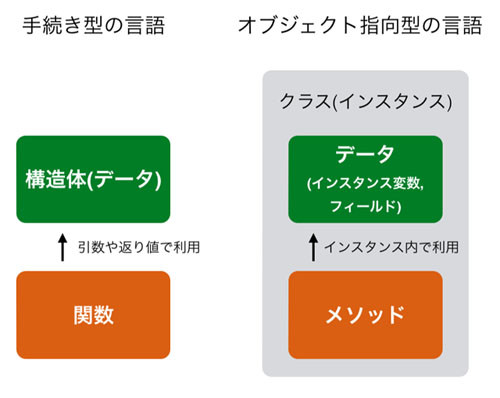

# クラスとインスタンス化

{{ TOC }}

## 概要

あとで書く

## クラスとインスタンスの関係

構造体を使うには「型の定義」と「作った型のデータを作成」という2つの手順を踏むのでした。
あいにくPythonには構造体はないのですが、代わりに構造体を発展させた「クラス」と呼ばれる機能を使うことができます。
クラスは簡単にいってしまうとオブジェクトを作る「型」です。
そしてオブジェクトは「構造体に特殊な関数であるメソッドをもたせたもの」だといえます。
実際はもっと多くのことができるのですが、本章ではとりあえずクラスとオブジェクトの関係に注目したいので、
難易度の低い「オブジェクトを構造体のように使う方法」についてお話します。

Python におけるクラスの定義も、構造体と同じように「クラスの名前」と「オブジェクトが持つデータ」を宣言します。
それは、以下のようになります。

```python
class UserInfo:
    def __init__(self):
        self.name = 'Unknown'
        self.birth = 0
        self.address = 'Unknown'
```

クラスは構造体よりも高機能なため、少し複雑になっていますが、class UserInfoでクラス名を宣言し、
そのなかの関数の定義のような箇所でname、birth、addressという変数を作成しています。
それぞれの変数は’Unknown’, 0, ‘Unknow’ という値で初期化されています。
`def __init__`や`self`は先述したメソッドに関わるものなので次章以降で改めて話します。
今回はとりあえずそういうものなのだと捉えてください。

当然ながらクラスも構造体のようにデータを作ることもできます。ただ、その方法は異なってきます。

```python
taro = UserInfo()
```

上記のように「クラス名()」とすることで、そのクラスから実際のデータを作ることができます。
このクラスから作成されたオブジェクトを「インスタンス」と呼びます。
通常、インスタンスとオブジェクトは同じ意味で使われますが、オブジェクトのほうが広い概念です。
インスタンスという呼び名はクラスから作成された場合以外にあまり用いられません。
このあたりの詳しい話は現時点でしても難しいため、後半で扱います。
クラス UserInfo とインスタンス taro は、リストで例えると UserInfo が list という型にあたり、
taro は [1,2,3] といった具体的なリストのデータとなります。

構造体と同じように「オブジェクトが持つデータの名前」を使うことで、インスタンスの各データに対してアクセスできます。
あえて書くほどでもありませんが、「オブジェクト.データ名」というかたちでアクセスします。
なお、インスタンスが持つこれらのデータのことを「インスタンス変数」と呼びます。
name、birth、addressはインスタンス変数です。
Pythonではあまり聞きませんが、インスタンス変数は「フィールド」という呼ばれ方もします。

インスタンス変数の値を出力してみます。

```python
print('{}, {}, {}'.format(taro.name, taro.birth, taro.address))
# Unknown, 0, Unknown
```

作られたデータを確認すると、クラス定義の中で書かれた初期値を出力していることがわかります。

taro オブジェクトが持つインスタンス変数は参照するだけでなく、値を書くこともできます。
その方法は参照と同じように代入を行うだけです。

```python
taro = UserInfo()
taro.name = 'taro'
taro.birth = 1986
taro.address = 'tokyo'

print('2: {}, {}, {}'.format(taro.name, taro.birth, taro.address))
# taro, 1986, tokyo
```

インスタンスを作成した後にインスタンス変数をセットしていくのではなく、
構造体のように最初から 'taro'、1986、'tokyo'などという値をインスタンスに与えることもできます。
ただ、それがどう実現されるか理解するにはもう少しクラスについて理解する必要があります。
そのため次章以降の解説とさせてください。

構造体とクラスについて学んできましたが、今の段階で覚えておいてもらいたいことは以下の3点だけです。

*	クラスは雛形で設計図のようなもの
*	インスタンスはクラスから作られる実体
*	インスタンスにどのようなデータを持たせるかはクラスで定義する
*	インスタンスとオブジェクトはほぼ同じ意味だが。オブジェクトのほうが広範囲の概念

クラスとインスタンスはちょうど、たい焼きの型枠とたい焼きのような関係かもしれません。
たい焼きはその枠型という設計図に従って量産されます。
どういうたい焼きを焼きたいかによって、そのもとになる「たい焼きの型枠」が変わってきます。
いったん型枠さえ作ってしまえば、何個でも実体としてのたい焼きが作れます。

クラスもこれと同じで、インスタンスがどういうようなデータ(インスタンス変数)や処理(メソッド)を持ちたいかによって、
どういうクラスを作るかが変わってきます。
そしていったんクラスを作ってしまえば、インスタンスは好きなタイミングで好きな数だけ作ることが可能です。

両者の関係のイメージ図を以下に記載します。


なお、作成されたインスタンスのクラス名を得る場合は今まで使っていた type 関数を使うことで実現できます。

```python
unknown_instance = [1,2,3]
print(type(unknown_instance))
# <class 'list'>

print(unknown_instance.__class__)
# <class 'list'>
```

インスタンスの特殊な属性である`__class__`を呼んでもクラスが得られます。
特殊属性については後述します。

## クラスの命名ルール
そしてクラス名なのですが、一般的には複数の単語から構成され、
キャメルケース(Camel case)とよばれる単語と単語を大文字で区切る方式が採用されます。
例えば以下のようなものです。

*	Apple
*	RedApple

1単語だけで構成されていれば先頭が大文字になるだけですが、2単語以上の場合は区切りも大文字になっています。
このでこぼこした感じがラクダ(Camel)に似ているのでキャメルケースと呼ばれています。
一目でクラスと分かるようにするためにこの名前の付けルールは守って下さい。


# インスタンスとメソッドの関係

{{ TOC }}

## 概要

あとで書く

## メソッドの定義

前の章にて構造体は内部にデータ(フィールド)だけを持ち、クラスはデータ(インスタンス変数)に加えて処理(メソッド)も内部に持っているとお伝えしました。
そして構造体やクラスを使うには、 まず「定義」をしてからそれを「インスタンス化」するという流れでした。
クラスはどのようなデータを持つかという定義に加えて、内部にそれらのデータを操作するための特殊な関数である「メソッド」を定義することができます。
本章ではそのメソッドについてとりあつかいます。

一般的に構造体のデータを扱うにはその構造体を使う関数を定義します。その関数を使って構造体のデータを読んだり、変更したりします。
一方、クラスを使う場合はインスタンスが持つデータへのアクセスにはメソッドを利用します。
両者の違いを以下に記します。



クラスで定義されたメソッドは文法レベルではどのように使っても構いません。
例えば会員情報を扱うクラスで円周率を求めるメソッドを書くこともできます。
ただ、基本的にはそのインスタンスが持つデータを操作するような処理に使うという、
オブジェクト指向プログラミングのルールがあるためそのようなことはしません。

メソッドの大枠を分かって頂けたかと思いますので、サンプルコードを使ってメソッドの使い方の説明をします。
生徒の国数英の点数を扱うクラスを作成します。インスタンス変数として名前と各教科の点数をもたせています。
そして 平均点を得るメソッドが実装されています。

```python
class Score:
  def __init__(self):
    self.name = 'Unknown'
    self.math = 0
    self.english = 0
    self.japanese = 0

  def get_average(self):
    return (self.math + self.english + self.japanese)/3
```

注目して欲しいのは、`def get_average(self)`という関数のようなものが「クラス内」に定義されていることです。
インデントの数からこれがクラス内にあることがわかります。
このクラスの中に定義された関数のようなものがメソッドとなります。
メソッドの定義の中身をみると、`def __init__`の中で定義された`math`、`english`といったデータを利用して、
その平均値を求めていることがわかります。

## メソッドの呼び出し

クラスの定義ができたので、実際にこのクラスをインスタンス化して利用してみます。
まず クラスからインスタンスを作成し、そのインスタンスが持つインスタンス変数に値を設定しています。
ここまでは前章と同じです。

```python
taro = Score()
taro.name = 'taro'
taro.math = 60
taro.english = 70
taro.japanese = 80
```

そしてこのインスタンスtaroの`get_average`メソッドを呼び出します。

```python
ave = taro.get_average()
print(ave)
# 70 <- (60 + 70 + 80) / 3
```

見てもらうとわかるように「インスタンス名.メソッド名()」としてメソッドを呼び出しています。
メソッドの呼び出し方はインスタンス変数へのアクセスとほとんど同じです。
なお、メソッドの定義は「def get_average(self):」というように引数をひとつ受け取るようにされていますが、
呼び出す際には`taro.get_average()`というように定義された selfに相当する引数を与えていません。
self については後ほど詳細を扱います。

### メソッドの引数

メソッドの宣言と使い方ですが、実はほとんど通常の関数と同じです。
違うところは以下あたりになります。

*	呼び出しが インスタンス.メソッド名(引数)
*	定義された第一引数(self)は呼び出しに利用されない

引数を複数持てることや、返り値を定義できる点においてメソッドは関数と同じです。
引数や返り値を使ったサンプルコードを以下に記載します。
インスタンス変数を今回は使わないので`__init__`を定義していません。

```python
class TestClass:
  def print0(self):
    print('0:')

  def print1(self, a, b):
    print('1: {} {}'.format(a,b))

  def get100(self):
    return 100

instance = TestClass()
instance.print0()
# 0:

instance.print1('A', 'B')
# 1: A B

a = instance.get100()
print(a)
# 100
```

クラスで定義された第一引数のselfがちょうど無視されているような形で呼び出しと定義がマッチしていることがわかります。
この self の存在を忘れることで、最初はメソッドの引数を間違えることが多いと思うので注意してください。

### メソッドの返り値

あとで整理
