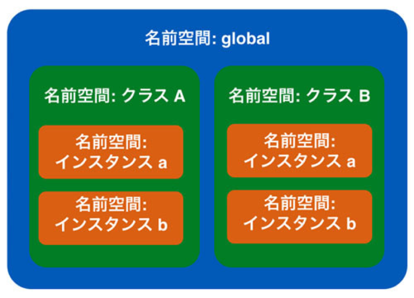

# クラス変数とクラスメソッド

{{ TOC }}

## 概要

この章では今まで扱わなかったクラスの高度なトピックについて扱います。
それらは初心者にとってはオブジェクト指向を実現するうえで必ず必要なものではないものの、
中級者以上のコードを読み書きする際に必要となることがあります。
まずは「こういったこともできる」という程度のものかと認識していただければ十分です。

## クラス変数

今までのクラス内での変数は「インスタンス変数」であり、インスタンスごとに独立したものでした。
クラスにはインスタンス変数に加えて「クラス変数」というものがあり、それは全てのインスタンスで共有されています。
つまり同じクラスから作成されたインスタンス a, b があるとすると、a がその変数を変更すると b のものも変更されるということです。
以下にインスタンス変数とクラス変数を使ったサンプルコードを記載します。

```python
class MyClass:
  # クラス変数の定義
  a = 'A'

  def __init__(self):
    self.b = 'B'

  def set_ab(self, a, b):
    # クラス変数の利用
    MyClass.a = a
    self.b = b

  def print_ab(self):
    print(MyClass.a)
    print(self.b)
```

コメントにあるように上記の変数 a がクラス変数で、変数 b が今まで使っていたインスタンス変数です。
使い方を見てもらうと分かりますが、クラス変数の定義はクラスの直下(メソッドと同じブロック)で行い、
定義したクラスを利用するには「クラス名.変数名」としています。
定義と利用はそれほど難しくないと思うので、さっそくクラス変数を使ってみます。
上記コードにある set_ab メソッドでクラス変数とインスタンス変数を更新し、print_ab でその中身を確認します。

```python
mycls_a = MyClass()
mycls_b = MyClass()

mycls_a.print_ab()
# A
# B
mycls_b.print_ab()
# A
# B

# クラス変数とインスタンス変数を更新
mycls_a.set_ab('AA', 'BB')

mycls_a.print_ab()
# AA
# BB
mycls_b.print_ab()
# AA
# B
```

インスタンス化された直後のクラス変数とインスタンス変数は初期状態のため、
2つのインスタンスで値は全く同じです。
そのあとで片方のインスタンスに対して set_ab で値を更新し、
両方のインスタンスの2つの変数 a, b の値を確認するとクラス変数のみ変更を加えていない側のインスタンスでも更新されていることがわかります。
この特性から全てのインスタンスで共有したい値にはクラス変数を使い、
各インスタンスで独立した値を持ちたい場合はインスタンス変数を使えばいいことが分かります。
なお、クラス変数はインスタンスに依存しないため、クラスから直接呼び出すこともできます。
たとえば先程のクラスだと以下のようになります。

```python
# インスタンスから呼び出し
mycls_a = MyClass()
print(mycls_a.a)
# AA

# クラスから直接呼び出し
print(MyClass.a)
# AA
```

クラス変数や今後扱うクラス定数、クラスメソッドなどは概念的には以下の図の緑にあたります。
一方、従来のインスタンス変数やインスタンスメソッドはオレンジに属しています。



クラス外に定義されている変数や関数はグローバル空間に属しています。
前書で説明した global 宣言なども関わってくるため、値のアップデートは極力避けて参照をするのみにしてください。

## クラス定数

クラス変数は変数名を大文字にすることで「クラス定数」としても利用できます。
以下にサンプルコードを記載します。

```python
class Calc:
  # クラス定数の定義
  TAX_RATE = 1.08

  def __init__(self, cut_rate):
  	self.cut_rate = cut_rate

  def get_price(self, tag_price):
    return int(tag_price * self.cut_rate * Calc.TAX_RATE)

taro_calc = Calc(0.95)
jiro_calc = Calc(0.9)
print(taro_calc.get_price(10000))
# 10260
print(jiro_calc.get_price(10000))
# 9720
```

上記の例は顧客ごとに商品の値段を求めるサンプルです。
各顧客はそれぞれ異なる割引率を持っており、それはインスタンス変数として定義されています。
一方、税率 TAX_RATEはどの顧客でも変わらないためクラス定数として持たせています。
クラス定数は基本的に普通の定数と同じルールで使います。
普通の定数との違いは単にクラスの中にあるということだけです。
前書でもお話したように python には本当の意味での「定数(値を変えられない変数)」はなく、
大文字の変数名の変数を上書きしないというプログラマのルールで変数を定数として使っています。
そのため、既に定義をされた定数は絶対に上書きしないで下さい。

クラス定数の便利な使い方に「クラス定数のみを持つクラス」があります。
たとえばプログラムで色コードが必要な場合、それをまとめて1つのクラスにクラス変数として定義してしまい、
それを他のプログラムが利用するといった使いかたが考えられます。

```python
class Color:
  BLACK = '000000'
  GRAY = '808080'
  WHITE = 'ffffff'
  BLUE = '0000ff'
  GREEN = '00ff00'
  RED = 'ff0000'

print(Color.RED)
# ff0000

print(Color.BLACK)
# 000000
```

色を必要とするクラスが複数ある場合、それらのクラスは上記のようなクラスを参照して色を使えば、
複数のクラス間で一貫した色の扱いをすることができます。

## クラスメソッド

クラスメソッドはインスタンス化しなくても使えるメソッドです。
今までメソッドを利用する場合はまずクラスからインスタンスを作成し、そのインスタンスからメソッドを呼び出していました。
ただ、その呼び出されるメソッドがその内部でインスタンス変数を使わない場合、そのメソッドはインスタンスに依存しないといえます。
ちょっと難しいのでコードで確認してみます。

```python
class MyClass:
  def __init__(self, a):
    self.a = a

  # インスタンスに依存するメソッド
  def print_a(self):
  	print(self.a)

  # インスタンスに依存しないメソッド
  def print_hello(self):
  	print('hello')
```

上記クラスはインスタンス変数 a を持ちます。print_a はそのインスタン変数を使っているので、
その結果はインスタンスごとに変わってきます。
たとえば初期化時に 10 を与えたインスタンスであれば 10 と出力されるでしょうが、
5を与えられたインスタンスであれば 5 と出力されます。
一方、print_hello メソッドは内部でインスタンスに依存する変数やメソッドを一切使っていないため、
このクラスのインスタンスのどれから呼び出されようと結果は必ず同じです。

クラスメソッドは上記のような「どのインスタンスから呼ばれても結果が同じ」というメソッドに使うべきテクニックです。
通常のメソッド(インスタンスメソッド)ではなくクラスメソッドとして定義をするとインスタンス化せずにメソッドを呼び出せます。
クラスメソッドは以下のように定義します。

```python
class MyClass:
  a = 'A'

  # @ を使ってクラスメソッドとして定義
  @classmethod
  def print_hello(cls):
    print(cls.a)
    print(type(cls))
```

今までのメソッドと違ってメソッドの定義の前に「@classmethod」というものがあります。
これは実はプロパティと呼ばれている「関数やメソッドがどう動くかを定義する宣言」の1つなのですが、
プロパティの詳細は初心者向けではないため下編に譲ります。
現時点ではとりあえずこう使うとだけ覚えておいて下さい。
クラスメソッドの宣言は通常のメソッドでは self であった箇所が cls になっています。
これは通常のメソッドはインスタンスが第一引数に渡されるのに対し、クラスメソッドはクラス自身が第一引数に渡されるからです。

クラスメソッドの呼び出しは簡単で、「クラス.クラスメソッド()」とするだけです。
上記のサンプルだと以下のようになります。

```python
MyClass.print_hello()
# A
# <class 'type'>
```

クラスメソッドはインスタンス(引数selfに入っていた)を受け取れないため、
インスタンス変数やインスタンスメソッドは利用できません。
ただ、引数cls を使ってクラス変数や他のクラスメソッドにはアクセスできます。

なお、クラス変数を self を経由して参照することも可能です。
ただし、これは「同名のインスタンス変数が存在しない場合」のみです。
例えば以下のようなコードがあるとしましょう。

```python
class MyClass:
  a = 'A'

  def print_self_a(self):
    print(self.a)

  def set_self_a(self, a):
    self.a = a

  @classmethod
  def print_cls_a(cls):
    print(cls.a)

  @classmethod
  def set_cls_a(cls, a):
    cls.a = a
```

コードを読んでもらうと分かりますが、以下のような構成となっています。

*	a というクラス変数がある
*	インスタンス変数 a に対する set, print がある
*	クラス変数 a に対する set, print がある

普通に考えると「クラス変数に対する set, print は問題なし。
インスタンス変数に対する print は set されるまでは失敗する」と動きそうなところですが、実はそうは動きません。
先に言ったように「インスタンス変数が存在しない場合は self からクラス変数を参照できる」ためです。

```python
mc1 = MyClass()
mc2 = MyClass()
mc1.print_self_a()
# A
mc2.print_self_a()
# A
```

上記コードの出力を見てもらうとわかるようにインスタンス変数の参照が実質的にクラス変数を見ていることが分かります。
ただ、代入をすると話が変わってきます。

```python
mc1.set_self_a('AA')
mc1.print_self_a()
# AA
mc1.print_cls_a()
# A
```

インスタンス変数に値を代入すると、インスタンス変数の a とクラス変数の a が同時に存在するようになります。
self.a が新しく代入された値を持っているのに対し、cls.a はもともとの値を持ち続けていることからも分かります。
上記のインスタンス変数への代入は当然ながら別の同一クラスのインスタンスには影響は及ぼしません。

```python
mc2.print_self_a()
# A
mc2.print_cls_a()
# A
```

self を経由したクラス変数へのアクセスは思わぬトラブルのもとになります。
大文字のため一目で分かり、絶対に上書きがされないクラス定数以外では利用をしないほうがよいでしょう。

## スタティックメソッド

クラスメソッドに似た性質を持つスタティックメソッドというものもあります。
簡単に言ってしまうとスタティックメソッドは「クラスメソッドの第一引数がない版」のようなものです。
そのため、引数cls を使ってクラス変数やクラスメソッドにアクセスできないため、アクセスするには「クラス名.属性」とします。
宣言は @classmethod の代わりに @staticmethod とします。
以下にサンプルを記載します。

```python
class MyClass:
  a = 'A'

  # @ を使ってスタティックメソッドとして定義
  @staticmethod
  def print_a():
  	print(MyClass.a)

MyClass.print_a()
# A
```

スタティックメソッドはある種の処理をまとめたユーティリティ用のクラスを作るときに便利です。
クラスのメソッドがインスタンス変数もクラス変数も全く使わない場合、
それをスタティックメソッドにしてしまうと余計な引数の定義がいらなくなります。
このユーティリティ用のクラスは例えば以下のような形になります。

```python
class MyUtil:

  @staticmethod
  def function1():
  	pass

  @staticmethod
  def function2():
  	pass

  @staticmethod
  def function3():
  	pass
```

MyUtil というクラスがグループ名で各メソッドが個々の処理になります。
インスタンス変数やクラス変数を使わないため、それぞれの処理は完全に独立しているものの、
同じジャンルの処理をクラスにまとめているといった形です。
ある作業をまとめたモジュールに無数の関数が定義されているのと似ています。

なお、クラスメソッドやスタティックメソッドは継承と関わると話が複雑になります。
興味がある人は調べてみるとよいかもしれませんが、そんな詳細まで把握している人は限られているため、使わないほうがよいと思います。
