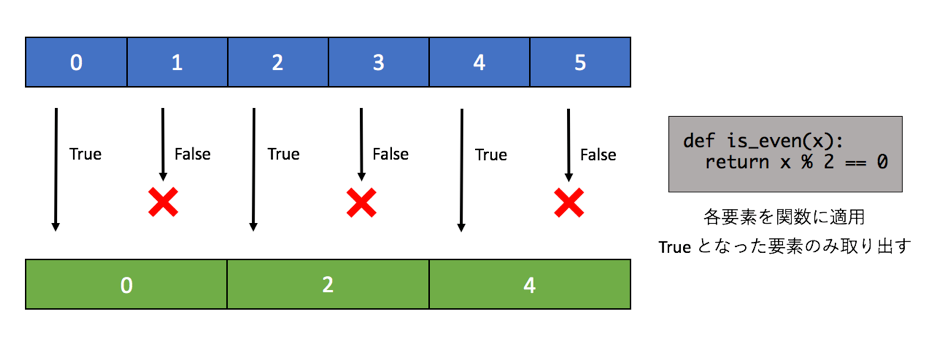
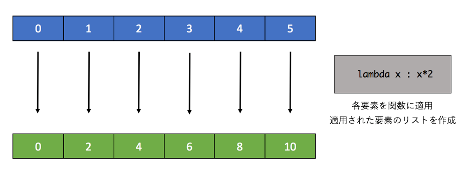
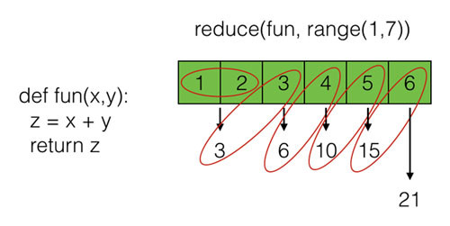

## 関数を使ったデータの操作

### filter

Python は関数渡しで使うことを前提とした関数や、リスト内包表記とよばれる特殊なリストを生成する書式を持っています。
これらはかなり関数型の言語に近い使われかたをします。
必ずしもこれから学ぶ関数やリスト内包表記を使わなくても同じことを「手続き型(今まで学んだ Python プログラムのような書き方)」でも実現できます。
ただ、これから学ぶテクニックを使うことで、シンプルで高速なプログラムを作れることが多いです。

最初にフィルタと呼ばれる処理を紹介します。
Erlangでリストに対してfilter関数を使って偶数だけ取り出す処理をしました。
同じことをPythonで実行することもできます。
Python の filter 関数は第一引数に関数を受け取り、第二引数にリストを受け取ります。
渡された関数をリストの各要素に適用し、True となった要素だけから構成されたフィルターオブジェクトを返します。
必要であればリスト型にキャストをします。filter という名前が示す通り、リストをフィルタ処理しています。

```python
def is_even(x):
  return x % 2 == 0

filter_object = filter(is_even, range(10))
print(list(filter_object))
# [0, 2, 4, 6, 8]
```

上記の例ではまず関数 is_even を宣言しています。%は剰余(あまり)をもとめる演算子なので、
「引数 x を2で割った余りが0か」ということを返しています。
filter 関数にこの is_even を第一引数として私、range(10) で 0 から9 までのリスト(正確にはrange型)を与えると、
与えられたリストに対して順番に関数を適用していき True となったものだけから構成されるリストを返します。
この filter の利用例を図に示します。



先ほど学んだラムダはこれらの関数を受け取る関数と相性がいいです。
先ほどの例ではわざわざ偶数判定の関数を定義していましたが、
それをラムダに置き換えると以下のようにコードが簡潔になります。

```python
filter_object = filter(lambda x:x%2 == 0, range(10))
print(list(filter_object))
# [0, 2, 4, 6, 8]
```

ラムダについて知らなければわからないコードですが、ラムダを知っている人にとっては簡潔です。
自分のコードで使うか使わないかは自分の判断で選べばいいでしょうが、
ラムダを使う人は多くいますので少なくとも読めるようにはなっておく必要があります。

### map

次にmap関数です。こちらはリストの各要素に関数を適用していき、
適用された値をリストにするというものです。
filter オブジェクトと同様に返される値はマップオブジェクトであるため、
それをリストにキャストして上げる必要があります。
やっていること自体は難しくないので、こちらも例を示します。
以下では range 関数で作成した [0,1,2,..8,9] というリストの要素を2倍にしています。

```python
map_object = map(lambda x:x*2, range(10))
print(list(map_object))
# [0, 2, 4, 6, 8, 10, 12, 14, 16, 18]
```

適用する関数を map の第一引数に与え、関数が適用されるリストは第二引数に与えられています。
filter 関数と同じです。
map の図を以下に記載します。



先の filter や map では比較的単純な例でしたが、四則演算だけでなくメソッドで処理を加える事もできます。
ラムダの引数に対してメソッドを呼び出し、テキストデータを大文字にしています。

```python
text_list = ['ab', 'cd', 'ef']
map_object = map(lambda x:x.upper(), text_list)
print(list(map_object))
['AB', 'CD', 'EF']
```

テキストを大文字にすることもそれほど難しくない処理ですが、たとえば自分で作ったクラスについてこれを適用することもできます。
便利といえば便利なのですが、自分以外にその処理がなにをやっているか分からなくなるため、
適切なコメント等を残すか、使わないという選択をする必要があると思います。
返り値のリストが不要で単にオブジェクトのメソッドをまとめて呼びたい場合は for 文を使うことが無難です。

なお、map や後ほど扱うリスト内包表記といったリストを生成する処理は必ずしも元のリストの値を使う必要はありません。たんに「ある長さのリストを生成する」ためにも使えます。たとえばランダムな数値を持つリストを生成する場合、以下のようなコードとなります。

```python
import random

# 普通の関数
def get_random_list1(length):
  random_list = []
  for i in range(length):
    random_list.append(random.randint(0, 100))
  return random_list

# map を使った関数
def get_random_list2(length):
  return list(map(lambda x: random.randint(0, 100), range(length)))

print(get_random_list1(10))
# [24, 25, 80, 78, 34, 11, 23, 6, 28, 33]

print(get_random_list2(10))
# [83, 26, 37, 95, 52, 36, 28, 12, 89, 71]
```

get_random_list1 関数は for 文を使って与えられた長さのぶんだけループを回し、
それでランダムに生成された数値をリストに詰めて返しています。
一方、get_random_list2 は同じことを map で実現しています。
for 文で要素の i を使わなくていいように、map に渡された関数もその引数を使わなくて構いません。
こういうことをできると知っておくべきかと思いますが、
コードを読む人にとって分かりにくいため積極的に使うようなテクニックではないかもしれません。

### reduce

最後にreduceです。これは「たたみ込み」と呼ばれる処理で、別言語だとfoldなどという呼び方をしているかもしれません。
mapやfilterに比べるとちょっと複雑で、利用場面はそれほど多くないと思います。

reduce(fold)の処理概念を以下の図に記します。



図を見てもらうとわかるように、リストの「要素N番目の処理結果をN + 1番目で利用」ということをリストの先頭から末尾まで繰り返していき、最後の処理結果を返すというものです。

書き下すと、

1.	1番目と2番目の要素を使いAを得る
2.	3番目とAを使いBを得る
3.	4番目とBを使いCを得る
4.	最後の要素である5番目とCを使いDを得る
5.	Dを返す

というような動きになります。

上記の図を実現するコードを以下に示します。なお、python2 は reduce をグローバル関数として利用できましたが、python3 では functools というモジュールに属するようになっています。

```python
import functools

def adder(a, b):
  return a + b

result = functools.reduce(adder, range(1, 7))
print(result)
# 21
```

プログラムもfilterやmapと同じように、関数の定義をリストに適用します。
ただ、引数に与える関数の引数が2つになっているのが今までと異なる点です。
今回は分かりやすいように関数を定義しましたが、簡単なものであればラムダが使われることが多いです。

この reduce なのですが、先ほどのような「リストの全ての要素を使って値を得る」というものよりも
「リストの中から何かひとつの要素を選ぶ」といった使い方のほうが多いかもしれません。

そのようなときは「引数で与えられた2つの関数を比較し、条件に合致するほうを返す関数」を定義し、
それをリストに対して reduce で適用するということをします。そうするとリストの全要素に対してその関数が適用され、
最も条件にあうリストの要素が取得できます。
以下のサンプルでは「2値を比較して大きい方を返す処理」を繰り返してランダムに生成された数値のリストから最大値を選ぶという処理をしています。

```python
import functools, random

# 2値を比較して条件に合致したほうの値を返す(今回は大きいほうを返す)
def get_bigger(a, b):
  if(a > b):
    return a
  else:
    return b

# ランダムな数値をリストにつめる
random_list = []
for i in range(10):
  random_list.append(random.randint(0,100))

# リストのなかで最も条件に合致する要素を返す
biggest = functools.reduce(get_bigger, random_list)

print('list: {}'.format(random_list))
# list: [19, 67, 8, 27, 6, 7, 41, 50, 38, 31]
print('biggest: {}'.format(biggest))
# biggest: 67
```

今回は数値のような簡単な例でしたが、2値の比較は複雑なオブジェクトに対しても実現できます。
for 文でリストから要素を取得するのが王道なのでしょうが、reduce でも同様のことができるというのは覚えておいて下さい。
関数型を使えるプログラマがよく使うテクニックです。
