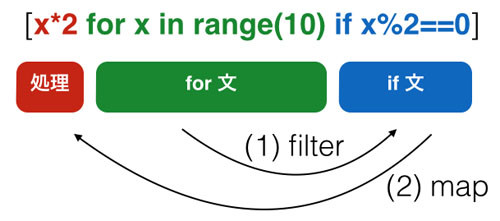

## リスト内包表記

本章の最後にリスト内包表記を扱います。
リスト内包表記はリストを生成するための特別な書式で、そのイメージとしてはラムダとmap とfilterを同時に使うというものになります。
ただ、見た目が難しいので簡単な実例から紹介していきたいとおもいます。

まずmapに近い使い方です。
先ほどの要素2倍にするmap処理をリスト内包表記で書くと、以下のようになります。

```python
list_ = [x*2 for x in range(10)]
print(list_)
# [0, 2, 4, 6, 8, 10, 12, 14, 16, 18]
```

1行目にある [ ] 内の式がリスト内包表記です。よく見るとfor文の使い方に似ています。
"for x in リスト"とすると、xにリストの要素が入ってループを回します。
その各要素xに対して"x * 2"という処理をしてリストを作成します。
通常の for 文によるループと違い、要素に対する処理が先頭にきています。
そしてこの処理が適用されたリストが返されます。

リスト内包表記が優れているところは先程のmap処理に加えて、同時にfilter処理もできることです。
たとえば偶数だけ抜き出し、それを2倍にするということもできます。

```python
list_ = [x*2 for x in range(10) if x%2==0]
print(list_)
# [0, 4, 8, 12, 16]
```

先ほどの map の使い方と同様の例とほとんど同じですが、"for x in リスト"の後にif文が追加されているのがわかります。
このif文がTrueとなった要素だけ、リスト作成の対象となります。処理(今回は x*2)が適用された後に対してではなく、
適用される前(今回はx)に対してフィルタ処理がされていることに注意してください。

書式が複雑なためリスト内包表記は難しく見えるかもしれませんが、
以下のような構造になっていると思えば、理解しやすいかもしれません。



ちなみにリスト内包表記は、通常のループ文よりも高速に動作する場合が多いといわれています。
これはfor文のようにScriptとして一行一行処理されるのではなく、
Python内にあるバイナリでリストに対して処理を施すためです。
興味があればベンチマークを取ってみてもいいかもしれません。

一般的にはあまり知られていませんが、リスト内包表記以外にも「内包表記」があります。
以下にセット内包表記と辞書内法表記の例を示します。

```python
# セット内包表記
set_ = {x * 2 for x in range(10)}

print(set_)
# {0, 2, 4, 6, 8, 10, 12, 14, 16, 18}
print(type(set_))
# <class 'set'>

# 辞書内法表記(タプルから辞書を作成)
tupple_list = [('apple', 'red'), ('banana', 'yellow')]
dict_ = {k.upper() : v for k, v in tupple_list}

print(dict_)
# {'BANANA': 'yellow', 'APPLE': 'red'}
print(type(dict_))
# <class 'dict'>

# 辞書内包表記(辞書から辞書を作成)
dict1 = {'apple':'red', 'banana':'yellow'}
dict2 = {k.upper() : v for k, v in dict1.items()}
print(dict2)
# {'BANANA': 'yellow', 'APPLE': 'red'}
print(type(dict2))
# <class 'dict'>
```

書式はリスト内包表記と大きな違いがありませんが、囲むカッコだけ変わっています。
リスト内包表記に比べてこれらの利用場面はそれほど多くなく、積極的に利用すべきものではありません。
