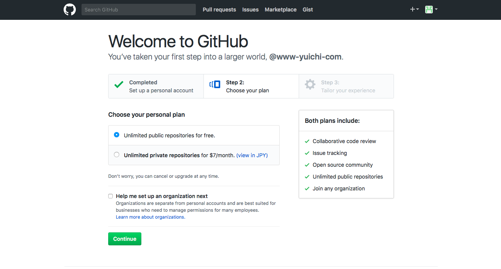
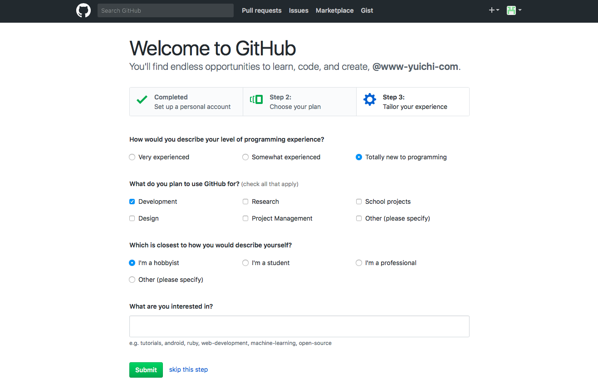
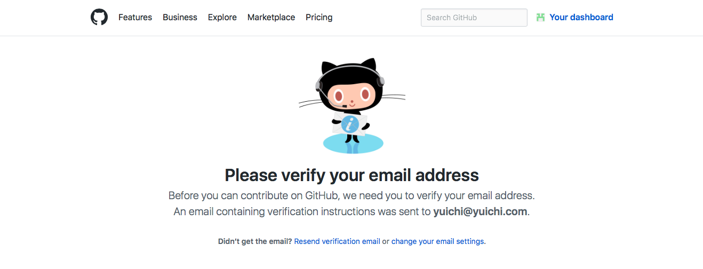
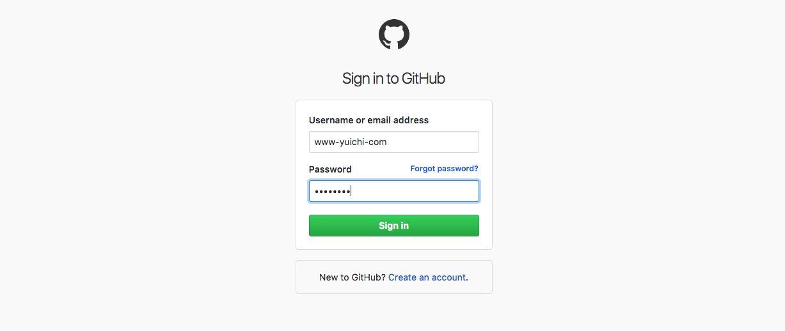
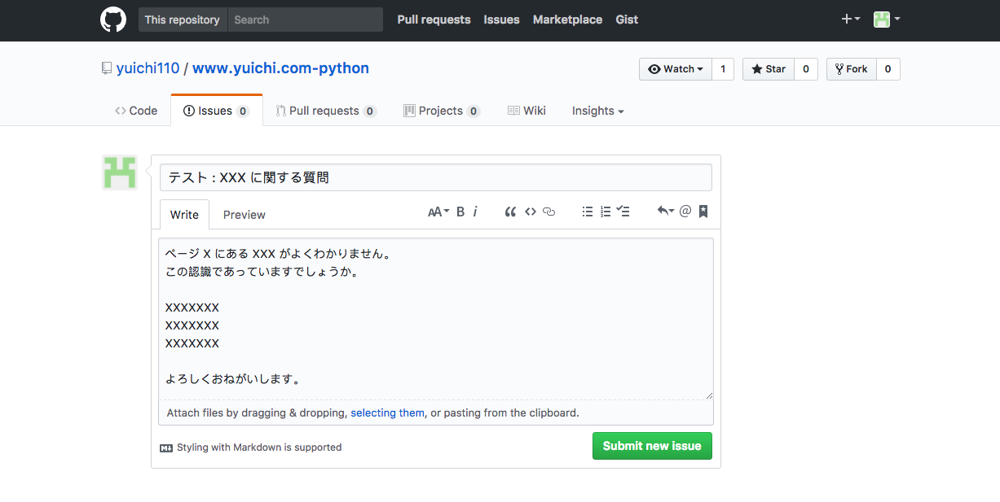

## 質問方法

### Github への登録

当ページのコンテンツはGithubで管理しています。
質問もGithubのIssue機能で対応します。
これを使うには Github への登録が必要ですので、まだアカウントを持っていない方は先に登録を行って下さい。

まずは Github への "Sign UP" をすることで以下のようなページへいきます。
使いたいユーザ名、自分のメールアドレス、パスワードを入力して登録をしてください。

次にGithubのプランが聞かれます。
質問をするだけなら無料のプランでできますので、freeのものを選びます。

どのような目的で使うかの質問には適当に回答をしてください。

登録したメールアドレスに確認メールが飛びますので、そこにあるURLをクリックして登録を完了してください。

登録したユーザ名とパスワードでログインします。

### 質問方法

Githubにログインした状態で以下のリンクをクリックしてください。

[Github Issue](https://github.com/yuichi110/www.yuichi.com-python/issues)

以下のようなページが表示されます。

"New Issue"をクリックして質問を書き込み、submit をしてください。

以上で質問が完了します。
