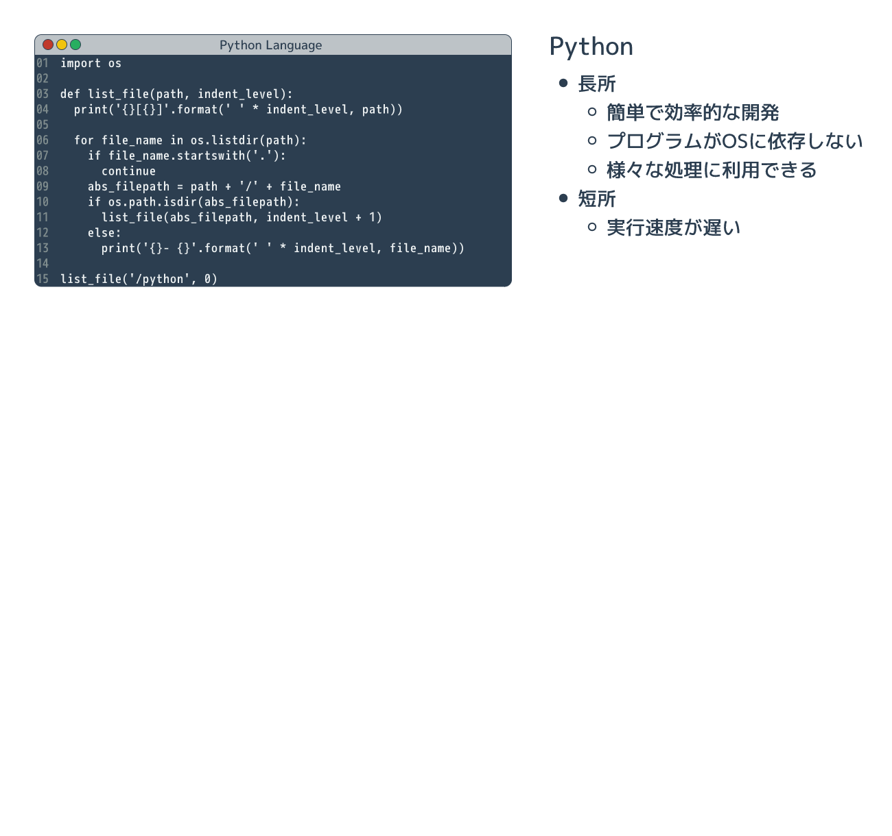

# プログラミングとはそもそもなにか

{{ TOC }}

## 概要

#### 図:プログラミング言語を介した機械への命令

コンピュータは人間の言葉を理解できず、01で記述されたプログラム(命令)の通りに動きます。
ただ、逆に人間は「01で書かれた機械の命令」は理解しすることが苦手です。

プログラミング言語はこの「人間の言葉」と「01で書かれた機械の命令」の中間に存在しています。
人間が「規則性を持ったプログラミング言語」で命令を書き、それを01に変換してコンピュータに実行させます。
このようにすることで、人間が苦労少なくコンピュータに命令を与えることができます。

プログラミング言語にも幾つかの種類があり、Pythonはその一つです。
コンピュータに同じ命令をするにしても、簡単なプログラミング言語で書けば簡単に書けます。
一方、難しいプログラミング言語でプログラムを書けば、余計な知識が必要とされるため難しいです。
効率的にプログラムを書くには簡単な言語を選ぶことが大事であり、Pythonは簡単な言語です。

また、プログラミング言語にはそれぞれ得意不得意な分野があります。
Pythonは他の言語に比べると得意な分野が広いものの、例えば組み込みコンピュータの制御といった機械に近い部分は苦手です。
どのようなことを実現したいかによって、学ぶべきプログラミング言語は変わってきます。
特にこだわりがないのであれば、最初は簡単で広く使われているプログラミング言語を学ぶべきでしょう。

Pythonは簡単なプログラミング言語として普及しており、なおかつ多くのことが実現できる優秀な言語です。
そのため、最初に学ぶプログラミング言語としてPythonを選ぶのは間違っていません。

## 機械と人間のかけはしとなるプログラミング言語

### 機械の言葉「01」

私達人間は言葉でものごとを考え、お互いの意思を会話や仕草で伝えます。
程度は違っても動物もこれと同じです。
これらの会話や頭の中での思考に使われる言葉は**自然言語**と呼ばれており、日本語や英語は含まれます。

一方、コンピュータ(PC)はこれと全く異なります。
内部の電気信号で命令を実行し、データのやりとりも電気信号を使います。
そのため人間の言葉といった曖昧なものではなく「電気のON/OFF」という単純な仕組みを組み合わせることで動いています。
電気の「ONとOFF」という2つの状態は、数字の「1と0」に対応付けることができます。
そのため、機械に命令を伝える際は「ON OFF ON」などと書くのではなく「101」と書きます。
機械ができる言葉である01の命令は**機械語**と呼ばれています。

これからプログラミングで学ぶような「PCのディスプレイに"Hello"と表示させる」という命令も、
つきつめると全てが「ON/OFF」、つまり「0,1」で構成されています。
ただ、「画面にHelloと出力する」ことを普通の人は機械に01で命令することはできません。

#### 図:人の言葉(自然言語)と機械の言葉(機械語)

人が使う自然言語と機械が理解できる機械語の隔たりは大きいです。

### なぜプログラムを書くのに日本語ではなく「プログラミング言語」を使うか

人間は機械とは違って「アナログ」な「言葉」を通して、ものごとを考えたり、意思疎通をしています。
この人間の言葉は機械が理解できる「01の命令」に比べると、かなり曖昧です。

機械は人間の言葉を理解することが苦手です。
英語をGoogle翻訳で日本語に直すと、少しおかしな結果が返ってくることがあるように、
厳密に内容を理解できない場合が多々あります。
そのため、あえてプログラミング言語は日本語や英語のような「曖昧な言葉」ではなく、
明確なルールを持った「制限された言葉」を使います。

例えば料理の手順を自然な言語と、ルールを持った言語で書くとすれば、
以下のような違いとなります。

* 日本語: 70度の水で、15分間茹でます
* 料理用のプログラミング言語例: ゆでる 70度　15分

後者のプログラミング言語は、私が文法を「作業　温度　時間」としました。
これであれば、焼いたり揚げたりといった内容も単純になるため、機械が理解しやすいです。

「01」でプログラムを書くのは人間には難しく、
「そのままの人間の言葉」でプログラムを理解するのは機械には難しいです。
そのため、人間にも機械にも理解しやすい両者の中間にある「プログラミング言語」を使うわけです。

#### 図:プログラミング言語を介した機械への命令

機械は電気信号である「01」しか理解できません。
そのため、「プログラミング言語」で書かれたプログラムを「01」で書かれた命令に変換する必要があります。
この01で書かれた命令のことを「機械語」と呼びます。
機械はこの機械語で書かれた命令を実行します。

図にあるように人間が「機械にHelloと言わせたい」と思ったら、
プログラミング言語で「Hello と出力しろ」と命令を書きます。
上記図の「print(“Hello”)」がその命令です。
この命令のことを「プログラム」や「コード」と呼びます。

この「人間がプログラミング言語で開発し、それを機械が01に変換したうえで実行する」までの流れを「プログラミング」と呼んでいます。
(プログラミング言語で書くまでのみをプログラミングと呼ぶ場合もあります)

### 機械語への変換方式

プログラミング言語から機械語への変換には大まかに次の2つの方式があります。

* コンパイル方式
* インタプリタ方式

コンパイル方式はプログラミング言語で書かれた命令を、「コンパイラ」と呼ばれるプログラムで、
プログラムが実行される「前」に機械語に変換します。
そして、その機械語のプログラムを実行するという流れで処理されます。

一方、インタプリタ方式はプログラムを実行する際に、
「インタプリタ」と呼ばれるプログラムがプログラミング言語の文法を読み取って解釈し、
その場で機械語に変換してプログラムを実行します。
先のコンパイルが事前に全てを機械語に変換したのに対し、
こちらは実行する直前に変換をします。

コンパイル型とインタプリタ型のプログラミング言語には、それぞれ長所と短所があります。
ただ、いずれにせよ"Hello"というテキストを表示するために「0,1 の規則性を勉強して、
0,1を延々と羅列して命令を書く」のと「プログラミング言語で print("Hello")と書く」 ことを比べたら、
どう考えても後者のほうがずっと簡単で効率的です。
そのため機械になんらかの作業をさせる場合は、プログラミング言語を使ってその命令を書きます。

## なぜ Python を学ぶのか

### 高級な言語と低級な言語

世界には数え切れないほどのプログラミング言語があり、実際に多くの人達に利用される言語でも数十種類はあります。
アプリケーションやサービスを作るにはどの言語を使うか選ぶ必要があります。

プログラミング言語にはそれぞれ得意な分野があります。
本サイトで学ぶプログラミング言語「Python」は、他の言語よりも汎用的(なんにでも使える)であり簡単です。
先程、プログラミング言語は人間と機械の中間にあると説明しましたが、
他のプログラミング言語よりも、Pythonは「人間より」だということです。

逆に有名な「C言語」は「機械より」なプログラミング言語です。
プログラミング言語が機械側に近いということは、
非常に小さなコンピュータ(例えば車のエンジン制御のチップなど)を動かす際に、
機械にとって処理しやすいプログラムを作ることができるということです。
また、機械に理解しやすいプログラムは高速に動作する場合が多いです。

人間に近いプログラミング言語は高級言語と呼ばれ、機械に近い言語は低級言語と呼ばれます。
高級であるほうが優れているように思われるかもしれませんが、単に使う場面が違うだけです。

1990年代以前であればコンピュータの処理能力もあまり高くなかったためC言語を使う機会も多かったですが、
現在はコンピュータは高速であるため処理能力よりも開発の生産性を重視して高級言語を利用する機会が増えています。
例えば、ある処理をするプログラムの開発に以下の2つの方法が考えられるとします。

* 0.0001秒で終わらせるプログラムを低級言語で1週間かけて開発する
* 0.001秒で終わらせられるプログラムを高級言語で1日で開発する

プログラムの開発にかかる人件費や、開発した後の保守費もタダではないので、
多くの場合は後者が選ばれるでしょう。

### 同じプログラムを複数のプログラミング言語で比較する

Python は汎用的であり簡単だと言いましたが、それは具体的にはどういうことでしょうか。
まずは論より証拠を見せたほうがはやいと思いますので、
「ディレクトリ(フォルダ)の階層を書き出すプログラム」を複数のプログラミング言語で書いて比較してみます。
実現することは全く同じですが、それぞれの言語の特徴がよくわかります。
同じ内容を複数の言語で書けば、それぞれの言語の特徴がよく分かります。

以下のアニメーション図では「Python」と「Java」と「C」という主要なプログラミング言語の3つコードと、
その特徴を示しています。

#### 図:同じ処理をするプログラムの比較

私から説明するまでもなく、Pythonのプログラムが短くて簡単に書けそうに思われたのではないでしょうか。
実際にその通りです。

### 3つのプログラミング言語の比較結果

いくつかのプログラミング言語で同一の処理を書きましたが、
ここで知ってほしいことは各プログラミング言語の詳細というよりも
「Aという処理を、Pythonだと2行で実現できるのに、Cだと5行必要」というような具合で、
言語ごとにプログラムを書く労力が大きく違うということです。

処理を書けば書くほどプログラムの文量がどんどん増えていくので、
今回の例では PythonとC言語のコード量には3倍以上の開きがありました。
開発時間に関しては私がPythonが得意ということもありますが、両者に10倍以上の開きがありました。

また、C言語に詳しいかたは気付かれたかもしれませんが、
先のC言語のコードはディレクトリが深くなったり、ファイル名が長かったりすると一気に破綻します。
作業領域の確保といった細かいことをC言語では気にする必要があるためです。
Pythonではそのようなことは気にする必要はありません。

Java言語はC言語に比べると柔軟な言語であるため、開発時間は短くて済みます。
Pythonの約2倍程度の時間で先ほどのコードを書くことができました。
ただ、Javaは「プログラミング言語としての文法が豊富で複雑」という特徴があります。
一旦理解してしまえば問題ありませんが、「とりあえず動かしたい」という初心者には最初のハードルが高いかもしれません。

最後に、Python、Java、Cの特徴を比較した図を記載します。

#### 図:プログラミング言語の比較

繰り返しますが、PythonはC言語やJavaに比べると、同じ処理を短いプログラムで実現することができます。
短いということをいいかえると、PythonはCやJavaより「簡単」な言語であるともいえます。

私の個人的な意見なのですが、初心者がまず学ぶべきことはプログラミング言語の仕様詳細よりも、
「プログラミング作業を行う際の考え方」です。
複雑な処理を実現したいときに「処理を小さい単位に分解して、
どのようなステップで実現するか順序立てて考える」ことが必ず必要となります。

それを学ぶのであれば、C言語のように余計な作法に振り回されて本質に注力できないプログラミング言語や、
Javaのように複雑で覚えることが多い言語よりも、
Pythonのような簡単な言語のほうが優れています。

Pythonは簡単なだけではなく、有名な大規模なソフトウェアプロジェクトで採用されていたり、
GoogleやCiscoといったメジャーなIT企業でも積極的に利用されていたりします。
開発のエキスパートたちがPythonを好き好んで利用しているのですから、
それはきっと素晴らしい言語ということです。

## 用語

* プログラミング
* プログラム
* コード
* プログラミング言語
* 自然言語
* 機械語
* コンパイル
* コンパイラ
* インタプリタ
* Python
* Java
* C言語
* アセンブリ言語
