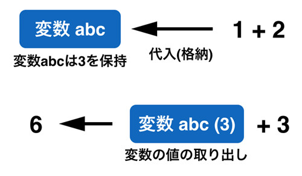
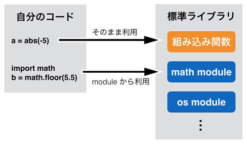
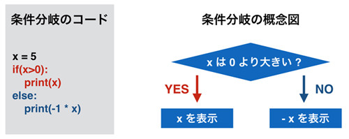

# 初級編の概要

{{ TOC }}

## 概要

Pythonプログラミングは他のプログラミング言語に比べると、それほど学習に時間がかからないと言われています。
ただ、それでも学ぶべきことは多くあります。

プログラミングの全体像を理解せずに、黙々とページを読んでいくのも退屈かもしれません。
そのため、細かいことを説明する前に、このページではでPythonプログラミングを体験してもらいたいと思います。

この後のページで詳細な解説をするため、このページの内容は深く考えずに軽く流してください。
手を動かして、プログラミングでどのようなことができるのか感じてみてください。

本ページの内容としては、最初にPythonプロンプトを使ってPythonの様々な機能を使います。
具体的には以下のようなものです。

* 変数
* 関数
* モジュール

これらは改めて、後のページで扱います。
ただ、あまりにも基本的な内容であるため概要だけは次ページ以降でも必要となります。
そのため本ページで説明します。

そのあとでGUIを使った簡単なアプリケーションを作成します。
GUI以外にもアプリケーションは存在しますが、目に見えて分かりやすい内容ですので取り上げました。
以降のページでも単純にプログラミングの文法を覚えていくだけでなく、
自分のゴールをどこにするかを意識しながら学んで下さい。


## Pythonシェル

さっそくはじめていきましょう。
Pythonのプロンプトを起動してください。

多くのプログラミング言語は、一行一行に順に命令を書いていくことで複雑な処理を実現します。
Pythonもそれと同じです。


### 計算

まずは簡単な数値計算を、Pythonにさせてみます。
Pythonプロンプトに計算式を書くと、その結果が返されます。

```python
>>> 1 + 2
3
>>> 3 - 4
-1
>>> 5 * 6
30
```

3つめの式にある「\*」は、掛け算です。

これも立派なプログラムなのですが、一行でできることは限られています。
そのため、現実的なプログラムを書くのであれば「ある行の処理を別の行の処理に、関係性を持たせる」ことが必要です。


### 変数

一番簡単な行と行の関わり方は、ある行の処理結果を別の行で使うというものです。
具体的には、1行目の結果を2行目で利用するといったことになります。

その際、「処理の結果を保存する」ことが必要となり、そのために「変数」を使います。
「変数に処理の結果を保存」し「変数から処理の結果を取得」することによって、
後ろの行で前の行の結果を使うことができます。

以下に変数の利用例を示します。

```python
>>> abc = 1 + 2
>>> abc + 3
6
```

上の例では1 + 2の結果を「abc」に保存しています。
この保存に利用しているabcが「変数」で、「=」記号の右側の結果を、左側の変数に格納します。
変数に利用する文字はabcでなくても構わず、名前付けのルールさえ守れば自分が好きなものを使うことができます。
なお、変数に値を格納することを「代入する」といいます。

これらをまとめると、1行目は「1+2の結果を、変数abcに代入している」といえます。

次の行では、変数に代入された「3」を取り出し、3+3を計算して6を得ています。
値が代入された変数をプログラム中に書くと、その中に格納されている値を取り出して使います。
値の取り出しは何回でも行なうことができ、取り出しても変数の中身はなくなりません。

変数の概念を以下の図に記します。




### 関数

プログラムは、処理を一行一行書いていくことを繰り返して作られるのですが、
全ての機能を「自分で書く」ことはできません。

たとえばファイルの内容を読み込む処理をしたいとした場合、
その処理は「1 + 1」とは根本的に違います。
「ファイルを開いて、それを読み込む(readする)」といった処理が必要となります。

ファイルの読み込みのような特別な処理は、「Pythonの言語開発者が作った機能」を呼び出すことで実現します。
具体的には、「ファイルを開く処理」を呼び出し、その後で「ファイルの中身を読む処理」を呼び出すのです。
この特別な機能の呼び出しは「関数」と呼ばれる機能を使うことなどで実現できます。

ファイルの読み出しだと話が難しいので、もっと簡単な「数の絶対値を得る」という関数を利用してみます。

```python
>>> abs(-5)
5
```

上記のプログラムの「abs」が関数です。
関数は複数存在し、それぞれに名前があります。
その名前を指定することで関数の「処理」を呼び出すことができます。

関数absの処理は「数値を受け取って、それを絶対値にして返す」というものです。
そのため、上記では()のなかの「-5」を受け取って、画面に出力されている「5」を返しています。

関数は「なんらかの処理を実行する」ので、今回は数値を受けとり、
数値を返すという

上記のプログラムでは、「abs()」を使うことで-5の絶対値である5を得ています。
absが関数の名前で()の中の数字が関数に与える値です。

この関数は変数などと組み合わせることもできます。

```python
>>> value = abs(5)
>>> value
5
```

1行目では、関数absへの入力値として「5」を与えて、出力値として「5」を得て、それを変数valueに代入しています。

変数の値の取り出しにしろ、関数の呼び出しにしろ、それが実行されれば単なる値と同じです。
そのため、その結果を代入したり、改めて変数に代入したり、関数に与えたりといったこともできます。

この関数absを使うことで、自分で絶対値を得る具体的な処理を書かなくても絶対値を得ることができています。
絶対値を得るぐらいの処理でしたら自分で書いてもいいでしょうが、
先ほどのファイル処理やネットワークの利用などはそもそも関数を使わないと実現不可能です。

### 標準ライブラリとモジュール

次に「小数点の切り捨て」をします。

小数点の切り捨てもabsと同様に関数として提供されています。
ただ、絶対値を得るabsほどよく使われる処理ではないので「組み込み関数(いきなり使える関数)」としては提供されていません。

小数点の切り捨ての関数は「標準ライブラリ」という、特定の処理をするための「ツール」のなかの、
ひとつの機能として提供されています。

標準ライブラリはそのなかに、特定機能を担当する「モジュール」をいくつも持っています。
たとえば、数学関連の「mathモジュール」や、OSの機能を利用するための「osモジュール」などがあります。

組み込み関数以外の「モジュールに属する関数」を使う場合は、
まず「◯◯というモジュールを使いますよ」という宣言をする必要があります。

切り捨ては「数学」的に利用される機能ですので、「mathモジュール」に含まれています。
そのため、今回は「mathモジュールを使いますよ」という宣言をして、そのうえで小数点の切り捨て関数を使います。

具体的には次のようになります。

```
>>> import math
>>> math.floor(5.5)
5.0
```

importは日本語でいうと「取り込む」といったニュアンスがあります。
そのため、「import math」は「mathモジュールを取り込む」と宣言しています。

モジュールを取り込むと、そのモジュールの関数を使えるようになります。
2行目はmathモジュールのfloor関数を呼び出しをしています。

モジュールに属する関数は、“モジュール名.関数()”というスタイルで呼び出すことができます。
5.5を与えて5.0を得ているのは先ほどのabsと同じですが、関数名の前にモジュール名がついているところが違います。
組み込み関数とモジュールの利用方法を以下に図示します。



なお、mathモジュールにはほかの機能もあり、floorはそのひとつにすぎません。
切り捨てがあるのですから切り上げも当然ながらあります。

また、実際に試してみるとわかりますが、モジュールの関数をimportなしに使おうとすると、
エラーが発生します。

```python
$ python3
>>> math.floor(5.5)
Traceback (most recent call last):
  File "<stdin>", line 1, in <module>
NameError: name 'math' is not defined
```

エラーには「math」は定義されていないと表示されています。

この「○○ is not defined」は良く見かけるエラーです。
宣言などがされていない何か(代入されていない変数、定義されていない関数など)を、
利用した場合に発生します。

### print関数

今後のプログラムで利用することになるprint関数について説明します。

この関数を呼び出すと、引数に与えた値をコンソールに出力します。
たとえば以下のようになります。

```python
>>> print('hello')
hello
>>> abc = 3
>>> print(abc)
3
```

print関数は上記のように変数に何が入っているか確認する用途に利用できます。
そのため、プログラムの挙動を確認するのに便利です。

本書のコードがどういう動きをしているか分からない場合は自分でコードにprint関数を挟むことで、
どこをどう実行しているかといったことや、変数になにが入っているかということを確認してみてください。


## プログラムファイルの作成と実行

ここからはプログラムが複雑になってくるため、
Pythonシェルではなく、プログラムファイルにプログラムを書いて実行します。

### 関数の作成

さきほど絶対値を返す関数absを使ってみましたが、このような「関数」を自分で作ることも可能です。

absのような一般的な処理は、それが関数やモジュールの関数などで既に提供されている可能性があります。
提供されていれば、それを使えばよいだけですので、自分で処理を作る必要はありません。
ただ、自分だけが使うような処理は自分でプログラムを作る必要があります。

自分で処理を作る際に知っておいて頂きたいのは、
関数を自分で定義できれば「何度も同じ処理を書く必要がなくなる」ということです。
自分が使いたい関数を自分で作り、その関数を何度も呼び出すだけで自分独自の処理を何度も実行できます。

また、「プログラムを整理する」という目的で関数を作ることも有効です。
延々と複雑な処理を書くよりは、処理Aと処理Bと処理Cを作り、それらA,B,Cを使って処理Dを作るとしたほうが、
処理Dの動きは分かりやすいものとなります。

関数作成の手始めに“hello”と出力する簡単な関数「print_hello」を作ってみます。

```
def print_hello():
  print('hello')
```

上記は関数の宣言(名前の登録)と処理の実装(機能を作る)をしています。
一行目の`def`で関数を作るという宣言をし、`print_hello`という変数名としました。
そしてその宣言の後に関数の処理である`print('hello')`が書かれています。

作った関数を使うためには、それを呼び出します。

```python
def print_hello():
  print('hello')

print_hello()
```

これを実行すると以下のように出力されます。

```text
hello
```

print_hello()を2回呼び出せば、helloが2回出力されます。

次にprint_helloよりも、もう少し複雑な関数「add5」を作ります。
名前から分かるかもしれませんが、受け取った数値に5を加えたものを返す関数です。

```python
def add5(x):
  y = x + 5
  return y
```

defで定義する際にadd5の()の中にxという変数が書かれています。
このxは関数を呼び出す際に「値を受け取る」ことを意味しています。

そして関数の定義の最後にreturnという命令が加えられています。
これは呼び出し元に、returnの後に指定した値を返すという役割を果たします。

さっそく定義した関数`add5`を使います。

```python
def add5(x):
  y = x + 5
  return y

z = add5(5)
print(z)
```

```text
10
```

absが値を受け取るのと同じように、add5も値を受け取ります。
呼び出し側である「`z = add5(5)`」の()のなかの5と、
呼び出される側である「`def add5(x):`」のxは対応がとられています。
そのため、定義された関数内の処理ではxに5が代入された状態となり、
続く処理が実行されます。

`y = x + 5`の前に、`print(x)`などという処理を書いてみれば、
実際にxに5が代入されていることが分かるはずです。

関数の最後にある`return y`を実行した際、上記の例ではyには10が代入されています。
そのため、`z = add5(5)`の`add(5)`は10を返し、それがzに代入されるという動作をします。

なお、わかりやすくするために、上の例では命令を一行にひとつしか書いていませんが、
一行に複数の命令を書くことも可能です。

上記のadd5の例では、以下のようになります。

```python
def add5(x):
  return x + 5

print(add5(5))
```

```text
10
```

### 条件分岐

関数作成の最後にabsと同じ働きをする関数「my_abs」を作ってみます。
まず絶対値を得るにはどういう手順で実現するか、考えてみます。

1.	数字Xを受け取る
2.	その数字Xが0より大きければ、すでにXは絶対値。 Xが0より小さければ、-1をかけて絶対値にする。
3.	絶対値を関数の呼び出しもとに返す

この2番目のステップで、「Xが0より大きければ、Aをする。そうでなければBをする」といったように、
プログラムの処理が条件によって、動きが変わります。

このような条件に依存した特別な処理の書き方を「条件分岐」と読んでいます。

条件分岐もプログラムで実現できます。



上記の図を参考にして、関数my_absを書いて利用してみます。

```python
def my_abs(x):
  if x > 0:
      return x
  else:
      return x * -1

print(my_abs(-6))
```

```text
6
```

先ほどのprint_hello、add5関数よりも複雑になっていますが、最初の5行で関数の定義をして、
後半で定義した関数を呼び出している点は同じです。

-6という数字をmy_abs関数に渡して、
返された絶対値をprint関数で画面に出力しています。

関数my_absの中の動きを見てみます。

my_abs(x)のxは、呼び出しもとで渡された値を格納しています。
今回は-6になります。

その次に「xが0以上ならAをする、そうでないならBをする」という処理がきますが、
それが「if else」の文です。

if文の後の条件「x > 0 (xは0よりも大きいか)」が満たされるなら、
if文に続く「return x」が実行されます。

条件が満たされないなら、elseの後の処理である「return x * -1」が実行されます。

つまり、「x > 0」のときはxをそのまま返して、
x>0でないときは-1をかけて負数を正数にしたうえで値を関数の呼び出しもとに返すということです。

これで渡された値(xに代入されている)が正数であろうと、負数であろうと、
常に絶対値が返されます。

ifのような「条件分岐」や、特定の処理を繰り返す「ループ」と呼ばれるものを組み合わせることで、
プログラムの動きをより複雑にすることができ、「特定の機能を実現するためのルール」が実現されます。
そのルールのことを「アルゴリズム」と呼びます。

### GUIのプログラムを体験1

一行一行命令を書くことと、誰かが作った処理(関数など)を呼び出すことで、
プログラムが作られるということはわかっていただけたかと思います。

ただ、簡単な計算処理をさせるだけではプログラミングで何を実現できるか、
いまいちイメージがつかめていないかもしれません。

そのため、かなり駆け足となってしまいますが、GUIのアプリケーションを実際に作ってみたいと思います。
GUIという目に見えて分かりやすいものを作ることで、
「一歩先のレベルで何が作れるようになるか」を実際に味わってもらいたいと思います。

なお、GUIのアプリケーション開発はオブジェクト指向の知識を必要とします。
そのため、本サイトの初級編ではなく、中級編で扱っています。

まず、以下のプログラムをコピペで結構ですので実行してみてください。

```python
import tkinter

font=('Helevetica', 32, 'bold')
label = tkinter.Label(text='Hello Python', font=font, bg='red')
label.pack()
label.mainloop()
```

プロンプトへの貼り付けはうまく貼り付けられないことがあるので、
前回話したようにファイルに記入してから実行したほうがいいかもしれません。

起動すると以下のようなGUIの画面がでてきます。


GUIを利用する手法はさまざまですが、上の例では「tkinter」と呼ばれるPythonが提供しているGUIのモジュールを使っています。

mathモジュールと同じように、tkinterをimportし、「tkinter.Label」という関数でGUIのパーツを作り、
それを変数labelに格納しています。
その際にフォントや背景色、テキストに表示する文字などを指定しています。
少し複雑ですが、基本的には関数absに-5を与え5を得ていたのと全く同じです。

そして、そのlabelに格納されたパーツに対して、「pack()やmainloop()という処理をしろ」と命令することで、
実際に画面にGUIのパーツが画面に表示されます。


### GUIのプログラムを体験2

本章の最後にGUIのカウンターのアプリケーションを書いてみます。
アプリケーションとしては非常に単純なもので「ボタンがクリックされた回数」を表示するだけのものです。

```python
import tkinter

counter = 0
font=('Helevetica', 32, 'bold')
button = tkinter.Button(font=font, text=str(counter))

def clicked():
    global counter, button
    counter = counter + 1
    button.config(text=str(counter))

button.config(command=clicked)
button.pack()
button.mainloop()
```

こののプログラムを実行すると、以下のようなアプリケーションの画面が立ち上がります。
このボタンをクリックすると、表示される数が増えることがわかります。


上記のプログラムを細かく解説することはしませんが、このプログラムで以下のようなことを行っています。

* def clicked(): による関数の宣言
* button.config(command=clicked) による関数の登録

ボタンをクリックした際の処理を自分で関数「clicked」として定義し、
それを「button」というGUIのパーツに「ボタンがクリックされたらこの関数を実施して下さい」という形で登録をします。
そうすることで簡単にGUIのプログラムをカスタマイズして作ることが可能になります。

今までのプログラムに比べると、相当複雑です。
ただ、それでも自分で何にも頼らずにGUIのアプリケーションを作ることに比べれば簡単です。

これから学んでいく様々なテクニックを覚えて、使っていくことで、
このようなこともいずれできるようになっていくはずです。
