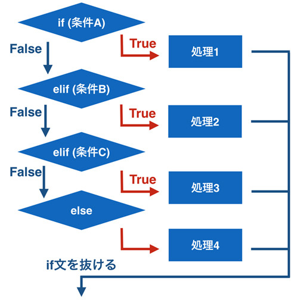
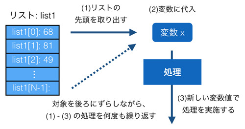
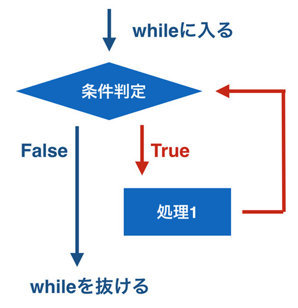

# 制御構造

{{ TOC }}

## 概要

プログラムの基本的な流れは上から下へ一行ずつ実行していくというものです。
単純なプログラムですと、テキストファイルに実施する処理を順番に羅列するだけで実現できます。
いわゆる「バッチ処理」と呼ばれている処理方式です。

ただ、複雑なプログラムだと、
このような「上から下に順番に実行していく」というスタイルだけでは処理を実現できなくなってきます。
たとえば、天気予報を確認するアプリケーションでは、
「今日が晴れなら晴れマークを表示、雨なら雨マークを表示」といった具合に
「あるものがAならBをする。そうでないならCをする」という複雑な処理が必要になってきます。
「条件」に応じて処理が「分岐」しているので、こういった処理のことを「条件分岐」といいます。

ほかには、同じ処理を何度も繰り返す「ループ処理」があります。
たとえば、「クラス全員のテストの平均点を求め、
その平均点と各生徒の点数の差分をチェックする」といった場合を考えてみましょう。
平均を求めるには「生徒の点数の合計/人数」とする必要がありますが、
この合計を求めるために「先頭の生徒から最後の生徒まで順番に点数を足していく」という「繰り返し(ループ)」が必要となります。
平均との差分の算出も同様です。

本ページではこのような条件分岐やループ処理といった「プログラムの制御構造」について取り扱います。
これらの処理を使うこと自体はそれほど難しくないので、何度も書いて慣れてしまえば、
簡単に使いこなせるようになるはずです。

## if による条件分岐

条件分岐は、条件分岐の式を満たすか満たさないかで実行される処理が変わるという制御構造です。
前章にて扱った Bool型が条件判定に利用され、その値がTrueかFalseかで実行するプログラムの挙動が変わります。

以下に条件分岐の仕組みを図で記します。



上記の図のうち、「if」は必ず必要です。そして「elif」は任意の数(0も含む)繰り返すことができ、
「else」も省略することができます。if や elif、else にはそれぞれ決まった処理が書かれます。
条件が合致した処理のみが実行され、他の条件に結びついた処理は一切実行されません。
elseがないときは、どの条件にも合致しない場合は「何もしない」という動きになります。

この図をPythonのプログラムで書くと以下のようになります。

```
if(条件A):
  処理1  # 条件 A が True の時に実行される処理
elif(条件B):
  処理2  # 条件 A が False で条件 B が True の時に実行される処理
elif(条件C):
  処理3  # 条件 A,B が False で条件 C が True の時に実行される処理
else:
  処理4  # 全ての条件が False の時に実行される処理
```

上記のifからelseの次の行までがひとつの「if文のカバー範囲」であり、
そのなかにあるifやelif、elseが細かい処理の単位だと思っていただければ大丈夫です。
条件ごとの処理はインデント(字下げ)されていることが分かります。

実際に条件分岐を行うプログラムを書くことで、条件分岐の使い方をイメージしてみましょう。
プログラムは非常に簡単で、変数xの値が0より大きければ「+」と出力し、
ピッタリ0なら「0」、0未満なら「-」と出力するというものです。
これは以下のようになります。

```python
x = 5
if(x > 0):
  print('+')
elif(x == 0):
  print('0')
else:
  print('-')

# +
```

上記プログラムをIDLEのエディタに書いて実行してみてください。
xに5が代入されているので、「+」と出力されたはずです。これはx > 0の条件式が満たされ(Trueとなり)、
「print('+')」が実行されたからです。そして if else の条件文をぬけるため、
print(‘0’) や print(‘-‘) は実行されません。
このxに代入する値をいろいろ変えて動かしてみると、どの条件式がチェックされ、
「if、elif、else」のどの処理が実行されたのかイメージできるはずです。

## インデントとコードブロック

条件分岐の話が終わったので、インデント(字下げ)についてもう少し詳しくお話しましょう。
先ほどのプログラムでif文に書かれた処理はかなりシンプルなものでしたが、
実際にはif文は多くの処理を持ちます。
すると、if文 が「どこからどこまでをカバーしているか」をどのような形で表現するかが問題になってきます。
このカバー範囲のことをコードブロックと読んでおり、
インデント(字下げ)を揃えることで範囲を決めています。
Pythonのインデントの仕方は「半角空白を4つ」が標準で、それに次いで半角空白2つも一般的です。
タブの使用は推奨されていません。本書は紙面の都合上、半角空白2つとしています。

以下のコードを見て下さい。

```
処理1
if(条件A):
   # ここから
   処理2
   処理3
   # ここまでがコードブロック
else:
   # ここから
   処理4
   # ここまでがコードブロック
処理5
```

上記のプログラムでは処理1、2、3、4、5 があります。このうち処理1は if 文の範囲外なので常に実行されます。
そして処理2,3 は if 文のコードブロックに属するので、条件Aが満たされる場合に両方とも実行されます。
処理2,3 のインデントは同じ深さなので、同じコードブロックです。
処理4はelse の場合のみ実行され、処理5は常に実行されます。
字下げをすることでコードブロックを表現する。簡単です。

なお、CやJavaにもコードブロックはありますが、その書き方は異なっています。
たとえばJavaだと上記のサンプルコードは以下のようなものとなります。

```
処理1
if(条件A){    
  // ここから
  処理2  // 字下げは必須ではない
  処理3
　// ここまでがコードブロック
}else{
  // ここから
  処理4
　// ここまでがコードブロック    
}
処理5
```

{}で囲むことでコードブロックを表しています。
たいていは読みやすいように上記のようにインデントをしますが、
プログラムとしてはインデントをする必要性はありません。

### コードブロックのネスト

コードブロックの中にコードブロックを作ることも可能です。
たとえば条件分岐の中に、さらに条件分岐を作ったりすることもできます。
書き方は簡単で、コードブロックの内側にさらにコードブロックを作るというものです。
その際、内側のコードブロックは外側のコードブロックに属しています。

サンプルコードをあげてみます。

```
if(条件A):
  処理1    # "if(条件1)"のコードブロックに属する
  if(条件B):
    処理2   # "if(条件1)" と "if(条件2)" の両方法のコードブロックに属する
  処理3
else:
  処理4
```

処理1、2、3はすべて「if(条件1)」のコードブロックに属していますが、
処理2だけではそれに加えて「if(条件B):」にも属しています。
そのため、処理2が実行されるのは条件A、Bが共にTrueのときのみです。
たとえ条件BがTrueであっても、条件AがFalseなら処理2は実行されません。
コードブロックはifやループなどの制御構造だけではなく、関数やクラスでも利用されます。

なお、コードブロックに限らず、
プログラミングで「入れ子」構造にすることを一般的に「ネストする」と言いますので覚えておいてください。
ネストすること自体には問題はありませんが、その深さが増えてくるとプログラムが非常に読みにくくなります。
深いレベルのネストが必要な状況になってきたら、アルゴリズムそのものを見直すか、
後の章で扱う「関数」に処理を分割することで読みやすくすることが多いです。

### pass文

なお、コードブロックの中には最低一つの式を書く必要があります。
そのため、if 文や関数を「とりあえず作って詳細は後で実装する」という場合に
「なにもしない」ということをブロック内に書く必要があります。
それには pass キーワードを使います。

```
a = 'hello'
if(a == 'hello'):
  # 将来ここに処理を実装
  pass
else:
  # 将来ここに処理を実装
  pass

print(a)
```

上記の pass はなにもしないためにこの if 文は不要です。
ただ、コメントにもあるように「とりあえずプログラムの構造を作っておきたい」という場合に pass 文を利用することはよくあります。
pass を書かかずにブロックに何もないとプログラムはエラーとなります。


## for によるループ

ループはその名前からわかるように「同じ処理を何度も繰り返す」という処理です。
ループ処理の制御構造にはforとwhileの2つがあり、両者の使うべきポイントは若干異なっています。
そのため、まずは利用頻度の多い for について扱い、その後で while について説明します。

forは「グループにある要素すべてを処理する」といったときに使われるループ構造です。
一番よく使われるのが、前回お話したリスト(配列)に格納されている要素すべてをチェックするような処理です。
JavaやCで使われるfor文と書き方はかなり異なるものの、ほとんど同じような場面で使います。

Pythonのfor文のイメージを以下の図に書きます。



難しい用語でいうと「イテレーター」と呼ばれる処理方式なのですが、
ようするに「たくさんある集合の先頭ひとつを取り出して、それを処理する。
それが終わったら、次を取り出して処理をする」ということを、集合が空になるまで繰り返すというイメージです。

それほど難しくないので例で示しましょう。
1、2、3、4、5という数字が格納されているリストの中身を、
一つひとつすべてprint出力する処理をforで書くと以下のようになります。

```python
a = [1,2,3,4,5]

for i in a:
  print(i)
```

この for 文は以下のような動きをします。

0. リスト a から 1 を取り出して i に格納。それをprint出力
0. リスト a から 2 を取り出して i に格納。それをprint出力
0. …(中略)…
0. リスト a から 5 を取り出して i に格納。それをprint出力
0. リスト a からすべてを取り出したのでforのコードブロックを終了

すでに想像はついているかもしれませんが、出力は以下のようになります。

```
1
2
3
4
5
```

イテレーターを使っているので、Javaのfor文で使うような「インデックス(配列の何番目か)による制御」に比べて、
間違った要素を指定するリスクが減っています。
一方、インデックスを操作するような複雑な処理は python の for では実現できません。
そのような場合は後述する while を使うことになります。

### forをシーケンスに使う

なお、for 文はリスト以外の「シーケンス型」と呼ばれる「並びを持つ型」 にも使えます。
例えば今までに扱った文字列もシーケンス型なので for 文が使えます。

```
text = 'hello'
for c in text:
  print(c)

# h
# e
# l
# l
# o
```

ただ、for 文は十中八九はリスト及びそれに似た型に対して利用することになると思います。
それ以外の型で使うことはあまり多くありません。

### for の変数名

for 文を書く際に注意すべきなのは取り出した値を格納する変数の名前付けです。
プログラムとしては変数名として有効なものであれば何を書いても動くのですが、
一般的には以下のようなルールがあります。

*	リストなどのシーケンスの変数名に対応する単数形の名前
*	順番に並んだ数字の場合は i, j, k (i が既に使われていれば j といった具合)
*	リストや文字列から取り出す「一文字」は c (character の c)

例えばリストとして students という複数形があればそれを取り出す変数は student といった具合です。
自分でプログラムを開発する場合はこのような名前付けになるように注意を払って下さい。
サンプルプログラムなどで数字の配列に対して for 文を回す場合は i という変数名を使うことも多いですが、
これは index という単語から来ています。
i が既に使われている場合は j, k と使っていくのですが、
これは単に ijk というアルファベットとしての並びがあるからです。
l (小文字のL)は数字の1や大文字のI (i)と見分けが使いにくいので使用は避けることが望ましいとされています。
変数名としてよい名前が浮かばないときに i が使われることも多いのですが、あまりよい使い方ではありません。

## while によるループ

whileもforと同じくループ処理のための制御構造です。
ただ、whileは「ループを何周すればいいかわからない処理」に利用されます。

先ほどのforの例を思い出して下さい。forでのループ回数は「リストaに格納されている要素の数」と明確にわかります。
このような場合はforで処理すべきです。
一方、たとえば「123456789という数字を2進数で表現するのに必要な桁数を求める処理」が必要だとした場合、
これをどうfor文で処理すればいいか、想像できますか。私はシンプルでスマートな実装は思いつかないです。

解き方はいろいろあると思いますが、一番簡単な解法の一つとして、以下のようなものが考えられます。

1.	2 の 1 乗は 123456789 より大きいか　-> No
2.	2 の 2 乗は 123456789 より大きいか　-> No
3.	..
4.	2 の N 乗は 123456789 より大きいか　-> No
5.	2 の N+1 乗は 123456789 より大きいか　-> YES
6.	N+1桁あれば 123456789 を表現可能だとわかる

この処理では2を1乗、2乗とループ処理でどんどん大きくしていきますが、
最終的に2の何乗になるかがわかりません。
このようなときに「特定の条件をクリアするまでループを回す」ためにwhileを使うと便利です。

以下にwhile文の使い方のイメージ図をのせます。



上記の図を見てもらうとわかるように、while文はループを回るごとに条件式をチェックして、
それがTrueならループを継続して、Falseならループを抜けるという処理をします。
これはJavaやCのwhileとまったく同じです。

先ほどの2進数の桁数を求めるプログラムをwhileで書いてみます。

```python
a = 123456789
i = 1
while(2**i < a):
  i+=1
print(i)
# 27
```

すでに扱った内容ですが、上記のプログラムを補足すると、2**iは「2のi乗」を計算していて、
i+=1はiをインクリメント(i = i + 1)しています。
2**iが123456789より小さい間はiをインクリメントしていき、
2**iが123456789より大きくなったらループを抜けるという動きをします。
ループを抜けた際iに入っている値が必要な桁数を表しています。

## break と continue によるループ制御

ループ制御そのものの打ち切りや「ループのその回だけ」の打ち切りが必要な場面があります。
たとえば以下のような偶数が含まれるかを判定するプログラムがあるとします。

```python
a = [1,3,5,7,9,10,11,13,15]
has_even = False
for i in a:
  if(i%2 == 0):
    has_even = True
print("List has even: " + str(has_even))
# True
```

上記はリストを for 文で走査し、その要素が偶数であれば has_even という変数に True をいれます。
リストに偶数がなければ False のままで、偶数があれば True になります。
今回はリストの中に10があるので、当然Trueとなります。

ただ、よく考えてみてください。なにか無駄な処理があると思いませんか。
そう、ループが10になった回で偶数があることがわかったのに、さらに偶数が含まれるかチェックを繰り返しています。
10が現れた時点で偶数があることはわかりきっているので、ループを回し続けるのは無駄です。

「break」を使ってループ処理を打ち切ることで、この問題を解決できます。
break を使ったプログラムは以下のようになります。

```python
a = [1,3,5,7,9,10,11,13,15]
has_even = False
for i in a:
  print(i)   # NEW CODE
  if(i%2 == 0):
    has_even = True
    break  # NEW CODE
print("List has even: " + str(has_even))
```

確認のためにbreakだけでなく、print文も追加しています。
これを実行すると以下のようになります。

```
1
3
5
7
9
10
List has even: True
```

どうです、11以降のチェックをしなくなりました。
i に10が代入されたタイミングで break が実行され、ループから抜けているためです。

### continue

一方「continue」ですが、正直こちらはbreakほど頻繁に利用されない気がします。
ただ、ループで「特定の条件の場合だけ処理をしたい」というときに利用されることが多いです。

たとえば、数値1から99のリストのうち、3でも5でも割り切れるものだけを画面出力する必要があるとします。
リストを使わないで愚直な書き方をすると以下のようになります(実際はcontinueを使わなくとも、もっとスマートに書けます)。

```python
for i in range(1,100):
  if(i%3 == 0):
    if(i%5 == 0):
      print(i)

# 15 30 45 60 75 90
```

上記は range 関数で [1,2,3,..,98,99] というリストを作成し、
それに対して for ループを回しています。
もし、iが3で割り切れたら、もしiが5で割り切れたら……などというように条件分岐がどんどん深くなってしまいます。
これをcontinueを使って書き直すと、次のようになります。

```python
for i in range(1,100):
  if(i%3 != 0):
    continue
  if(i%5 != 0):
    continue
  print(i)

# 15 30 45 60 75 90
```

行数は増えてしまいましたが、プログラムの見渡しはよくなりましたね。
このように使いようによっては、breakとcontinueは便利です。

### 無限ループ

個人的に私がよく使うのは「whileの条件判定にTrueをいれた無限ループ」をbreakで抜けるというものです。
たとえば以下のような構造です。

```
while(True):
  処理
  if(条件):
    処理
    break
  処理
```

気をつけないと無限ループから抜けられなくなりますが、
適切に使えば while の条件式に判定をいれるよりも綺麗なコードが書けます。

## 3項演算子

今まで扱ってきた if 文や ループに比べてあまり利用されないため後にもってきましたが、
実は if 文の亜種の3項演算子というものも存在します。

例えば以下のプログラムがあるとしましょう。

```
a = 5

if(a % 2 == 0):
  is_even = True
else:
  is_even = False

print(is_even)
# False
```

上記プログラムは a という変数に格納されている値が偶数であれば is_even という変数に True をいれ、
そうでなければ False をいれるというものです。
プログラムを書いていると、時々こういうような if 文の結果に応じて同じ変数に入れる値が変わるという場面に出くわします。

3項演算子はまさにこういった処理をするために用意された文法で、以下のように書きます。

```python
a = 5

# (Trueのときに返る値) if (条件式) else (Falseのときに返る値)
is_even = True if (a % 2 == 0) else False

print(is_even)
# False
```

## 1ライナーの条件式

最後に1ライナーと呼ばれるテクニックを紹介します。
インデントとコードブロックで説明したように、基本的には if や for の処理は字下げして書きます。
ただ、1行だけの処理であれば条件式の直後に処理を書くことができます。

例えば以下のようなものになります。

```python
a = 5
if(a==5): print('a == 5')
else: print('a != 5')
# a == 5

for i in [1,2,3]: print(i)
# 1
# 2
# 3
```

Python の分かりやすさは綺麗なインデントにあるといっても過言ではないので、
乱用は避けたほうがいいです。
ただ、あまりにも短い単純なコードであれば1ライナーで書いてしまったほうが見やすい場合もあります。
