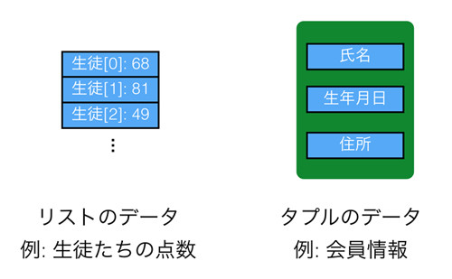

# タプル

{{ TOC }}

## 概要

あとで書く

## タプルの目的

リストという型がなぜ存在するのか覚えていますか。
ひとつの型のなかに任意の数の複数のデータを格納できると便利だからでした。
たとえば「生徒たちの成績を格納する」といった目的で利用されます。
タプルもリストと似ていて、ひとつの型のなかに複数のデータを格納します。
ただ、その目的は異なっていて、「決まった数の複数のデータがひとつの意味を持つもの」にタプルは使われます。

例をあげて説明しましょう。
お店の会員情報というものをデータで表現することを考えてみます。
例えば 'taro, 1986, tokyo' といった具合で単純に文字列としてすべてを含めてしまってもいいのですが、
以下のような複数の要素を持つデータとして表現したほうがプログラムで使いやすそうです。

*	氏名
*	生年月日
*	住所

テキスト処理で文字列の中から生年月日を抜き出したりするよりも、
「Aさんの住所 -> 東京都…」というようにぱっと取り出せる方が便利です。
これはちょうど先ほど説明したオブジェクト指向におけるメソッドがないクラスのようなものです。

タプルは上記のような複数のデータをひとつにまとめるための型です。
Python のリストは様々な種類のデータを格納することができるため、
同じことをリストでも実現できます。
ただ、リストは「可変長(長さが変わる)」なので、
複数のデータが合わさってはじめて意味を持つ場合の利用は本来の用途ではなく、
それよりも同じデータをいくつも格納する用途で使われます。

以下にリストとタプルの違いを図にまとめます。



## 基礎

### 作成

タプルがどういうものかわかっていただけたと思うので、具体的にどのように使うのか説明しましょう。
タプルの作成はタプルの要素となる値を () で囲むことで作成できます。
type関数は型を確認するために利用する関数です。

```python
a = ('taro','1986','tokyo')
print(type(a))
# <class 'tuple'>
```

### 要素の取得

上記は先ほどの会員情報のタプルです。
その要素への参照はリストに似ています。

```python
a = ('taro','1986','tokyo')
print(a[0])
# 'taro'
print(len(a))
# 3

for i in a:
  print(i)
# taro
# 1986
# tokyo
```

ただし、リストと異なり一度作成されたオブジェクトは変更することはできません。

```python
a = ('taro','1986','tokyo')
a[0] = 5
# Traceback (most recent call last):
#  ...
# TypeError: 'tuple' object does not support item assignment
```

### 要素をまとめて取得

少しトリッキーな見た目ですが、タプル内の要素を一気に取得することもできます。

```python
a = ('taro','1986','tokyo')
(b,c,d) = a
print(b)   # taro
print(c)   # 1986
print(d)   # tokyo
```

タプルはC言語でいう「構造体」やJavaでいう「クラスのメンバ関数」の簡易版として使うのが主な用途です。
ただし、構造体やメンバ関数はそれぞれ「変数名」を持っているのに対して、
タプルは「何番目にある要素か」ということを基準にしてデータを管理します。

## タプルの便利な使い方

### 関数の返り値

最後にタプルの便利な使い方を紹介します。あまり機会は多くないのですが、
関数の返り値を2つ返したい場合がときどき発生します。
一つひとつ別の関数に分けて値を取得するようにすることもできますが、
たとえばfor文での探索のようなプログラムだと計算コストが高いため、
無駄に2周するのは避けたほうがよいです。
そのようなときにタプルをreturnで使うと便利です。
たとえば、リストの要素の最小値と最大値を取得する関数だと、返り値は2つ返したいところです。
そのような場合は以下のようにすれば大丈夫です。

```python
def get_min_max(list_):
  min_ = a[0]
  max_ = a[0]
  for i in list_:
    if(i < min_): min_ = i
    if(max_ < i): max_ = i
  return (min_, max_)

a = [5,8,1,4,10,3,7]
(min_, max_) = get_min_max(a)
print('min: {}'.format(min_))
# 1
print('max: {}'.format(max_))
# 10
```

返り値をタプルにした際は、タプルの構造に気をつけて利用してください。
たとえ関数の返り値のタプルの形式が変更されたにもかかわらず、それを利用する側が変更されなければエラーとなります。
複雑な形式をやりとりしたいのであれば、続編で扱うクラスなどにしてしまうほうがよいです。
