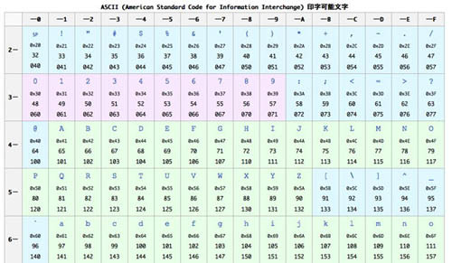
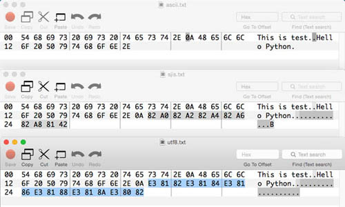

# 基数と文字コードの仕組み

{{ TOC }}

## 概要

日本でプログラミングをする以上、プログラミングにおける「日本語の処理」は必須の知識です。
ただ、日本語について扱うには「文字コード」と文字データがどのように表現されているかを知るための「基数の知識」が必要です。
そのため、順を追って基数と文字コード、そして次の章にて日本語の処理を扱うという手順で説明します。


## 文字コード

### 文字コードの仕組み

コンピュータは、突き詰めると01しか理解できないので、文字も最終的には01に対応付けられます。
その「文字と01の対応関係」を決めるのが文字コードと呼ばれているものです。
アルファベットと数字のみを利用する場合は「ASCIIコード」と呼ばれる文字コードが使われることが多いです。
たとえばASCIIコードだと「01100001」は「a」に対応し、その次の「01100010」は「b」に対応しています。
ただ、先にお伝えしたように2進数だと桁が長いので、一般的には16進数2桁で文字コードを表現します。
aとbはそれぞれ以下のようになります。

```
>>> hex(int('01100001', 2))  # a
'0x61'
>>> hex(int('01100010', 2))  # b
'0x62'
```

以下にASCIIコードの一部を記載します。



見てもらうとわかりますが、文字1文字が1バイトに対応しています。
1バイトは8ビットなので2の8乗パターンの組み合わせ、つまり0～255の256パターンが存在します。
アルファベットや数字、改行などのいくつかの特殊記号だけであれば256パターンもあれば表現できます。

ただ、よく考えてみてください。日本語はどう考えても1バイト＝256個じゃ足りません。
そこで日本語を扱うときは複数バイトを使います。
2バイトにするだけでも65536(256^2) パターン、3バイトにすれば16777216(256^3)パターンの組み合わせが表現できます。

この複数バイトの01と文字のマッピングをする文字コードにはいくつかの種類があります。
日本で有名なのは、Shift-JISやUTF-8、EUC-JPあたりでしょうか。
文字コードが違えば、01に変換したデータも変わってきます。

以下のテキストがあるとします。

```
This is test.
Hello Python.
あいうえお。
```

文字コードとバイト配列を比較するためにこれをASCII、Shift-JIS(SJIS)、UTF-8でファイルに書き込み、
それをバイナリエディタを使って01(実際は16進数)で見てみます。
なお、日本語あいうえおはASCIIにはそもそも対応してないので、ASCII の例はアルファベットのみから構成されています。
上からASCII、SJIS、UTF-8という順です。



英語の部分は変わっていませんが、強調している日本語の部分は文字コードごとに違っているのがわかります。

ここからわかることは「どの文字コードで書かれているか」ということがわからないと、
エディタやPythonは適切に文字を扱うことができないということです。
たとえば、SJISのファイルをUTF-8として読み込もうとすればコードを解釈できずに文字化けが発生したりエラーとなったりします。
当然、ひとつのファイルのなかでさまざまな文字コードを織り交ぜるということはできません。
ファイルのなかで利用する文字コードは必ず統一して下さい。

### Pythonを使わない文字コードの変換方法

文字コードがどのようなものか、正しく文字コードを認識できることがいかに大切かということを理解してもらえたら幸いです。
なお、自分で文字コードの変更を試されたい場合は文字コードを変更できるエディタやnkfコマンドなどを利用すればよいと思います。

余談ですが、もしどの文字コードを使ってもよいのであれば、UTF-8が今だと一般的かもしれません。
10年前だとShift-JISだとかEUC-JPあたりも見たのですが、今のプログラマはあまり好んで使わない傾向があります。
私は制約がない限り、すべてUTF-8でコードもドキュメントも統一するようにしています。
実際、次の章でも説明しますが python3 はUTF-8 をデフォルトの文字コードにしています。
可能であれば UTF-8 でコードを書くようにして下さい。

コメント: WindowsとMacの代表的なフリーなエディタと、変換方法を書くこと

## バイト型

### 宣言

文字コードだけでなく様々なデータは全て「0,1 の羅列」で表現されています。
この0,1 の羅列のことをバイト列といい、Python はそれを bytes という型で扱います。
バイト列は文字列やリストと似たようなシーケンスとして処理ができますが、
C 言語などと違ってPython でバイト配列を直接扱う機会は多くないと思います。
ただ、プログラミングの基礎概念として知っておくべき内容であるため、簡単に説明します。
バイト列の宣言は文字列とほぼ同じように行いますが、シングルクオテーション等の前に b と宣言します。
例えば以下のようになります。

```python
b = b'hello world'
print(type(b))
# <class 'bytes'>
```

### encode/decodeメソッド

文字列とバイト列の変換は encode と decode メソッドを使います。

```python
print('hello world'.encode())
# b'hello world'

print(b'hello world'.decode())
# hello world
```

文字列に対してメソッド encode() を呼び出すとバイト列を返し、
バイト列に対して decode メソッドを呼び出すと文字列を返します。

### 16進数との変換

上記例では ‘hello world’ を文字列としてではなく、バイト列として扱います。
そのため、変数 b は文字列型ではなくバイト型のオブジェクトを持っています。
バイト型のオブジェクトも当然ながらメソッドを持っており、hex を使うとバイト列を 16 進数の文字列で返します。

```python
print(b.hex())
# 68656c6c6f20776f726c64
```

68 -> h, 65 -> e, 6c -> l, 6c -> l というように Ascii 表に沿って、
上記の16進数をアルファベットに変換していくと hello world になります。
16進数の文字列をbyte 型に変換するには bytes クラスの fromhex メソッドを使います。

```python
print(bytes.fromhex('68656c6c6f20776f726c64'))
# b'hello world'
```
