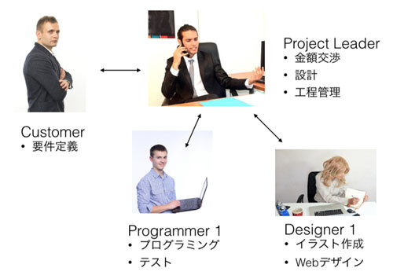
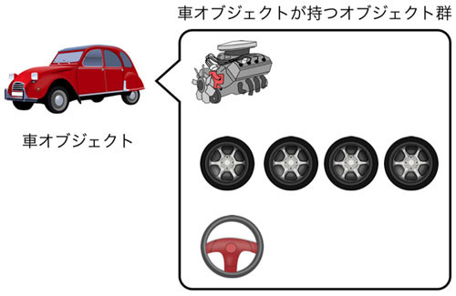
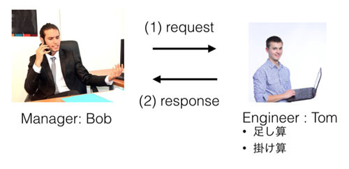
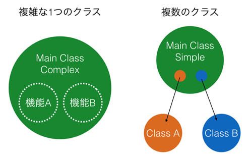
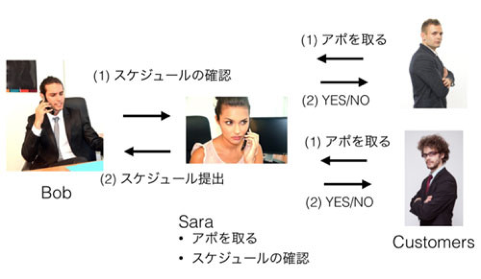
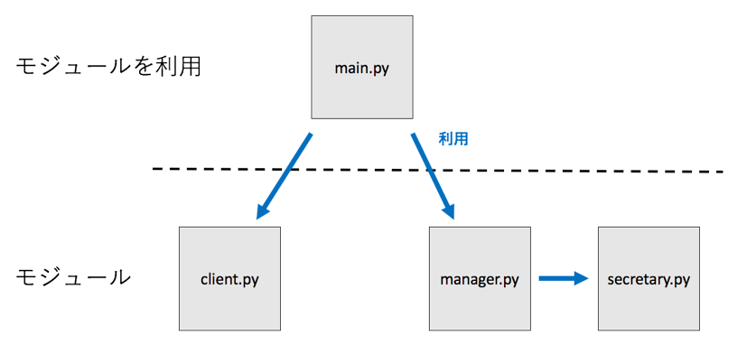

# オブジェクトは何をすべきか

{{ TOC }}

## 概要

## オブジェクトとオブジェクトの連携

オブジェクト指向において「オブジェクト」と「インスタンス」は非常に近い存在です。
ただ、インスタンスは「クラスから生成される」という意味合いが強く、
以前お話した、たい焼きの型枠とたい焼きといったような文脈で使われます。
それに対して、オブジェクトは「ある特定の領域をカバーする実体」という意味合いが強いかもしれません。
また、クラスとクラスの連携を意識する際も「オブジェクト」という言葉が良く使われます。

「ある特定の領域をカバーする実体」や「連携」と言われても少しわかりにくいと思うので例をあげて説明しましょう。
以下の図を見てください。



これは簡単なWebサービスを作る際に必要な人物と、
それぞれの仕事および関係を示しています。
開発論についての話題ではないので、
もっとこうしたほうがよいというようなことは置いておいてください)。

上図を見てわかるように、以下の登場人物がいます。

*	Customer
*	Project Leader
*	Programmer
*	Designer

それぞれの登場人物が果たすべき仕事は明確に分けられており、各人物の間の関係も明確です。
この図におけるそれぞれの登場人物がオブジェクト指向のオブジェクトにあたります。

つまり、オブジェクト指向におけるオブジェクトは単にクラスから生成された実体(インスタンス)であるという意味合いだけでなく、
以下の特徴があります。

*	それぞれが果たす役割が明確に決まっている
*	オブジェクト同士を連携させて全体像を作る

この「役割が明確」「連携させて全体となる」といったことは手続き型言語でも実現可能です。
実際に優秀なエンジニアはこれらを意識して設計を行います。
ただ、オブジェクト指向言語は設計さえ正しければこれらを容易に実現できるのに対して、
手続き型言語は各プログラマの技量に強く依存します。
そしてチーム全体で情報の共有をより多く必要とします。
要は、手続き型言語では開発のリーダーや各プログラマの腕が悪いと簡単にプログラムのアーキテクチャが崩壊するということです。

## コンポジション

オブジェクトとオブジェクトは連携するということがわかっていただけたかと思います。
問題はこれをどう実現するかです。

実はこれはすごい単純な話で、オブジェクトがオブジェクトを持てば解決します。
たとえば自動車という複雑な製品をイメージしてください。車は数万以上のパーツから構成されているものの、
それらのパーツはある単位にまとめられています。
たとえば、構成要素として、エンジン、4つのタイヤ、ハンドルがあげられます。



車というオブジェクトが金属パーツ数千個、ネジを数千個持つと考えるのではなく、
車というオブジェクトが、エンジンオブジェクト、4つのタイヤオブジェクト、ハンドルオブジェクトを持つと考えるのです。
こうすることで、車というオブジェクトを人が理解しやすくなり、設計も簡単になります。

このように、オブジェクトがオブジェクトを持つということを「コンポジション」と呼びます。
コンポジションは当然ながら一階層ではなく、複数の階層になる場合があります。
たとえば、車オブジェクトはタイヤオブジェクトを持ち、タイヤオブジェクトはブレーキオブジェクトを持つという構成も考えられます。
車にそれほど詳しくないので間違っているかもしれませんが。

情報を隠蔽するメリットは、何も修正や改良だけではありません。話を車の開発に戻しましょう。

車が登場しはじめた当時は、おそらく車のすべてのパーツに対して開発者が熟知している必要があったはずです。
ただ、そのようなことはどんどん複雑になってきている現在の車ではできないはずです。
各自動車メーカーにはエンジンの専門家やフレーム開発の専門家、
ブレーキの専門家といったようにある特定のパーツに特化した専門家を多数そろえていて、
それぞれの専門家は、自分の範囲外の分野について、深い知識はそれほど必要としません。
たとえばブレーキの専門家は、エンジンの省エネ化方式については、知る必要はありません。
一方、車の全体設計をするエンジニアは、各パーツを組み合わせて車を作ったり、
新しい車を作るために必要な要件を専門家に伝えればよいだけです。

オブジェクト指向もこれと同じことが言えます。
各オブジェクトを作っている人たちは「自分が作るオブジェクト(クラス)」については深く理解する必要があるものの、
「自分が利用するオブジェクト」についてはどう使えばよいかだけ知っておけばよいのです。

ある複雑なモノやシステムも、それを分解していけば小さな単位に分けることができるはずです。
複雑なものをどのように自然な実現しやすいコンポーネント単位にまとめるか。
プログラマのスキルは「細かい処理をいかにして実現するか」ということだけではなく、
「全体像を描き、いかに最適な論理的な構造を作るか」という場面でも必要とされます。

正しい設計がシステムやサービスの構築には必須です。
たくさんコードを書いて、設計に失敗して、修正して、そういったことを繰り返していると、
自然と正しい設計ができるようになるのではないでしょうか。
デザインパターンという設計の教科書を読むのもてっとり早いのですが、ある程度の経験がないと自分の血肉にはならないです。

## コンポジションの実現

### 処理を分割

実際にどのようにしてコンポジションを実現するかについて話します。
先ほどのWebサービスの開発の仕組みを簡単にして、以下の図のようなものを構築してみたいと思います。



見てわかるようにManagerオブジェクトのBobが、EngineerオブジェクトのTomに作業を依頼するというものです。
実際にはありえない話でしょうが、上司のBobは算数ができないため、Tomに計算処理を依頼するというシナリオでコードを書いてみます。

```python
class Manager:
  def __init__(self):
    self.tom = Engineer()

  def work_a(self):
    result = self.tom.add(5, 3)
    print(result)

  def work_b(self):
    result = self.tom.add(8, 4)
    print(result)

class Engineer:
  def add(self, a, b):
    return a + b

  def multiply(self, a, b):
    return a * b

bob = Manager()
bob.work_a()
# 8
bob.work_b()
# 12
```

上記コードを見ると ManagerクラスがEngineerのインスタンスであるtomを持っているということがわかります。
そしてManagerのメソッドを見ると、tomに仕事を依頼して、その結果を得ていることがわかります。
今回の例は非常に簡単な処理(計算)をコンポジションで実現していますが、実際はこの処理が複雑なものに置き換えられます。
そうするとコンポジションを使う側のManager クラスに相当する側の処理がシンプルに保たれます。

### 状態を分割

もう少しプログラムを複雑にしてオブジェクト指向のメリットを得てみたいと思います。
この無能なマネージャーBobは仕事が管理できておらず、
どのようなことを会議で話していたかまったく覚えられないとしましょう。
そこで優秀な秘書Saraに時刻付きでログを取ってもらうことにしました。
これをプログラムで実現してみます。

この秘書は算数をするエンジニアより優秀で複雑なので、
今回は Manager クラス(インスタンスはBob)と新しく作る Secretary クラス(インスタンスは sara) をモジュールに分けてコードを整理します。
サンプルコードで時間関連のライブラリを使うため、その機能を簡単に紹介しておきます。

```python
# time モジュールをインポート
import time

# 現在時刻を得る
print(time.ctime())
'Wed Aug 24 08:37:28 2016'

# x 秒間スリープする
print(time.ctime()); time.sleep(5); print(time.ctime())
'Wed Aug 24 08:37:50 2016'
'Wed Aug 24 08:37:55 2016'
```

まず、秘書のSecretaryクラスを実装します。
コードを見てもらうとわかりますが、write_log メソッドを呼ばれるリスト型のインスタンス変数のlog に与えられたログを時間付きで追加します。
そして get_log メソッドが呼ばれると、追加されてきたログ全てを改行コードで結合して文字列として返します。
このクラスはsecretary.pyに書かれています。

```python
import time

class Secretary:
  def __init__(self):
     self.log = []

  def write_log(self, text):
    self.log.append('{}: {}'.format(time.ctime(), text))

  def get_log(self):
    return '\n'.join(self.log)
```

次に上司のManagerクラスを以下のように定義します。

```python
import time
from secretary import *

class Manager:
  def __init__(self):
    self.sara = Secretary()

  def work_a(self):
    self.sara.write_log('hello')
    time.sleep(5)
    self.sara.write_log('hey')

  def work_b(self):
    print(self.sara.get_log())
```

コンストラクタで秘書をインスタンス化してインスタンス変数に持っています。
今回は説明と話を合わせるために sara という名前にしていますが、本来であればもっと一般的な名前をつけるべきです。
work_a メソッドでその秘書の更にログを取ってもらい、sleep関数で5秒ほど昼寝をして、
もういちど発言のログをとってもらいます。
そして work_b メソッドでは秘書にとってもらったログを確認しています。

Manager クラスをインスタンス化し、そのメソッドを呼び出すと以下のようになります。

```python
bob = Manager()
bob.work_a()
bob.work_b()
# Wed Oct 14 21:33:01 2015: hello
# Wed Oct 14 21:33:06 2015: hey
```

上司の発言ログが時間付きで得られています。それほど難しくないと思います。
先に扱ったEngineerとSecretaryの例なのですが、非常に簡単なものの実はかなり一般的な使い方となります。

まずEngineerの例は、特定の複雑な処理をAPIのようにして提供していることがわかります。
ただ、処理の主導権自体はManagerにあり、Engineerは100%、Managerが思うままに動きます。
正直なところ、このような使い方の場合はモジュールとして独立させて、
必要な処理を単なる関数として定義したほうがよいかもしれませんね。
そもそもインスタンスを作るメリットがあまりありません。
次にSecretaryですが、これは非常にオブジェクト指向の思想にあった良い使い方です。
先ほどのEngineerの例と違って、こちらは内部に「今までのログ」という「状態」を持っていることがわかります。
本来はManagerクラスが何を何時に言ったか覚えていなければいけないものを、
その作業をすべてSecretaryに肩代わりしてもらっています。
Secretaryが状態を持つということは、100%マネージャーの思いどおりになるとは限らないということですが、
少なくともあれもこれもとすべてマネージャーにやらせるよりは、専任の人(クラス)にそれをやらせたほうが間違いは少ないです。

つまりクラスを使うことで、特定の複雑な処理を簡単に呼び出すようにしたり、
ある特定の処理の複雑な状態管理をシンプルに管理できるようになるといえます。
クラスを使わない場合と使う場合の比較図を以下に記します。



プログラミングを学びたての人は複雑な機能を持つ大きなクラスを作りがちです。
ただ、そのようなクラスは規模が大きくなるにつれてどこで何をやっているかどんどん分からなくなります。
図でいうところの機能Aと機能Bのインスタンス変数やメソッドが入り混じってくるためです。
一方、これらの機能を切り出して図の右のようなコンポジションを使った設計にすると機能Aと機能Bのコードが入り乱れにくくなります。
なぜならそれらはクラスとして独立しているからです。

このとき注意して欲しいのは右のクラスAとクラスBが直接やりとりすることを極力少なくすることです。
もしクラスAとクラスBが直接やりとりしてしまうと、
それらを利用しているメインクラスの知らないところで「オブジェクトの状態が変わっている」可能性が高くなります。
そのようなことだと「もしかしてこうなっているかも」と余計なことを考えてくる必要性が出てきます。
例のような3者の関係ですら頭で追うのは難しいのに、これが4,5 と増えていくと追いきれなくなってきます。
コンポジションを実現する場合はクラスの設計をシンプルにするだけでなく、オブジェクト間の連携の仕組みもシンプルに保つことを心がけて下さい。

## クラス分けによるコードの再利用

クラス分けをすることにより実装がシンプルになるという話をしましたが、これはコードを再利用する際にも重要なことです。
先ほどのSecretaryクラスのSaraですが、ManagerのBobの上司であるDirectorのJohnも「俺もログ機能を使いたい」と思ったとします。
仮にログの機能をSecretaryに実装せずに、直接Managerクラスに実装してしまったとしたら、
DirectorにManagerのログ機能を「コピー&ペースト」で実装することになると思います。
一方、きちんと Secretaryクラスとして機能が分けられていれば、DirectorクラスもManagerクラスと同様に、
Secretaryクラスを内部に持つことで、ログ機能を簡単に使えるようになります。
コピペに比べると随分とエレガントですし、仮にログ機能にバグが見つかったとしても修正は一箇所で済みます。

個人的な考えですが、一般的に自分で設計をするクラスは2種類あると考えています。

*	アプリやサービスのアーキテクチャを作るクラス
*	上記クラスが利用する汎用処理のクラス

はっきり言うと、すべて汎用クラスとすることはライブラリの開発以外は不可能です。
独自の機能は一箇所でしか使われず、それはあなたが開発するアプリやサービスを 特徴付けるものです。
ただ、すべてこのような独自機能のクラスに実装を定義してしまうとコードが複雑になり、メンテナンスも大変になります。
そこで独自機能を実現するために「どのような汎用処理が必要か」をよく考えて、それを切り出してクラスとして定義してあげる。
自分の独自機能は可能な限り、標準ライブラリや自分が作った汎用クラスを使いながらシンプルなコードで実現する。
そうすることで独自性を持たせつつ、なおかつ理解しやすいコードが作れるのではないかと思っています。

コンポジションの利点を感じて欲しいので先ほどのクラスSecretaryクラスを改良して動作を変更させるサンプルをお見せします。
先ほどの Secretary クラスにはひとつ問題があります。
それはプログラムを終了するとデータをすべて失ってしまうことです。
この問題を解決したいとしましょう。仮にこの機能をSecretaryクラスではなく、
プログラムの主役であるManagerクラスに実装していたとすると、コードの修正はメインとなるクラスをいじらなければならなくなります。
メインとなるクラスは一般的に複雑で、なおかついろいろなものを利用しているため、テストなどもしにくいものです。
正直なところ、ログの方式の変更程度でメインとなるクラスをいじるのは面倒くさく、なおかつバグを生むというリスクも高まります。

ただ、きちんとSecretaryクラスとしてログ機能が実装されていると、メインとなるManagerクラスをいじらずに、
Secretaryクラスのみを変更するだけで機能をアップデートすることができます。

試しにプログラム終了時にデータを失うという問題点を回避する修正を加えてみます。
これには以前お話したPickleという機能を使ってみます。

```python
import time

class Secretary:
  def __init__(self):
    self.logfile = '_log.txt'

  def write_log(self, text):
    log = "{}: {}\n".format(time.ctime(), text)
    f = open(self.logfile, 'a')
    f.write(log)
    f.close()

  def get_log(self):
    f = open(self.logfile, 'r')
    log = f.read()
    f.close()
    return log
```

コードを読んでもらうとわかりますが、コンストラクタでログファイルのパスを設定し、
write_log をすると新しいログを追記し、get_log をするとファイルを読み出して今までのログを返します。

これを利用するManagerクラスを以下に記載します。

```python
import time
from secretary import *

class Manager:
  def __init__(self):
    self.sara = Secretary()

  def work_a(self):
    self.sara.write_log('hello')
    time.sleep(5)
    self.sara.write_log('hey')

  def work_b(self):
    print(self.sara.get_log())

bob = Manager()
bob.work_a()
bob.work_b()
```

先に書いたManagerクラスと見比べてみてください。一行も変わっていません。これは手抜きではなく、あえてそうしています(笑)。
プログラムのメインとなるManagerのコードを一切変更せずに、ログ機能のアップデートを行っています。

試しにコードを動かしてみます。一度目の実行は以下のようになりました。

```python
$ python3 test.py
Wed Aug 24 09:10:15 2016: hello
Wed Aug 24 09:10:20 2016: hey

そして二度目の実行は以下のようになりました。

$ python3 test.py
Wed Aug 24 09:10:15 2016: hello
Wed Aug 24 09:10:20 2016: hey
Wed Aug 24 09:10:40 2016: hello
Wed Aug 24 09:10:45 2016: hey
```

プログラムを終了してもログを残すという目的を果たせていることがわかります。
このように適切に機能がクラス分けされていると、コードの修正範囲が狭くなり、機能拡張や変更、そしてバグ潰しが楽になります。
大切なことなので覚えておいてください。

## オブジェクト渡し

今までのManager、Engineer、Secretaryの例を見てもらうとわかるのですが、
常に「AがBを持つ」という形でプログラムが実現されています。
そのため、Manager内でEngineerやSecretaryのインスタンスを作成して保持すればよいだけでした。

ただ、世の中(プログラム)はそんなに単純じゃありません。たとえば以下のシナリオを考えてください。
秘書SecretaryクラスのSaraは昇進したので、ログ取りという業務ではなく、
客からのアポイントメントの管理をするという仕事を新たにすることになりました。
この業務は以下の図のようになります。



ManagerクラスのBobがSaraにアポイントを確認するのは簡単です。
今までどおり、自分が持つSaraオブジェクトのメソッドを呼び出すだけです。
ただ、問題となるのは「客がSaraにどうやってアポイントメントを取るか」です。
なぜならSaraオブジェクトはBobが持っており、客はSaraオブジェクトを持っていないのですから。

この問題を実現する方法は色々ありますが、それらに共通して言えることは「Bobが持つSaraというインスタンスを客に渡す必要がある」ということです。
自分で作るのではなく、渡すことでSaraというインスタンスをBobとクライアントのインスタンスが共有します。
これをコードで実現してみます。

プログラムの全体像としては以下のようになります。



プログラムを構成する要素(コンポーネント)としてマネージャー、秘書、クライアントがいます。
そしてそれらを使うシナリオを動かすコードです。
マネージャーは秘書クラスを持ち、クライアントはマネージャーが持つ秘書クラスを利用します。
実際にコードを書いていきます。

まず秘書のSecretaryクラスです。アポイントの管理は今回の本質ではないので、
辞書型を使ってキーに時間(文字列)、バリューに誰という形でアポイントを管理しています。
同じ時間を別の客に指定された(既に同じキーが存在する)ときだけFalse(アポイントを取れない)を返して、
そうでなければTrue(アポイントを取れた)を返し、アポイント管理の辞書データを更新します。

これを request_appointment メソッドとして実装します。
そしてマネージャーがアポイントを確認するための get_schedule メソッドを作成し、
その辞書データを文字列として返しています。

```python
class Secretary:
  def __init__(self):
    self.appointment = {}

  def request_appointment(self, when, who):
    if(when in self.appointment):
      return False
    else:
      self.appointment[when] = who
      return True

  def get_schedule(self):
    return str(self.appointment)
```

次にManagerのコードです。Managerはアポイントの確認機能があります。
また、クライアントにたいして秘書を渡す機能もあります。

```python
from secretary import *

class Manager:
  def __init__(self):
    self.sara = Secretary()

  def check_schedule(self):
    schedule = self.sara.get_schedule()
    print(schedule)

  def get_secretary(self):
    return self.sara
```

そして最後のコンポーネントであるクライアントです。
クライアントは秘書を連絡先として登録する機能と、アポイントを取る機能が実装されています。

```python
class Client:
  def __init__(self, name):
    self.name = name
    self.contact_point = None

  def set_contact_point(self, contact_point):
    self.contact_point = contact_point

  def make_appointment(self, when):
    if(self.contact_point):
      is_success = self.contact_point.request_appointment(when,
                                                          self.name)
      print(self.name + " could book? : " + str(is_success))
```

これらのコンポーネントを使うシナリオを 実行させるプログラムは以下となります。

```python
from manager import *
from client import *

bob = Manager()

adam = Client('adam')
adam.set_contact_point(bob.get_secretary())
adam.make_appointment('10:30')
# adam could book? : True

charles = Client('charles')
charles.set_contact_point(bob.get_secretary())
charles.make_appointment('11:30')
# charles could book? : True

dag = Client('dag')
dag.set_contact_point(bob.get_secretary())
dag.make_appointment('10:30')
# dag could book? : False

bob.check_schedule()
{'11:30': 'charles', '10:30': 'adam'}
```

注目してほしいことは、先程も言ったようにClientのインスタンスがManagerの持つSecretaryのインスタンスを取得していることです。
このようにすることで特定のインスタンスを複数の異なるインスタンス間で共有することができ、
その共有されたインスタンスを介してやりとりすることが可能です。

今回はManagerにget_secretary、Clientにset_contact_pointというメソッドを実装してやりとりしています。
ただ、インスタンスの受け渡しの方法はこれだけではなく、ぱっと思いつくだけでも以下の方法があります。

*	コンストラクタでインスタンスを渡す
*	get、setで渡す(今回の例)
*	インスタンスの受け渡し専門のクラスを作る
*	グローバル空間で共有する

やりかたはさまざまですが、それぞれにメリット・デメリットがあるので状況に応じて使い分ける必要があります。
ベストプラクティスを知りたい場合は先程紹介した「デザインパターン」と呼ばれる設計方法について学ぶといいと思います。
